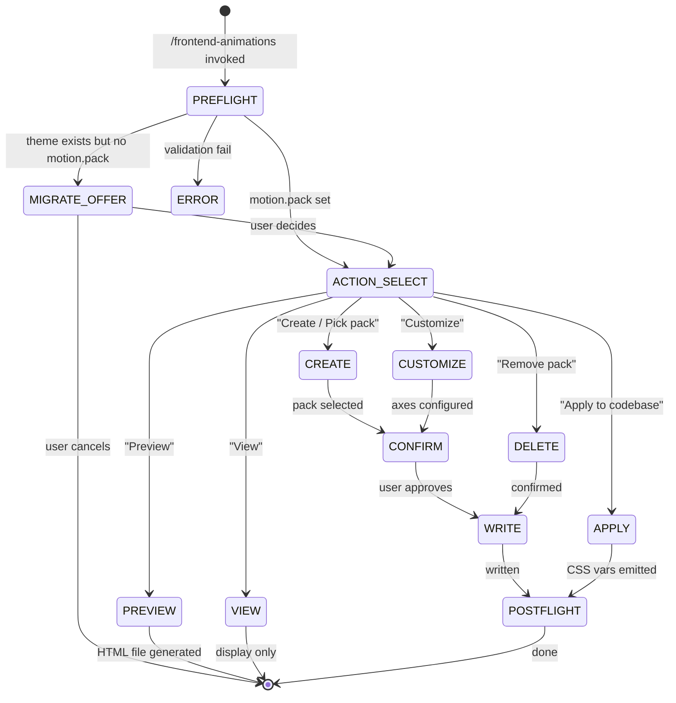

# Animations

Manages animation packs, spring physics tokens, choreography compositions, and surface effects (glass/vibrancy). Layers on top of the base motion tokens set by `/frontend-tokens`.

**Keywords**: animation, motion, pack, spring, iOS, Apple, Material, Fluent, Carbon, glass, vibrancy, choreography, micro-interactions, easing, whimsical, playful, transitions, hover, press, entrance, delight

## Overview

This skill owns four sub-sections in `project.json#theme`:

| Owned section           | Description                                                          |
| ----------------------- | -------------------------------------------------------------------- |
| `motion.pack`           | Active pack name: `none \| subtle \| standard \| apple \| playful`   |
| `motion.axes`           | Pack config vector: `{expressiveness, springiness, tempo, surfaces}` |
| `motion.spring[]`       | Spring physics tokens with CSS approximations                        |
| `motion.choreography{}` | Named animation compositions per interaction type                    |
| `theme.surfaces{}`      | Glass/vibrancy opt-in + elevation system                             |

**Does NOT touch:** `motion.durations`, `motion.easings`, `interactions` — those are owned by `/frontend-tokens`.

**References:**

- `skills/frontend-animations/references/packs.md` — Pack definitions + source credits (source of truth)
- `skills/frontend-animations/references/ios-easings.md` — Apple iOS/macOS easing curves (Apple pack)
- `skills/frontend-animations/references/material-motion.md` — Material Design 3 curves + duration scale (Standard pack)
- `skills/frontend-animations/references/fluent-motion.md` — Microsoft Fluent 2 curves (Customize opt-in)
- `skills/frontend-animations/references/carbon-motion.md` — IBM Carbon entrance/exit curves (Customize opt-in)
- `skills/frontend-animations/references/web-baseline.md` — Linear/GitHub/Vercel curves (Subtle pack)
- `skills/frontend-animations/references/spring-math.md` — Spring physics conversion + library mapping
- `skills/frontend-animations/references/choreography.md` — Named compositions per pack
- `skills/shared/DESIGN.md` — Glass surfaces rules, animation pack anti-clichés, motion timing
- `skills/shared/TOKENS.md` — Token contract (T106–T108 violations, CSS var names)
- `skills/shared/PATTERNS.md` — Motion patterns (spring-press, hover-elevate, glass-card, etc.)

---

## Animation Pack Schema

The pack system is the primary interface. Each pack is a composite that sets multiple theme sub-sections at once.

```json
"motion": {
  "durations": [],
  "easings": [],
  "pack": "standard",
  "axes": {
    "expressiveness": "standard",
    "springiness": "smooth",
    "tempo": "normal",
    "surfaces": "flat"
  },
  "spring": [
    {
      "token": "spring-snappy",
      "stiffness": 300,
      "damping": 25,
      "mass": 1,
      "cssApprox": "cubic-bezier(0.4, 1.15, 0.7, 1.05)",
      "cssDuration": "420ms",
      "usage": "Press, tap feedback"
    }
  ],
  "choreography": {
    "entrance": "entrance.float-in",
    "exit": "exit.fade-out",
    "success": null,
    "attention": null,
    "error": "error.shake"
  }
}
```

```json
"surfaces": {
  "glass": {
    "enabled": false,
    "blur": "20px",
    "saturation": "180%",
    "tint": "color-mix(in oklch, var(--color-surface) 70%, transparent)",
    "border": "1px solid color-mix(in oklch, var(--color-foreground) 8%, transparent)",
    "vibrancy": false,
    "fallback": "solid"
  },
  "elevation": [
    { "token": "elevation-1", "shadow": "shadow-sm", "tint": "none", "usage": "Resting cards" },
    { "token": "elevation-2", "shadow": "shadow-md", "tint": "surface-raised", "usage": "Hover, dropdowns" },
    { "token": "elevation-3", "shadow": "shadow-lg", "tint": "surface-overlay", "usage": "Modals, popovers" },
    { "token": "elevation-4", "shadow": "shadow-xl", "tint": "surface-floating", "usage": "Toasts, command-K" }
  ]
}
```

---

## Pack Axes

Every pack is defined as a vector across four axes (visible in Customize mode):

| Axis             | Values                                   | Effect                                   |
| ---------------- | ---------------------------------------- | ---------------------------------------- |
| `expressiveness` | subtle · standard · expressive · playful | How rich the choreography is             |
| `springiness`    | linear · smooth · snappy · bouncy        | Easing/spring shape                      |
| `tempo`          | slow · normal · fast                     | Duration multiplier (0.75× / 1× / 1.25×) |
| `surfaces`       | flat · elevated · glass                  | Enables glass (`surfaces.glass.enabled`) |

---

## Stack Detection

Read `package.json` to determine motion library availability:

| Detected                            | Library                         | Code strategy                                      |
| ----------------------------------- | ------------------------------- | -------------------------------------------------- |
| `motion` or `framer-motion` in deps | motion.dev / Framer Motion v11+ | Use `<motion.*>` with `{stiffness, damping, mass}` |
| `motion-v`                          | Vue motion                      | Use `<Motion>` with spring props                   |
| `svelte`                            | svelte/motion                   | Use `spring()` store                               |
| None of the above                   | CSS only                        | Use `cssApprox` + `cssDuration` from spring tokens |

---

## Read/Write Protocol

### Delta-write rule (critical)

This skill does **NOT** overwrite the full `theme` section. It only touches its owned keys:

1. Read `.project/project.json`
2. Parse JSON — locate `theme`
3. Mutate ONLY: `theme.motion.pack`, `theme.motion.axes`, `theme.motion.spring`, `theme.motion.choreography`, `theme.surfaces`
4. Assert all other `theme` keys are byte-identical to the read value
5. Write back as `JSON.stringify(data, null, 2)`

---

## State Machine



---

## PHASE 0 — Pre-flight

```
1. Check .project/project.json exists → if not: offer to create empty scaffold (see DASHBOARD.md)
2. Read theme section:
   - theme.motion.pack present?    → yes: go to ACTION_SELECT
   - theme.motion.pack absent?     → MIGRATE_OFFER
3. Read package.json → detect stack (React/Vue/Svelte/vanilla)
4. Store as $STACK_TYPE, $HAS_MOTION_LIB (true/false), $CURRENT_PACK
```

**PACK RENAME CHECK:** Before MIGRATE_OFFER — if `motion.pack === "expressive"`:

> "Your project uses the old pack name `expressive`. This has been renamed to `apple` to avoid confusion with Material Design 3's own Expressive mode. Rename now? (Yes — updates only `theme.motion.pack`, all other keys stay identical)"

If user confirms: delta-write `theme.motion.pack = "apple"` and continue to ACTION_SELECT.

**MIGRATE_OFFER:** When `motion.pack` is absent but `motion.durations[]` or `motion.easings[]` exist:

> "Your project has base motion tokens but no animation pack. Want me to infer the closest pack from your existing tokens and set it up?
> Options: Yes (Recommended) / No, start fresh / Skip (keep pack-less)"

Infer closest pack:

- No `easings[]` → None
- easings contain only `ease-out/in/in-out` → Subtle
- Has `ease-expo-out` or `ease-cubic-out` → Subtle
- Has `ease-md-emphasized` or M3 tokens → Standard
- Has `ease-ios-spring` or spring tokens → Apple

---

## Routes

Each route is detailed in its reference file. Load only when the route fires.

### Create / Pick Pack

> **Todo:** Read `skills/frontend-animations/references/route-create.md`

### Customize (axis-by-axis)

> **Todo:** Read `skills/frontend-animations/references/route-customize.md`

### Preview

Generate `.project/animation-preview.html` from `references/preview-template.html` populated with all current tokens. Open the path for the user.

> **Todo:** Read `skills/frontend-animations/references/preview-template.html` and populate with current `theme.motion` + `theme.surfaces` values.

### Apply to codebase

Emit CSS-vars delta into `theme.cssVars` for all pack tokens (spring, easings, durations, surfaces). Coordinate with frontend-tokens: read current `theme.cssVars`, append the new `--spring-*`, `--ease-ios-*`, `--ease-md-*`, `--surface-glass-*`, `--duration-md-*` blocks per active pack, write back.

> **Todo:** Read `skills/frontend-animations/references/route-apply.md`

### View

Display current pack state as a summary table:

```
Pack:           apple
Source:         Apple iOS/macOS HIG (see ios-easings.md)
Axes:           expressiveness=expressive · springiness=snappy · tempo=normal · surfaces=glass
Springs:        spring-gentle · spring-smooth · spring-snappy
Easings:        ease-ios-default · ease-ios-out · ease-ios-in · ease-ios-spring · ease-ios-snappy · ease-ios-bouncy
Choreography:   entrance=entrance.float-in · exit=exit.fade-out · success=success.pulse · ...
Glass surfaces: enabled=true · blur=20px · vibrancy=false
Stack:          React (motion.dev detected)
```

### Delete / Remove pack

Reset `motion.pack = ""`, `motion.axes = {}`, `motion.spring = []`, `motion.choreography = {}`, `surfaces.glass.enabled = false`. Prompt confirmation first.

---

## Completeness Check

After Create or Customize, display:

```
[ ] motion.pack          set? {pack}
[ ] motion.spring[]      {n} tokens
[ ] motion.choreography  {n} compositions
[ ] surfaces.glass       enabled={true/false}
[ ] cssVars              spring/iOS/surface vars emitted?
```

---

## Post-flight

1. Sync `devinfo.tokenDrift` if spring tokens changed (path: `theme.motion.spring[*].token`)
2. Write backlog sync (mark any MOTION/ANIMATION task as in-progress or done per user intent)
3. Report:

```
✓ Animation pack applied
  Pack:     {name}
  Springs:  {n} tokens
  Glass:    {enabled/disabled}
  Stack:    {CSS-only / motion.dev / motion-v / svelte}
  Preview:  .project/animation-preview.html (run /frontend-animations → Preview to generate)
  Next:     /frontend-check motion — audit pack compliance
```
