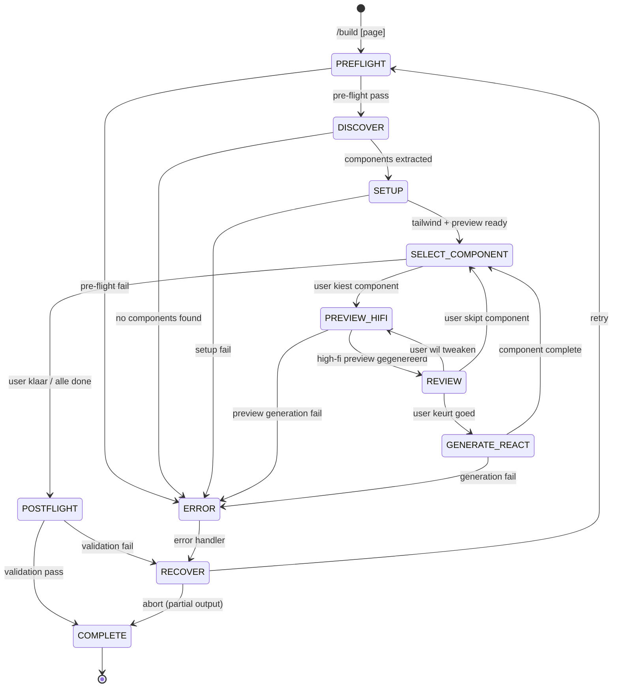

# Build

Design and build wireframe components into production-ready React code, one at a time. Each component gets a visual high-fidelity HTML preview for approval before generating React+Tailwind code. The wireframe page progressively transforms from grayscale to fully styled.

**Keywords**: build, component, high-fidelity, React, Tailwind, preview, progressive, atomic design, visual approval, page assembly

## When to Use

- After `/compose` has produced a final wireframe with `data-component` attributes
- When you want visual control over each component's design
- Before deploying production React components

---

## State Machine



**State Descriptions:**
- **PREFLIGHT**: Validate theme, wireframe, project structure
- **DISCOVER**: Parse wireframe HTML for data-component attributes, build tree
- **SETUP**: Extend Tailwind config, create high-fi preview copy of wireframe
- **SELECT_COMPONENT**: User picks next component from list (or follows suggested order)
- **PREVIEW_HIFI**: Generate styled HTML, replace low-fi in preview page
- **REVIEW**: User reviews preview — approve, tweak, or skip
- **GENERATE_REACT**: Convert approved high-fi HTML to React+Tailwind component, place in page
- **POSTFLIGHT**: Final validation (TypeScript, page, structure)
- **COMPLETE**: Summary report, handoff data

---

## References

- `../shared/VALIDATION.md` — Pre-flight/post-flight patterns
- `../shared/RULES.md` — React/TypeScript rules (R001-R108, T001-T103)
- `../shared/PATTERNS.md` — Component patterns (compound, render props, etc.)
- `../shared/DEVINFO.md` — Session tracking, handoff contracts
- `../shared/brand-presets.md` — Brand color presets

---

## Cross-Skill Contract

### Input (from wireframe)

Reads from `handoff` key in devinfo.json (see DEVINFO.md):

```json
{
  "handoff": {
    "from": "frontend-compose",
    "to": "frontend-build",
    "data": {
      "selectedWireframe": ".workspace/wireframes/[page]/final.html",
      "finalScreenshot": ".workspace/wireframes/[page]/final-screenshot.png",
      "refinement": {
        "iterations": 3,
        "basis": "agent-a/v2",
        "combinedElements": { "header": "agent-b/v2" }
      },
      "atomicLevel": "atom | molecule | organism | template | page",
      "platform": "mobile | desktop | both",
      "components": [
        { "name": "Header", "atomic": "organism" },
        { "name": "MetricCard", "atomic": "molecule" }
      ],
      "themeApplied": true,
      "themeFile": ".workspace/config/THEME.md",
      "projectContext": {
        "framework": "Next.js 14",
        "uiLibrary": "Tailwind CSS",
        "existingComponents": ["Button", "Card"]
      }
    }
  }
}
```

> **Note:** The wireframe skill does NOT provide `variants` counts in the component list.
> Variants, states, and sizes are discovered by parsing the wireframe HTML directly
> (see FASE 1: Component Discovery). The `data-variant` attribute is generated by the
> wireframe skill. `data-state` and `data-size` are optional — if absent, infer from
> component context and type.

### Output (final)

```json
{
  "from": "frontend-build",
  "to": null,
  "data": {
    "hifiPreview": ".workspace/wireframes/[page]/hifi/preview.html",
    "componentsDirectory": "src/components/[page]/",
    "tailwindConfig": "tailwind.config.js",
    "componentsCompleted": [
      {
        "name": "Header",
        "atomic": "organism",
        "files": ["Header.tsx", "Header.types.ts"],
        "approved": true
      }
    ],
    "componentsSkipped": [],
    "pageFile": "src/pages/[page].tsx"
  }
}
```

---

## FASE 0: Pre-flight Validation

**BEFORE any work, validate:**

### 0.1 Theme Dependency Check

```
PRE-FLIGHT: Theme
─────────────────
[ ] THEME.md exists at .workspace/config/THEME.md
[ ] Contains Colors section (main + accent + semantic)
[ ] Contains Typography section (families + scale)
[ ] Contains Spacing section
[ ] CSS export section valid
```

**On failure:**

```yaml
header: "Theme Nodig"
question: "THEME.md niet gevonden of onvolledig. Hoe doorgaan?"
options:
  - label: "Run /theme eerst (Recommended)"
    description: "Maak eerst een theme aan"
  - label: "Tailwind defaults"
    description: "Ga door met standaard Tailwind config"
  - label: "Pad opgeven"
    description: "Geef alternatief theme bestand op"
multiSelect: false
```

### 0.2 Wireframe Dependency Check

```
PRE-FLIGHT: Wireframe
─────────────────────
[ ] Wireframe directory exists for [page]
[ ] final.html exists (of refined/refined.html)
[ ] HTML contains data-component attributes
[ ] Minimum 1 data-component gevonden
```

**On failure:**

```yaml
header: "Wireframe Nodig"
question: "Geen wireframe gevonden voor [page]. Hoe doorgaan?"
options:
  - label: "Run /wireframe eerst (Recommended)"
    description: "Genereer eerst wireframes"
  - label: "Selecteer HTML bestand"
    description: "Ik geef het pad naar een wireframe op"
  - label: "Andere pagina"
    description: "Kies een andere pagina"
multiSelect: false
```

### 0.3 Project Structure Check

```
PRE-FLIGHT: Project
───────────────────
[ ] package.json exists
[ ] tailwindcss in dependencies (of devDependencies)
[ ] TypeScript configured (tsconfig.json)
[ ] src/components/ exists or can be created
```

**On Tailwind missing:**

```yaml
header: "Tailwind Nodig"
question: "Tailwind niet gevonden in project. Hoe doorgaan?"
options:
  - label: "Installeer Tailwind (Recommended)"
    description: "Run: npm install -D tailwindcss"
  - label: "Ga door zonder"
    description: "Genereer components, fix Tailwind later"
  - label: "Annuleren"
    description: "Stop en installeer eerst Tailwind"
multiSelect: false
```

### 0.4 Conflict Check

```
PRE-FLIGHT: Conflicts
─────────────────────
[ ] Target directory src/components/[page]/ check
[ ] Bestaande components detectie
[ ] hifi/ directory check
```

**On conflict:**

```yaml
header: "Bestaande Components"
question: "Er bestaan al components voor [page]. Hoe doorgaan?"
options:
  - label: "Overschrijven (Recommended)"
    description: "Vervang bestaande components"
  - label: "Samenvoegen"
    description: "Update alleen nieuwe/gewijzigde"
  - label: "Nieuwe directory"
    description: "Maak [page]-v2 directory"
multiSelect: false
```

### Pre-flight Samenvatting

```
PRE-FLIGHT COMPLETE
═══════════════════════════════════════════════════════════
Theme:     .workspace/config/THEME.md (12 colors, 3 fonts)
Wireframe: .workspace/wireframes/[page]/final.html
Project:   Next.js + Tailwind 3.4 + TypeScript 5.3
Target:    src/components/[page]/
Status:    Ready to discover components
═══════════════════════════════════════════════════════════
```

---

## FASE 1: Component Discovery

> **Doel:** Parse het wireframe en bouw een overzicht van alle components met hun atomic levels en relaties.

### 1.1 Data Attribute Parsing

Zoek naar `data-*` attributen in wireframe HTML:

```html
<!-- Voorbeeld wireframe structuur -->
<header data-component="Header" data-atomic="organism" data-variant="default,sticky">
  <nav data-component="Navigation" data-atomic="molecule">
    <a data-component="NavLink" data-atomic="atom" data-state="default,active,hover">Home</a>
  </nav>
  <div data-component="UserMenu" data-atomic="molecule">
    
  </div>
</header>
```

Extraheer per component:
- `data-component` → Component naam (altijd aanwezig)
- `data-atomic` → Atomic level (altijd aanwezig: atom, molecule, organism)
- `data-variant` → Visuele varianten (aanwezig indien wireframe ze definieert)
- `data-state` → Interactie states (optioneel — indien afwezig, infereer uit component type: buttons krijgen hover/active/disabled, links krijgen default/active/hover)
- `data-size` → Size varianten (optioneel — indien afwezig, infereer standaard sm/md/lg voor atoms)
- Parent-child relaties (nesting in HTML)

### 1.2 Component Tree

```
COMPONENT TREE
═══════════════════════════════════════════════════════════

Organisms (2):
├── Header
│   ├── variants: [default, sticky]
│   ├── children: [Navigation, UserMenu]
│   └── root element: <header>
└── Sidebar
    ├── variants: [expanded, collapsed]
    └── children: [NavGroup, NavItem]

Molecules (4):
├── Navigation
│   └── children: [NavLink ×N]
├── UserMenu
│   └── children: [Avatar, Badge]
├── NavGroup
│   └── children: [NavItem ×N]
└── MetricCard
    └── variants: [small, medium, large]

Atoms (5):
├── NavLink — states: [default, active, hover]
├── Avatar — sizes: [sm, md, lg]
├── Badge
├── Button — variants: [primary, secondary, ghost]
└── Icon

Total: 11 components

═══════════════════════════════════════════════════════════
```

### 1.3 Gesuggereerde Volgorde

Stel een bottom-up volgorde voor (atoms → molecules → organisms), zodat child-components al gestyled zijn als parents aan de beurt komen:

```
GESUGGEREERDE VOLGORDE
═══════════════════════════════════════════════════════════

 #  Component       Level      Dependencies
─── ─────────────── ────────── ──────────────────
 1  Button          atom       —
 2  Badge           atom       —
 3  Icon            atom       —
 4  Avatar          atom       —
 5  NavLink         atom       —
 6  Navigation      molecule   NavLink
 7  UserMenu        molecule   Avatar, Badge
 8  NavGroup        molecule   NavItem
 9  MetricCard      molecule   —
10  Header          organism   Navigation, UserMenu
11  Sidebar         organism   NavGroup, Button

═══════════════════════════════════════════════════════════
```

### 1.4 Gebruiker Bevestiging

```yaml
header: "Component Plan"
question: "Dit zijn de [N] gevonden components. Hoe wil je doorgaan?"
options:
  - label: "Gesuggereerde volgorde (Recommended)"
    description: "Atoms → Molecules → Organisms (bottom-up)"
  - label: "Ik kies zelf per stap"
    description: "Ik selecteer steeds de volgende component"
  - label: "Alleen specifieke"
    description: "Ik wil niet alle components maken"
multiSelect: false
```

**Als "Alleen specifieke":**

```yaml
header: "Selectie"
question: "Welke components wil je maken? (kies meerdere)"
options:
  - label: "[Component 1]"
    description: "[atomic level] — [N variants]"
  - label: "[Component 2]"
    description: "[atomic level] — [N variants]"
  - label: "[Component 3]"
    description: "[atomic level] — [N variants]"
multiSelect: true
```

### 1.5 Opslaan Component Data

Sla discovery resultaat op:

```json
// .workspace/wireframes/[page]/hifi/components.json
{
  "page": "dashboard",
  "wireframe": ".workspace/wireframes/dashboard/final.html",
  "discoveredAt": "ISO timestamp",
  "components": [
    {
      "name": "Button",
      "atomic": "atom",
      "variants": ["primary", "secondary", "ghost"],
      "states": ["hover", "active", "disabled"],
      "sizes": ["sm", "md", "lg"],
      "parent": null,
      "children": [],
      "status": "pending",
      "htmlSelector": "[data-component=\"Button\"]",
      "order": 1
    },
    {
      "name": "MetricCard",
      "atomic": "molecule",
      "variants": ["small", "medium", "large"],
      "states": [],
      "sizes": [],
      "parent": null,
      "children": [],
      "status": "pending",
      "htmlSelector": "[data-component=\"MetricCard\"]",
      "order": 9
    }
  ],
  "totalComponents": 11,
  "selectedComponents": 11,
  "completedComponents": 0
}
```

---

## FASE 2: Setup (Eenmalig)

> **Doel:** Bereid de technische basis voor — Tailwind config, utilities, en de high-fi preview pagina.

### 2.1 Parse Theme Tokens

Lees THEME.md en extraheer tokens:

```
THEME TOKENS
═══════════════════════════════════════════════════════════

Colors:
├── Main: dark=#1a1a2e, light=#f5f5f5, mid=#888, light-gray=#e0e0e0
├── Accent: primary=#6366f1, secondary=#8b5cf6, tertiary=#06b6d4
└── Semantic: success=#22c55e, warning=#f59e0b, error=#ef4444, info=#3b82f6

Typography:
├── heading: "Poppins", sans-serif
├── body: "Inter", system-ui, sans-serif
└── mono: "Fira Code", monospace

Spacing: 4px base (scale: 0-16)

Border Radius: sm=0.25rem, md=0.375rem, lg=0.5rem

Shadows: sm, md, lg scale

═══════════════════════════════════════════════════════════
```

### 2.2 Extend Tailwind Config

Genereer of update `tailwind.config.js`:

```javascript
// tailwind.config.js
/** @type {import('tailwindcss').Config} */
module.exports = {
  content: [
    './src/**/*.{js,ts,jsx,tsx,mdx}',
  ],
  theme: {
    extend: {
      colors: {
        // From THEME.md
        primary: {
          DEFAULT: '#6366f1',
          hover: '#4f46e5',
        },
        background: '#ffffff',
        foreground: '#1a1a2e',
        muted: {
          DEFAULT: '#f4f4f5',
          foreground: '#71717a',
        },
        border: '#e4e4e7',
        // Semantic
        success: '#22c55e',
        warning: '#f59e0b',
        error: '#ef4444',
        info: '#3b82f6',
      },
      fontFamily: {
        sans: ['Inter', 'system-ui', 'sans-serif'],
        heading: ['Poppins', 'sans-serif'],
        mono: ['Fira Code', 'monospace'],
      },
      borderRadius: {
        sm: '0.25rem',
        md: '0.375rem',
        lg: '0.5rem',
      },
    },
  },
  plugins: [],
};
```

### 2.3 Create cn() Utility

Als nog niet aanwezig, maak `src/lib/utils.ts`:

```typescript
import { type ClassValue, clsx } from 'clsx';
import { twMerge } from 'tailwind-merge';

export function cn(...inputs: ClassValue[]) {
  return twMerge(clsx(inputs));
}
```

### 2.4 Create High-Fi Preview Page

Kopieer `final.html` naar `.workspace/wireframes/[page]/hifi/preview.html` en voeg een high-fi CSS class systeem toe.

**Het `.hf-*` class systeem** wordt toegevoegd als extra `<style>` blok in de `<head>`. Dit werkt naast de bestaande `.wf-*` wireframe classes. Wanneer een component wordt ge-upgrade, worden de `.wf-*` classes in die component vervangen door `.hf-*` classes.

```css
/* ═══ HIGH-FIDELITY CLASS SYSTEM ═══
   Uses same THEME.md CSS variables as wireframe,
   but adds real styling: radius, shadows, transitions, hover states.
   Added during /build workflow — do not remove.
*/

/* ─── Layout ─── */
.hf-flex { display: flex; }
.hf-flex-col { flex-direction: column; }
.hf-items-center { align-items: center; }
.hf-justify-between { justify-content: space-between; }
.hf-gap-1 { gap: 4px; }
.hf-gap-2 { gap: 8px; }
.hf-gap-3 { gap: 12px; }
.hf-gap-4 { gap: 16px; }
.hf-gap-6 { gap: 24px; }
.hf-grid { display: grid; }
.hf-grid-2 { grid-template-columns: repeat(2, 1fr); }
.hf-grid-3 { grid-template-columns: repeat(3, 1fr); }
.hf-grid-4 { grid-template-columns: repeat(4, 1fr); }

/* ─── Spacing ─── */
.hf-p-2 { padding: 8px; }
.hf-p-3 { padding: 12px; }
.hf-p-4 { padding: 16px; }
.hf-p-6 { padding: 24px; }
.hf-px-3 { padding-left: 12px; padding-right: 12px; }
.hf-px-4 { padding-left: 16px; padding-right: 16px; }
.hf-px-6 { padding-left: 24px; padding-right: 24px; }
.hf-py-2 { padding-top: 8px; padding-bottom: 8px; }
.hf-py-3 { padding-top: 12px; padding-bottom: 12px; }
.hf-m-0 { margin: 0; }
.hf-mb-2 { margin-bottom: 8px; }
.hf-mb-4 { margin-bottom: 16px; }
.hf-mb-6 { margin-bottom: 24px; }

/* ─── Colors (from THEME.md CSS variables) ─── */
.hf-bg-background { background-color: var(--wf-light); }
.hf-bg-foreground { background-color: var(--wf-dark); }
.hf-bg-primary { background-color: var(--wf-accent-primary); }
.hf-bg-muted { background-color: var(--wf-light-gray); }
.hf-bg-card { background-color: #fff; }
.hf-bg-success { background-color: var(--wf-success); }
.hf-bg-warning { background-color: var(--wf-warning); }
.hf-bg-error { background-color: var(--wf-error); }

.hf-text-foreground { color: var(--wf-dark); }
.hf-text-muted { color: var(--wf-mid-gray); }
.hf-text-primary { color: var(--wf-accent-primary); }
.hf-text-light { color: var(--wf-light); }
.hf-text-success { color: var(--wf-success); }
.hf-text-warning { color: var(--wf-warning); }
.hf-text-error { color: var(--wf-error); }

/* ─── Typography (from THEME.md fonts) ─── */
.hf-font-heading { font-family: var(--wf-font-heading); }
.hf-font-body { font-family: var(--wf-font-body); }
.hf-font-mono { font-family: var(--wf-font-mono); }

.hf-text-xs { font-size: 12px; line-height: 1.25; }
.hf-text-sm { font-size: 14px; line-height: 1.25; }
.hf-text-base { font-size: 16px; line-height: 1.5; }
.hf-text-lg { font-size: 18px; line-height: 1.75; }
.hf-text-xl { font-size: 20px; line-height: 1.75; }
.hf-text-2xl { font-size: 24px; line-height: 1.33; }
.hf-text-3xl { font-size: 30px; line-height: 1.2; }

.hf-font-normal { font-weight: 400; }
.hf-font-medium { font-weight: 500; }
.hf-font-semibold { font-weight: 600; }
.hf-font-bold { font-weight: 700; }

/* ─── Borders ─── */
.hf-border { border: 1px solid var(--wf-light-gray); }
.hf-border-b { border-bottom: 1px solid var(--wf-light-gray); }
.hf-rounded-sm { border-radius: 4px; }
.hf-rounded { border-radius: 6px; }
.hf-rounded-md { border-radius: 8px; }
.hf-rounded-lg { border-radius: 12px; }
.hf-rounded-full { border-radius: 9999px; }

/* ─── Shadows ─── */
.hf-shadow-sm { box-shadow: 0 1px 2px rgba(0,0,0,0.05); }
.hf-shadow { box-shadow: 0 1px 3px rgba(0,0,0,0.1), 0 1px 2px rgba(0,0,0,0.06); }
.hf-shadow-md { box-shadow: 0 4px 6px rgba(0,0,0,0.1), 0 2px 4px rgba(0,0,0,0.06); }
.hf-shadow-lg { box-shadow: 0 10px 15px rgba(0,0,0,0.1), 0 4px 6px rgba(0,0,0,0.05); }

/* ─── Effects & Transitions ─── */
.hf-transition { transition: all 0.2s ease; }
.hf-hover-lift:hover { transform: translateY(-1px); box-shadow: 0 4px 12px rgba(0,0,0,0.15); }
.hf-hover-brightness:hover { filter: brightness(1.05); }
.hf-hover-bg-muted:hover { background-color: var(--wf-light-gray); }
.hf-opacity-0 { opacity: 0; }
.hf-opacity-50 { opacity: 0.5; }
.hf-overflow-hidden { overflow: hidden; }

/* ─── Interactive ─── */
.hf-cursor-pointer { cursor: pointer; }
.hf-focus-ring:focus { outline: 2px solid var(--wf-accent-primary); outline-offset: 2px; }
.hf-disabled { opacity: 0.5; cursor: not-allowed; pointer-events: none; }

/* ─── Buttons ─── */
.hf-btn {
  display: inline-flex; align-items: center; justify-content: center;
  padding: 8px 16px; border-radius: 6px;
  font-family: var(--wf-font-body); font-size: 14px; font-weight: 500;
  cursor: pointer; border: none;
  transition: all 0.2s ease;
}
.hf-btn-primary {
  background-color: var(--wf-accent-primary); color: var(--wf-light);
}
.hf-btn-primary:hover { filter: brightness(1.1); }
.hf-btn-secondary {
  background-color: transparent; color: var(--wf-accent-primary);
  border: 1px solid var(--wf-accent-primary);
}
.hf-btn-secondary:hover { background-color: var(--wf-accent-primary); color: var(--wf-light); }
.hf-btn-ghost {
  background-color: transparent; color: var(--wf-mid-gray);
}
.hf-btn-ghost:hover { background-color: var(--wf-light-gray); color: var(--wf-dark); }

.hf-btn-sm { padding: 4px 10px; font-size: 12px; }
.hf-btn-lg { padding: 12px 24px; font-size: 16px; }

/* ─── Inputs ─── */
.hf-input {
  padding: 8px 12px; border: 1px solid var(--wf-light-gray); border-radius: 6px;
  font-family: var(--wf-font-body); font-size: 14px;
  background: #fff; color: var(--wf-dark);
  transition: border-color 0.2s ease;
}
.hf-input:focus { border-color: var(--wf-accent-primary); outline: none; box-shadow: 0 0 0 2px rgba(99,102,241,0.2); }
.hf-input::placeholder { color: var(--wf-mid-gray); }

/* ─── Cards ─── */
.hf-card {
  background: #fff; border: 1px solid var(--wf-light-gray);
  border-radius: 8px; padding: 16px;
  box-shadow: 0 1px 3px rgba(0,0,0,0.1);
}

/* ─── Badges ─── */
.hf-badge {
  display: inline-flex; align-items: center;
  padding: 2px 8px; border-radius: 9999px;
  font-size: 12px; font-weight: 500;
}
.hf-badge-primary { background-color: var(--wf-accent-primary); color: var(--wf-light); }
.hf-badge-success { background-color: var(--wf-success); color: #fff; }
.hf-badge-warning { background-color: var(--wf-warning); color: #fff; }
.hf-badge-error { background-color: var(--wf-error); color: #fff; }
.hf-badge-muted { background-color: var(--wf-light-gray); color: var(--wf-mid-gray); }

/* ─── Avatars ─── */
.hf-avatar {
  border-radius: 9999px; object-fit: cover;
  background: var(--wf-light-gray);
}
.hf-avatar-sm { width: 32px; height: 32px; }
.hf-avatar-md { width: 40px; height: 40px; }
.hf-avatar-lg { width: 48px; height: 48px; }

/* ─── Marker: highlight component being styled ─── */
[data-component][data-hifi="active"] {
  outline: 2px dashed var(--wf-accent-primary);
  outline-offset: 4px;
}
[data-component][data-hifi="done"] {
  /* No outline — blends naturally */
}
```

**Preview Navigation Extra:**

Voeg een extra indicator toe aan de wireframe nav balk die toont hoeveel components gestyled zijn:

```html
<span class="hifi-progress">
  Styled: <strong>0/11</strong>
</span>
```

### 2.5 Create Page Skeleton

Analyseer de wireframe layout structuur en maak een React pagina skeleton:

```typescript
// src/pages/[page].tsx (of app/[page]/page.tsx voor Next.js App Router)

export default function [Page]Page() {
  return (
    <div className="min-h-screen bg-background">
      {/* Header placeholder */}
      <div className="flex">
        {/* Sidebar placeholder */}
        <main className="flex-1 p-6">
          <div className="grid grid-cols-4 gap-4 mb-6">
            {/* MetricCard placeholder */}
            {/* MetricCard placeholder */}
            {/* MetricCard placeholder */}
            {/* MetricCard placeholder */}
          </div>
          {/* Content placeholder */}
        </main>
      </div>
    </div>
  );
}
```

**Layout analyse:**
1. Lees de wireframe HTML structuur (header, sidebar, main content, footer)
2. Identificeer layout regio's en hun nesting
3. Maak placeholder comments op de plekken waar components komen
4. De layout classes komen uit de wireframe analyse + THEME.md tokens

> **Note:** De skeleton is een 1-op-1 vertaling van de wireframe layout naar React JSX.
> Elke `data-component` in de wireframe krijgt een `{/* [Component] placeholder */}` comment.
> Bij FASE 3d worden placeholders vervangen door echte component imports.

### 2.6 Setup Samenvatting

```
SETUP COMPLETE
═══════════════════════════════════════════════════════════
✓ tailwind.config.js extended with theme tokens
✓ src/lib/utils.ts ready (cn helper)
✓ High-fi preview created at hifi/preview.html
✓ .hf-* class system injected (layout, colors, typography, components)
✓ Page skeleton created at src/pages/[page].tsx
✓ Component tracker initialized (0/11 complete)

Preview: .workspace/wireframes/[page]/hifi/preview.html
Page: src/pages/[page].tsx
Target: src/components/[page]/
═══════════════════════════════════════════════════════════
```

---

## FASE 3: Component Loop

> **Kern van de skill.** Herhaal dit voor elke component:
> Select → Preview → Review → Generate React + Place in Page → Mark Complete

---

### 3a. Select Component

Toon de huidige status en laat de gebruiker kiezen:

```
COMPONENT STATUS
═══════════════════════════════════════════════════════════

 #  Component       Level      Status
─── ─────────────── ────────── ──────────────
 1  Button          atom       ✓ Complete
 2  Badge           atom       ✓ Complete
 3  Icon            atom       ✓ Complete
 4  Avatar          atom       → In preview
 5  NavLink         atom       · Pending
 6  Navigation      molecule   · Pending
 7  UserMenu        molecule   · Pending
 8  NavGroup        molecule   · Pending
 9  MetricCard      molecule   · Pending
10  Header          organism   · Pending
11  Sidebar         organism   · Pending

Progress: 3/11 complete

═══════════════════════════════════════════════════════════
```

```yaml
header: "Volgende Component"
question: "Welke component wil je nu maken?"
options:
  - label: "[Volgende in volgorde] (Recommended)"
    description: "[Component naam] — [atomic level], [N variants]"
  - label: "Ik kies zelf"
    description: "Selecteer een specifieke component"
  - label: "Klaar — afronden"
    description: "Stop, ga naar post-flight"
multiSelect: false
```

**Als "Ik kies zelf":**

```yaml
header: "Kies Component"
question: "Welke component?"
options:
  - label: "[Pending component 1]"
    description: "[level] — dependencies: [lijst]"
  - label: "[Pending component 2]"
    description: "[level] — dependencies: [lijst]"
  - label: "[Pending component 3]"
    description: "[level] — dependencies: [lijst]"
multiSelect: false
```

---

### 3b. High-Fi HTML Preview

> **Doel:** Genereer een visueel accurate gestylede versie van de component en toon deze in de context van de volledige wireframe pagina.

#### Stap 1: Analyseer Low-Fi Component

Lees de huidige low-fi HTML van de component uit `preview.html`:

```
ANALYSING: [Component Name]
═══════════════════════════════════════════════════════════

Element: <[tag] data-component="[name]" data-atomic="[level]">
Variants: [list]
States: [list]
Children: [child components or HTML elements]
Current classes: wf-bg-dark, wf-text-light, ...

Context: [waar zit dit component in de pagina — header, sidebar, main, etc.]

═══════════════════════════════════════════════════════════
```

#### Stap 2: Genereer High-Fi HTML

Vervang de low-fi HTML met gestylede versie. Gebruik `.hf-*` classes en THEME.md tokens.

**Voorbeeld transformatie — Button:**

Low-fi:
```html
<button data-component="Button" data-atomic="atom" data-variant="primary,secondary,ghost"
        class="wf-bg-accent wf-text-light" style="padding:8px 16px;">
  Click me
</button>
```

High-fi:
```html
<button data-component="Button" data-atomic="atom" data-variant="primary,secondary,ghost"
        data-hifi="active"
        class="hf-btn hf-btn-primary hf-transition hf-focus-ring">
  Click me
</button>
```

**Voorbeeld transformatie — MetricCard:**

Low-fi:
```html
<div data-component="MetricCard" data-atomic="molecule"
     class="wf-bg-light wf-border" style="padding:16px;">
  <span class="wf-text-mid" style="font-size:12px;">Total Revenue</span>
  <span class="wf-text-dark" style="font-size:24px;">$45,231</span>
  <span class="wf-text-mid" style="font-size:12px;">+12.5% vs last month</span>
</div>
```

High-fi:
```html
<div data-component="MetricCard" data-atomic="molecule"
     data-hifi="active"
     class="hf-card hf-transition hf-hover-lift">
  <span class="hf-text-sm hf-text-muted hf-font-medium">Total Revenue</span>
  <span class="hf-text-2xl hf-font-bold hf-text-foreground hf-font-heading">$45,231</span>
  <span class="hf-text-xs hf-text-success hf-font-medium">+12.5% vs last month</span>
</div>
```

#### Stap 3: Update Preview

1. Vervang de component HTML in `preview.html`
2. Zet `data-hifi="active"` op de component (visuele outline indicator)
3. Update de progress counter in de nav balk

#### Stap 4: Open Preview

```bash
start .workspace/wireframes/[page-name]/hifi/preview.html
```

```
HIGH-FI PREVIEW GEGENEREERD
═══════════════════════════════════════════════════════════

Component: [Name] ([atomic level])
Status: data-hifi="active" (paarse outline)

De component is nu gestyled in de context van de volledige pagina.
Andere components zijn nog low-fidelity (grayscale).

Bekijk het resultaat in je browser.

═══════════════════════════════════════════════════════════
```

---

### 3c. Review & Tweak

```yaml
header: "Review"
question: "Hoe ziet de [Component] eruit?"
options:
  - label: "Goedkeuren (Recommended)"
    description: "Ga door met React component generatie"
  - label: "Tweaken"
    description: "Ik beschrijf wat er anders moet"
  - label: "Opnieuw genereren"
    description: "Probeer een andere styling aanpak"
  - label: "Overslaan"
    description: "Skip deze component, ga naar de volgende"
multiSelect: false
```

**Als "Tweaken":**

```yaml
header: "Aanpassingen"
question: "Wat wil je aanpassen aan [Component]?"
options:
  - label: "Ik beschrijf het"
    description: "Tekst input met gewenste wijzigingen"
multiSelect: false
# User kiest "Other" voor tekst input
```

**Voorbeelden van tweak instructies:**
- "Meer padding, het voelt te krap"
- "Maak de shadow subtieler"
- "Gebruik een outline style ipv filled"
- "De hover state is te agressief"
- "Font size van de titel groter"
- "Border radius moet scherper, minder rounded"

**Verwerk tweaks:**

```
PROCESSING TWEAK
═══════════════════════════════════════════════════════════
Instructie: "[user input]"

Analyse:
• Property: [wat wordt aangepast — padding, shadow, etc.]
• Wijziging: [specifieke CSS aanpassing]

Toepassen...
═══════════════════════════════════════════════════════════
```

Pas de HTML aan in `preview.html` en loop terug naar Review.

**Als "Opnieuw genereren":**

Genereer een compleet nieuwe high-fi versie met een andere visuele aanpak. Behoud dezelfde component structuur maar verander de styling keuzes (bijv. filled → outline, card → flat, rounded → sharp).

**Als "Overslaan":**

Markeer de component als "skipped" in `components.json` en ga terug naar Select Component.

---

### 3d. Generate React Component + Place in Page

> **Doel:** Converteer de goedgekeurde high-fi HTML naar productie-klare React+Tailwind code
> en voeg het component toe aan de werkende pagina.

#### Stap 1: Map `.hf-*` naar Tailwind

Map de high-fi preview classes naar equivalente Tailwind classes:

| `.hf-*` class | Tailwind equivalent |
|---|---|
| `hf-flex` | `flex` |
| `hf-items-center` | `items-center` |
| `hf-p-4` | `p-4` |
| `hf-bg-primary` | `bg-primary` |
| `hf-text-foreground` | `text-foreground` |
| `hf-rounded-md` | `rounded-md` |
| `hf-shadow` | `shadow` |
| `hf-transition` | `transition-all duration-200` |
| `hf-card` | Custom styles via `cn()` |

#### Stap 2: Genereer React Component

**Voorbeeld — MetricCard.tsx:**

```typescript
import { cn } from '@/lib/utils';
import type { MetricCardProps } from './MetricCard.types';

export function MetricCard({
  label,
  value,
  trend,
  trendDirection = 'up',
  variant = 'default',
  className,
}: MetricCardProps) {
  return (
    <div className={cn(
      'bg-card border border-border rounded-lg p-4',
      'shadow-sm transition-all duration-200 hover:-translate-y-0.5 hover:shadow-md',
      className
    )}>
      <span className="text-sm text-muted-foreground font-medium">{label}</span>
      <span className="text-2xl font-bold text-foreground font-heading block mt-1">{value}</span>
      {trend && (
        <span className={cn(
          'text-xs font-medium mt-1 block',
          trendDirection === 'up' ? 'text-success' : 'text-error'
        )}>
          {trendDirection === 'up' ? '↑' : '↓'} {trend}
        </span>
      )}
    </div>
  );
}
```

**Types:**

```typescript
// MetricCard.types.ts
export interface MetricCardProps {
  label: string;
  value: string | number;
  trend?: string;
  trendDirection?: 'up' | 'down';
  variant?: 'default' | 'highlighted';
  className?: string;
}
```

---

#### Compound Components (organisms)

Voor complexe layout components (organisms met children), gebruik compound component pattern uit `PATTERNS.md`:

```typescript
// Sidebar.tsx
'use client';

import { createContext, useContext, useState } from 'react';
import { cn } from '@/lib/utils';
import type { SidebarProps, SidebarContextValue } from './Sidebar.types';

const SidebarContext = createContext<SidebarContextValue | null>(null);

function useSidebar() {
  const context = useContext(SidebarContext);
  if (!context) throw new Error('Sidebar.* must be used within <Sidebar>');
  return context;
}

export function Sidebar({ defaultCollapsed = false, className, children }: SidebarProps) {
  const [collapsed, setCollapsed] = useState(defaultCollapsed);
  return (
    <SidebarContext.Provider value={{ collapsed, setCollapsed }}>
      <aside className={cn(
        'flex flex-col bg-muted border-r border-border transition-all duration-200',
        collapsed ? 'w-16' : 'w-64',
        className
      )}>
        {children}
      </aside>
    </SidebarContext.Provider>
  );
}

Sidebar.Item = function SidebarItem({ icon, children, active, className }: SidebarItemProps) {
  const { collapsed } = useSidebar();
  return (
    <button className={cn(
      'flex items-center gap-3 px-3 py-2 rounded-md',
      'text-muted-foreground hover:text-foreground hover:bg-background transition-colors',
      active && 'bg-background text-foreground',
      className
    )}>
      {icon}
      {!collapsed && <span>{children}</span>}
    </button>
  );
};

Sidebar.Toggle = function SidebarToggle() {
  const { collapsed, setCollapsed } = useSidebar();
  return (
    <button
      onClick={() => setCollapsed(!collapsed)}
      className="p-2 hover:bg-background rounded-md"
      aria-label={collapsed ? 'Expand sidebar' : 'Collapse sidebar'}
    >
      {collapsed ? '→' : '←'}
    </button>
  );
};
```

---

#### Stap 3: Plaats in Pagina

Na het genereren van het React component, voeg het toe aan de pagina file:

1. Voeg import statement toe bovenaan de pagina file
2. Vervang het placeholder comment door de echte component JSX
3. Wire props aan (hardcoded data als placeholder, later te vervangen door echte data)

```typescript
// Voorbeeld: MetricCard wordt toegevoegd aan de pagina
import { MetricCard } from '@/components/[page]/molecules/MetricCard/MetricCard';

// In de JSX:
<div className="grid grid-cols-4 gap-4">
  <MetricCard label="Total Revenue" value="$45,231" trend="+12.5%" trendDirection="up" />
  <MetricCard label="Users" value="2,350" trend="+5.2%" trendDirection="up" />
  {/* MetricCard placeholder */}
  {/* MetricCard placeholder */}
</div>
```

> **Note:** Data is hardcoded als placeholder. De pagina is visueel correct maar nog niet connected aan echte data. Data-integratie is een aparte stap buiten deze skill.

---

#### Pattern Selection (voor complexe components)

Als een native component compound of complex is:

```yaml
header: "Pattern: [Component]"
question: "Welk pattern voor [Component]?"
options:
  - label: "Compound (Recommended)"
    description: "[Component] + [Component].Item + [Component].Group"
  - label: "Simple props"
    description: "Props-based configuratie"
  - label: "Slot pattern"
    description: "Named regions via header/footer/etc. props"
multiSelect: false
```

#### Generation Output

```
REACT COMPONENT GEGENEREERD
═══════════════════════════════════════════════════════════

Component: Button (atom)

Files:
  ✓ src/components/[page]/atoms/Button/Button.tsx
  ✓ src/components/[page]/atoms/Button/Button.types.ts

Pagina: src/pages/[page].tsx
  ✓ Button geïmporteerd en geplaatst

Variants: primary, secondary, ghost
Sizes: sm, md, lg

═══════════════════════════════════════════════════════════
```

```
REACT COMPONENT GEGENEREERD
═══════════════════════════════════════════════════════════

Component: MetricCard (molecule) — native

Files:
  ✓ src/components/[page]/molecules/MetricCard/MetricCard.tsx
  ✓ src/components/[page]/molecules/MetricCard/MetricCard.types.ts

Pagina: src/pages/[page].tsx
  ✓ MetricCard geïmporteerd en geplaatst

Variants: default, highlighted
Props: label, value, trend, trendDirection

═══════════════════════════════════════════════════════════
```

---

### 3e. Mark Complete

1. Update `data-hifi="done"` op de component in `preview.html` (verwijdert outline)
2. Update `components.json` status naar `"completed"`
3. Update progress counter in nav balk
4. Toon updated status lijst

```
COMPONENT COMPLETE: Button ✓
═══════════════════════════════════════════════════════════

Progress: 4/11 components complete

Volgende suggestie: NavLink (atom)
  → Wordt gebruikt door: Navigation

═══════════════════════════════════════════════════════════
```

Loop terug naar **3a. Select Component**.

---

## FASE 4: Final Assembly

> **Na de component loop:** assembleer alles en valideer.

### 4.1 Index File

Genereer barrel exports voor alle gegenereerde components:

```typescript
// src/components/[page]/index.ts

// ─── Organisms ───
export { Header } from './organisms/Header/Header';
export type { HeaderProps } from './organisms/Header/Header.types';

export { Sidebar } from './organisms/Sidebar/Sidebar';
export type { SidebarProps } from './organisms/Sidebar/Sidebar.types';

// ─── Molecules ───
export { Navigation } from './molecules/Navigation/Navigation';
export { MetricCard } from './molecules/MetricCard/MetricCard';
export type { MetricCardProps } from './molecules/MetricCard/MetricCard.types';
export { UserMenu } from './molecules/UserMenu/UserMenu';

// ─── Atoms ───
export { Button } from './atoms/Button/Button';
export type { ButtonProps } from './atoms/Button/Button.types';
export { NavLink } from './atoms/NavLink/NavLink';
```

### 4.2 Post-flight Validation

```
POST-FLIGHT VALIDATION
═══════════════════════════════════════════════════════════
```

#### TypeScript Check

```bash
npx tsc --noEmit src/components/[page]/**/*.tsx
```

```
TypeScript:
  [ ] All components compile
  [ ] No type errors
  [ ] Props interfaces complete
```

#### Tailwind Check

```
Tailwind:
  [ ] All utility classes valid
  [ ] Theme tokens resolve in config
  [ ] No typos in class names
```

#### Structure Check

```
Structure:
  [ ] index.ts barrel exports match generated components
  [ ] All .types.ts files present
  [ ] Page file imports all completed components
  [ ] Page file renders without errors
```

**On validation failure:**

```yaml
header: "Validatie"
question: "[N] issues gevonden. Hoe doorgaan?"
options:
  - label: "Auto-fix (Recommended)"
    description: "Fix type errors, missing imports"
  - label: "Bekijk details"
    description: "Toon alle issues"
  - label: "Accepteer"
    description: "Negeer warnings"
multiSelect: false
```

### 4.3 Completion Report

```
BUILD COMPLETE
═══════════════════════════════════════════════════════════

Page: [page name]
Components created: [N]/[total]
Components skipped: [N]

Files created:
├── .tsx (components): [N]
├── .types.ts: [N]
├── index.ts: 1
├── page file: 1
└── utils.ts: 1 (als nieuw)

Tailwind: Extended with [N] colors, [N] fonts

High-fi preview: .workspace/wireframes/[page]/hifi/preview.html
Page: src/pages/[page].tsx
Components: src/components/[page]/

Validation:
├── TypeScript: [PASS ✓ | FAIL ✗]
├── Structure: [PASS ✓ | FAIL ✗]
└── Tailwind: [PASS ✓ | FAIL ✗]

Next steps:
1. Run: npm run dev
2. Open: http://localhost:3000/[page]
3. Components zijn beschikbaar via:
   import { Header, Sidebar } from '@/components/[page]';
4. Verify: /dev:test - Test gebouwde componenten

═══════════════════════════════════════════════════════════
```

---
---

> **Reference material** (output structure, error recovery, DevInfo integration, framework notes):
> See `references/appendix.md`

## Restrictions

Dit command moet **NOOIT**:
- Alle components tegelijk genereren zonder visuele goedkeuring
- De preview.html volledig vervangen (altijd progressief updaten)
- React code genereren voor een component die niet visueel is goedgekeurd
- Edit mode code (interact.js, CSS, JS) uit de preview verwijderen
- Post-flight validation overslaan

Dit command moet **ALTIJD**:
- Component-voor-component werken met visuele feedback
- De gebruiker laten kiezen welke component volgende is
- Een high-fi HTML preview tonen voordat React code wordt gegenereerd
- De wireframe pagina progressief transformeren (low-fi → high-fi)
- Progress bijhouden in components.json
- Patterns uit PATTERNS.md volgen voor complexe components
- Rules uit RULES.md volgen voor React/TypeScript code
- DevInfo updaten bij elke fase transitie
