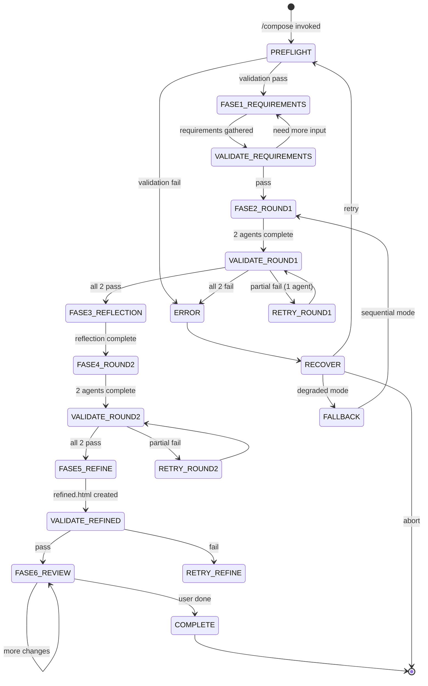

# Compose

Generate multiple low-fidelity wireframe sketches using 2 parallel design agents. Each agent explores a different layout approach. After two rounds of iteration with visual reflection, the best elements are automatically combined into a refined version.

**Keywords**: wireframe, mockup, prototype, layout, UI design, UX, mobile, desktop, atomic design, storybook, low-fidelity, parallel agents, design variants

## When to Use

- Planning page layouts before coding
- Exploring different layout options
- Before starting `/build` workflow
- Need diverse design perspectives

---

## State Machine



**State Descriptions:**

- **PREFLIGHT**: Validate theme, directories, template, agent capability
- **FASE1_REQUIREMENTS**: Gather user requirements via modals, with full project context
- **VALIDATE_REQUIREMENTS**: Check requirements completeness
- **FASE2_ROUND1**: Spawn 2 parallel agents for v1 wireframes
- **VALIDATE_ROUND1**: Verify all 2 v1 files exist and valid
- **RETRY_ROUND1**: Retry failed agent only
- **FASE3_REFLECTION**: Sequential thinking analysis of v1 wireframes
- **FASE4_ROUND2**: Spawn 2 parallel agents for v2 wireframes
- **VALIDATE_ROUND2**: Verify all 2 v2 files exist and valid
- **FASE5_REFINE**: User selects basis + elements to combine into refined.html
- **VALIDATE_REFINED**: Verify refined.html exists and valid
- **FASE6_REVIEW**: User reviews refined version, iterative tweaks
- **COMPLETE**: Create final.html and prepare handoff to /build
- **FALLBACK**: Degraded sequential mode

---

## Process Overview

```
FASE 0.5: Pre-flight Validation
    ↓
FASE 1: Requirements & Project Context
    ↓
FASE 2: Round 1 - 2 agents create v1 wireframes (parallel)
    ↓
    [Validate Round 1]
    ↓
FASE 3: Visual Reflection (sequential thinking)
    ↓
FASE 4: Round 2 - 2 agents create v2 wireframes (parallel)
    ↓
    [Validate Round 2]
    ↓
FASE 5: Refine - User selects best elements for refined version
    ↓
FASE 6: Review & Tweak refined version
    ↓
FASE 7: Final Post-flight Validation
```

## Resources

This skill includes pre-researched reference files for fast execution:

| File                                       | Description                                                       |
| ------------------------------------------ | ----------------------------------------------------------------- |
| `references/html-template.html`            | Single-view template (phone OR desktop)                           |
| `references/html-template-responsive.html` | **RECOMMENDED** Dual-view template (phone + desktop side-by-side) |
| `references/mobile-patterns.md`            | Touch targets, navigation, layouts, forms for mobile              |
| `references/desktop-patterns.md`           | Navigation, grids, interactions, data display for desktop         |
| `references/page-types.md`                 | Structures for landing, dashboard, form, list, detail, settings   |

---

## FASE 0.5: Pre-flight Validation

> **CRITICAL:** Run these checks BEFORE spawning expensive parallel agents.

```
PRE-FLIGHT CHECK
════════════════════════════════════════════════════════════════
```

### 1. Theme Dependency Check

```bash
# Check .workspace/config/THEME.md
```

```
Theme: [✓|✗] THEME.md - [exists|missing]
  → If exists: [valid|corrupt]
  → Tokens: colors={N}, typography={N}, spacing={N}
```

### 2. Output Directory Check

```bash
# Check .workspace/wireframes/[page-name]/
```

```
Directory: [✓|✗] .workspace/wireframes/ - [exists|created|error]
Page dir: [✓|✗] [page-name]/ - [available|exists (conflict)|error]
```

### 3. Agent Capability Check

```
Task tool: [✓|✗] - [available|unavailable]
Parallel mode: [✓|✗] - [supported|fallback to sequential]
```

### 4. Template Validation

```bash
# Read and validate references/html-template.html
```

```
Template: [✓|✗] html-template.html - [valid|missing|corrupt]
Placeholders: [✓|✗] All required placeholders present
  - {{PAGE_NAME}}: [✓|✗]
  - {{WIREFRAME_CONTENT}}: [✓|✗]
  - {{COMPONENT_STYLES}}: [✓|✗]
  - {{THEME_VARIABLES}}: [✓|✗]
```

### 5. Session Check

```
Session: [✓|✗] [New session | Continuing from {skill}]
Handoff: [✓|✗] [theme data available | not applicable]
```

### Pre-flight Samenvatting

```
════════════════════════════════════════════════════════════════
PRE-FLIGHT RESULT
════════════════════════════════════════════════════════════════
Theme:      [✓ PASS | ⚠ MISSING | ✗ CORRUPT]
Directory:  [✓ PASS | ⚠ CONFLICT | ✗ FAIL]
Agents:     [✓ PARALLEL | ⚠ SEQUENTIAL | ✗ UNAVAILABLE]
Template:   [✓ PASS | ✗ FAIL]

Status: [→ Ready for parallel agents | ⚠ Degraded mode | ✗ Cannot proceed]
════════════════════════════════════════════════════════════════
```

### On Theme Missing

```yaml
header: "Theme Missing"
question: "Geen THEME.md gevonden. Hoe wil je doorgaan?"
options:
  - label: "Run /theme eerst (Recommended)", description: "Maak theme tokens aan"
  - label: "Grayscale wireframes", description: "Standaard low-fidelity zonder theme"
  - label: "Brand preset kiezen", description: "Gebruik preset uit brand-presets.md"
  - label: "Annuleren", description: "Stop workflow"
multiSelect: false
```

### On Directory Conflict

```yaml
header: "Directory Conflict"
question: "Wireframes voor [page-name] bestaan al. Wat nu?"
options:
  - label: "Overschrijven (Recommended)", description: "Vervang bestaande wireframes"
  - label: "Nieuwe naam", description: "Maak [page-name]-v2 directory"
  - label: "Bekijk bestaande", description: "Open bestaande wireframes eerst"
  - label: "Annuleren", description: "Stop workflow"
multiSelect: false
```

### On Agent Unavailable

```yaml
header: "Agent Mode"
question: "Task tool beperkt beschikbaar. Hoe doorgaan?"
options:
  - label: "Sequential mode (Recommended)", description: "2 agents achter elkaar i.p.v. parallel"
  - label: "Single agent", description: "Eén agent maakt 2 varianten"
  - label: "Annuleren", description: "Stop workflow"
multiSelect: false
```

---

## FASE 1: Requirements Gathering

> **Doel:** Inventariseer WAT er op de pagina moet EN begrijp het project voordat agents starten.
> De output is een requirements document dat agents gebruiken.

---

### Step 1.1: Project Context Scan (Automatisch)

> **CRITICAL:** Scan the project FIRST so all subsequent questions are informed by real project data. This context must be included in agent briefings.

**Run these scans automatically before asking the user anything:**

**1. Session & Handoff Data:**

```bash
# Read devinfo for cross-skill handoff
cat .workspace/session/devinfo.json 2>/dev/null
```

**2. Project Identity:**

```bash
# Detect project type and framework
cat package.json 2>/dev/null        # Node/JS projects
cat composer.json 2>/dev/null       # PHP projects
cat project.godot 2>/dev/null       # Godot projects
cat README.md 2>/dev/null           # Project description
```

Read whichever config file exists. Extract:

- Project name and description
- Framework/library (Next.js, Remix, Nuxt, Astro, etc.)
- Key dependencies (UI libraries, state management, etc.)

**3. Existing Pages & Routes:**

```
Glob: src/pages/**/*.{tsx,jsx,vue,svelte,astro}
Glob: app/**/page.{tsx,jsx}
Glob: src/routes/**/*.{tsx,jsx,svelte}
Glob: pages/**/*.{tsx,jsx,vue}
```

**4. Existing Components:**

```
Glob: src/components/**/*.{tsx,jsx,vue,svelte}
Glob: components/**/*.{tsx,jsx,vue,svelte}
```

**5. API Routes & Data Models:**

```
Glob: src/api/**/*.{ts,js}
Glob: app/api/**/*.{ts,js}
Glob: src/types/**/*.{ts,d.ts}
Glob: types/**/*.{ts,d.ts}
Glob: src/models/**/*.{ts,js}
```

**6. Design System / Existing Styles:**

```
Glob: src/styles/**/*.{css,scss}
Glob: tailwind.config.*
Glob: src/design-system/**/*
```

**7. Theme (from pre-flight):**

```bash
# Already checked in pre-flight, use cached result
# If THEME.md exists, extract design tokens for agent briefing
```

**8. Design Memory (persistent design decisions):**

```bash
cat .workspace/config/DESIGN_MEMORY.md 2>/dev/null
```

Als Design Memory bestaat: laad beslissingen voor agent briefing en toon samenvatting.
Als niet bestaat: skip (eerste run voor dit project).

**Show context summary to user:**

```
PROJECT CONTEXT
════════════════════════════════════════════════════════════════

Project: [name from package.json / README]
Type: [E-commerce | SaaS | Blog | Portfolio | Admin | Game | Unknown]
Framework: [Next.js App Router | Next.js Pages | Remix | Astro | etc.]
UI Library: [Tailwind | MUI | Chakra | None detected]

Existing pages ({N}):
  /products, /cart, /checkout, /account, ...

Reusable components ({N}):
  Button, Card, Header, Footer, Modal, ...

API endpoints ({N}):
  GET /api/products, POST /api/cart, ...

Data models:
  User, Product, Order, ...

Theme: [Available (THEME.md) | Not available]
Design memory: [Available ({N} decisions) | Not available (first run)]
Previous skill: [theme → wireframe handoff | None]

════════════════════════════════════════════════════════════════
```

---

### Step 1.2: Open Beschrijving

Now ask the user, WITH context already displayed:

```yaml
header: "Beschrijving"
question: "Beschrijf wat deze pagina moet doen en voor wie het is:"
options: []
# Tekst input - laat gebruiker in eigen woorden beschrijven
```

**Voorbeelden van goede input:**

- "Een dashboard voor marketing managers om campagne ROI te monitoren"
- "Checkout flow voor een e-commerce site met payment options"
- "Settings pagina waar users hun profiel en notificaties kunnen aanpassen"

---

### Step 1.3: Paginatype Bevestiging

Op basis van beschrijving + context scan:

```yaml
header: "Paginatype"
question: "Je beschreef [samenvatting]. Is dit een...?"
options:
  - label: "Dashboard", description: "Overzicht met metrics, grafieken, status"
  - label: "Landing", description: "Marketing pagina met hero en CTA"
  - label: "Formulier", description: "Data invoer met validatie"
  - label: "Lijst/Overzicht", description: "Items met filtering en sortering"
  - label: "Detail", description: "Detailweergave van één item"
  - label: "Instellingen", description: "Configuratie en voorkeuren"
  - label: "Checkout/Flow", description: "Multi-step process"
  - label: "Anders", description: "Ik beschrijf het zelf"
multiSelect: false
```

---

### Step 1.4: Type-Specifieke Verdieping

**Per paginatype, vraag specifieke details:**

#### Voor Dashboard:

```yaml
header: "Dashboard Details"
question: "Wat voor data toont dit dashboard?"
options:
  - label: "Analytics/Metrics", description: "KPIs, grafieken, trends"
  - label: "Admin/Beheer", description: "Users, content, permissions"
  - label: "Persoonlijk", description: "Eigen activiteit, stats, progress"
  - label: "Operationeel", description: "Live status, queues, alerts"
multiSelect: false
```

Dan:

```yaml
header: "Key Metrics"
question: "Welke belangrijkste informatie moet direct zichtbaar zijn? (max 5)"
options: []
# Tekst input - bijv: "conversions, spend, ROI, active campaigns, top performers"
```

#### Voor Formulier:

```yaml
header: "Formulier Details"
question: "Wat voor formulier is dit?"
options:
  - label: "Contact/Feedback", description: "Simpel contact formulier"
  - label: "Registratie/Signup", description: "Account aanmaken"
  - label: "Checkout/Payment", description: "Bestelling afronden"
  - label: "Settings/Profile", description: "Instellingen wijzigen"
  - label: "Data Entry", description: "Complexe data invoer"
multiSelect: false
```

Dan:

```yaml
header: "Formulier Velden"
question: "Welke velden zijn nodig? (lijst de belangrijkste)"
options: []
# Tekst input - bijv: "email, password, name, company, phone"
```

#### Voor Lijst:

```yaml
header: "Lijst Details"
question: "Wat voor items toont deze lijst?"
options:
  - label: "Producten", description: "E-commerce catalogus"
  - label: "Artikelen/Posts", description: "Blog of nieuws"
  - label: "Users/Contacts", description: "Mensen beheren"
  - label: "Orders/Transacties", description: "Bestellingen of history"
  - label: "Files/Documents", description: "Bestanden of documenten"
multiSelect: false
```

Dan:

```yaml
header: "Lijst Features"
question: "Welke features zijn nodig?"
options:
  - label: "Zoeken", description: "Tekst search"
  - label: "Filters", description: "Filter op eigenschappen"
  - label: "Sorteren", description: "Sorteer opties"
  - label: "Pagination", description: "Meerdere pagina's"
  - label: "Bulk acties", description: "Meerdere items selecteren"
multiSelect: true
```

#### Voor Landing:

```yaml
header: "Landing Details"
question: "Wat is het doel van deze pagina?"
options:
  - label: "Product launch", description: "Nieuw product presenteren"
  - label: "Lead generation", description: "Emails/signups verzamelen"
  - label: "Brand awareness", description: "Bedrijf/merk voorstellen"
  - label: "Feature showcase", description: "Features uitlichten"
multiSelect: false
```

Dan:

```yaml
header: "Landing Secties"
question: "Welke secties zijn nodig?"
options:
  - label: "Hero met CTA", description: "Hoofdboodschap + actie"
  - label: "Features", description: "Belangrijkste voordelen"
  - label: "Social proof", description: "Testimonials, logos, stats"
  - label: "Pricing", description: "Prijzen of plannen"
  - label: "FAQ", description: "Veelgestelde vragen"
  - label: "Contact/CTA", description: "Afsluitende call-to-action"
multiSelect: true
```

---

### Step 1.5: Platform Keuze

```yaml
header: "Platform"
question: "Voor welk platform ontwerp je?"
options:
  - label: "Responsive dual-view (Recommended)", description: "Phone + Desktop naast elkaar met toggle"
  - label: "Mobile first", description: "Primair mobile, desktop secondary"
  - label: "Desktop only", description: "Uitsluitend desktop (bijv. admin tools)"
  - label: "Mobile only", description: "Uitsluitend mobile (bijv. app webview)"
multiSelect: false
```

**Template Selection Based on Platform:**

- **Responsive dual-view** → Use `html-template-responsive.html`
- **Mobile first / Mobile only** → Use `html-template.html` with `phone-frame`
- **Desktop only** → Use `html-template.html` with `desktop-frame`

---

### Step 1.6: Requirements Samenvatting

Toon verzamelde requirements aan gebruiker, INCLUDING project context:

```
REQUIREMENTS SAMENVATTING
═════════════════════════════════════════════════════════════════

Page: [naam]
Type: [Dashboard | Landing | Form | etc.]
Platform: [Desktop + Mobile | etc.]

MUST HAVE:
1. [Component/Feature]: [wat het moet doen]
2. [Component/Feature]: [wat het moet doen]
3. [Component/Feature]: [wat het moet doen]
...

PROJECT CONTEXT (from codebase):
- Framework: [detected framework]
- Reusable components: [bestaande components die relevant zijn]
- API endpoints: [beschikbare endpoints]
- Data models: [relevante types/interfaces]
- Existing pages: [navigatie context]

═════════════════════════════════════════════════════════════════
```

```yaml
header: "Requirements Check"
question: "Klopt deze samenvatting? Mis ik iets?"
options:
  - label: "Ja, dit klopt (Recommended)", description: "Ga door naar layout preferences"
  - label: "Ik wil iets toevoegen", description: "Extra requirements specificeren"
  - label: "Ik wil iets verwijderen", description: "Requirements aanpassen"
  - label: "Opnieuw beginnen", description: "Start requirements gathering opnieuw"
multiSelect: false
```

---

### Step 1.7: Layout Preferences (Optioneel)

```yaml
header: "Layout"
question: "Heb je specifieke layout wensen? (optioneel)"
options:
  - label: "Laat Claude beslissen (Recommended)", description: "Agents bepalen zelf de beste layout"
  - label: "Met sidebar", description: "Hoofd content + zijpaneel voor filters/nav"
  - label: "Zonder sidebar", description: "Full-width content"
  - label: "Split view", description: "Twee kolommen naast elkaar"
  - label: "Eigen specificatie", description: "Ik beschrijf mijn layout wensen"
multiSelect: false
```

**Als "Eigen specificatie":**

```yaml
header: "Layout Details"
question: "Beschrijf je layout wensen:"
options: []
# Tekst input
# Voorbeelden: "Filters bovenaan, niet in sidebar", "Sticky header", "Cards in 3-kolom grid"
```

---

### Step 1.8: Atomic Design Level

```yaml
header: "Design Niveau"
question: "Welk detail niveau voor de wireframes?"
options:
  - label: "Page (Recommended)", description: "Complete pagina met alle secties"
  - label: "Template", description: "Pagina layout met placeholder content"
  - label: "Organism", description: "Focus op één sectie (header, card grid, etc.)"
multiSelect: false
```

---

### Step 1.9: Theme Integration

**Als THEME.md bestaat (detected in pre-flight):**

```yaml
header: "Theme"
question: "Theme tokens gevonden. Gebruiken voor wireframes?"
options:
  - label: "Ja, gebruik theme (Recommended)", description: "Wireframes krijgen theme kleuren en fonts"
  - label: "Nee, standaard grayscale", description: "Low-fidelity grayscale wireframes"
multiSelect: false
```

---

### Step 1.10: Bevestiging & Requirements Document

**Genereer requirements document:**

```markdown
# Wireframe Requirements: [Page Name]

## Context

- **Doel:** [Samenvatting van wat gebruiker beschreef]
- **Gebruiker:** [Wie gebruikt dit]
- **Platform:** [Desktop + Mobile | etc.]
- **Type:** [Dashboard | Landing | Form | etc.]

## Project Context

- **Framework:** [Next.js App Router | etc.]
- **UI Library:** [Tailwind | MUI | etc.]
- **Existing Components:** [Button, Card, Header, etc.]
- **API Endpoints:** [relevant endpoints]
- **Data Models:** [relevant types]
- **Related Pages:** [existing pages in same flow]

## Must Have

1. **[Component]:** [Wat het moet tonen/doen]
2. **[Component]:** [Wat het moet tonen/doen]
3. **[Component]:** [Wat het moet tonen/doen]
   ...

## Layout

- **Voorkeur:** [Claude beslist | Sidebar | Full-width | Custom: ...]
- **Niveau:** [Page | Template | Organism]

## Theme

- **Styling:** [Theme tokens | Grayscale]

## Hints voor Agents

- [Pattern suggestie gebaseerd op page type]
- [Best practice hint]
- [Codebase context hint: "Project uses Tailwind, keep class naming consistent"]
- [Existing component hint: "Header component exists at src/components/Header.tsx"]

---

✓ Requirements complete — ready for agents
```

**Sla op naar:** `.workspace/wireframes/[page]/requirements.md`

```yaml
header: "Start Agents"
question: "Requirements document is klaar. Starten met wireframe generatie?"
options:
  - label: "Ja, start agents (Recommended)", description: "2 parallel agents maken v1 wireframes"
  - label: "Nee, requirements aanpassen", description: "Terug naar requirements"
  - label: "Annuleren", description: "Stop workflow"
multiSelect: false
```

---

### Step 1.11: Load Reference Patterns

**Na bevestiging, laad relevante reference files:**

```
Loading reference patterns...
```

**Based on platform:**

```
Read: skills/frontend-compose/references/mobile-patterns.md (if mobile)
Read: skills/frontend-compose/references/desktop-patterns.md (if desktop)
```

**Based on page type:**

```
Read: skills/frontend-compose/references/page-types.md
```

---

### FASE 1 Output

**Wat agents ontvangen:**

```
AGENT BRIEFING
══════════════

Page: Marketing Dashboard
Platform: Desktop + Mobile
Level: Page

PROJECT CONTEXT:
- Framework: Next.js 14 App Router
- UI Library: Tailwind CSS
- Existing components: Button, Card, Header, Sidebar, Modal
- API: GET /api/analytics, GET /api/campaigns, POST /api/reports
- Data models: Campaign { id, name, spend, conversions, ctr }
- Related pages: /campaigns, /reports, /settings

REQUIREMENTS:
1. Header: Logo, main nav, user menu with notifications
2. KPI Cards (4x): Total spend, Conversions, ROI %, Avg CTR
3. Trend Chart: Conversions over time (line chart, last 30 days)
4. Campaign Table: Top campaigns with spend, clicks, conversions, sortable
5. Filters: Date range picker, channel selector, campaign status

LAYOUT:
- User preference: Sidebar for filters
- Hint: KPIs at top for quick scanning
- Hint: Table may need horizontal scroll on mobile

THEME:
- Using: THEME.md tokens (see attached)

DESIGN MEMORY (consistency — only if available):
- [Layout: sidebar 280px, collapsible under md breakpoint]
- [Cards: rounded-lg, shadow-sm, p-4, border border-gray-200]
- [Navigation: bottom sheet op mobile, sidebar op desktop]
- [Anti-patterns: geen hamburger, geen gradients op buttons]
→ Respecteer deze beslissingen. Gebruik dezelfde patronen
  tenzij de requirements expliciet iets anders vragen.

REFERENCE PATTERNS:
- Dashboard patterns from page-types.md
- Desktop patterns (primary)
- Mobile patterns (responsive)

CRITICAL: Het template bevat Edit Mode code (CSS, JS, interact.js CDN).
Verwijder deze NIET en wijzig ze NIET. Edit Mode wordt door gebruikers
gebruikt na generatie voor drag/resize/text editing.

YOUR TASK: Create a unique wireframe layout. Focus on a different structural
approach than the other agent. Explore alternative arrangements of the
required elements while keeping all requirements intact.

OUTPUT: .workspace/wireframes/dashboard/[agent-a|agent-b]/v1.html
```

---

## FASE 2: Round 1 - First Designs

**CRITICAL:** Spawn 2 agents IN PARALLEL using the Task tool. Send a single message with 2 Task tool calls.

```
2 design agents parallel gestart...

- Agent A: Eerste layout variant maken
- Agent B: Alternatieve layout variant maken
```

### Agent Prompts

**IMPORTANT:** Each agent MUST read `references/html-template.html` (or responsive variant) and use it EXACTLY.

**Task 1 - Agent A:**

```
Task(
  subagent_type="general-purpose",
  description="Create wireframe variant A v1",
  prompt="[Agent A prompt with requirements, project context, template instructions, output path]

  You are Agent A. Create a wireframe layout for the given requirements.
  Focus on YOUR unique structural approach. The other agent will create
  a different layout - make yours distinct.

  Output to: .workspace/wireframes/[page]/agent-a/v1.html"
)
```

**Task 2 - Agent B:**

```
Task(
  subagent_type="general-purpose",
  description="Create wireframe variant B v1",
  prompt="[Agent B prompt with requirements, project context, template instructions, output path]

  You are Agent B. Create a wireframe layout for the given requirements.
  Focus on YOUR unique structural approach. The other agent will create
  a different layout - make yours distinct. Try a fundamentally different
  arrangement of elements.

  Output to: .workspace/wireframes/[page]/agent-b/v1.html"
)
```

### Post-FASE 2 Validation

**Run IMMEDIATELY after both agents complete:**

```
ROUND 1 VALIDATION
════════════════════════════════════════════════════════════════
```

**1. File Existence**

```
Files:
  [✓|✗] agent-a/v1.html - [exists|missing] ({N} bytes)
  [✓|✗] agent-b/v1.html - [exists|missing] ({N} bytes)
```

**2. HTML Validity**

```
Parse status:
  [✓|✗] agent-a/v1.html - [valid HTML|parse error]
  [✓|✗] agent-b/v1.html - [valid HTML|parse error]
```

**3. Navigation Intact**

```
Navigation:
  [✓|✗] wireframe-nav class present
  [✓|✗] All 5 links present (A v1, B v1, A v2, B v2, Refined)
```

**4. Theme Applied (if selected)**

```
Theme:
  [✓|✗] CSS variables injected
  [✓|✗] No default grayscale where theme expected
```

**5. Visual Screenshot Capture (Playwright)**

Capture screenshots en accessibility snapshots voor analyse:

```
Screenshot capture:
  [✓|✗] agent-a/v1-screenshot.png - captured
  [✓|✗] agent-b/v1-screenshot.png - captured

Accessibility snapshots:
  [✓|✗] agent-a/v1-snapshot.md - {N} interactive elements
  [✓|✗] agent-b/v1-snapshot.md - {N} interactive elements
```

**Playwright sequence per wireframe:**

```
1. browser_navigate → file:///[absolute-path]/[agent]/v1.html
2. browser_snapshot → save to [agent]/v1-snapshot.md
3. browser_take_screenshot → save to [agent]/v1-screenshot.png
4. browser_close (cleanup)
```

**Round 1 Result:**

```
════════════════════════════════════════════════════════════════
ROUND 1 RESULT: [2/2 PASS | 1/2 PASS - retry needed | 0/2 FAIL]
════════════════════════════════════════════════════════════════
```

### On Partial Failure (1 agent failed)

```yaml
header: "Partial Failure"
question: "1/2 agents gefaald. Hoe doorgaan?"
options:
  - label: "Retry gefaalde (Recommended)", description: "Alleen [agent] opnieuw"
  - label: "Doorgaan met succes", description: "Ga verder met 1 wireframe"
  - label: "Alles opnieuw", description: "Start FASE 2 opnieuw"
  - label: "Sequential mode", description: "Schakel over naar sequential"
multiSelect: false
```

---

## FASE 3: Visual Reflection

### Step 3.1: Analyse Screenshots & Snapshots (Playwright)

Gebruik de screenshots en accessibility snapshots uit Post-FASE 2 validation:

```
Beschikbare assets voor analyse:
├── agent-a/
│   ├── v1-screenshot.png    ← Visuele layout
│   └── v1-snapshot.md       ← Accessibility tree (interactieve elementen)
└── agent-b/
    ├── v1-screenshot.png
    └── v1-snapshot.md
```

**Optioneel: Open in browser voor handmatige review**

```bash
start .workspace/wireframes/[page-name]/agent-a/v1.html
```

### Step 3.2: Sequential Thinking Analysis

Analyseer ELKE wireframe met sequential thinking, gebruik de screenshots EN snapshots:

```
Analyseren van [agent] v1 wireframe...

1. Layout structuur (uit snapshot): Welke elementen zijn aanwezig?
2. Visuele hierarchie (uit screenshot): Is de flow duidelijk?
3. Whitespace balans (uit screenshot): Voldoende ruimte?
4. Touch targets (uit snapshot): Buttons ≥44px? Check interactive elements.
5. Accessibility (uit snapshot): Zijn alle elementen bereikbaar?
6. Wat kan verbeterd worden voor v2?
7. Wat moet behouden blijven?

Conclusie: Specifieke verbeteringen voor v2...
```

**Cross-comparison:**

```
VERGELIJKING A vs B
════════════════════════════════════════════════════════════════

Agent A sterke punten:
- [wat A beter doet]

Agent B sterke punten:
- [wat B beter doet]

Gedeelde verbeterpunten:
- [wat beide moeten verbeteren in v2]

Inzichten voor v2:
- Agent A zou moeten: [specifieke feedback]
- Agent B zou moeten: [specifieke feedback]
- Beide: [gedeelde feedback]

════════════════════════════════════════════════════════════════
```

---

## FASE 4: Round 2 - Improved Designs

**CRITICAL:** Spawn 2 agents IN PARALLEL opnieuw, nu met reflection inzichten.

```
Ronde 2 gestart met visuele feedback...
```

Each agent receives:

- Original requirements + project context
- Their own v1 screenshot analysis
- Cross-comparison insights
- Specific improvement instructions from reflection

### Post-FASE 4 Validation

**Run IMMEDIATELY after both v2 agents complete:**

```
ROUND 2 VALIDATION
════════════════════════════════════════════════════════════════
Files:
  [✓|✗] agent-a/v2.html - [exists|missing] ({N} bytes)
  [✓|✗] agent-b/v2.html - [exists|missing] ({N} bytes)

Parse status: [all valid | {N} errors]
Navigation: [intact | broken]
Theme: [applied | missing]

Screenshots (Playwright):
  [✓|✗] agent-a/v2-screenshot.png - captured
  [✓|✗] agent-b/v2-screenshot.png - captured

Accessibility snapshots:
  [✓|✗] agent-a/v2-snapshot.md - {N} interactive elements
  [✓|✗] agent-b/v2-snapshot.md - {N} interactive elements

ROUND 2 RESULT: [2/2 PASS | 1/2 PASS | FAIL]
════════════════════════════════════════════════════════════════
```

---

## FASE 5: Refine (User-Driven)

> **Doel:** De gebruiker bepaalt welke elementen uit welke wireframe de refined versie vormen.
> Claude opent de wireframes, presenteert de keuzes, en de gebruiker beslist.

### Step 5.1: Open Wireframes voor Vergelijking

Open de eerste wireframe in de browser zodat de gebruiker kan navigeren via de nav balk:

```bash
start .workspace/wireframes/[page-name]/agent-a/v1.html
```

Show table of all 4 wireframes (A v1, B v1, A v2, B v2) with brief layout descriptions.
Remind user about nav bar navigation and Edit Mode.

### Step 5.2: Gebruiker Kiest Basis

```yaml
header: "Basis Kiezen"
question: "Welke wireframe wil je als basis voor de refined versie?"
options:
  - label: "Agent A v2 (Recommended)", description: "Verbeterde variant A als startpunt"
  - label: "Agent B v2", description: "Verbeterde variant B als startpunt"
  - label: "Agent A v1", description: "Originele variant A als startpunt"
  - label: "Agent B v1", description: "Originele variant B als startpunt"
multiSelect: false
```

### Step 5.3: Gebruiker Kiest Elementen om Over te Nemen

Na de basis-keuze, vraag welke elementen uit de ANDERE wireframes overgenomen moeten worden:

```yaml
header: "Elementen Combineren"
question: "Welke elementen wil je overnemen uit de andere wireframes? (bekijk ze in de nav balk)"
options:
  - label: "Geen - basis is goed", description: "Gebruik alleen de gekozen basis"
multiSelect: false
# User kiest "Other" om te beschrijven welke elementen uit welke wireframe
# Bijv: "Header van B v2, cards layout van A v1, mobile nav van B v2"
```

**Als user elementen wil combineren, vraag door:**

```yaml
header: "Specifieke Elementen"
question: "Beschrijf per onderdeel welke versie je wilt gebruiken:"
options:
  - label: "Ik heb het al beschreven", description: "Ga verder met mijn vorige antwoord"
multiSelect: false
# User beschrijft via "Other" bijv:
# "Header: van B v2 (breder, met search bar)"
# "Content grid: van A v2 (3 kolommen)"
# "Footer: van B v1 (compacter)"
```

### Step 5.4: Samenvatting & Bevestiging

Show plan summary: chosen basis + list of overgenomen elementen with source wireframe.

```yaml
header: "Bevestiging"
question: "Klopt dit plan voor de refined versie?"
options:
  - label: "Ja, maak refined (Recommended)", description: "Combineer zoals beschreven"
  - label: "Aanpassen", description: "Ik wil de elementen-keuze wijzigen"
multiSelect: false
```

### Step 5.5: Generate Refined Wireframe

Create `refined/refined.html` by combining the user-selected elements:

- Use the same HTML template as all other wireframes
- Start from the user-chosen basis wireframe
- Replace specified elements with those from the user-indicated sources
- Set `{{ACTIVE_REFINED}}` to `class="active"` in the nav bar
- Ensure all requirements from FASE 1 are met

**Output to:** `.workspace/wireframes/[page]/refined/refined.html`

### Step 5.6: Validate Refined Version

Validate: file exists, valid HTML, navigation (5 links, Refined active), theme, all requirements.
Capture Playwright screenshot + accessibility snapshot. Report PASS/FAIL.

### Step 5.7: Open Refined Version

```bash
start .workspace/wireframes/[page-name]/refined/refined.html
```

Confirm: show basis, combined elements, requirements count, and nav bar reference.

---

## FASE 6: Review & Tweak (Optional)

> **Doel:** Iteratief de refined wireframe tweaken tot user satisfied is.
> **Tip:** De gebruiker kan ook direct in de browser editen via de "Edit Mode" toggle
> in de nav balk. Drag componenten, resize elementen, en bewerk tekst direct.
> Daarna kan de gebruiker de aangepaste wireframe downloaden via "Download HTML".

> Edit Mode features (sub-modes, toolbar, undo/redo, delete, limitations):
> See `references/appendix.md#edit-mode-features`

### Step 6.1: Ask for Review

```yaml
header: "Review"
question: "Hoe wil je verder met de refined wireframe?"
options:
  - label: "Tweaken (Recommended)", description: "Ik wil nog aanpassingen doen"
  - label: "Klaar - maak final", description: "Direct doorgaan naar final.html"
  - label: "Kies andere basis", description: "Ik wil liever een van de 4 originelen gebruiken"
multiSelect: false
```

**If user selects "Kies andere basis":**

```yaml
header: "Selecteer Wireframe"
question: "Welke wireframe wil je als basis gebruiken?"
options:
  - label: "Agent A v2", description: "Layout variant A, verbeterde versie"
  - label: "Agent A v1", description: "Layout variant A, initieel"
  - label: "Agent B v2", description: "Layout variant B, verbeterde versie"
  - label: "Agent B v1", description: "Layout variant B, initieel"
multiSelect: false
```

Then copy selected wireframe to `refined/refined.html` and continue to tweaking.

### Step 6.2: Refinement Loop

```yaml
header: "Refinement"
question: "Wat wil je aanpassen aan deze wireframe?"
options:
  - label: "Done - wireframe is klaar", description: "Afronden en final.html maken"
  - label: "Ik heb in de browser geëdit", description: "Ik upload mijn gedownloade wireframe-edited.html"
multiSelect: false
# User kan "Other" kiezen voor tekst input met beschrijving van wijzigingen
```

**Als user "Ik heb in de browser geëdit" kiest:**
De gebruiker heeft via Edit Mode in de browser aanpassingen gedaan en een `wireframe-edited.html` gedownload. Vraag om het pad naar dit bestand, lees het in, en gebruik het als de nieuwe basis voor `refined/refined.html`.

**Voorbeelden van instructies (via "Other" tekst input):**

- "Maak de header kleiner, 60px hoogte"
- "Voeg een search bar toe in de header"
- "Verwijder de sidebar, maak content full-width"
- "Meer whitespace tussen de secties (32px)"
- "Verplaats de CTA button naar rechts"
- "Verander de grid van 3 naar 4 kolommen"

### Step 6.3: Pas Wijzigingen Toe

Analyseer de instructie en pas de HTML aan:

Show analysis (component, type, details), apply changes.
After: Playwright validate (navigate, snapshot, screenshot → `iteration-{N}.png`).
Show before/after comparison with applied changes summary.

### Step 6.5: Continue of Finalize

Loop terug naar Step 6.2 voor volgende iteratie.

Als user "Done" kiest → ga naar Step 6.6.

### Step 6.6: Finalize Wireframe

Maak final.html van de refined wireframe:

```bash
# Kopieer naar final locatie
cp .workspace/wireframes/[page]/refined/refined.html .workspace/wireframes/[page]/final.html

# Final screenshot
# Playwright: browser_take_screenshot → final-screenshot.png
```

Confirm completion: show final.html path, screenshot path, total iterations.

### Step 6.7: Update Design Memory

Analyseer de final wireframe en extraheer design decisions naar `.workspace/config/DESIGN_MEMORY.md`.

**Bij eerste run (bestand bestaat niet) — create:**

Genereer DESIGN_MEMORY.md met 5 secties geëxtraheerd uit de final wireframe:

```markdown
# Design Memory

Persistent design decisions voor dit project. Automatisch bijgewerkt door /compose.

## Layout

- [Geëxtraheerde layout beslissingen: grid/flex structuur, sidebar breedte, header hoogte, breakpoints]

## Components

- [Card stijl, button variant, form layout, tabel approach]

## Interaction

- [Modal type, nav patroon, dropdown/popover keuze]

## Typography

- [Heading weight, body size, data display stijl]

## Anti-patterns

- [Wat bewust NIET is gekozen en waarom]

---

_Bijgewerkt door /compose voor: [page-name] op [datum]_
```

**Bij volgende runs (bestand bestaat) — merge:**

1. Lees bestaande DESIGN_MEMORY.md
2. Vergelijk met nieuwe wireframe beslissingen
3. Nieuwe beslissingen die niet conflicteren: **toevoegen**
4. Bestaande beslissingen: **behouden**
5. Bij conflict (bijv. andere sidebar breedte):

```yaml
header: "Design Memory"
question: "Nieuwe layout wijkt af van bestaande memory. Wat wil je?"
options:
  - label: "Update memory (Recommended)"
    description: "Nieuwe beslissing vervangt de oude"
  - label: "Behoud bestaande"
    description: "Deze pagina is een uitzondering"
  - label: "Review beide"
    description: "Toon verschil en laat mij kiezen"
```

---

## FASE 7: Final Post-flight Validation

**Run before completion:**

```
FINAL POST-FLIGHT CHECK
════════════════════════════════════════════════════════════════
```

### 1. Completeness

```
Files: [5/5 wireframes created]
  agent-a/v1.html: [✓] {size} bytes
  agent-a/v2.html: [✓] {size} bytes
  agent-b/v1.html: [✓] {size} bytes
  agent-b/v2.html: [✓] {size} bytes
  refined/refined.html: [✓] {size} bytes
```

### 2. Navigation Check

```
Navigation links:
  [✓|✗] All relative paths valid
  [✓|✗] Active states correctly set per file
  [✓|✗] Refined link present and styled
```

### 3. Accessibility Baseline

```
Accessibility (RULES.md H002, H006):
  [✓|✗] H1 present in each wireframe
  [✓|✗] Touch targets ≥44px (spot check)
  [⚠] Color contrast: [N/A for grayscale | verified for theme]
```

### 4. Edit Mode Intact

```
Edit mode present (for user post-generation editing):
  [✓|✗] interact.js CDN script tag present
  [✓|✗] Edit toggle button in nav bar
  [✓|✗] Edit toolbar with Layout/Text/Add/Undo/Redo/Download/Reset
  [✓|✗] Edit mode CSS classes (edit-handle, edit-toolbar, etc.)
```

### 5. Storybook Readiness

```
data-* attributes:
  [✓|✗] data-component present: {N} components
  [✓|✗] data-variant present: {N} variants
  [✓|✗] data-atomic present: {N} marked
```

### Final Result

```
════════════════════════════════════════════════════════════════
FINAL POST-FLIGHT RESULT
════════════════════════════════════════════════════════════════
Completeness:   [✓ 5/5]
Navigation:     [✓ PASS | ✗ FAIL]
Accessibility:  [✓ PASS | ⚠ {N} warnings]
Edit mode:      [✓ Edit mode intact for user editing]
Storybook:      [✓ {N} components ready]

Status: [→ Complete | ⚠ Warnings noted]
════════════════════════════════════════════════════════════════
```

---

---

> **Reference material** (output structure, error recovery, DevInfo integration, cross-skill contracts, styling guidelines, resources):
> See `references/appendix.md`

## Troubleshooting

### Error: Agent timeout during wireframe generation

**Cause:** Parallel Task agents may timeout on complex designs.
**Solution:** The skill automatically degrades: 2 parallel → 2 sequential → 1 agent with 2 variants. Successfully generated wireframes are always preserved.

### Error: Empty or broken HTML output

**Cause:** Agent produced invalid HTML wireframe.
**Solution:** The skill retries the failing agent with a more verbose prompt. If persistent, falls back to template-only output.

### Error: Theme not applied to wireframes

**Cause:** THEME.md not found or CSS export section invalid.
**Solution:** Check `.workspace/config/THEME.md` exists with a valid CSS export. Run `/frontend-theme` first if needed.

## Restrictions

Dit command moet **NOOIT**:

- Parallel agents spawnen zonder pre-flight validation
- Doorgaan als template corrupt is
- Post-flight validation overslaan
- Gedeeltelijke outputs als "complete" markeren
- Edit mode code (interact.js, CSS, JS) verwijderen uit templates — dit is essentieel voor gebruikers

Dit command moet **ALTIJD**:

- Project context scannen VOOR requirements gathering
- Project context meesturen in agent briefings
- Pre-flight validation uitvoeren VOOR agents
- Na elke agent ronde valideren
- Gebruiker laten kiezen welke elementen in de refined versie komen
- Refined versie opnemen in nav balk
- Retry aanbieden bij partial failures
- Graceful degradation bij persistent failures
- DevInfo updaten bij elke fase transitie
- Final post-flight validation uitvoeren
