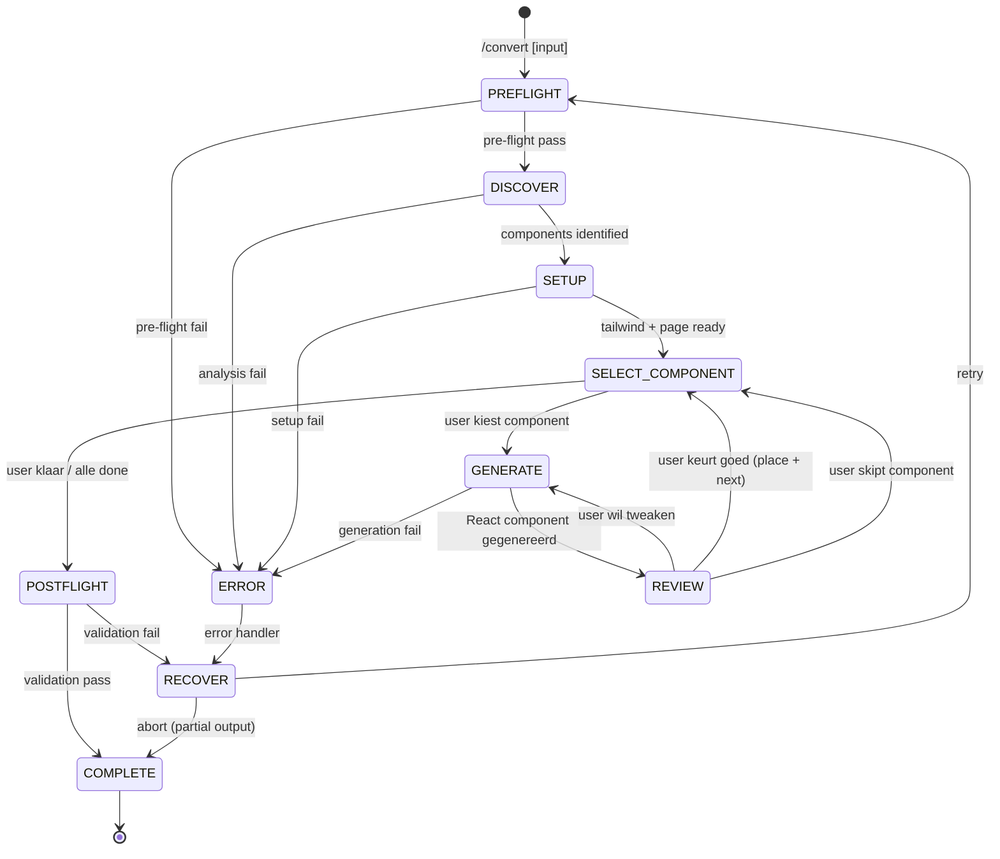

# Convert

Converteer een bestaand high-fidelity design naar productie-klare React+Tailwind components, component voor component. Elk component wordt gegenereerd, gereviewed tegen het originele design, en geplaatst in een werkende pagina. Geen creatieve design stap -- puur mechanische 1:1 conversie.

**Keywords**: convert, screenshot, HTML, URL, Figma export, Webflow, React, Tailwind, reverse engineering, design-to-code, pixel-perfect, external design

## When to Use

- When a designer provides a finished design (screenshot, Figma export, Webflow export)
- When you have an HTML page you want to recreate in React
- When you want to convert a live website into React components
- When you receive a design mockup and need pixel-perfect React code
- When migrating an existing HTML/CSS page to a React+Tailwind stack

**Dit is het EXTERNE pad.** Designers leveren een af design, `/convert` maakt er React van.
Het interne pad (`/theme` -> `/compose` -> `/build`) is voor ontwerpen vanuit wireframes.

---

## State Machine



**State Descriptions:**

- **PREFLIGHT**: Detect input type, validate project structure, check theme
- **DISCOVER**: Analyse design (vision/HTML parse), build component tree
- **SETUP**: Extract design tokens, extend Tailwind, create page skeleton
- **SELECT_COMPONENT**: User picks next component from list (or follows suggested order)
- **GENERATE**: Convert design region directly to React+Tailwind component
- **REVIEW**: User compares generated component with original design -- approve, tweak, or skip
- **POSTFLIGHT**: Final validation (TypeScript, page, structure)
- **COMPLETE**: Summary report

> **Key difference with /build:** Er is geen PREVIEW_HIFI state. Design CSS waarden worden
> DIRECT vertaald naar Tailwind classes. Geen `.hf-*` tussenlaag, geen `preview.html`.

---

## References

- `../shared/VALIDATION.md` -- Pre-flight/post-flight patterns
- `../shared/RULES.md` -- React/TypeScript rules (R001-R108, T001-T103)
- `../shared/PATTERNS.md` -- Component patterns (compound, render props, etc.)
- `../shared/DEVINFO.md` -- Session tracking, handoff contracts

---

## Cross-Skill Contract

### Input (universal)

Dit skill accepteert input uit ELKE bron -- geen handoff van andere skills vereist:

| Input Type | Detectie                                                  | Bron                                             |
| ---------- | --------------------------------------------------------- | ------------------------------------------------ |
| Screenshot | `.png`, `.jpg`, `.jpeg`, `.webp`, `.gif`, `.bmp` extensie | Designer, Figma export, browser screenshot       |
| HTML file  | `.html`, `.htm` extensie                                  | Webflow export, saved webpage, Figma HTML export |
| URL        | `http://` of `https://` prefix                            | Live website, staging environment                |

```
/convert screenshot.png
/convert design.html
/convert https://example.com/landing
```

### Output (final)

```json
{
  "from": "frontend-convert",
  "to": "frontend-data",
  "data": {
    "inputType": "screenshot | html | url",
    "inputSource": "[path or URL]",
    "pageFile": "src/pages/[page].tsx",
    "componentsDirectory": "src/components/[page]/",
    "tailwindConfig": "tailwind.config.js",
    "componentsCompleted": [
      {
        "name": "Header",
        "atomic": "organism",
        "files": ["Header.tsx", "Header.types.ts"],
        "approved": true
      }
    ],
    "componentsSkipped": [],
    "designTokensExtracted": {
      "colors": 8,
      "fonts": 2,
      "source": "design CSS | vision analysis"
    }
  }
}
```

---

## FASE 0: Pre-flight Validation

**BEFORE any work, validate:**

### 0.1 Input Detectie (Auto-Detect)

Detecteer automatisch het input type op basis van de user input:

```
PRE-FLIGHT: Input Detectie
───────────────────────────
[ ] Input argument aanwezig
[ ] Type gedetecteerd: [screenshot | html | url]
[ ] Input bereikbaar/leesbaar
```

**Detectie regels:**

- Extensie `.png`, `.jpg`, `.jpeg`, `.webp`, `.gif`, `.bmp` -> **screenshot**
- Extensie `.html`, `.htm` -> **html**
- Begint met `http://` of `https://` -> **url**
- Geen match -> vraag de gebruiker

**Per type extra checks:**

**Screenshot:**

```
Input: [pad naar bestand]
  [ ] Bestand bestaat
  [ ] Bestand leesbaar (niet 0 bytes)
  [ ] Afbeelding formaat geldig
  [ ] Resolutie voldoende (min 800px breed)
```

**HTML:**

```
Input: [pad naar bestand]
  [ ] Bestand bestaat
  [ ] HTML parseerbaar
  [ ] Bevat <body> content
  [ ] Minimaal 1 visueel element
```

**URL:**

```
Input: [URL]
  [ ] URL syntax geldig
  [ ] Site bereikbaar (HTTP 200)
  [ ] Content-Type is text/html
  [ ] Pagina laadt zonder auth
```

**On detection failure:**

```yaml
header: "Input Type"
question: "Kan het input type niet detecteren. Wat is het?"
options:
  - label: "Screenshot/afbeelding"
    description: "PNG, JPG, of ander afbeelding formaat"
  - label: "HTML bestand"
    description: "Lokaal HTML bestand"
  - label: "URL/website"
    description: "Live website URL"
  - label: "Annuleren"
    description: "Stop workflow"
multiSelect: false
```

**On URL auth required:**

```yaml
header: "Authenticatie Vereist"
question: "De URL vereist authenticatie. Hoe doorgaan?"
options:
  - label: "Screenshot uploaden (Recommended)"
    description: "Maak een screenshot en gebruik dat als input"
  - label: "HTML opslaan"
    description: "Sla de pagina op als HTML en geef het pad"
  - label: "Annuleren"
    description: "Stop workflow"
multiSelect: false
```

### 0.2 Theme Check (Optioneel)

```
PRE-FLIGHT: Theme
─────────────────
[ ] THEME.md check: [exists | not found]
[ ] Tailwind config check: [exists | not found]
```

**Als THEME.md bestaat:**

- Gebruik bestaande design tokens als basis
- Aanvullen met tokens uit het design waar nodig

**Als THEME.md NIET bestaat:**

```yaml
header: "Design Tokens"
question: "Geen THEME.md gevonden. Hoe design tokens bepalen?"
options:
  - label: "Extraheren uit design (Recommended)"
    description: "Kleuren, fonts, spacing automatisch detecteren uit het design"
  - label: "Run /theme eerst"
    description: "Maak eerst een theme aan"
  - label: "Tailwind defaults"
    description: "Ga door met standaard Tailwind config"
multiSelect: false
```

### 0.3 Project Structure Check

```
PRE-FLIGHT: Project
───────────────────
[ ] package.json exists
[ ] tailwindcss in dependencies (of devDependencies)
[ ] TypeScript configured (tsconfig.json)
[ ] src/components/ exists or can be created
[ ] Framework detectie: [Next.js App Router | Next.js Pages | Vite React | Other]
```

**On Tailwind missing:**

```yaml
header: "Tailwind Nodig"
question: "Tailwind niet gevonden in project. Hoe doorgaan?"
options:
  - label: "Installeer Tailwind (Recommended)"
    description: "Run: npm install -D tailwindcss"
  - label: "Ga door zonder"
    description: "Genereer components, fix Tailwind later"
  - label: "Annuleren"
    description: "Stop en installeer eerst Tailwind"
multiSelect: false
```

### 0.4 Conflict Check

```
PRE-FLIGHT: Conflicts
─────────────────────
[ ] Target directory src/components/[page]/ check
[ ] Bestaande components detectie
[ ] tailwind.config.js backup nodig?
```

**On conflict:**

```yaml
header: "Bestaande Components"
question: "Er bestaan al components voor [page]. Hoe doorgaan?"
options:
  - label: "Overschrijven (Recommended)"
    description: "Vervang bestaande components"
  - label: "Samenvoegen"
    description: "Update alleen nieuwe/gewijzigde"
  - label: "Nieuwe directory"
    description: "Maak [page]-v2 directory"
multiSelect: false
```

### Pre-flight Samenvatting

```
PRE-FLIGHT COMPLETE
===============================================================
Input:     [type]: [path/URL]
Theme:     [THEME.md gevonden | Extraheren uit design | Tailwind defaults]
Project:   [Next.js 14 + Tailwind 3.4 + TypeScript 5.3]
Framework: [App Router | Pages Router | Vite]
Target:    src/components/[page]/
Status:    Ready to analyse design
===============================================================
```

---

## FASE 1: Component Discovery

> **Doel:** Analyseer het design en identificeer alle visuele components met hun structuur en relaties.

### 1.1 Design Analyse

De analyse methode verschilt per input type:

#### Screenshot Analyse (Claude Vision)

Gebruik Claude's vision capabilities om de screenshot te analyseren:

```
DESIGN ANALYSE: Screenshot
===============================================================

Analysing screenshot via vision...

1. Identificeer visuele regio's (header, sidebar, main, footer)
2. Detecteer herhalende patronen (cards, list items, nav items)
3. Extraheer kleurpalet (dominant colors, accent colors)
4. Identificeer typografie (heading sizes, body text, captions)
5. Detecteer layout structuur (grid, flex, columns)
6. Identificeer interactieve elementen (buttons, inputs, links)

===============================================================
```

**Vision prompt strategie:**

- Beschrijf ELKE visuele sectie van de pagina
- Identificeer component grenzen
- Noteer exacte kleuren waar mogelijk
- Beschrijf typografie hierarchie
- Identificeer spacing patronen
- Markeer interactieve vs. statische elementen

#### HTML Analyse (Parse)

Parse de HTML structuur om components te identificeren:

```
DESIGN ANALYSE: HTML
===============================================================

1. Parse DOM structuur
2. Extraheer semantic landmarks (<header>, <nav>, <main>, <aside>, <footer>)
3. Identificeer component patronen (herhalende structuren)
4. Extraheer CSS (inline styles, <style> blocks, linked stylesheets)
5. Parse class namen voor component hints
6. Detecteer JavaScript interactie patronen

===============================================================
```

**HTML parse strategie:**

- Lees de volledige HTML source
- Als external CSS linked: lees CSS bestanden
- Map CSS selectors naar HTML elementen
- Groepeer herhalende HTML structuren als components
- Identificeer layout containers vs. content elements

#### URL Analyse (Fetch + Parse)

```
DESIGN ANALYSE: URL
===============================================================

1. Fetch pagina HTML
2. Capture screenshot via Playwright
3. Parse HTML structuur (zelfde als HTML analyse)
4. Extraheer computed styles via Playwright
5. Combineer structurele + visuele analyse

Playwright sequence:
  1. browser_navigate -> [URL]
  2. browser_take_screenshot -> .workspace/convert/[page]/reference.png
  3. browser_snapshot -> .workspace/convert/[page]/reference-snapshot.md
  4. Extraheer computed styles voor key elements

===============================================================
```

### 1.2 Component Tree

Bouw een component tree op basis van de analyse:

```
COMPONENT TREE
===============================================================

Organisms (2):
+-- Header
|   +-- layout: flex, justify-between, items-center
|   +-- children: [Logo, Navigation, UserMenu]
|   +-- root element: <header>
+-- Sidebar
    +-- layout: flex-col, fixed left
    +-- children: [NavGroup, NavItem]

Molecules (4):
+-- Navigation
|   +-- children: [NavLink xN]
+-- UserMenu
|   +-- children: [Avatar, DropdownMenu]
+-- MetricCard
|   +-- variants: [default, highlighted]
+-- DataTable
    +-- children: [TableHeader, TableRow]

Atoms (5):
+-- NavLink -- states: [default, active, hover]
+-- Avatar -- sizes: [sm, md, lg]
+-- Badge
+-- Button -- variants: [primary, secondary, ghost]
+-- Logo

Total: 11 components

===============================================================
```

### 1.3 Gesuggereerde Volgorde (Bottom-Up)

Stel een bottom-up volgorde voor (atoms -> molecules -> organisms), zodat child-components al bestaan als parents aan de beurt komen:

```
GESUGGEREERDE VOLGORDE
===============================================================

 #  Component       Level      Dependencies
--- --------------- ---------- ------------------
 1  Logo            atom       --
 2  Button          atom       --
 3  Badge           atom       --
 4  Avatar          atom       --
 5  NavLink         atom       --
 6  Navigation      molecule   NavLink
 7  UserMenu        molecule   Avatar, Badge
 8  MetricCard      molecule   --
 9  DataTable       molecule   Button, Badge
10  Header          organism   Logo, Navigation, UserMenu
11  Sidebar         organism   NavLink, Button

===============================================================
```

### 1.4 Gebruiker Bevestiging

```yaml
header: "Component Plan"
question: "Dit zijn de [N] geidentificeerde components. Hoe wil je doorgaan?"
options:
  - label: "Gesuggereerde volgorde (Recommended)"
    description: "Atoms -> Molecules -> Organisms (bottom-up)"
  - label: "Ik kies zelf per stap"
    description: "Ik selecteer steeds de volgende component"
  - label: "Alleen specifieke"
    description: "Ik wil niet alle components maken"
  - label: "Component lijst aanpassen"
    description: "Components toevoegen, verwijderen, of hernoemen"
multiSelect: false
```

**Als "Alleen specifieke":**

```yaml
header: "Selectie"
question: "Welke components wil je converteren? (kies meerdere)"
options:
  - label: "[Component 1]"
    description: "[atomic level] -- [beschrijving uit design]"
  - label: "[Component 2]"
    description: "[atomic level] -- [beschrijving uit design]"
  - label: "[Component 3]"
    description: "[atomic level] -- [beschrijving uit design]"
multiSelect: true
```

**Als "Component lijst aanpassen":**

```yaml
header: "Aanpassen"
question: "Wat wil je wijzigen aan de component lijst?"
options:
  - label: "Component toevoegen"
    description: "Ik zie een component die niet is herkend"
  - label: "Component verwijderen"
    description: "Een herkend component is niet nodig"
  - label: "Component hernoemen"
    description: "De naam klopt niet"
  - label: "Components samenvoegen"
    description: "Twee herkende items zijn eigenlijk een component"
multiSelect: false
```

### 1.5 Opslaan Component Data

Sla discovery resultaat op:

```json
// .workspace/convert/[page]/components.json
{
  "page": "landing",
  "inputType": "screenshot",
  "inputSource": "design/landing-v3.png",
  "discoveredAt": "ISO timestamp",
  "designReference": {
    "screenshot": ".workspace/convert/landing/reference.png",
    "snapshot": ".workspace/convert/landing/reference-snapshot.md",
    "html": ".workspace/convert/landing/reference.html"
  },
  "components": [
    {
      "name": "Button",
      "atomic": "atom",
      "variants": ["primary", "secondary", "ghost"],
      "states": ["hover", "active", "disabled"],
      "sizes": ["sm", "md", "lg"],
      "parent": null,
      "children": [],
      "designRegion": "multiple locations",
      "status": "pending",
      "order": 1
    },
    {
      "name": "MetricCard",
      "atomic": "molecule",
      "variants": ["default", "highlighted"],
      "states": [],
      "sizes": [],
      "parent": null,
      "children": [],
      "designRegion": "main content area, row of 4",
      "status": "pending",
      "order": 8
    }
  ],
  "designTokens": {
    "extracted": false,
    "source": "pending"
  },
  "totalComponents": 11,
  "selectedComponents": 11,
  "completedComponents": 0
}
```

---

## FASE 2: Setup (Eenmalig)

> **Doel:** Extraheer design tokens uit het originele design, bereid de technische basis voor.

### 2.1 Design Token Extractie

> **NIEUW in /convert:** Tokens worden geextraheerd uit het design zelf, niet uit een THEME.md.

#### Uit HTML/CSS (directe extractie)

Als de input HTML of URL is, extraheer tokens direct uit de CSS:

```
TOKEN EXTRACTIE: CSS
===============================================================

Bron: [inline styles | <style> blocks | external CSS]

1. Parse alle CSS regels
2. Extraheer unieke kleuren (hex, rgb, hsl -> normalize naar hex)
3. Extraheer font-family declaraties
4. Extraheer font-size scale
5. Extraheer spacing waarden (padding, margin, gap)
6. Extraheer border-radius waarden
7. Extraheer shadow waarden
8. Categoriseer: primary, secondary, background, text, border, semantic

===============================================================
```

```
EXTRACTED TOKENS
===============================================================

Colors:
+-- Background: #ffffff, #f8fafc
+-- Foreground: #0f172a, #334155, #64748b
+-- Primary: #6366f1 (used 12x in CSS)
+-- Primary hover: #4f46e5
+-- Accent: #06b6d4 (used 4x)
+-- Border: #e2e8f0
+-- Semantic: success=#22c55e, warning=#f59e0b, error=#ef4444

Typography:
+-- Headings: "Plus Jakarta Sans", sans-serif
+-- Body: "Inter", system-ui, sans-serif
+-- Mono: "JetBrains Mono", monospace
+-- Scale: 12px, 14px, 16px, 18px, 20px, 24px, 30px, 36px

Spacing:
+-- Base: 4px
+-- Scale: 4, 8, 12, 16, 20, 24, 32, 48, 64

Border Radius: 4px, 6px, 8px, 12px, 9999px

Shadows:
+-- sm: 0 1px 2px rgba(0,0,0,0.05)
+-- md: 0 4px 6px rgba(0,0,0,0.1)
+-- lg: 0 10px 15px rgba(0,0,0,0.1)

===============================================================
```

#### Uit Screenshot (vision-based extractie)

Als de input een screenshot is, gebruik vision analyse:

```
TOKEN EXTRACTIE: Vision
===============================================================

1. Identificeer dominante kleuren in het design
2. Categoriseer: backgrounds, text colors, accent colors
3. Schat font families in (serif/sans-serif/mono + closest match)
4. Schat font sizes in op basis van visuele hierarchie
5. Schat spacing in op basis van visuele whitespace

NB: Vision-based extractie is een schatting. De gebruiker
    kan tokens aanpassen in de review stap.

===============================================================
```

#### Token Review

```yaml
header: "Design Tokens"
question: "Dit zijn de geextraheerde design tokens. Kloppen ze?"
options:
  - label: "Ja, doorgaan (Recommended)"
    description: "Gebruik deze tokens voor Tailwind config"
  - label: "Aanpassen"
    description: "Ik wil kleuren/fonts/spacing corrigeren"
  - label: "THEME.md laden"
    description: "Gebruik een bestaand theme bestand in plaats van extractie"
multiSelect: false
```

**Als "Aanpassen":**

```yaml
header: "Token Correctie"
question: "Welke tokens wil je aanpassen?"
options:
  - label: "Kleuren"
    description: "Primary, secondary, background, etc."
  - label: "Typography"
    description: "Font families en sizes"
  - label: "Spacing"
    description: "Spacing scale"
  - label: "Alles"
    description: "Alle tokens opnieuw specificeren"
multiSelect: true
```

### 2.2 Extend Tailwind Config

Genereer of update `tailwind.config.js` met geextraheerde tokens:

```javascript
// tailwind.config.js
/** @type {import('tailwindcss').Config} */
module.exports = {
  content: ["./src/**/*.{js,ts,jsx,tsx,mdx}"],
  theme: {
    extend: {
      colors: {
        // Extracted from design
        primary: {
          DEFAULT: "#6366f1",
          hover: "#4f46e5",
        },
        background: "#ffffff",
        foreground: "#1a1a2e",
        muted: {
          DEFAULT: "#f4f4f5",
          foreground: "#71717a",
        },
        border: "#e4e4e7",
        card: "#ffffff",
        // Semantic
        success: "#22c55e",
        warning: "#f59e0b",
        error: "#ef4444",
        info: "#3b82f6",
      },
      fontFamily: {
        sans: ["Inter", "system-ui", "sans-serif"],
        heading: ["Poppins", "sans-serif"],
        mono: ["Fira Code", "monospace"],
      },
      borderRadius: {
        sm: "0.25rem",
        md: "0.375rem",
        lg: "0.5rem",
      },
    },
  },
  plugins: [],
};
```

> **Note:** De waarden in dit voorbeeld zijn placeholders. De werkelijke waarden
> komen uit de Design Token Extractie (2.1). Elk project krijgt een unieke config.

### 2.3 Create cn() Utility

Als nog niet aanwezig, maak `src/lib/utils.ts`:

```typescript
import { type ClassValue, clsx } from "clsx";
import { twMerge } from "tailwind-merge";

export function cn(...inputs: ClassValue[]) {
  return twMerge(clsx(inputs));
}
```

Installeer dependencies als nodig:

```bash
npm install clsx tailwind-merge
```

### 2.4 Create Page Skeleton

Analyseer de design layout structuur en maak een React pagina skeleton:

```typescript
// src/pages/[page].tsx (of app/[page]/page.tsx voor Next.js App Router)

export default function [Page]Page() {
  return (
    <div className="min-h-screen bg-background">
      {/* Header placeholder */}
      <div className="flex">
        {/* Sidebar placeholder */}
        <main className="flex-1 p-6">
          {/* Content placeholder */}
        </main>
      </div>
    </div>
  );
}
```

**Layout analyse:**

1. Analyseer de design voor layout regio's (header, sidebar, main content, footer)
2. Identificeer layout nesting en structuur
3. Maak placeholder comments op de plekken waar components komen
4. Gebruik Tailwind layout classes die matchen met het design

> **Note:** De skeleton is een 1-op-1 vertaling van de design layout naar React JSX.
> Elk geidentificeerd component krijgt een `{/* [Component] placeholder */}` comment.
> Bij FASE 3d worden placeholders vervangen door echte component imports.

### 2.5 Setup Samenvatting

```
SETUP COMPLETE
===============================================================
[V] tailwind.config.js extended with design tokens
[V] src/lib/utils.ts ready (cn helper)
[V] Page skeleton created at src/pages/[page].tsx
[V] Design reference saved at .workspace/convert/[page]/
[V] Component tracker initialized (0/[N] complete)

Design tokens: [N] colors, [N] fonts, [N] spacing values
Source: [CSS extraction | Vision analysis | THEME.md]
Page: src/pages/[page].tsx
Target: src/components/[page]/
===============================================================
```

---

## FASE 3: Component Loop

> **Kern van de skill.** Herhaal dit voor elke component:
> Select -> Generate React -> Review (tegen origineel design) -> Place in Page -> Mark Complete

---

### 3a. Select Component

Toon de huidige status en laat de gebruiker kiezen:

```
COMPONENT STATUS
===============================================================

 #  Component       Level      Status
--- --------------- ---------- --------------
 1  Logo            atom       [V] Complete
 2  Button          atom       [V] Complete
 3  Badge           atom       [V] Complete
 4  Avatar          atom       -> Generating
 5  NavLink         atom       . Pending
 6  Navigation      molecule   . Pending
 7  UserMenu        molecule   . Pending
 8  MetricCard      molecule   . Pending
 9  DataTable       molecule   . Pending
10  Header          organism   . Pending
11  Sidebar         organism   . Pending

Progress: 3/11 complete

===============================================================
```

```yaml
header: "Volgende Component"
question: "Welke component wil je nu converteren?"
options:
  - label: "[Volgende in volgorde] (Recommended)"
    description: "[Component naam] -- [atomic level], [design beschrijving]"
  - label: "Ik kies zelf"
    description: "Selecteer een specifieke component"
  - label: "Klaar -- afronden"
    description: "Stop, ga naar post-flight"
multiSelect: false
```

**Als "Ik kies zelf":**

```yaml
header: "Kies Component"
question: "Welke component?"
options:
  - label: "[Pending component 1]"
    description: "[level] -- dependencies: [lijst]"
  - label: "[Pending component 2]"
    description: "[level] -- dependencies: [lijst]"
  - label: "[Pending component 3]"
    description: "[level] -- dependencies: [lijst]"
multiSelect: false
```

---

### 3b. Generate React Component

> **Doel:** Converteer de design regio DIRECT naar een React+Tailwind component.
> Design CSS waarden worden direct vertaald naar Tailwind utility classes.
> Er is GEEN `.hf-*` tussenlaag en GEEN `preview.html`.

#### Stap 1: Analyseer Design Regio

Analyseer het specifieke deel van het design dat bij dit component hoort:

**Voor screenshot input:**

```
ANALYSING: [Component Name]
===============================================================

Design regio: [beschrijving van waar in het design]
Element type: [button | card | nav | header | etc.]

Vision analyse:
  Layout: [flex row | grid | stacked]
  Kleuren: [bg: #xxx, text: #xxx, border: #xxx]
  Typography: [font-size, font-weight, font-family]
  Spacing: [padding, margin, gap]
  Border: [radius, width, color]
  Shadow: [type en intensity]
  States: [hover effect, active state als zichtbaar]

===============================================================
```

**Voor HTML input:**

```
ANALYSING: [Component Name]
===============================================================

Source HTML:
  Tag: <[element]>
  Classes: [original CSS classes]
  Computed styles:
    display: flex
    padding: 16px
    background: #ffffff
    border: 1px solid #e4e4e7
    border-radius: 8px
    font-family: Inter, sans-serif
    ...

Children: [child elements]

===============================================================
```

#### Stap 2: Map Design CSS naar Tailwind

Vertaal design CSS properties DIRECT naar Tailwind utility classes:

| Design CSS                  | Tailwind Class                          |
| --------------------------- | --------------------------------------- |
| `display: flex`             | `flex`                                  |
| `align-items: center`       | `items-center`                          |
| `padding: 16px`             | `p-4`                                   |
| `padding: 8px 16px`         | `px-4 py-2`                             |
| `background: #ffffff`       | `bg-card` (als in config) of `bg-white` |
| `color: #1a1a2e`            | `text-foreground` (als in config)       |
| `border: 1px solid #e4e4e7` | `border border-border`                  |
| `border-radius: 8px`        | `rounded-lg`                            |
| `font-size: 14px`           | `text-sm`                               |
| `font-weight: 600`          | `font-semibold`                         |
| `font-family: Poppins`      | `font-heading` (als in config)          |
| `box-shadow: 0 1px 3px...`  | `shadow`                                |
| `gap: 16px`                 | `gap-4`                                 |
| `transition: all 0.2s`      | `transition-all duration-200`           |

> **CRITICAL:** Gebruik de design tokens uit de Tailwind config (FASE 2.2) waar mogelijk.
> Bijv. `bg-primary` in plaats van `bg-[#6366f1]`. Arbitrary values `[...]` alleen als
> er geen passende Tailwind class of config token bestaat.

#### Stap 3: Genereer React Component

**Voorbeeld -- MetricCard.tsx:**

```typescript
import { cn } from '@/lib/utils';
import type { MetricCardProps } from './MetricCard.types';

export function MetricCard({
  label,
  value,
  trend,
  trendDirection = 'up',
  className,
}: MetricCardProps) {
  return (
    <div className={cn(
      'bg-card border border-border rounded-lg p-4',
      'shadow-sm transition-all duration-200 hover:-translate-y-0.5 hover:shadow-md',
      className
    )}>
      <span className="text-sm text-muted-foreground font-medium">{label}</span>
      <span className="text-2xl font-bold text-foreground font-heading block mt-1">{value}</span>
      {trend && (
        <span className={cn(
          'text-xs font-medium mt-1 block',
          trendDirection === 'up' ? 'text-success' : 'text-error'
        )}>
          {trendDirection === 'up' ? '^' : 'v'} {trend}
        </span>
      )}
    </div>
  );
}
```

**Types:**

```typescript
// MetricCard.types.ts
export interface MetricCardProps {
  label: string;
  value: string | number;
  trend?: string;
  trendDirection?: "up" | "down";
  className?: string;
}
```

---

#### Compound Components (organisms)

Voor complexe layout components (organisms met children), gebruik compound component pattern uit `PATTERNS.md`:

```typescript
// Sidebar.tsx
'use client';

import { createContext, useContext, useState } from 'react';
import { cn } from '@/lib/utils';
import type { SidebarProps, SidebarContextValue } from './Sidebar.types';

const SidebarContext = createContext<SidebarContextValue | null>(null);

function useSidebar() {
  const context = useContext(SidebarContext);
  if (!context) throw new Error('Sidebar.* must be used within <Sidebar>');
  return context;
}

export function Sidebar({ defaultCollapsed = false, className, children }: SidebarProps) {
  const [collapsed, setCollapsed] = useState(defaultCollapsed);
  return (
    <SidebarContext.Provider value={{ collapsed, setCollapsed }}>
      <aside className={cn(
        'flex flex-col bg-muted border-r border-border transition-all duration-200',
        collapsed ? 'w-16' : 'w-64',
        className
      )}>
        {children}
      </aside>
    </SidebarContext.Provider>
  );
}

Sidebar.Item = function SidebarItem({ icon, children, active, className }: SidebarItemProps) {
  const { collapsed } = useSidebar();
  return (
    <button className={cn(
      'flex items-center gap-3 px-3 py-2 rounded-md',
      'text-muted-foreground hover:text-foreground hover:bg-background transition-colors',
      active && 'bg-background text-foreground',
      className
    )}>
      {icon}
      {!collapsed && <span>{children}</span>}
    </button>
  );
};

Sidebar.Toggle = function SidebarToggle() {
  const { collapsed, setCollapsed } = useSidebar();
  return (
    <button
      onClick={() => setCollapsed(!collapsed)}
      className="p-2 hover:bg-background rounded-md"
      aria-label={collapsed ? 'Expand sidebar' : 'Collapse sidebar'}
    >
      {collapsed ? '>' : '<'}
    </button>
  );
};
```

---

#### Pattern Selection (voor complexe components)

Als een component compound of complex is:

```yaml
header: "Pattern: [Component]"
question: "Welk pattern voor [Component]?"
options:
  - label: "Compound (Recommended)"
    description: "[Component] + [Component].Item + [Component].Group"
  - label: "Simple props"
    description: "Props-based configuratie"
  - label: "Slot pattern"
    description: "Named regions via header/footer/etc. props"
multiSelect: false
```

#### Generation Output

```
REACT COMPONENT GEGENEREERD
===============================================================

Component: MetricCard (molecule)

Files:
  [V] src/components/[page]/molecules/MetricCard/MetricCard.tsx
  [V] src/components/[page]/molecules/MetricCard/MetricCard.types.ts

Props: label, value, trend, trendDirection, className

Design mapping:
  bg: #ffffff -> bg-card
  border: 1px solid #e4e4e7 -> border border-border
  radius: 8px -> rounded-lg
  padding: 16px -> p-4
  shadow: sm -> shadow-sm
  hover: lift effect -> hover:-translate-y-0.5 hover:shadow-md

===============================================================
```

---

### 3c. Review (Reference-Based)

> **Key difference with /build:** Review in /convert is REFERENCE-BASED.
> De gebruiker vergelijkt de gegenereerde component met het ORIGINELE design,
> niet met een high-fi HTML preview.

```
REVIEW: [Component Name]
===============================================================

Vergelijk de gegenereerde React component met het originele design:

Design referentie: [screenshot path | original HTML region | URL]
Generated code: src/components/[page]/[level]/[Component]/[Component].tsx

Let op:
- Kleuren: matchen ze met het design?
- Typography: juiste font, size, weight?
- Spacing: padding en margin correct?
- Layout: flex/grid structuur klopt?
- Border/shadow: stijl en intensiteit?
- States: hover/active/disabled correct?

===============================================================
```

```yaml
header: "Review: [Component]"
question: "Hoe ziet de [Component] eruit vergeleken met het design?"
options:
  - label: "Goedkeuren (Recommended)"
    description: "Component matcht het design, plaats in pagina"
  - label: "Tweaken"
    description: "Ik beschrijf wat er anders moet"
  - label: "Opnieuw genereren"
    description: "Probeer een andere aanpak"
  - label: "Overslaan"
    description: "Skip deze component, ga naar de volgende"
multiSelect: false
```

**Als "Tweaken":**

```yaml
header: "Aanpassingen"
question: "Wat moet er anders aan [Component]?"
options:
  - label: "Ik beschrijf het"
    description: "Tekst input met gewenste wijzigingen"
multiSelect: false
```

**Voorbeelden van tweak instructies:**

- "De primary color moet #3B82F6 zijn, niet #6366f1"
- "Font size van de titel is te groot, moet text-xl zijn"
- "Meer padding, het design heeft meer whitespace"
- "De border-radius is scherper in het design, gebruik rounded-sm"
- "De hover state mist een color change op de button"
- "Er mist een divider lijn tussen de items"
- "De icon moet links staan, niet rechts"

**Verwerk tweaks:**

```
PROCESSING TWEAK
===============================================================
Instructie: "[user input]"

Analyse:
  Property: [wat wordt aangepast -- color, spacing, etc.]
  Huidige waarde: [current Tailwind class]
  Nieuwe waarde: [updated Tailwind class]

Toepassen...
===============================================================
```

Update de React component file en loop terug naar Review.

**Als "Opnieuw genereren":**

Genereer een compleet nieuwe versie met een andere interpretatie van het design regio. Behoud dezelfde component structuur maar verander de Tailwind class mapping.

**Als "Overslaan":**

Markeer de component als "skipped" in `components.json` en ga terug naar Select Component.

---

### 3d. Place in Page

Na goedkeuring, voeg het component toe aan de pagina file:

1. Voeg import statement toe bovenaan de pagina file
2. Vervang het placeholder comment door de echte component JSX
3. Wire props aan (hardcoded data als placeholder)

```typescript
// Voorbeeld: MetricCard wordt toegevoegd aan de pagina
import { MetricCard } from '@/components/[page]/molecules/MetricCard/MetricCard';

// In de JSX:
<div className="grid grid-cols-4 gap-4 mb-6">
  <MetricCard label="Total Revenue" value="$45,231" trend="+12.5%" trendDirection="up" />
  <MetricCard label="Users" value="2,350" trend="+5.2%" trendDirection="up" />
  <MetricCard label="Orders" value="1,247" trend="-2.1%" trendDirection="down" />
  <MetricCard label="Conversion" value="3.6%" trend="+0.8%" trendDirection="up" />
</div>
```

> **Note:** Data is hardcoded als placeholder. De pagina is visueel correct maar nog niet
> connected aan echte data. Data-integratie is een aparte stap buiten deze skill.

```
COMPONENT GEPLAATST
===============================================================

Component: MetricCard (molecule)

Pagina: src/pages/[page].tsx
  [V] Import toegevoegd
  [V] Placeholder vervangen door component JSX
  [V] Props hardcoded met design data

===============================================================
```

---

### 3e. Mark Complete

1. Update `components.json` status naar `"completed"`
2. Toon updated status lijst

```
COMPONENT COMPLETE: MetricCard [V]
===============================================================

Progress: 4/11 components complete

Volgende suggestie: DataTable (molecule)
  -> Wordt gebruikt door: geen parent (standalone)

===============================================================
```

Loop terug naar **3a. Select Component**.

---

## FASE 4: Final Assembly

> **Na de component loop:** assembleer alles en valideer.

### 4.1 Index File

Genereer barrel exports voor alle gegenereerde components:

```typescript
// src/components/[page]/index.ts

// --- Organisms ---
export { Header } from "./organisms/Header/Header";
export type { HeaderProps } from "./organisms/Header/Header.types";

export { Sidebar } from "./organisms/Sidebar/Sidebar";
export type { SidebarProps } from "./organisms/Sidebar/Sidebar.types";

// --- Molecules ---
export { Navigation } from "./molecules/Navigation/Navigation";
export { MetricCard } from "./molecules/MetricCard/MetricCard";
export type { MetricCardProps } from "./molecules/MetricCard/MetricCard.types";
export { UserMenu } from "./molecules/UserMenu/UserMenu";
export { DataTable } from "./molecules/DataTable/DataTable";

// --- Atoms ---
export { Button } from "./atoms/Button/Button";
export type { ButtonProps } from "./atoms/Button/Button.types";
export { NavLink } from "./atoms/NavLink/NavLink";
export { Avatar } from "./atoms/Avatar/Avatar";
export { Badge } from "./atoms/Badge/Badge";
export { Logo } from "./atoms/Logo/Logo";
```

### 4.2 Post-flight Validation

```
POST-FLIGHT VALIDATION
===============================================================
```

#### TypeScript Check

```bash
npx tsc --noEmit src/components/[page]/**/*.tsx
```

```
TypeScript:
  [ ] All components compile
  [ ] No type errors
  [ ] Props interfaces complete
```

#### Tailwind Check

```
Tailwind:
  [ ] All utility classes valid
  [ ] Design tokens resolve in config
  [ ] No typos in class names
  [ ] No unnecessary arbitrary values (should use config tokens)
```

#### Structure Check

```
Structure:
  [ ] index.ts barrel exports match generated components
  [ ] All .types.ts files present
  [ ] Page file imports all completed components
  [ ] Page file renders without errors
```

#### Design Fidelity Check

```
Design Fidelity:
  [ ] All design tokens used consistently
  [ ] Color palette matches original design
  [ ] Typography hierarchy preserved
  [ ] Layout structure matches design
```

**On validation failure:**

```yaml
header: "Validatie"
question: "[N] issues gevonden. Hoe doorgaan?"
options:
  - label: "Auto-fix (Recommended)"
    description: "Fix type errors, missing imports"
  - label: "Bekijk details"
    description: "Toon alle issues"
  - label: "Accepteer"
    description: "Negeer warnings"
multiSelect: false
```

### 4.3 Completion Report

```
CONVERT COMPLETE
===============================================================

Page: [page name]
Input: [type]: [source path/URL]
Components converted: [N]/[total]
Components skipped: [N]

Files created:
+-- .tsx (components): [N]
+-- .types.ts: [N]
+-- index.ts: 1
+-- page file: 1
+-- utils.ts: 1 (als nieuw)

Design tokens: [N] colors, [N] fonts from [source]
Tailwind: Extended with extracted design tokens

Page: src/pages/[page].tsx
Components: src/components/[page]/

Validation:
+-- TypeScript: [PASS [V] | FAIL [X]]
+-- Structure: [PASS [V] | FAIL [X]]
+-- Tailwind: [PASS [V] | FAIL [X]]
+-- Design Fidelity: [PASS [V] | FAIL [X]]

Next steps:
1. Run: npm run dev
2. Open: http://localhost:3000/[page]
3. Vergelijk met origineel design en tweak waar nodig
4. Components zijn beschikbaar via:
   import { Header, Sidebar } from '@/components/[page]';
5. Gebruik /data om hardcoded data te vervangen door echte API connecties
6. Gebruik /test om component unit tests te genereren

===============================================================
```

---

---

> **Reference material** (output structure, error recovery, DevInfo integration, framework notes, input guidelines):
> See `references/appendix.md`

## Restrictions

Dit command moet **NOOIT**:

- `.hf-*` CSS classes gebruiken (geen high-fidelity CSS class systeem)
- `.wf-*` CSS classes gebruiken (geen wireframe classes)
- `preview.html` aanmaken of wijzigen (geen HTML preview workflow)
- `data-component` attributen parsen uit wireframe output (geen wireframe dependency)
- Alle components tegelijk genereren zonder review
- Design CSS kopiëren als inline styles (altijd Tailwind classes)
- Arbitrary Tailwind values `[...]` gebruiken als een config token beschikbaar is
- Creatieve design beslissingen nemen -- dit is 1:1 conversie
- Post-flight validation overslaan

Dit command moet **ALTIJD**:

- Input type automatisch detecteren
- Design tokens extraheren uit het design zelf (niet raden)
- Component-voor-component werken met review stap
- De gebruiker laten kiezen welke component volgende is
- Review baseren op vergelijking met het ORIGINELE design
- Design CSS waarden DIRECT naar Tailwind classes vertalen (geen `.hf-*` tussenlaag)
- Bottom-up volgorde suggereren (atoms -> molecules -> organisms)
- Tailwind config extenden met geextraheerde design tokens
- Progress bijhouden in components.json
- Patterns uit PATTERNS.md volgen voor complexe components
- Rules uit RULES.md volgen voor React/TypeScript code
- DevInfo updaten bij elke fase transitie
- Pixel-perfect streven naar het originele design
