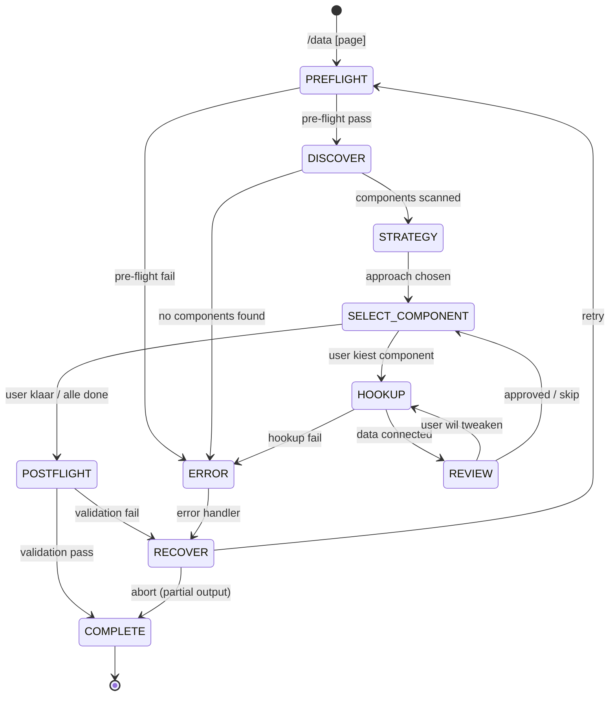

# Data

Vervang hardcoded data in React components door echte API/state connecties, component voor component. Voegt loading states (Skeleton/Suspense), error states (ErrorBoundary), en type-safe data fetching toe zonder visuele styling te wijzigen.

**Keywords**: data, API, fetch, React Query, SWR, server components, loading state, error state, skeleton, hookup, integration

## When to Use

- Na `/build` of `/convert` wanneer components hardcoded data hebben
- Wanneer een API beschikbaar is en components connected moeten worden
- Om loading/error states toe te voegen aan bestaande components

**Dit is GEEN design skill.** Visuele styling wordt niet gewijzigd — alleen data wiring + loading/error states.

---

## State Machine



---

## References

- `../shared/RULES.md` — R-series (R007, R109-R114), T-series (T001-T003)
- `../shared/PATTERNS.md` — Server Component data loading, API service layer, loading/error state patterns
- `../shared/DEVINFO.md` — Session tracking, handoff contracts (build→data, convert→data)

---

## Cross-Skill Contract

### Input (from build/convert)

Leest van `handoff` key in devinfo.json (zie DEVINFO.md):

```json
{
  "handoff": {
    "from": "frontend-build | frontend-convert",
    "to": "frontend-data",
    "data": {
      "pageFile": "src/pages/[page].tsx",
      "componentsDirectory": "src/components/[page]/",
      "componentsCompleted": [
        {
          "name": "Header",
          "atomic": "organism",
          "files": ["Header.tsx", "Header.types.ts"]
        }
      ],
      "componentsSkipped": []
    }
  }
}
```

### Output (final)

```json
{
  "from": "frontend-data",
  "to": null,
  "data": {
    "pageFile": "src/pages/[page].tsx",
    "componentsDirectory": "src/components/[page]/",
    "componentsHooked": [
      {
        "name": "Header",
        "dataSource": "server-component | react-query | swr | plain-fetch",
        "hasLoadingState": true,
        "hasErrorState": true
      }
    ],
    "componentsSkipped": [],
    "servicesCreated": ["src/services/users.ts"],
    "dataStrategy": "react-query | server-components | swr | plain-fetch"
  }
}
```

---

## FASE 0: Pre-flight Validation

**BEFORE any work, validate:**

### 0.1 Component Directory Check

```
PRE-FLIGHT: Components
──────────────────────
[ ] componentsDirectory exists
[ ] pageFile exists
[ ] .tsx component files found
[ ] .types.ts files found
```

**On failure (geen handoff):**

```yaml
header: "Component Locatie"
question: "Geen handoff data gevonden. Waar staan de components?"
options:
  - label: "Ik geef het pad op"
    description: "Specificeer de component directory"
  - label: "Run /build eerst (Recommended)"
    description: "Genereer eerst components"
  - label: "Scan project"
    description: "Zoek automatisch naar React components"
multiSelect: false
```

### 0.2 Framework Detectie

```
PRE-FLIGHT: Framework
─────────────────────
[ ] React framework detected
[ ] Rendering model: [SSR | CSR | SSG | ISR]
[ ] TypeScript: [strict mode]
```

### 0.3 Bestaande Data Patterns

Scan voor al aanwezige data fetching:

```
PRE-FLIGHT: Data Patterns
──────────────────────────
[ ] React Query / TanStack Query: [installed | not found]
[ ] SWR: [installed | not found]
[ ] tRPC: [installed | not found]
[ ] Server Components: [App Router detected | not applicable]
[ ] Existing API routes: [N] found at [path]
[ ] Existing services: [N] found at [path]
```

### 0.4 API Routes Detectie

```
PRE-FLIGHT: APIs
────────────────
[ ] API routes directory: [path | not found]
[ ] Existing endpoints: [list]
[ ] External API config: [env vars found | none]
```

### Pre-flight Samenvatting

```
PRE-FLIGHT COMPLETE
═══════════════════════════════════════════════════════════
Components:  [N] in [directory]
Page:        [pageFile]
Framework:   [Next.js App Router | Vite + React | ...]
Data libs:   [React Query | SWR | none installed]
API routes:  [N] existing
Services:    [N] existing
Status:      Ready for discovery
═══════════════════════════════════════════════════════════
```

---

## FASE 1: Discovery

> **Doel:** Scan components voor hardcoded data, parse types, groepeer per data source.

### 1.1 Hardcoded Data Scan

Scan page file en components voor:

- Hardcoded prop values in JSX (`value="$45,231"`, `name="John"`)
- Inline arrays/objects als data (`const items = [{...}, {...}]`)
- Static mock data in component files
- Placeholder tekst die echte data moet worden

### 1.2 Type Shape Analyse

Parse `.types.ts` bestanden voor data shapes:

```
DATA SHAPES
═══════════════════════════════════════════════════════════

MetricCard.types.ts:
  MetricCardProps {
    label: string        → API field
    value: string|number → API field
    trend?: string       → API field
    trendDirection?: "up"|"down" → API field
  }

UserMenu.types.ts:
  UserMenuProps {
    name: string    → API: /users/me
    avatar: string  → API: /users/me
    role: string    → API: /users/me
  }

═══════════════════════════════════════════════════════════
```

### 1.3 Data Source Groepering

Groepeer components per logische data source:

```
DATA SOURCES
═══════════════════════════════════════════════════════════

Source: "metrics" (API: /api/metrics)
  Components: MetricCard ×4

Source: "user" (API: /api/users/me)
  Components: Header (user name), UserMenu, Avatar

Source: "navigation" (static config)
  Components: Navigation, NavLink

Source: "notifications" (API: /api/notifications)
  Components: NotificationBadge

═══════════════════════════════════════════════════════════
```

---

## FASE 2: Strategy

> **Doel:** Data fetching aanpak kiezen, per data group API endpoint bepalen.

### 2.1 Fetching Approach

```yaml
header: "Data Fetching"
question: "Welke data fetching aanpak wil je gebruiken?"
options:
  - label: "React Query (Recommended)"
    description: "Client-side caching, refetching, optimistic updates"
  - label: "Server Components"
    description: "Next.js App Router server-side data loading"
  - label: "SWR"
    description: "Lightweight client-side data fetching"
  - label: "Plain fetch"
    description: "Geen library, useEffect + fetch"
multiSelect: false
```

### 2.2 Per Data Group

Voor elke data source groep:

```
DATA STRATEGY
═══════════════════════════════════════════════════════════

Group: "metrics"
  Endpoint:   /api/metrics (of custom)
  Method:     GET
  Refresh:    [realtime | polling | on-demand | static]
  Service:    src/services/metrics.ts (nieuw)

Group: "user"
  Endpoint:   /api/users/me
  Method:     GET
  Refresh:    on-demand
  Service:    src/services/users.ts (nieuw)

Group: "navigation"
  Strategy:   Static config (geen API nodig)
  Source:     src/config/navigation.ts

═══════════════════════════════════════════════════════════
```

### 2.3 API Endpoint Bevestiging

```yaml
header: "API Endpoints"
question: "Kloppen deze API endpoints? Pas aan waar nodig."
options:
  - label: "Klopt (Recommended)"
    description: "Ga door met deze endpoints"
  - label: "Aanpassen"
    description: "Ik geef de juiste endpoints op"
  - label: "Mock eerst"
    description: "Genereer mock API routes, connect later"
multiSelect: false
```

---

## FASE 3: Component Loop

> **Kern van de skill.** Herhaal per component:
> Select → Hookup → Review

### 3a. Select Component

Toon status en laat gebruiker kiezen:

```
COMPONENT STATUS
═══════════════════════════════════════════════════════════

 #  Component        Data Source    Status
─── ──────────────── ───────────── ──────────────
 1  MetricCard       metrics       → Ready (shared source)
 2  MetricCard ×3    metrics       · Follows #1
 3  Header (user)    user          · Pending
 4  UserMenu         user          · Pending
 5  Navigation       static        · Pending
 6  NotificationBadge notifications · Pending

Progress: 0/6 connected

═══════════════════════════════════════════════════════════
```

```yaml
header: "Volgende Component"
question: "Welke component wil je nu connecten?"
options:
  - label: "MetricCard — metrics (Recommended)"
    description: "Shared data source, connecteert 4 components"
  - label: "Ik kies zelf"
    description: "Selecteer een specifieke component"
  - label: "Klaar — afronden"
    description: "Stop, ga naar post-flight"
multiSelect: false
```

### 3b. Hookup

Per component/groep:

#### Stap 1: Service Layer

Als service nog niet bestaat, genereer `src/services/[entity].ts`:

```typescript
// src/services/metrics.ts
import { apiClient } from "./api-client";
import type { Metric } from "@/types/metric";

export const metricsService = {
  getAll: () => apiClient<Metric[]>("/metrics"),
  getById: (id: string) => apiClient<Metric>(`/metrics/${id}`),
};
```

> **Volg het API Service Layer Pattern uit PATTERNS.md.**

#### Stap 2: Custom Hook / Loader

Afhankelijk van gekozen strategy:

**React Query:**

```typescript
// src/hooks/useMetrics.ts
import { useQuery } from "@tanstack/react-query";
import { metricsService } from "@/services/metrics";

export function useMetrics() {
  return useQuery({
    queryKey: ["metrics"],
    queryFn: metricsService.getAll,
    staleTime: 5 * 60 * 1000,
  });
}
```

**Server Components:**

```typescript
// Directe async call in Server Component
import { metricsService } from '@/services/metrics'

export default async function DashboardPage() {
  const metrics = await metricsService.getAll()
  return <MetricGrid metrics={metrics} />
}
```

#### Stap 3: Hardcoded Props Vervangen

Vervang hardcoded data in page file door hook/loader data:

```
BEFORE:
  <MetricCard label="Revenue" value="$45,231" trend="+12.5%" />

AFTER:
  {metrics.map(m => (
    <MetricCard key={m.id} label={m.label} value={m.value} trend={m.trend} />
  ))}
```

#### Stap 4: Loading State Toevoegen

Voeg Skeleton/Suspense toe (zie PATTERNS.md — Loading State Patterns):

```typescript
// Skeleton component naast component
function MetricCardSkeleton() {
  return (
    <div className="bg-card border border-border rounded-lg p-4 animate-pulse">
      <div className="h-4 w-24 bg-muted rounded mb-2" />
      <div className="h-8 w-32 bg-muted rounded mb-1" />
      <div className="h-3 w-20 bg-muted rounded" />
    </div>
  )
}
```

> **Belangrijk:** Skeleton moet EXACT dezelfde afmetingen hebben als het echte component (CLS preventie, regel P101).

#### Stap 5: Error State Toevoegen

Voeg ErrorBoundary/inline error toe (zie PATTERNS.md — Error State Patterns):

```typescript
// In page file
<ErrorBoundary fallback={<MetricCardError />}>
  <Suspense fallback={<MetricCardSkeleton />}>
    <MetricSection />
  </Suspense>
</ErrorBoundary>
```

### 3c. Review

```yaml
header: "Review"
question: "Data hookup voor [Component] — klopt dit?"
options:
  - label: "Goedkeuren (Recommended)"
    description: "Ga door naar volgende component"
  - label: "Tweaken"
    description: "Ik beschrijf wat er anders moet"
  - label: "Overslaan"
    description: "Skip, houd hardcoded data"
multiSelect: false
```

**Bij "Tweaken":** Pas de hookup aan op basis van feedback en toon opnieuw.

### Hookup Output

```
HOOKUP COMPLETE: MetricCard
═══════════════════════════════════════════════════════════

Data source:  /api/metrics (metricsService)
Hook:         useMetrics()
Loading:      MetricCardSkeleton (animate-pulse)
Error:        ErrorBoundary + MetricCardError
Type safety:  MetricSchema (Zod)

Files created/modified:
  + src/services/metrics.ts
  + src/hooks/useMetrics.ts
  + src/components/[page]/molecules/MetricCard/MetricCardSkeleton.tsx
  ~ src/pages/[page].tsx (hardcoded → hook data)

Progress: 1/6 connected

═══════════════════════════════════════════════════════════
```

Loop terug naar **3a. Select Component**.

---

## FASE 4: Post-flight

### Data Integration Validation

Voer de Data Check uit RULES.md uit:

```
DATA CHECK
──────────
[ ] R109 - Loading states aanwezig voor alle async data
[ ] R110 - Error states aanwezig voor alle async data
[ ] R111 - Type-safe API responses
[ ] R112 - Geen hardcoded API URLs
[ ] R007 - Async error handling
```

### TypeScript Check

```bash
npx tsc --noEmit
```

### Import Check

Verifieer alle imports correct zijn:

- Services importeren types
- Hooks importeren services
- Components importeren hooks
- Page file importeert alles correct

### Completion Report

```
DATA HOOKUP COMPLETE
═══════════════════════════════════════════════════════════

Page: [page name]
Strategy: [React Query | Server Components | SWR | plain fetch]

Components connected: [N]/[total]
Components skipped: [N]

Services created:
  + src/services/metrics.ts
  + src/services/users.ts

Hooks created:
  + src/hooks/useMetrics.ts
  + src/hooks/useUser.ts

Loading states: [N]/[N] components covered
Error states: [N]/[N] components covered

Validation:
├── TypeScript: [PASS | FAIL]
├── Loading coverage: [PASS | FAIL]
├── Error coverage: [PASS | FAIL]
└── Import check: [PASS | FAIL]

Next steps:
1. Start dev server en test data loading
2. Verifieer loading/error states visueel
3. Overweeg /test voor component unit tests
4. Overweeg /perf voor performance impact

═══════════════════════════════════════════════════════════
```

---

## Restrictions

Dit command moet **NOOIT**:

- Visuele styling wijzigen (geen Tailwind classes, geen CSS)
- Components herstructureren (alleen data wiring)
- API endpoints aanmaken zonder bevestiging
- Loading/error states overslaan
- Hardcoded data verwijderen zonder vervanging

Dit command moet **ALTIJD**:

- Component-voor-component werken met review
- Loading state (Skeleton) toevoegen voor elke async data source
- Error state (ErrorBoundary/inline) toevoegen voor elke async data source
- Type-safe data handling (Zod of TypeScript interfaces)
- Service layer pattern volgen uit PATTERNS.md
- Skeleton afmetingen matchen met component (CLS preventie)
- Rules uit RULES.md volgen (R-series, T-series)
- DevInfo updaten bij elke fase transitie
- Alle prompts in het Nederlands
