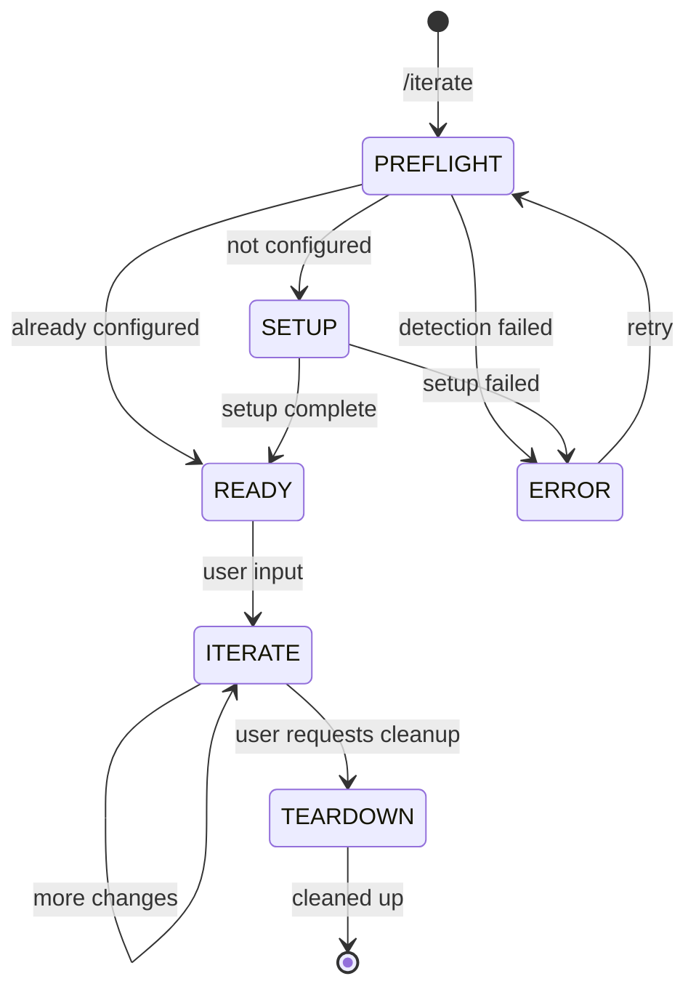

# Frontend Iterate

Iterative browser-based editing: user clicks elements in their browser, copies a file reference, pastes it in chat, and Claude makes targeted edits with live HMR feedback.

## Architecture

```
VPS: Vite dev server + Cloudflare Tunnel
  → transformIndexHtml injects inspect overlay
  → babel plugin adds data-inspector-* attributes to DOM

User browser (PC/phone):
  → Alt+Click or toggle button activates inspect mode
  → Click element → clipboard: "src/components/Header.tsx:10"
  → Paste in Claude Code chat
  → Claude edits file → HMR pushes update
```

## State Machine



## References

- `references/inspect-overlay-plugin.ts` — Vite plugin template with embedded overlay script

## FASE 0: Pre-flight

### 0.1 Framework Detection

Check `package.json` dependencies:

- `vite` present → Vite project
- `next` present → Next.js project (future support)
- Neither → abort: "Only Vite projects are supported. Run `/dev-server` first to set up a project."

### 0.2 React Plugin Detection

Check `vite.config.ts` (or `.js`, `.mjs`) imports:

- `@vitejs/plugin-react-swc` → SWC mode (needs switch)
- `@vitejs/plugin-react` → Babel mode (ready)
- Neither → abort: "No React plugin found in vite.config"

### 0.3 Existing Setup Check

Grep `vite.config` for `inspect-overlay` or `inspectOverlay`:

- Found → skip to FASE 2 (READY)
- Not found → proceed to FASE 1 (SETUP)

### 0.4 Dev Server Status

```bash
ss -tlnp | grep :3000
```

Track whether dev server is running — it needs restart after setup.

### Pre-flight Output

```
PRE-FLIGHT
════════════════════════════════════
Framework:     Vite
React plugin:  @vitejs/plugin-react [Babel | SWC]
Overlay:       [Configured | Not configured]
Dev server:    [Running on :3000 | Not running]
════════════════════════════════════
```

## FASE 1: Setup

Skip entirely if pre-flight detected existing configuration.

### 1.1 SWC to Babel Switch (conditional)

Only if `@vitejs/plugin-react-swc` detected.

Use AskUserQuestion:

```yaml
header: "Plugin"
question: "De inspect overlay vereist Babel voor data-attributen. Wil je switchen van SWC naar Babel?"
options:
  - label: "Ja, switch (Recommended)"
    description: "Vervangt plugin-react-swc met plugin-react. Dev builds iets trager, geen impact op production."
  - label: "Nee, zonder data-attributen"
    description: "Overlay werkt zonder exacte bestandsreferenties. Claude zoekt via tekst/classes."
multiSelect: false
```

If switch accepted:

```bash
npm uninstall @vitejs/plugin-react-swc && npm install -D @vitejs/plugin-react
```

Update vite.config import: `@vitejs/plugin-react-swc` → `@vitejs/plugin-react`.

If declined: skip babel plugin installation, overlay will work in degraded mode (no file:line references, only visual element info).

### 1.2 Install Babel Plugin

Only if Babel mode (not degraded):

```bash
npm install -D @react-dev-inspector/babel-plugin
```

### 1.3 Generate Vite Plugin File

Read `references/inspect-overlay-plugin.ts` from skill directory.
Write it to project root as `inspect-overlay.vite.ts`.

### 1.4 Update vite.config.ts

Add import at top of file:

```typescript
import { inspectOverlay } from "./inspect-overlay.vite";
```

Add `inspectOverlay()` to the plugins array.

If Babel mode — add babel plugin to react() config:

```typescript
react({
  babel: {
    plugins: ["@react-dev-inspector/babel-plugin"],
  },
});
```

If degraded mode (SWC kept) — only add inspectOverlay(), no babel config.

### 1.5 Restart Dev Server

If dev server was running on port 3000:

```bash
fuser -k 3000/tcp 2>/dev/null; sleep 1
```

Then restart using the same command from `/dev-server` skill (detect framework command from package.json scripts or default to `npx vite --port 3000 --host`).

Wait for server ready (max 15s):

```bash
for i in $(seq 1 15); do curl -s http://localhost:3000 > /dev/null 2>&1 && break || sleep 1; done
```

## FASE 2: Ready

Report overlay status:

```
INSPECT OVERLAY ACTIVE
═══════════════════════════════════════════════════
Mode:      [Full (Babel) | Degraded (SWC, no file refs)]
Desktop:   Alt+I to toggle, then click elements
Mobile:    Tap toggle button (bottom-right), then tap elements
Clipboard: Paste the copied reference in this chat
Server:    [tunnel URL if cloudflared running, else localhost:3000]
═══════════════════════════════════════════════════

Waiting for your input. Click an element and paste the reference here,
or describe what you want to change.
```

Detect tunnel URL:

```bash
pgrep -f cloudflared > /dev/null && grep -oE 'https://[a-z0-9-]+\.trycloudflare\.com' /tmp/cloudflared.log 2>/dev/null | head -1
```

## FASE 3: Iterate

This phase loops indefinitely. The skill responds to user input in two patterns.

### Pattern A: File Reference Pasted

User pastes a reference like `src/components/Header.tsx:10` or `src/components/Header.tsx:10:6`.

1. **Parse reference** — extract file path and line number
2. **Read file** — open the file, focus on the referenced line and surrounding context (30 lines before/after)
3. **Wait for instruction** — user describes the change they want
4. **Edit** — make the targeted change
5. **Confirm** — report what was changed

Format:

```
EDIT: [filepath]:[line]
──────────────────────
Changed: [brief description of what changed]
HMR will update your browser automatically.
```

### Pattern B: Description Without Reference

User describes an element without pasting a reference (e.g., "make the header background darker").

1. **Identify element** — use Grep to search for the described element across components. Use Playwright `browser_snapshot` as fallback to map visual description to DOM structure.
2. **Confirm match** — show the user which file/component was identified. If ambiguous, ask.
3. **Continue as Pattern A** from step 3 onward.

### Iteration Guidelines

- Make minimal, targeted edits. Do not refactor surrounding code.
- One change at a time. If the user asks for multiple changes, handle them sequentially.
- After editing, do NOT take a screenshot or validate unless the user asks. Trust HMR.
- If the user pastes a new reference, start a new iteration immediately.
- If the user says "done" or "klaar", acknowledge and stop.

## Teardown

Only when user explicitly requests cleanup (e.g., "remove the overlay", "cleanup iterate").

1. Delete `inspect-overlay.vite.ts` from project root
2. Remove `inspectOverlay` import and plugin call from vite.config.ts
3. Remove `@react-dev-inspector/babel-plugin` from babel plugins in vite.config.ts
4. Optionally uninstall: `npm uninstall @react-dev-inspector/babel-plugin`
5. Restart dev server

Do NOT teardown automatically. The overlay is lightweight and useful across sessions.
