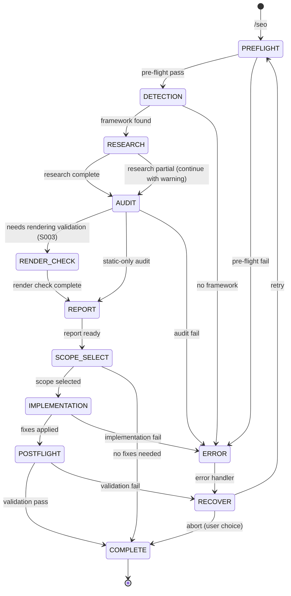

# SEO

Audit and optimize web applications for search engine visibility. Detects the framework in use, researches current best practices via Context7, and implements SEO improvements.

---

## State Machine



---

## References

- `../shared/VALIDATION.md` — Pre-flight/post-flight patterns
- `../shared/RULES.md` — Rule IDs voor SEO-gerelateerde checks (H002, H003, R002)
- `../shared/DEVINFO.md` — Session tracking protocol
- `../shared/PLAYWRIGHT.md` — Browser automation for S003 render validation

---

## FASE 0: Pre-flight Validation

**BEFORE any work, validate:**

### 0.1 Project Structure Check

```
PRE-FLIGHT: Project Structure
─────────────────────────────
[ ] package.json exists
[ ] Source directory exists (src/, app/, pages/)
[ ] Node project (not static HTML only)
```

**Failure action:**

```yaml
header: "Project Check"
question: "Geen package.json gevonden. Dit lijkt geen Node.js project. Hoe doorgaan?"
options:
  - label: "Scan toch (Recommended)"
    description: "Zoek naar HTML files met SEO issues"
  - label: "Abort"
    description: "Stop de SEO audit"
```

### 0.2 Git Status Check

```
PRE-FLIGHT: Git Status
──────────────────────
[ ] Git repository initialized
[ ] Working tree status noted
```

**Output:**

```
PRE-FLIGHT COMPLETE
───────────────────
Project: Valid Node.js project
Git: [Clean | Dirty - uncommitted changes]
Ready for: Framework detection
```

> **Note:** Rollback wordt afgehandeld door Claude Code's ingebouwde "Rewind" functie.

---

## Phase 1: Framework Detection

Scan the project to identify:

1. **Framework**: Next.js (App Router / Pages Router), Remix, Astro, Nuxt, SvelteKit, plain React, etc.
2. **Existing SEO setup**: Check for existing metadata, sitemaps, robots.txt, structured data
3. **Route structure**: Map all pages/routes in the application

Detection checks:

- `package.json` dependencies for framework identification
- `next.config.*`, `remix.config.*`, `astro.config.*`, `nuxt.config.*` for framework confirmation
- `app/` vs `pages/` vs `src/routes/` for router type
- Existing `sitemap.*`, `robots.*`, metadata files

**Output:**

```
DETECTED
────────
Framework: [name] ([version])
Router: [type]
Routes found: [count]
Existing SEO: [list what's already present]
```

**Validation:**

```
DETECTION VALIDATION
────────────────────
[ ] Framework identified (not "unknown")
[ ] At least 1 route found
[ ] Package.json readable
```

**On detection failure:**

```yaml
header: "Framework"
question: "Framework niet gedetecteerd. Wat is het framework?"
options:
  - label: "Next.js App Router"
    description: "app/ directory"
  - label: "Next.js Pages Router"
    description: "pages/ directory"
  - label: "Remix"
    description: "app/routes/ directory"
  - label: "Plain React"
    description: "Client-side rendered"
```

---

## Phase 2: Context7 Research

**MANDATORY** — Before auditing, research the detected framework's current SEO APIs and best practices.

1. Use `resolve-library-id` to find the framework's documentation
2. Query for: "[framework] SEO metadata API, sitemap generation, structured data"
3. Query for: "[framework] generateMetadata, OpenGraph, robots.txt configuration"

Store findings for use during audit and implementation. This ensures recommendations use the latest APIs, not outdated patterns.

**Validation:**

```
RESEARCH VALIDATION
───────────────────
[ ] Context7 query succeeded
[ ] API patterns documented
[ ] Fallback: use built-in knowledge if Context7 unavailable
```

---

## Phase 3: SEO Audit

Scan every route/page for the following categories:

### Critical (blocks search visibility)

| Check                 | Rule ID | What to look for                                                    |
| --------------------- | ------- | ------------------------------------------------------------------- |
| **Page titles**       | S001    | Every route must have a unique, descriptive title                   |
| **Meta descriptions** | S002    | Every route must have a unique description                          |
| **Rendering**         | S003    | SSR/SSG required for crawlable content — flag client-only rendering |
| **Robots**            | S004    | No accidental `noindex` on important pages                          |

### Important (impacts ranking)

| Check              | Rule ID | What to look for                                     |
| ------------------ | ------- | ---------------------------------------------------- |
| **Open Graph**     | S101    | og:title, og:description, og:image per route         |
| **Canonical URLs** | S102    | Proper canonical tags, especially for dynamic routes |
| **Sitemap**        | S103    | sitemap.xml exists and includes all public routes    |
| **robots.txt**     | S104    | Exists with sensible defaults                        |
| **Headings**       | H002/H003 | H1 on every page, logical hierarchy (H1->H2->H3)   |
| **Image alt text** | R002    | All images have descriptive alt attributes           |

### Nice-to-have (enhances visibility)

| Check                 | Rule ID | What to look for                                                |
| --------------------- | ------- | --------------------------------------------------------------- |
| **Structured data**   | S201    | JSON-LD for content type (Article, Product, Organization, etc.) |
| **Twitter cards**     | S202    | twitter:card, twitter:title, twitter:image                      |
| **Dynamic OG images** | S203    | Auto-generated OG images for social sharing                     |
| **Performance**       | S204    | Image optimization, lazy loading, Core Web Vitals hints         |

### S003: Rendered Content Validation (Playwright)

> **CRITICAL for SPAs and client-rendered applications**

For frameworks detected as client-side rendered (React/Vue without SSR, Vite, CRA), use Playwright to validate that content is actually visible in the browser:

**Trigger:** Framework = "Plain React" OR no SSR/SSG detected

```
RENDER VALIDATION (Playwright)
══════════════════════════════════════════════════════════════

Framework: [React/Vue/etc.] (client-rendered)
Dev server: [http://localhost:3000]

Starting browser validation...

1. browser_navigate → [dev server URL]/[route]
2. browser_wait_for → { text: "[expected H1 content]" }
3. browser_snapshot → (analyze accessibility tree)
4. browser_close

Parse returned snapshot for:
[ ] Title element found in accessibility tree
[ ] H1 content matches expected
[ ] Meta description visible (if dynamically rendered)
[ ] Open Graph tags present in DOM

══════════════════════════════════════════════════════════════
```

**Output:**
```
RENDER CHECK RESULT
───────────────────
Status: [✓ PASS | ✗ FAIL]
Visible content: [H1 text or "None"]
Meta rendered: [Yes | No | Static-only]

[If FAIL] Warning: Content requires JavaScript execution.
          Search engines may not see this content.
          Recommendation: Implement SSR/SSG
```

**On Render Failure:**

```yaml
header: "Render Check Failed"
question: "Content niet zichtbaar in browser zonder JavaScript. Dit is een CRITICAL SEO probleem."
options:
  - label: "Flag as CRITICAL (Recommended)"
    description: "Markeer S003 als CRITICAL issue in rapport"
  - label: "Check SSR config"
    description: "Content zou server-rendered moeten zijn"
  - label: "Skip render check"
    description: "Doorgaan zonder render validation"
```

**On Playwright Unavailable:**

Fall back to static analysis with warning:
```
⚠ Playwright unavailable - using static analysis only
  S003 check: Based on framework detection only
  Recommendation: Run with Playwright for accurate validation
```

---

## Phase 4: Audit Report

Present findings grouped by severity:

```
SEO AUDIT REPORT
────────────────

Framework: [name] ([router])
Routes audited: [count]
Score: [X/Y checks passed]

CRITICAL ([count])
──────────────────
[S001] Missing title: [file:line] — [route path]
[S002] Missing description: [file:line] — [route path]

IMPORTANT ([count])
───────────────────
[S101] Missing Open Graph: [file:line]
[H002] Missing H1: [file:line]

NICE-TO-HAVE ([count])
──────────────────────
[S201] No structured data for [content type]

PASSING ([count])
─────────────────
✓ robots.txt present
✓ sitemap.xml present
```

Use **AskUserQuestion**:

```yaml
header: "Fix scope"
question: "Which issues should be fixed?"
options:
  - label: "Critical only (Recommended)"
    description: "Fix blocking SEO issues first"
  - label: "Critical + Important"
    description: "Fix all impactful issues"
  - label: "Everything"
    description: "Full SEO implementation including nice-to-haves"
  - label: "Let me pick"
    description: "I want to select specific issues"
multiSelect: false
```

---

## Phase 5: Implementation

For each selected issue, implement the fix using framework-specific APIs discovered in Phase 2.

### Implementation Order

1. Global metadata/layout (affects all pages)
2. Per-route metadata (page-specific)
3. Technical files (sitemap, robots.txt)
4. Structured data
5. Image optimization and alt text
6. Open Graph and social cards

### Per Fix

1. Show what will change (file + diff preview)
2. Implement the change
3. Mark as done in progress tracker

### Progress Tracking

```
IMPLEMENTATION PROGRESS
───────────────────────
[✓] Global metadata (layout.tsx)
[✓] Page titles (5/5 routes)
[▸] Meta descriptions (3/5 routes)
[ ] sitemap.ts
[ ] robots.ts
[ ] Open Graph images
```

---

## FASE 5.5: Post-flight Validation

**AFTER implementation, verify:**

### 5.5.1 File Validation

```
POST-FLIGHT: Files
──────────────────
[ ] All modified files exist
[ ] All modified files valid syntax
[ ] No accidental deletions
```

### 5.5.2 Fix Verification

```
POST-FLIGHT: Fixes
──────────────────
[ ] Each CRITICAL fix applied and verifiable
[ ] Each IMPORTANT fix applied (if selected)
[ ] No new issues introduced
```

**Verification method:**

```javascript
// Re-run relevant checks only
for (const fix of appliedFixes) {
  const stillFailing = recheck(fix.ruleId, fix.file);
  if (stillFailing) {
    failures.push(fix);
  }
}
```

### 5.5.3 Render Verification (Playwright)

For S003 fixes (SSR/SSG implementation):

```
POST-FLIGHT: Render Verification
────────────────────────────────
[ ] Dev server running
[ ] Routes accessible

Per fixed route:
1. browser_navigate → [route URL]
2. browser_wait_for → { text: "[expected content]" }
3. browser_snapshot → (analyze accessibility tree)
4. browser_close

Result:
[ ] Content now server-rendered (visible in source)
[ ] Meta tags visible in initial HTML
[ ] No JavaScript required for SEO content
```

**Render Verification Checklist:**
```
Route: /[path]
  Source HTML: [Has content | Empty/Loading]
  Rendered HTML: [Matches source | Different]
  Status: [✓ SSR working | ⚠ Hydration only | ✗ CSR only]
```

### 5.5.4 Build Check (Optional)

Als TypeScript project:

```bash
npx tsc --noEmit
```

**On post-flight failure:**

```yaml
header: "Verification"
question: "[N] fixes konden niet geverifieerd worden. Hoe doorgaan?"
options:
  - label: "Review failures (Recommended)"
    description: "Bekijk welke fixes niet werkten"
  - label: "Retry failed fixes"
    description: "Probeer gefaalde fixes opnieuw"
  - label: "Keep changes"
    description: "Accepteer huidige state"
```

---

## FASE 6: Completion

After all fixes are implemented and validated:

```
SEO COMPLETE
────────────

Implemented: [count] fixes
─────────────────────────
[S001] Added titles to 5 routes
[S002] Added descriptions to 5 routes
[S103] Created sitemap.ts
[S104] Created robots.ts

Files modified: [count]
- app/layout.tsx
- app/page.tsx
- app/about/page.tsx
- app/sitemap.ts
- app/robots.ts

Remaining: [count] items not selected
- [S201] Structured data (nice-to-have)
```

---

## Error Recovery

### Framework Detection Failure

```
RECOVERY: Framework Detection
─────────────────────────────
1. Check package.json manually
2. Ask user to specify framework
3. Use generic HTML SEO patterns
```

### Context7 Failure

```
RECOVERY: Context7 Unavailable
──────────────────────────────
1. Log warning
2. Use built-in framework knowledge
3. Add disclaimer to report
```

### Implementation Failure

```
RECOVERY: Fix Application
─────────────────────────
1. Log specific error
2. Skip failed fix
3. Continue with remaining fixes
4. Report partial success
```

> **Note:** Rollback wordt afgehandeld door Claude Code's ingebouwde "Rewind" functie.

---

## DevInfo Integration

### Session Update (bij elke phase transition)

```json
{
  "currentSkill": {
    "name": "frontend-seo",
    "phase": "AUDIT"
  },
  "progress": {
    "completedTasks": 2,
    "totalTasks": 6,
    "currentTask": "Scanning routes for SEO issues"
  }
}
```

### Completion Handoff

```json
{
  "handoff": {
    "from": "frontend-seo",
    "to": null,
    "data": {
      "fixesApplied": 12,
      "framework": "next-app-router",
      "routesAudited": 15
    }
  }
}
```

---

## Framework-Specific Notes

### Next.js (App Router)

- Use `metadata` export or `generateMetadata()` in `layout.tsx` / `page.tsx`
- Create `app/sitemap.ts` and `app/robots.ts`
- Use `next/image` for automatic optimization
- JSON-LD via `<script type="application/ld+json">` in layout

### Next.js (Pages Router)

- Use `next/head` with `<Head>` component
- Create `pages/sitemap.xml.tsx` with `getServerSideProps`
- Use `next-seo` package if available

### Remix

- Use `meta` export function per route
- Handle `robots.txt` and `sitemap.xml` as resource routes

### Astro

- Use frontmatter `title`, `description` or `<SEO>` component
- Built-in sitemap integration (`@astrojs/sitemap`)

### Plain React (Vite/CRA)

- **Warning**: Client-side rendered apps have fundamental SEO limitations
- Use `react-helmet-async` for metadata
- Consider prerendering with `vite-plugin-ssr` or migration to Next.js/Remix
- Implement what's possible but flag SSR/SSG as recommended next step

---

## Notes

- Always use Context7 for framework-specific API details — don't rely on potentially outdated patterns
- Prefer framework-native solutions over third-party SEO packages
- Never implement SEO at the cost of user experience or performance
