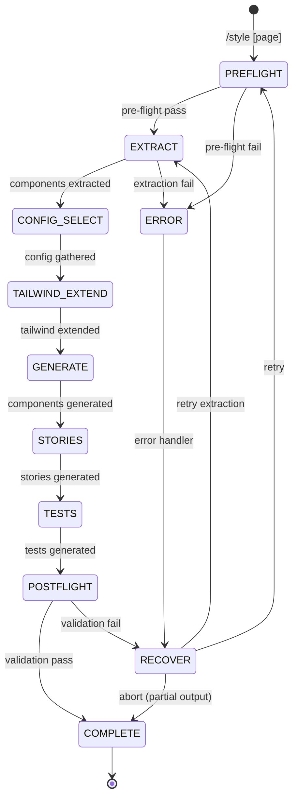

# Style

Generate production-ready React components with Tailwind CSS by combining wireframe structure with theme tokens. Extracts components from wireframe, extends Tailwind config, and outputs complete component files with Storybook stories and tests.

---

## State Machine



---

## References

- `../shared/VALIDATION.md` — Pre-flight/post-flight patterns
- `../shared/RULES.md` — React/TypeScript rules (R001-R108, T001-T103)
- `../shared/PATTERNS.md` — Component patterns (compound, render props, etc.)
- `../shared/DEVINFO.md` — Session tracking, handoff contracts

---

## Cross-Skill Contract

### Input (from wireframe)

```json
{
  "from": "frontend-wireframe",
  "to": "frontend-style",
  "data": {
    "selectedWireframe": ".workspace/wireframes/[page]/[agent]/v2.html",
    "selection": {
      "agent": "ux | minimal | rich",
      "version": "v2"
    },
    "atomicLevel": "atom | molecule | organism | template | page",
    "platform": "mobile | desktop | both",
    "components": [
      { "name": "Header", "atomic": "organism", "variants": 2 },
      { "name": "MetricCard", "atomic": "molecule", "variants": 3 }
    ],
    "themeApplied": true,
    "themeFile": ".workspace/config/THEME.md"
  }
}
```

### Output (final pipeline step)

```json
{
  "from": "frontend-style",
  "to": null,
  "data": {
    "componentsDirectory": "src/components/[page]/",
    "tailwindConfig": "tailwind.config.js",
    "components": [
      {
        "name": "Header",
        "files": ["Header.tsx", "Header.types.ts", "Header.stories.tsx", "Header.test.tsx"]
      }
    ],
    "storybookReady": true,
    "testCoverage": "stubs"
  }
}
```

---

## FASE 0: Pre-flight Validation

**BEFORE any work, validate:**

### 0.1 Theme Dependency Check

```
PRE-FLIGHT: Theme
─────────────────
[ ] THEME.md exists at .workspace/config/THEME.md
[ ] Contains Colors section (for Tailwind extend)
[ ] Contains Typography section
[ ] Contains Spacing section
```

**Failure action:**

```yaml
header: "Theme Required"
question: "THEME.md niet gevonden. Hoe doorgaan?"
options:
  - label: "Run /theme first (Recommended)"
    description: "Maak eerst een theme aan"
  - label: "Use Tailwind defaults"
    description: "Ga door met standaard Tailwind config"
  - label: "Specify path"
    description: "Geef alternatief theme bestand op"
```

### 0.2 Wireframe Dependency Check

```
PRE-FLIGHT: Wireframe
─────────────────────
[ ] Wireframe directory exists for [page]
[ ] At least one HTML file present
[ ] HTML contains data-component attributes
```

**Failure action:**

```yaml
header: "Wireframe Required"
question: "Geen wireframe gevonden voor [page]. Hoe doorgaan?"
options:
  - label: "Run /wireframe first (Recommended)"
    description: "Genereer eerst wireframes"
  - label: "List components manually"
    description: "Ik geef een component lijst op"
  - label: "Select different page"
    description: "Kies een andere pagina"
```

### 0.3 Project Structure Check

```
PRE-FLIGHT: Project
───────────────────
[ ] package.json exists
[ ] tailwindcss in dependencies
[ ] TypeScript configured (tsconfig.json)
[ ] src/components/ exists or can be created
```

**Failure action (no Tailwind):**

```yaml
header: "Tailwind Required"
question: "Tailwind niet gevonden in project. Hoe doorgaan?"
options:
  - label: "Install Tailwind (Recommended)"
    description: "Run: npm install -D tailwindcss"
  - label: "Continue anyway"
    description: "Genereer components, fix Tailwind later"
  - label: "Abort"
    description: "Stop en installeer eerst Tailwind"
```

### 0.4 Conflict Check

```
PRE-FLIGHT: Conflicts
─────────────────────
[ ] Target directory check
[ ] Existing components detection
```

**On conflict:**

```yaml
header: "Existing Components"
question: "Er bestaan al components voor [page]. Hoe doorgaan?"
options:
  - label: "Overwrite (Recommended)"
    description: "Vervang bestaande components"
  - label: "Merge"
    description: "Update alleen nieuwe/gewijzigde"
  - label: "New directory"
    description: "Maak [page]-v2 directory"
```

**Output:**

```
PRE-FLIGHT COMPLETE
───────────────────
Theme: .workspace/config/THEME.md (12 colors, 3 fonts)
Wireframe: .workspace/wireframes/dashboard/ux/v2.html
Project: Next.js + Tailwind 3.4 + TypeScript 5.3
Target: src/components/dashboard/
Status: Ready to extract components
```

---

## FASE 1: Component Extraction

Parse het geselecteerde wireframe HTML en extraheer component data.

### 1.1 Data Attribute Parsing

Zoek naar data-* attributes in wireframe:

```html
<!-- Voorbeeld wireframe structuur -->
<header data-component="Header" data-atomic="organism" data-variant="default,sticky">
  <nav data-component="Navigation" data-atomic="molecule">
    <a data-component="NavLink" data-atomic="atom" data-state="default,active,hover">Home</a>
    <a data-component="NavLink" data-atomic="atom">About</a>
  </nav>
  <div data-component="UserMenu" data-atomic="molecule">
    
  </div>
</header>
```

### 1.2 Extraction Output

```
COMPONENTS EXTRACTED
────────────────────

Organisms (2):
├── Header
│   ├── variants: [default, sticky]
│   ├── children: [Navigation, UserMenu]
│   └── root element: <header>
└── Sidebar
    ├── variants: [expanded, collapsed]
    └── children: [NavGroup, NavItem]

Molecules (4):
├── Navigation
├── UserMenu
├── NavGroup
└── MetricCard
    └── variants: [small, medium, large]

Atoms (6):
├── NavLink
│   └── states: [default, active, hover]
├── Avatar
│   └── sizes: [sm, md, lg]
├── Badge
├── Button
│   └── variants: [primary, secondary, ghost]
└── Icon

Total: 12 components
```

### 1.3 Component Tree

```
COMPONENT TREE
──────────────
Header (organism)
├── Navigation (molecule)
│   └── NavLink (atom) ×N
└── UserMenu (molecule)
    ├── Avatar (atom)
    └── Badge (atom)

Sidebar (organism)
├── NavGroup (molecule) ×N
│   └── NavItem (atom) ×N
└── Button (atom)
```

---

## FASE 2: Configuration

### 2.1 Page Selection (als geen argument)

```yaml
header: "Page"
question: "Voor welke pagina wil je components genereren?"
options:
  - label: "[Detected pages from wireframes]"
    description: "dashboard, settings, profile..."
```

### 2.2 Wireframe Selection (als meerdere beschikbaar)

```yaml
header: "Wireframe"
question: "Welke wireframe versie gebruiken?"
options:
  - label: "UX Agent v2 (Recommended)"
    description: "Focus op gebruikerservaring"
  - label: "Minimal Agent v2"
    description: "Clean, essentieel design"
  - label: "Rich Agent v2"
    description: "Feature-rijke interface"
```

### 2.3 Output Options

```yaml
header: "Output"
question: "Welke bestanden genereren per component?"
options:
  - label: "Full stack (Recommended)"
    description: "Component + types + story + test"
  - label: "Component only"
    description: "Alleen .tsx bestand"
  - label: "Component + story"
    description: "Component met Storybook"
```

### 2.4 Pattern Selection (voor complexe components)

```yaml
header: "Pattern: Sidebar"
question: "Welk pattern voor Sidebar?"
options:
  - label: "Compound (Recommended)"
    description: "Sidebar + Sidebar.Item + Sidebar.Group"
  - label: "Simple"
    description: "Props-based configuratie"
  - label: "Render Props"
    description: "Custom rendering via children"
```

---

## FASE 3: Tailwind Configuration

### 3.1 Parse Theme Tokens

Lees THEME.md en extraheer tokens:

```
THEME TOKENS
────────────

Colors:
├── primary: #6366f1
├── primary-hover: #4f46e5
├── background: #ffffff
├── foreground: #1a1a2e
├── muted: #f4f4f5
├── border: #e4e4e7
└── ... 6 more

Typography:
├── font-sans: "Inter", system-ui, sans-serif
├── font-heading: "Poppins", sans-serif
└── font-mono: "Fira Code", monospace

Spacing: (uses Tailwind defaults)

Border Radius:
├── sm: 0.25rem
├── md: 0.375rem
└── lg: 0.5rem
```

### 3.2 Extend Tailwind Config

Genereer of update `tailwind.config.js`:

```javascript
// tailwind.config.js
/** @type {import('tailwindcss').Config} */
module.exports = {
  content: [
    './src/**/*.{js,ts,jsx,tsx,mdx}',
  ],
  theme: {
    extend: {
      colors: {
        // From THEME.md
        primary: {
          DEFAULT: '#6366f1',
          hover: '#4f46e5',
        },
        background: '#ffffff',
        foreground: '#1a1a2e',
        muted: {
          DEFAULT: '#f4f4f5',
          foreground: '#71717a',
        },
        border: '#e4e4e7',
      },
      fontFamily: {
        sans: ['Inter', 'system-ui', 'sans-serif'],
        heading: ['Poppins', 'sans-serif'],
        mono: ['Fira Code', 'monospace'],
      },
      borderRadius: {
        sm: '0.25rem',
        md: '0.375rem',
        lg: '0.5rem',
      },
    },
  },
  plugins: [],
};
```

### 3.3 Create cn() Utility

Als nog niet aanwezig, maak `src/lib/utils.ts`:

```typescript
// src/lib/utils.ts
import { type ClassValue, clsx } from 'clsx';
import { twMerge } from 'tailwind-merge';

export function cn(...inputs: ClassValue[]) {
  return twMerge(clsx(inputs));
}
```

**Output:**

```
TAILWIND CONFIGURED
───────────────────
✓ tailwind.config.js extended with theme tokens
✓ src/lib/utils.ts created (cn helper)
✓ 12 colors mapped
✓ 3 font families mapped
```

---

## FASE 4: Component Generation

### 4.1 Component Template

Voor elk component, genereer met Tailwind classes:

```typescript
// Header.tsx
import { cn } from '@/lib/utils';
import type { HeaderProps } from './Header.types';

export function Header({
  variant = 'default',
  className,
  children,
}: HeaderProps) {
  return (
    <header
      className={cn(
        // Base styles
        'flex items-center justify-between',
        'px-4 py-3',
        'bg-background border-b border-border',
        // Variant styles
        variant === 'sticky' && 'sticky top-0 z-50 shadow-sm',
        variant === 'compact' && 'py-2',
        // Allow overrides
        className
      )}
    >
      {children}
    </header>
  );
}
```

### 4.2 Types Template

```typescript
// Header.types.ts
import type { ComponentPropsWithoutRef } from 'react';

export type HeaderVariant = 'default' | 'sticky' | 'compact';

export interface HeaderProps extends ComponentPropsWithoutRef<'header'> {
  /** Visual variant of the header */
  variant?: HeaderVariant;
}
```

### 4.3 Compound Component Template

Voor components zoals Sidebar:

```typescript
// Sidebar.tsx
'use client';

import { createContext, useContext, useState } from 'react';
import { cn } from '@/lib/utils';
import type { SidebarProps, SidebarContextValue } from './Sidebar.types';

const SidebarContext = createContext<SidebarContextValue | null>(null);

export function useSidebar() {
  const context = useContext(SidebarContext);
  if (!context) {
    throw new Error('Sidebar components must be used within <Sidebar>');
  }
  return context;
}

export function Sidebar({
  defaultCollapsed = false,
  className,
  children,
}: SidebarProps) {
  const [collapsed, setCollapsed] = useState(defaultCollapsed);

  return (
    <SidebarContext.Provider value={{ collapsed, setCollapsed }}>
      <aside
        className={cn(
          'flex flex-col',
          'bg-muted border-r border-border',
          'transition-all duration-200',
          collapsed ? 'w-16' : 'w-64',
          className
        )}
      >
        {children}
      </aside>
    </SidebarContext.Provider>
  );
}

Sidebar.Item = function SidebarItem({
  icon,
  children,
  active,
  className,
}: SidebarItemProps) {
  const { collapsed } = useSidebar();

  return (
    <button
      className={cn(
        'flex items-center gap-3 px-3 py-2 rounded-md',
        'text-muted-foreground hover:text-foreground',
        'hover:bg-background',
        'transition-colors',
        active && 'bg-background text-foreground',
        className
      )}
    >
      {icon}
      {!collapsed && <span>{children}</span>}
    </button>
  );
};

Sidebar.Toggle = function SidebarToggle() {
  const { collapsed, setCollapsed } = useSidebar();

  return (
    <button
      onClick={() => setCollapsed(!collapsed)}
      className="p-2 hover:bg-background rounded-md"
      aria-label={collapsed ? 'Expand sidebar' : 'Collapse sidebar'}
    >
      {collapsed ? '→' : '←'}
    </button>
  );
};
```

### 4.4 Generation Progress

```
GENERATING COMPONENTS
─────────────────────

[1/12] Header (organism)
       └── Header.tsx ✓
       └── Header.types.ts ✓

[2/12] Sidebar (organism, compound)
       └── Sidebar.tsx ✓ (includes Sidebar.Item, Sidebar.Toggle)
       └── Sidebar.types.ts ✓

[3/12] Navigation (molecule)
       └── Navigation.tsx ✓
       └── Navigation.types.ts ✓

...

[12/12] Icon (atom)
        └── Icon.tsx ✓
        └── Icon.types.ts ✓
```

---

## FASE 5: Stories & Tests

### 5.1 Storybook Story Template

```typescript
// Header.stories.tsx
import type { Meta, StoryObj } from '@storybook/react';
import { Header } from './Header';

const meta: Meta<typeof Header> = {
  title: 'Organisms/Header',
  component: Header,
  tags: ['autodocs'],
  parameters: {
    layout: 'fullscreen',
  },
  argTypes: {
    variant: {
      control: 'select',
      options: ['default', 'sticky', 'compact'],
    },
  },
};

export default meta;
type Story = StoryObj<typeof Header>;

export const Default: Story = {
  args: {
    children: (
      <>
        <span className="font-heading text-xl">Logo</span>
        <nav className="flex gap-4">
          <a href="#">Home</a>
          <a href="#">About</a>
        </nav>
      </>
    ),
  },
};

export const Sticky: Story = {
  args: {
    ...Default.args,
    variant: 'sticky',
  },
  decorators: [
    (Story) => (
      <div className="h-[200vh]">
        <Story />
        <p className="p-4">Scroll down to see sticky behavior</p>
      </div>
    ),
  ],
};

export const Compact: Story = {
  args: {
    ...Default.args,
    variant: 'compact',
  },
};
```

### 5.2 Test Template

```typescript
// Header.test.tsx
import { render, screen } from '@testing-library/react';
import { describe, it, expect } from 'vitest';
import { Header } from './Header';

describe('Header', () => {
  it('renders children', () => {
    render(<Header>Test Content</Header>);
    expect(screen.getByText('Test Content')).toBeInTheDocument();
  });

  it('applies default variant classes', () => {
    const { container } = render(<Header>Test</Header>);
    const header = container.querySelector('header');
    expect(header).toHaveClass('flex', 'items-center', 'justify-between');
  });

  it('applies sticky variant classes', () => {
    const { container } = render(<Header variant="sticky">Test</Header>);
    const header = container.querySelector('header');
    expect(header).toHaveClass('sticky', 'top-0');
  });

  it('applies compact variant classes', () => {
    const { container } = render(<Header variant="compact">Test</Header>);
    const header = container.querySelector('header');
    expect(header).toHaveClass('py-2');
  });

  it('accepts custom className', () => {
    const { container } = render(<Header className="custom-class">Test</Header>);
    const header = container.querySelector('header');
    expect(header).toHaveClass('custom-class');
  });
});
```

### 5.3 Stories & Tests Progress

```
GENERATING STORIES & TESTS
──────────────────────────

[1/12] Header
       └── Header.stories.tsx ✓ (3 stories)
       └── Header.test.tsx ✓ (5 tests)

[2/12] Sidebar
       └── Sidebar.stories.tsx ✓ (4 stories)
       └── Sidebar.test.tsx ✓ (6 tests)

...
```

---

## FASE 6: Post-flight Validation

### 6.1 TypeScript Check

```bash
npx tsc --noEmit src/components/[page]/**/*.tsx
```

```
POST-FLIGHT: TypeScript
───────────────────────
[ ] All components compile
[ ] No type errors
[ ] Props interfaces complete
```

### 6.2 Tailwind Check

```
POST-FLIGHT: Tailwind
─────────────────────
[ ] All utility classes valid
[ ] No typos in class names
[ ] Theme tokens resolve
```

### 6.3 Storybook Check

```bash
npx storybook build --test
```

```
POST-FLIGHT: Storybook
──────────────────────
[ ] Stories compile
[ ] No missing imports
[ ] All variants covered
```

### 6.4 Test Check

```bash
npx vitest run src/components/[page] --passWithNoTests
```

```
POST-FLIGHT: Tests
──────────────────
[ ] Tests compile
[ ] Basic tests pass
```

**On validation failure:**

```yaml
header: "Validation"
question: "[N] validation issues gevonden. Hoe doorgaan?"
options:
  - label: "Auto-fix (Recommended)"
    description: "Fix type errors, missing imports"
  - label: "Review issues"
    description: "Bekijk details per issue"
  - label: "Accept as-is"
    description: "Negeer warnings"
```

---

## FASE 7: Output

### 7.1 Directory Structure

```
src/components/dashboard/
├── index.ts                    # Barrel exports
│
├── organisms/
│   ├── Header/
│   │   ├── Header.tsx
│   │   ├── Header.types.ts
│   │   ├── Header.stories.tsx
│   │   └── Header.test.tsx
│   └── Sidebar/
│       ├── Sidebar.tsx         # Includes compound children
│       ├── Sidebar.types.ts
│       ├── Sidebar.stories.tsx
│       └── Sidebar.test.tsx
│
├── molecules/
│   ├── Navigation/
│   ├── MetricCard/
│   └── UserMenu/
│
└── atoms/
    ├── Button/
    ├── Badge/
    ├── Avatar/
    └── NavLink/

src/lib/
└── utils.ts                    # cn() helper

tailwind.config.js              # Extended with theme
```

### 7.2 Index File

```typescript
// src/components/dashboard/index.ts

// Organisms
export { Header } from './organisms/Header/Header';
export type { HeaderProps, HeaderVariant } from './organisms/Header/Header.types';

export { Sidebar } from './organisms/Sidebar/Sidebar';
export type { SidebarProps } from './organisms/Sidebar/Sidebar.types';

// Molecules
export { Navigation } from './molecules/Navigation/Navigation';
export { MetricCard } from './molecules/MetricCard/MetricCard';
export { UserMenu } from './molecules/UserMenu/UserMenu';

// Atoms
export { Button } from './atoms/Button/Button';
export { Badge } from './atoms/Badge/Badge';
export { Avatar } from './atoms/Avatar/Avatar';
export { NavLink } from './atoms/NavLink/NavLink';
```

### 7.3 Completion Report

```
STYLE COMPLETE
──────────────

Page: dashboard
Components: 12

Files created: 50
├── .tsx (components): 12
├── .types.ts: 12
├── .stories.tsx: 12
├── .test.tsx: 12
├── index.ts: 1
└── utils.ts: 1

Tailwind: Extended with 12 colors, 3 fonts

Validation:
├── TypeScript: PASS ✓
├── Storybook: PASS ✓
└── Tests: PASS ✓

Output: src/components/dashboard/

Next steps:
1. Run: npm run storybook
2. Run: npm run test
3. Import components in your pages:
   import { Header, Sidebar } from '@/components/dashboard';
```

Send notification:

```bash
powershell -ExecutionPolicy Bypass -File .claude/scripts/notify.ps1 -Title "Claude Code" -Message "Components ready for dashboard"
```

---

## Error Recovery

### Theme Parse Failure

```
RECOVERY: Theme Parse
─────────────────────
1. Show parse error location
2. Offer to fix THEME.md syntax
3. Fallback: use Tailwind defaults
```

### Wireframe Parse Failure

```
RECOVERY: Wireframe Parse
─────────────────────────
1. Show invalid HTML location
2. Try alternate wireframe version
3. Fallback: manual component list input
```

### TypeScript Errors

```
RECOVERY: Type Errors
─────────────────────
1. Parse error message
2. Auto-fix common issues:
   - Missing imports
   - Wrong prop types
   - Missing 'use client'
3. Flag complex errors for manual fix
```

### Tailwind Errors

```
RECOVERY: Tailwind Errors
─────────────────────────
1. Check tailwind.config.js syntax
2. Validate theme token names
3. Check for typos in class names
4. Suggest closest valid class
```

---

## DevInfo Integration

### Session Update

```json
{
  "currentSkill": {
    "name": "frontend-style",
    "phase": "GENERATE",
    "startedAt": "2024-01-15T12:00:00Z"
  },
  "progress": {
    "completedTasks": 6,
    "totalTasks": 12,
    "currentTask": "Generating MetricCard component"
  },
  "files": {
    "created": [
      { "path": "src/components/dashboard/organisms/Header/Header.tsx", "skill": "frontend-style" },
      { "path": "tailwind.config.js", "skill": "frontend-style" }
    ]
  }
}
```

### Workflow Completion

Als laatste skill in pipeline:

```json
{
  "workflow": {
    "name": "frontend-pipeline",
    "status": "completed",
    "completedAt": "2024-01-15T12:30:00Z"
  },
  "handoff": {
    "from": "frontend-style",
    "to": null,
    "data": {
      "summary": "12 components generated for dashboard",
      "outputDirectory": "src/components/dashboard/",
      "tailwindExtended": true,
      "storybookReady": true
    }
  }
}
```

---

## Framework Notes

### Next.js App Router

- Add `'use client'` directive for interactive components
- Server components don't need the directive
- Compound components always need `'use client'`

### Next.js Pages Router

- No client directive needed
- Standard React component structure

### Vite React

- No client directive needed
- Configure path aliases in `vite.config.ts`

---

## Notes

- Tailwind classes are applied directly in components — no separate CSS files
- Use `cn()` helper for conditional classes and merging
- Keep components focused: split if >100 lines
- Compound components keep related UI together
- All components accept `className` prop for overrides
- Generated code is a starting point — expect refinement
