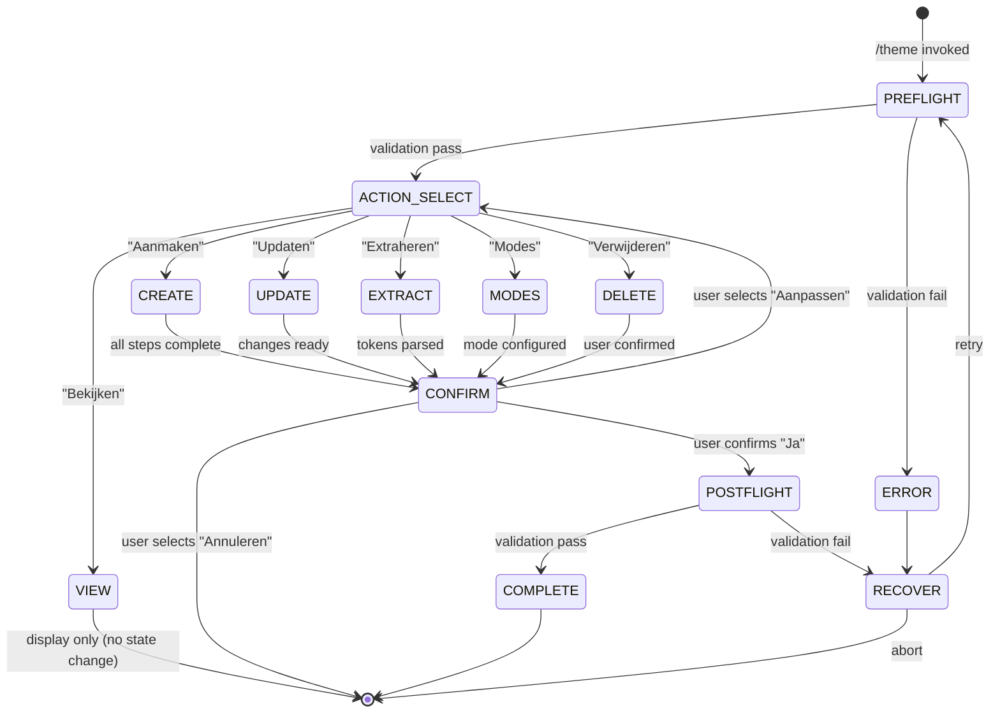

# Theme

Beheert het project design systeem: design tokens aanmaken, bekijken, updaten, en dark/light mode configuratie.

**Keywords**: design tokens, theme, colors, typography, spacing, breakpoints, dark mode, light mode, tailwind, css variables, design system, brand colors, font families

## Overview

Dit command beheert de `THEME.md` file die design tokens bevat (colors, typography, spacing, breakpoints). Het kan tokens automatisch extraheren uit bestaande Tailwind of CSS configuratie.

**Output locatie:** `.workspace/config/THEME.md`

## When to Use

- Design systeem opzetten voor nieuw project
- Bestaande design tokens bekijken of updaten
- Tokens extraheren uit Tailwind/CSS config
- Dark/light mode toevoegen of aanpassen

---

## State Machine



**State Descriptions:**

- **PREFLIGHT**: Validate resources and dependencies
- **ACTION_SELECT**: User chooses CRUD operation
- **CREATE/UPDATE/EXTRACT/MODES/DELETE**: Execute selected operation
- **VIEW**: Read-only display (no state mutation)
- **CONFIRM**: User reviews and confirms changes
- **POSTFLIGHT**: Validate output
- **COMPLETE**: Success, prepare handoff
- **ERROR/RECOVER**: Handle failures

---

## Workflow

### FASE 0: Pre-flight Validation

**Voer deze checks uit VOORDAT de workflow begint.**

```
PRE-FLIGHT CHECK
════════════════════════════════════════════════
```

**1. Directory Check**

```bash
# Verify .workspace/config/ exists or can be created
```

```
Directory: [✓|✗] .workspace/config/ - [exists|created|error]
```

**2. Session Check**

```bash
# Check .workspace/session/devinfo.json
```

```
Session: [✓|✗] [New session | Continuing from {skill}]
Handoff: [✓|✗] [data available | not applicable]
```

**3. Conflict Check (voor Create/Update)**

```
Conflicts: [✓|✗] THEME.md - [not exists | exists (will warn) | locked]
```

**Pre-flight Samenvatting:**

```
════════════════════════════════════════════════
PRE-FLIGHT RESULT
════════════════════════════════════════════════
Directory:  [✓ PASS | ✗ FAIL]
Session:    [✓ PASS | ✗ FAIL]
Conflicts:  [✓ PASS | ⚠ WARNING | ✗ FAIL]

Status: [→ Ready to proceed | ⚠ Warning: {issue} | ✗ Cannot proceed]
════════════════════════════════════════════════
```

**On Failure:**

**AskUserQuestion:**

```yaml
header: "Pre-flight Failed"
question: "Pre-flight check mislukt: {reason}. Hoe wil je doorgaan?"
options:
  - label: "Fix en retry (Recommended)", description: "Los probleem op en probeer opnieuw"
  - label: "Doorgaan anyway", description: "Negeer warning en ga door"
  - label: "Annuleren", description: "Stop workflow"
multiSelect: false
```

---

### FASE 1: Actie Selectie

**Check eerst of THEME.md bestaat:**

```bash
# Check .workspace/config/THEME.md
```

**Als THEME.md BESTAAT:**

**AskUserQuestion:**

```yaml
header: "Theme"
question: "Wat wil je doen?"
options:
  - label: "Bekijken", description: "Toon huidige design tokens"
  - label: "Updaten", description: "Wijzig bestaande tokens"
  - label: "Extraheren", description: "Tokens ophalen uit Tailwind/CSS"
  - label: "Modes", description: "Dark/light mode beheren"
  - label: "Verwijderen", description: "Theme file verwijderen"
  - label: "Explain question", description: "Leg opties uit"
multiSelect: false
```

**Als THEME.md NIET bestaat:**

**AskUserQuestion:**

```yaml
header: "Theme"
question: "Geen theme gevonden. Wat wil je doen?"
options:
  - label: "Aanmaken (Recommended)", description: "Nieuwe theme met guided setup"
  - label: "Extraheren", description: "Tokens ophalen uit bestaande Tailwind/CSS"
  - label: "Explain question", description: "Leg opties uit"
multiSelect: false
```

---

### FASE 2: Actie Uitvoering

#### Route: Aanmaken (Nieuwe Theme)

**Stap 0: Brand Preset (Snelle Start)**

**AskUserQuestion:**

```yaml
header: "Brand Preset"
question: "Wil je een brand preset gebruiken voor snelle start?"
options:
  - label: "Custom (Recommended)", description: "Eigen kleuren en fonts definiëren"
  - label: "Anthropic Style", description: "Dark/Light + Orange/Blue/Green accents, Poppins/Lora"
  - label: "Minimal Mono", description: "Zwart/Wit met één accent kleur, system fonts"
  - label: "Warm Earth", description: "Aardtinten met serif fonts"
  - label: "Cool Tech", description: "Blauw/Cyan met Inter font"
  - label: "Explain question", description: "Wat zijn brand presets?"
multiSelect: false
```

**Als een preset geselecteerd:**

1. Laad preset waarden uit `skills/shared/brand-presets.md`
2. Toon preview van preset kleuren en fonts
3. **Als preset dark mode kleuren heeft:** Toon dark mode preview, vraag bevestiging
4. **Als preset geen dark mode heeft:** → Ga naar Stap 5 (Dark Mode)
5. Vraag bevestiging → Spring naar Stap 6 (Bevestiging)

**Als "Custom":** → Ga naar Stap 1

**Stap 1: Kleuren**

**AskUserQuestion:**

```yaml
header: "Colors"
question: "Hoe wil je kleuren definiëren?"
options:
  - label: "Handmatig invoeren (Recommended)", description: "Ik geef hex values op"
  - label: "Extraheren uit config", description: "Haal uit Tailwind/CSS"
  - label: "Defaults gebruiken", description: "Start met standaard palette"
  - label: "Explain question", description: "Wat zijn design tokens?"
multiSelect: false
```

**Als "Handmatig invoeren":**

```
Geef je primaire kleuren (hex values):

1. Primary (hoofdkleur voor acties/buttons)
   → Voorbeeld: #3B82F6

2. Secondary (ondersteunende kleur)
   → Voorbeeld: #10B981

3. Neutral (grijs voor tekst/borders)
   → Voorbeeld: #6B7280

Type 's' voor populaire paletten, 'q' voor uitleg
```

**Als "Extraheren":** → Spring naar Route: Extraheren

**Als "Defaults":** Gebruik template defaults, ga naar Stap 2

**Stap 2: Typography**

**AskUserQuestion:**

```yaml
header: "Typography"
question: "Welke fonts gebruik je?"
options:
  - label: "System fonts (Recommended)", description: "system-ui, sans-serif"
  - label: "Custom fonts", description: "Eigen font families opgeven"
  - label: "Extraheren", description: "Haal uit bestaande CSS"
  - label: "Explain question", description: "Waarom fonts belangrijk zijn"
multiSelect: false
```

**Als "Custom fonts":**

```
Geef je font families:

1. Headings font
   → Voorbeeld: "Inter", "Poppins"

2. Body font
   → Voorbeeld: "Inter", system-ui

3. Mono font (optioneel, voor code)
   → Voorbeeld: "Fira Code", monospace

Type 's' voor populaire combinaties
```

**Stap 3: Spacing**

**AskUserQuestion:**

```yaml
header: "Spacing"
question: "Spacing scale voorkeur?"
options:
  - label: "4px base (Recommended)", description: "4, 8, 12, 16, 20, 24, 32, 48, 64"
  - label: "8px base", description: "8, 16, 24, 32, 40, 48, 64, 80, 96"
  - label: "Custom", description: "Eigen spacing scale"
  - label: "Explain question", description: "Wat is een spacing scale"
multiSelect: false
```

**Stap 4: Breakpoints**

**AskUserQuestion:**

```yaml
header: "Breakpoints"
question: "Responsive breakpoints?"
options:
  - label: "Tailwind defaults (Recommended)", description: "sm:640, md:768, lg:1024, xl:1280"
  - label: "Bootstrap style", description: "sm:576, md:768, lg:992, xl:1200"
  - label: "Custom", description: "Eigen breakpoints"
  - label: "Explain question", description: "Hoe breakpoints werken"
multiSelect: false
```

**Stap 5: Dark Mode**

**AskUserQuestion:**

```yaml
header: "Dark Mode"
question: "Wil je dark mode toevoegen aan je theme?"
options:
  - label: "Ja, auto-generate (Recommended)", description: "Genereer dark kleuren automatisch op basis van je light palette"
  - label: "Ja, handmatig", description: "Zelf dark mode kleuren opgeven"
  - label: "Nee, alleen light mode", description: "Sla dark mode over (later toe te voegen via Modes)"
  - label: "Explain question", description: "Waarom dark mode belangrijk is"
multiSelect: false
```

**Als "Ja, auto-generate":**

- Inverteer background/foreground: `dark` ↔ `light`
- Pas `mid-gray` en `light-gray` aan voor dark context
- Behoud accent kleuren maar verhoog lightness (~10-15%) voor leesbaarheid op donkere achtergrond
- Genereer `.dark` CSS block naast `:root`
- Toon preview (zelfde als Mode Comparison)

**Als "Ja, handmatig":**

```
Geef je dark mode kleuren (hex values):

1. Background (donkere achtergrond)
   → Voorbeeld: #1a1a2e

2. Foreground (lichte tekst op donker)
   → Voorbeeld: #f5f5f5

3. Card background (iets lichter dan background)
   → Voorbeeld: #2d2d44

4. Border kleur
   → Voorbeeld: #3d3d5c
```

**Als "Nee":**

- Sla dark mode over
- Theme Modes sectie bevat alleen Light Mode
- → Ga naar Stap 6

**Stap 6: Bevestiging**

```
📋 THEME SAMENVATTING

| Categorie | Waarde |
|-----------|--------|
| **Primary** | {color} |
| **Secondary** | {color} |
| **Neutral** | {color} |
| **Headings** | {font} |
| **Body** | {font} |
| **Spacing** | {scale} |
| **Breakpoints** | {list} |
| **Dark Mode** | {Ja (auto) / Ja (custom) / Nee} |
```

**AskUserQuestion:**

```yaml
header: "Confirm"
question: "Theme aanmaken met deze settings?"
options:
  - label: "Ja, aanmaken (Recommended)", description: "Schrijf naar .workspace/config/THEME.md"
  - label: "Aanpassen", description: "Terug om wijzigingen te maken"
  - label: "Annuleren", description: "Stop zonder aanmaken"
multiSelect: false
```

**Als "Ja":**

1. Lees `THEME_TEMPLATE.md` uit resources
2. Vul template in met user values
3. **Als dark mode gekozen:** Vul ook `.dark` CSS block in Theme Modes sectie
4. **Als geen dark mode:** Verwijder Dark Mode blok uit Template, behoud alleen Light Mode
5. Schrijf naar `.workspace/config/THEME.md`
6. → Ga naar FASE X: Post-flight Validation

---

#### Route: Bekijken

1. Lees `.workspace/config/THEME.md`
2. Parse en toon in overzichtelijke tabel:

```
📋 HUIDIGE THEME

## Colors
| Token | Value | Preview |
|-------|-------|---------|
| primary-500 | #3B82F6 | 🟦 |
| secondary-500 | #10B981 | 🟩 |
| ... | ... | ... |

## Typography
| Element | Font |
|---------|------|
| Headings | Inter |
| Body | system-ui |

## Spacing
| Token | Value |
|-------|-------|
| spacing-1 | 4px |
| spacing-2 | 8px |
| ... | ... |

## Breakpoints
| Name | Value |
|------|-------|
| sm | 640px |
| md | 768px |
| ... | ... |
```

**AskUserQuestion:**

```yaml
header: "Action"
question: "Wat wil je doen?"
options:
  - label: "Klaar", description: "Terug naar conversation"
  - label: "Updaten", description: "Wijzigingen maken"
  - label: "Exporteren", description: "Toon als CSS variables"
  - label: "Visual Preview", description: "Open theme preview in browser"
multiSelect: false
```

**If "Visual Preview":**

```
THEME PREVIEW
═════════════

Generating preview page...

1. Create temporary preview HTML:
   - Inject CSS variables from THEME.md
   - Include color swatches, typography samples, spacing demo

2. Open in default browser:
   start [temp-path]/theme-preview.html

(If dark mode configured: include toggle button in preview)
```

---

#### Route: Updaten

**AskUserQuestion:**

```yaml
header: "Update"
question: "Welke sectie wil je updaten?"
options:
  - label: "Colors", description: "Kleuren aanpassen"
  - label: "Typography", description: "Fonts aanpassen"
  - label: "Spacing", description: "Spacing scale aanpassen"
  - label: "Breakpoints", description: "Breakpoints aanpassen"
  - label: "Alles", description: "Volledige herconfig"
  - label: "Explain question", description: "Toon huidige waarden"
multiSelect: true
```

**Per geselecteerde sectie:**

- Toon huidige waarden
- Vraag nieuwe waarden (zelfde flow als Aanmaken)
- Toon diff preview
- Bevestig wijziging
- → Ga naar FASE X: Post-flight Validation

---

#### Route: Extraheren

**Stap 1: Detectie**

```bash
# Zoek configuratie files
# - tailwind.config.js/ts/mjs
# - CSS files met :root variables
# - globals.css, variables.css, etc.
```

**Output:**

```
🔍 DETECTIE RESULTAAT

| Bron | Status | Tokens |
|------|--------|--------|
| tailwind.config.js | ✓ Gevonden | ~{N} colors, spacing |
| src/styles/globals.css | ✓ Gevonden | ~{N} CSS variables |
| src/index.css | ✗ Geen tokens | - |
```

**AskUserQuestion:**

```yaml
header: "Extract"
question: "Uit welke bronnen extraheren?"
options:
  - label: "Alle bronnen (Recommended)", description: "Combineer alle gevonden tokens"
  - label: "Alleen Tailwind", description: "Alleen uit tailwind config"
  - label: "Alleen CSS", description: "Alleen :root variables"
  - label: "Explain question", description: "Verschil tussen bronnen"
multiSelect: false
```

**Stap 2: Extractie uitvoeren**

1. Parse geselecteerde bronnen
2. Map naar THEME.md structuur
3. Toon preview van geëxtraheerde tokens
4. Vraag bevestiging (zelfde als Aanmaken Stap 5)
5. → Ga naar FASE X: Post-flight Validation

---

#### Route: Modes (Dark/Light)

**AskUserQuestion:**

```yaml
header: "Modes"
question: "Theme mode actie?"
options:
  - label: "Dark mode toevoegen (Recommended)", description: "Voeg dark variant toe aan huidige theme"
  - label: "Light mode toevoegen", description: "Voeg light variant toe"
  - label: "Mode verwijderen", description: "Verwijder een bestaande mode"
  - label: "Mode switchen", description: "Wissel default mode"
  - label: "Explain question", description: "Hoe modes werken"
multiSelect: false
```

**Als "Dark mode toevoegen":**

**AskUserQuestion:**

```yaml
header: "Dark Mode"
question: "Hoe dark mode kleuren genereren?"
options:
  - label: "Auto-generate (Recommended)", description: "Inverteer/adjust automatisch"
  - label: "Handmatig", description: "Zelf dark kleuren opgeven"
  - label: "Extraheren", description: "Haal uit bestaande dark theme CSS"
  - label: "Explain question", description: "Tips voor dark mode kleuren"
multiSelect: false
```

**Als "Auto-generate":**

- Genereer dark variants van huidige kleuren
- Toon preview
- Vraag bevestiging
- → Ga naar FASE X: Post-flight Validation

#### Mode Comparison

After mode configuration, show side-by-side comparison:

```
MODE COMPARISON
═══════════════

1. Generate comparison HTML:
   - Left panel: Light mode
   - Right panel: Dark mode
   - Same content in both

2. Open in default browser:
   start [temp-path]/mode-comparison.html

Layout: [Light Mode] | [Dark Mode] side-by-side
```

**Output:**

```
MODE COMPARISON READY
─────────────────────
Colors compared:
  Background: #ffffff ↔ #1a1a2e
  Foreground: #1a1a2e ↔ #f5f5f5
  Primary:    #3B82F6 ↔ #60A5FA
  ...

Contrast check:
  Primary on background: 4.8:1 ✓ (AA pass)
  Text on background: 7.2:1 ✓ (AAA pass)

Opening comparison in browser...
```

**AskUserQuestion (after preview opens):**

```yaml
header: "Mode Preview"
question: "Bekijk de light/dark vergelijking in browser. Tevreden?"
options:
  - label: "Ja, opslaan (Recommended)", description: "Bevestig mode configuratie"
  - label: "Aanpassen", description: "Wijzig kleuren"
```

---

#### Route: Verwijderen

**AskUserQuestion:**

```yaml
header: "Delete"
question: "Weet je zeker dat je de theme wilt verwijderen?"
options:
  - label: "Ja, verwijderen", description: "Verwijder .workspace/config/THEME.md"
  - label: "Nee, annuleren (Recommended)", description: "Behoud theme"
multiSelect: false
```

---

### FASE X: Post-flight Validation

**Voer deze checks uit NA elke write operatie (Create/Update/Extract/Modes).**

```
POST-FLIGHT CHECK
════════════════════════════════════════════════
```

**1. File Validation**

```
File: [✓|✗] .workspace/config/THEME.md - [exists|missing|empty]
Size: [✓|✗] {N} bytes - [valid|suspicious]
Format: [✓|✗] Markdown - [valid|corrupt]
```

**2. Content Validation**

```
Sections:
  [✓|✗] Colors - [present|missing]
  [✓|✗] Typography - [present|missing]
  [✓|✗] Spacing - [present|missing]
  [✓|✗] Breakpoints - [present|missing]
  [✓|✗] Theme Modes - [light only|light+dark|missing]
```

**3. Value Validation**

```
Colors:
  [✓|✗] All hex codes valid (#RRGGBB format)
  [✓|✗] No empty values
Typography:
  [✓|✗] Font families have fallbacks
Spacing:
  [✓|✗] All values numeric with unit
Theme Modes:
  [✓|✗] Light mode :root CSS present and valid
  [✓|✗] Dark mode .dark CSS present (if configured)
  [✓|✗] Dark mode contrast ratios acceptable (AA minimum)
  [✓|✗] No unfilled placeholders in mode CSS blocks
```

**4. Export Validation**

```
CSS Export:
  [✓|✗] CSS Variables section present
  [✓|✗] :root block syntax valid
  [✓|✗] .dark block syntax valid (if dark mode configured)
  [✓|✗] Matches token table
  [✓|✗] All theme mode variables populated (no {placeholders})
```

**Post-flight Samenvatting:**

```
════════════════════════════════════════════════
POST-FLIGHT RESULT
════════════════════════════════════════════════
File:      [✓ PASS | ✗ FAIL]
Content:   [✓ PASS | ✗ FAIL] - {N}/{M} sections
Values:    [✓ PASS | ⚠ WARNINGS | ✗ FAIL]
Modes:     [✓ PASS | ⚠ Light only | ✗ FAIL] - {light|light+dark}
Export:    [✓ PASS | ✗ FAIL]

Status: [→ Complete | ⚠ Warnings: {list} | ✗ Recovery needed]
════════════════════════════════════════════════
```

**On Failure:**

**AskUserQuestion:**

```yaml
header: "Post-flight Failed"
question: "Validatie vond problemen: {issues}. Wat nu?"
options:
  - label: "Auto-fix (Recommended)", description: "Probeer automatisch te repareren"
  - label: "Handmatig fixen", description: "Bekijk en fix problemen"
  - label: "Negeren", description: "Accepteer output ondanks problemen"
multiSelect: false
```

---

## Output Formaat

**Na succesvolle actie:**

```
✅ THEME [AANGEMAAKT/BIJGEWERKT/VERWIJDERD]

Locatie: .workspace/config/THEME.md

| Categorie | Tokens |
|-----------|--------|
| Colors | {N} |
| Typography | {N} |
| Spacing | {N} |
| Breakpoints | {N} |
| Modes | {light/dark/both} |

Next suggested: /frontend:compose of /dev:define (met theme als context)
```

---

## Error Recovery

> Zie ook: `skills/shared/VALIDATION.md` voor algemene recovery patterns.

### Extraction Failures

| Error                      | Recovery                            |
| -------------------------- | ----------------------------------- |
| Config file niet gevonden  | Offer manual path input             |
| Parse error in config      | Toon raw content, vraag format hint |
| Geen tokens gevonden       | Offer defaults + manual input       |
| Tailwind v3 vs v4 verschil | Detecteer versie, pas parser aan    |

### Write Failures

| Error                     | Recovery                           |
| ------------------------- | ---------------------------------- |
| Permission denied         | Suggest alternative path           |
| Disk full                 | Warn, suggest cleanup              |
| Directory niet creëerbaar | Offer manual creation instructions |

### Validation Failures

| Error            | Auto-fix              | Manual                       |
| ---------------- | --------------------- | ---------------------------- |
| Invalid hex code | Suggest closest valid | Show invalid, ask correction |
| Missing section  | Add with defaults     | Ask for values               |
| Empty value      | Use default           | Ask for value                |
| CSS syntax error | Re-generate export    | Show error location          |

> **Note:** Rollback wordt afgehandeld door Claude Code's ingebouwde "Rewind" functie.

---

## DevInfo Integration

> Zie ook: `skills/shared/DEVINFO.md` voor volledige specificatie.

### Session Initialization

Bij skill start:

```json
{
  "currentSkill": {
    "name": "frontend-theme",
    "phase": "PREFLIGHT",
    "startedAt": "ISO timestamp"
  }
}
```

### Progress Updates

Update devinfo bij elke fase transitie:

- `PREFLIGHT` → `ACTION_SELECT`
- `ACTION_SELECT` → `CREATE|UPDATE|EXTRACT|MODES|DELETE`
- `CONFIRM` → `POSTFLIGHT`
- `POSTFLIGHT` → `COMPLETE`

### Completion Handoff

Bij succesvolle completion:

```json
{
  "handoff": {
    "from": "frontend-theme",
    "to": "frontend-compose",
    "data": {
      "themeFile": ".workspace/config/THEME.md",
      "preset": "Anthropic Style | Custom",
      "tokens": {
        "colors": 12,
        "typography": 3,
        "spacing": 9
      },
      "modes": ["light", "dark"],
      "cssExportValid": true
    }
  }
}
```

---

## Cross-Skill Integration

### Output Contract (theme → wireframe)

Deze skill garandeert bij completion:

- `.workspace/config/THEME.md` bestaat
- Bevat valid sections: Colors, Typography, Spacing, Breakpoints
- CSS export section is syntactically valid
- Handoff data beschikbaar in devinfo

### Suggested Next

Na succesvolle theme creatie/update:

```
Next suggested: /frontend:compose of /dev:define (met theme als context)
Theme tokens ready for wireframe integration.
```

---

## Resources

- `skills/frontend-theme/references/THEME_TEMPLATE.md` - Template voor nieuwe theme
- `skills/shared/brand-presets.md` - Voorgedefinieerde brand presets
- `skills/shared/VALIDATION.md` - Pre/post-flight validation templates
- `skills/shared/DEVINFO.md` - Session state tracking

---

## Restrictions

Dit command moet **NOOIT**:

- Theme aanmaken zonder bevestiging
- Bestaande theme overschrijven zonder waarschuwing
- Tokens raden zonder bron (config of user input)
- Post-flight validation overslaan

Dit command moet **ALTIJD**:

- Pre-flight validation uitvoeren
- AskUserQuestion gebruiken voor alle keuzes
- Huidige waarden tonen bij updates
- Diff preview tonen voor wijzigingen
- Bevestiging vragen voor destructieve acties
- Post-flight validation uitvoeren
- DevInfo updaten bij fase transities
