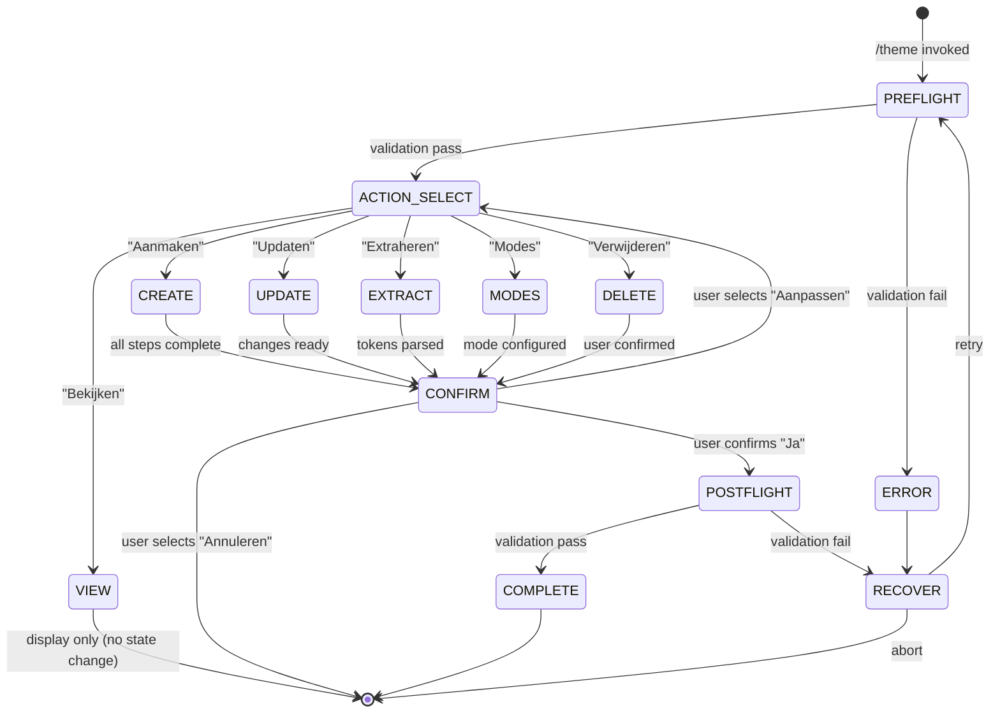

# Tokens

Beheert het project design systeem: design tokens aanmaken, bekijken, updaten, en dark/light mode configuratie. Inclusief motion tokens (durations, easings) en interaction tokens (focus ring, hover, active states).

**Keywords**: design tokens, theme, colors, typography, spacing, breakpoints, dark mode, light mode, tailwind, css variables, design system, brand colors, font families, motion, animation, easing, transitions, interactions, focus ring, hover states

## Overview

Dit command beheert de `theme` sectie in `.project/project.json` die design tokens bevat (colors, typography, spacing, breakpoints, borderRadius, shadows, modes, cssVars). Het kan tokens automatisch extraheren uit bestaande Tailwind of CSS configuratie.

**Output locatie:** `.project/project.json` → `theme` sectie

**Referenties:**

- `THEME_TEMPLATE.md` — Token categorieën en naming conventions
- `../shared/DESIGN.md` — Anti-patterns, OKLCH kleuradvies, typography, motion, interaction states

## When to Use

- Design systeem opzetten voor nieuw project
- Bestaande design tokens bekijken of updaten
- Tokens extraheren uit Tailwind/CSS config
- Dark/light mode toevoegen of aanpassen

---

## Theme JSON Schema

De `theme` sectie in `project.json` volgt dit schema:

```json
{
  "colors": {
    "main": [{ "token": "dark", "value": "#hex", "usage": "description" }],
    "accent": [
      { "token": "accent-primary", "value": "#hex", "usage": "description" }
    ],
    "semantic": [
      { "token": "success", "value": "#hex", "usage": "description" }
    ]
  },
  "typography": {
    "families": {
      "heading": "Font, fallback",
      "body": "Font, fallback",
      "mono": "Font, fallback"
    },
    "sizes": [{ "token": "text-base", "size": "1rem", "lineHeight": "1.5rem" }]
  },
  "spacing": {
    "base": "4px",
    "scale": [{ "token": "spacing-4", "value": "16px", "usage": "description" }]
  },
  "breakpoints": [
    { "token": "screen-md", "value": "768px", "target": "Tablets" }
  ],
  "borderRadius": [
    { "token": "rounded-md", "value": "0.375rem", "usage": "description" }
  ],
  "shadows": [{ "token": "shadow-md", "value": "...", "usage": "Cards" }],
  "motion": {
    "durations": [
      {
        "token": "duration-fast",
        "value": "200ms",
        "usage": "Tooltip, hover state"
      }
    ],
    "easings": [
      {
        "token": "ease-out",
        "value": "cubic-bezier(0.25, 1, 0.5, 1)",
        "usage": "Elements entering"
      }
    ]
  },
  "interactions": {
    "focusRing": {
      "width": "2px",
      "style": "solid",
      "color": "var(--color-accent-primary)",
      "offset": "2px"
    },
    "hover": {
      "transition": "var(--duration-fast) var(--ease-out)",
      "transform": "none"
    },
    "active": { "transform": "scale(0.98)" }
  },
  "modes": { "light": ":root { css }", "dark": ".dark { css }" },
  "cssVars": ":root { full css vars export }"
}
```

Zie `shared/DASHBOARD.md` voor het volledige `project.json` schema met alle secties.

---

## Read/Write Protocol

### Lezen

1. Read `.project/project.json`
2. Parse als JSON
3. Gebruik `theme` sectie (kan leeg/undefined zijn)

### Schrijven

1. Read `.project/project.json` (of maak nieuw met leeg schema als niet bestaat)
2. Parse JSON
3. Muteer ALLEEN de `theme` sectie (NIET andere secties overschrijven)
4. Write terug als `JSON.stringify(data, null, 2)`

### Nieuw bestand aanmaken

Als `.project/project.json` niet bestaat, maak aan met het lege schema uit `shared/DASHBOARD.md`:

```json
{
  "concept": { "name": "", "content": "" },
  "theme": {},
  "stack": {
    "framework": "",
    "language": "",
    "styling": "",
    "db": "",
    "auth": "",
    "hosting": "",
    "packages": []
  },
  "data": { "entities": [] },
  "endpoints": [],
  "decisions": []
}
```

Vul vervolgens de `theme` sectie met de gegenereerde tokens.

---

## State Machine



**State Descriptions:**

- **PREFLIGHT**: Validate resources and dependencies
- **ACTION_SELECT**: User chooses CRUD operation
- **CREATE/UPDATE/EXTRACT/MODES/DELETE**: Execute selected operation
- **VIEW**: Read-only display (no state mutation)
- **CONFIRM**: User reviews and confirms changes
- **POSTFLIGHT**: Validate output
- **COMPLETE**: Success, prepare handoff
- **ERROR/RECOVER**: Handle failures

---

## Workflow

### FASE 0: Pre-flight Validation

**Voer deze checks uit VOORDAT de workflow begint.**

```
PRE-FLIGHT CHECK
════════════════════════════════════════════════
```

**1. Directory Check**

```bash
# Verify .project/ exists or can be created
```

```
Directory: [✓|✗] .project/ - [exists|created|error]
```

**2. Session Check**

```bash
# Check .project/session/devinfo.json
```

```
Session: [✓|✗] [New session | Continuing from {skill}]
Handoff: [✓|✗] [data available | not applicable]
```

**3. Conflict Check (voor Create/Update)**

```bash
# Read .project/project.json → check of theme sectie al gevuld is
```

```
Conflicts: [✓|✗] project.json theme - [empty | has data (will warn) | file missing]
```

**Pre-flight Samenvatting:**

```
════════════════════════════════════════════════
PRE-FLIGHT RESULT
════════════════════════════════════════════════
Directory:  [✓ PASS | ✗ FAIL]
Session:    [✓ PASS | ✗ FAIL]
Conflicts:  [✓ PASS | ⚠ WARNING | ✗ FAIL]

Status: [→ Ready to proceed | ⚠ Warning: {issue} | ✗ Cannot proceed]
════════════════════════════════════════════════
```

**On Failure:**

**AskUserQuestion:**

```yaml
header: "Pre-flight Failed"
question: "Pre-flight check mislukt: {reason}. Hoe wil je doorgaan?"
options:
  - label: "Fix en retry (Recommended)", description: "Los probleem op en probeer opnieuw"
  - label: "Doorgaan anyway", description: "Negeer warning en ga door"
  - label: "Annuleren", description: "Stop workflow"
multiSelect: false
```

---

### FASE 1: Actie Selectie

**Check eerst of project.json een gevulde theme sectie bevat:**

```bash
# Read .project/project.json → parse JSON → check theme sectie
```

**Design Principles Context (optional):**

Check `.project/project.json` → `design.principles`. If principles exist, show them as context before action selection:

```
DESIGN PRINCIPES BESCHIKBAAR
════════════════════════════════════════════════════════════════
- {principle.name}: {principle.description}
- {principle.name}: {principle.description}
════════════════════════════════════════════════════════════════

Deze principes worden meegenomen als suggestie bij token keuzes.
```

Principles are advisory — use them to inform suggestions (e.g., if "Mobile-first" exists, suggest mobile-optimized breakpoints), but don't enforce.

**Als theme sectie DATA bevat (niet leeg):**

**Completeness check — voer uit voordat het actiemenu getoond wordt:**

Check welke van de 10 verwachte secties aanwezig zijn in `theme`. Een sectie telt als "aanwezig" als de key bestaat EN niet een leeg object `{}`, leeg array `[]`, of lege string `""` is.

```
THEME STATUS
════════════════════════════════════════════════
  [✓|✗] colors
  [✓|✗] typography
  [✓|✗] spacing
  [✓|✗] breakpoints
  [✓|✗] borderRadius
  [✓|✗] shadows
  [✓|✗] motion
  [✓|✗] interactions
  [✓|✗] modes
  [✓|✗] cssVars

Compleet: {N}/10 secties
════════════════════════════════════════════════
```

**Als alle secties aanwezig (N = 10):**

**AskUserQuestion:**

```yaml
header: "Theme"
question: "Wat wil je doen?"
options:
  - label: "Bekijken", description: "Toon huidige design tokens"
  - label: "Updaten", description: "Wijzig bestaande tokens"
  - label: "Modes", description: "Dark/light mode beheren"
  - label: "Verwijderen", description: "Theme data verwijderen"
multiSelect: false
```

**Als secties ontbreken (N < 10):**

**AskUserQuestion:**

```yaml
header: "Theme"
question: "Wat wil je doen? (⚠ {10-N} secties ontbreken: {missing_list})"
options:
  - label: "Aanvullen (Recommended)", description: "Vul ontbrekende secties aan: {missing_list}"
  - label: "Bekijken", description: "Toon huidige design tokens"
  - label: "Updaten", description: "Wijzig bestaande tokens"
  - label: "Modes", description: "Dark/light mode beheren"
multiSelect: false
```

**Als theme sectie LEEG is of project.json niet bestaat:**

**AskUserQuestion:**

```yaml
header: "Theme"
question: "Geen theme gevonden. Wat wil je doen?"
options:
  - label: "Aanmaken (Recommended)", description: "Nieuwe theme met guided setup"
  - label: "Extraheren", description: "Tokens ophalen uit bestaande Tailwind/CSS"
  - label: "Explain question", description: "Leg opties uit"
multiSelect: false
```

---

### FASE 2: Actie Uitvoering

#### Route: Aanvullen (Ontbrekende Secties)

Targets alleen de ontbrekende secties. Voor elke ontbrekende sectie, voer de bijbehorende stap uit de Aanmaken-route uit:

| Ontbrekende Sectie | → Voer Stap Uit                                                          |
| ------------------ | ------------------------------------------------------------------------ |
| colors             | Stap 1: Kleuren                                                          |
| typography         | Stap 2: Typography                                                       |
| spacing            | Stap 3: Spacing                                                          |
| breakpoints        | Stap 4: Breakpoints                                                      |
| modes              | Stap 5: Dark Mode                                                        |
| motion             | Stap 6: Motion                                                           |
| interactions       | Stap 7: Interactions                                                     |
| borderRadius       | Genereer defaults (0.125rem, 0.25rem, 0.375rem, 0.5rem, 0.75rem, 9999px) |
| shadows            | Genereer defaults (sm, md, lg, xl + glow met accent kleur)               |
| cssVars            | Auto-genereer uit alle aanwezige token data                              |

Sla al-aanwezige secties over. Na het aanvullen van alle ontbrekende secties:

1. Regenereer `cssVars` om nieuw toegevoegde tokens te bevatten
2. → Ga naar FASE X: Post-flight Validation
3. → Ga naar X.6: Theme Infrastructure Sync
4. → Ga naar FASE Y: Website Sync

---

#### Route: Aanmaken (Nieuwe Theme)

**Stap 1: Kleuren**

**AskUserQuestion:**

```yaml
header: "Colors"
question: "Hoe wil je kleuren definiëren?"
options:
  - label: "Genereer voor mij (Recommended)", description: "Beschrijf wat je bouwt, Claude kiest passende kleuren"
  - label: "Handmatig invoeren", description: "Ik geef hex values op"
  - label: "Extraheren uit config", description: "Haal uit Tailwind/CSS"
  - label: "Explain question", description: "Wat zijn design tokens?"
multiSelect: false
```

**Als "Genereer voor mij":**

```
Beschrijf kort wat je bouwt:

→ Voorbeeld: "Healthcare dashboard voor artsen"
→ Voorbeeld: "E-commerce voor luxe horloges"
→ Voorbeeld: "SaaS landing page voor projectmanagement"
```

Op basis van de beschrijving genereert Claude een contextbewust kleurenpalet:

- Main colors (dark, light, mid-gray, light-gray)
- Accent colors (primary, secondary, tertiary) passend bij de industrie/doelgroep
- Semantic colors (success, warning, error, info)

Toon het gegenereerde palet als tabel, vraag bevestiging. → Ga naar Stap 2

**Als "Handmatig invoeren":**

```
Geef je primaire kleuren (hex values):

1. Primary (hoofdkleur voor acties/buttons)
   → Voorbeeld: #3B82F6

2. Secondary (ondersteunende kleur)
   → Voorbeeld: #10B981

3. Neutral (grijs voor tekst/borders)
   → Voorbeeld: #6B7280
```

**Als "Extraheren":** → Spring naar Route: Extraheren

**Stap 2: Typography**

**AskUserQuestion:**

```yaml
header: "Typography"
question: "Welke fonts gebruik je?"
options:
  - label: "System fonts (Recommended)", description: "system-ui, sans-serif"
  - label: "Custom fonts", description: "Eigen font families opgeven"
  - label: "Extraheren", description: "Haal uit bestaande CSS"
  - label: "Explain question", description: "Waarom fonts belangrijk zijn"
multiSelect: false
```

**Als "Custom fonts":**

```
Geef je font families:

1. Headings font
   → Voorbeeld: "Inter", "Poppins"

2. Body font
   → Voorbeeld: "Inter", system-ui

3. Mono font (optioneel, voor code)
   → Voorbeeld: "Fira Code", monospace

Type 's' voor populaire combinaties
```

**Stap 3: Spacing**

**AskUserQuestion:**

```yaml
header: "Spacing"
question: "Spacing scale voorkeur?"
options:
  - label: "4px base (Recommended)", description: "4, 8, 12, 16, 20, 24, 32, 48, 64"
  - label: "8px base", description: "8, 16, 24, 32, 40, 48, 64, 80, 96"
  - label: "Custom", description: "Eigen spacing scale"
  - label: "Explain question", description: "Wat is een spacing scale"
multiSelect: false
```

**Stap 4: Breakpoints**

**AskUserQuestion:**

```yaml
header: "Breakpoints"
question: "Responsive breakpoints?"
options:
  - label: "Tailwind defaults (Recommended)", description: "sm:640, md:768, lg:1024, xl:1280"
  - label: "Bootstrap style", description: "sm:576, md:768, lg:992, xl:1200"
  - label: "Custom", description: "Eigen breakpoints"
  - label: "Explain question", description: "Hoe breakpoints werken"
multiSelect: false
```

**Stap 5: Dark Mode**

**AskUserQuestion:**

```yaml
header: "Dark Mode"
question: "Wil je dark mode toevoegen aan je theme?"
options:
  - label: "Ja, auto-generate (Recommended)", description: "Genereer dark kleuren automatisch op basis van je light palette"
  - label: "Ja, handmatig", description: "Zelf dark mode kleuren opgeven"
  - label: "Nee, alleen light mode", description: "Sla dark mode over (later toe te voegen via Modes)"
  - label: "Explain question", description: "Waarom dark mode belangrijk is"
multiSelect: false
```

**Als "Ja, auto-generate":**

- Inverteer background/foreground: `dark` <> `light`
- Pas `mid-gray` en `light-gray` aan voor dark context
- Behoud accent kleuren maar verhoog lightness (~10-15%) voor leesbaarheid op donkere achtergrond
- Genereer `.dark` CSS block naast `:root`
- Toon preview (zelfde als Mode Comparison)

**Als "Ja, handmatig":**

```
Geef je dark mode kleuren (hex values):

1. Background (donkere achtergrond)
   → Voorbeeld: #1a1a2e

2. Foreground (lichte tekst op donker)
   → Voorbeeld: #f5f5f5

3. Card background (iets lichter dan background)
   → Voorbeeld: #2d2d44

4. Border kleur
   → Voorbeeld: #3d3d5c
```

**Als "Nee":**

- Sla dark mode over
- `modes` bevat alleen `light` key
- → Ga naar Stap 6

**Stap 6: Motion**

**AskUserQuestion:**

```yaml
header: "Motion"
question: "Motion tokens voor animaties en transities?"
options:
  - label: "Defaults (Recommended)", description: "Standaard durations (100/200/300/500ms) + smooth easings"
  - label: "Custom", description: "Eigen durations en easing curves opgeven"
  - label: "Geen motion tokens", description: "Sla over (later toe te voegen via Update)"
  - label: "Explain question", description: "Wat zijn motion tokens"
multiSelect: false
```

**Als "Defaults":**

Genereer standaard motion tokens op basis van `shared/DESIGN.md`:

- Durations: `duration-instant` (100ms), `duration-fast` (200ms), `duration-normal` (300ms), `duration-slow` (500ms)
- Easings: `ease-out` (cubic-bezier(0.25, 1, 0.5, 1)), `ease-in` (cubic-bezier(0.7, 0, 0.84, 0)), `ease-in-out` (cubic-bezier(0.65, 0, 0.35, 1))

Toon als tabel, vraag bevestiging. → Ga naar Stap 7

**Als "Custom":**

```
Geef je motion preferences:

1. Snelheid voorkeur?
   → "snappy" (kortere durations: 75/150/200/350ms)
   → "smooth" (standaard: 100/200/300/500ms)
   → "relaxed" (langere durations: 150/250/400/600ms)

2. Easing stijl?
   → "smooth" (ease-out-quart — default)
   → "snappy" (ease-out-expo — confident, direct)
   → "custom" (eigen cubic-bezier waarden)
```

**Als "Geen motion tokens":**

- Sla motion over, `motion` sectie wordt leeg object
- → Ga naar Stap 7

**Stap 7: Interactions**

**AskUserQuestion:**

```yaml
header: "Interactions"
question: "Interaction tokens voor hover, focus en active states?"
options:
  - label: "Defaults (Recommended)", description: "Focus ring (2px accent), subtle hover transition, scale active"
  - label: "Custom", description: "Eigen interaction styles opgeven"
  - label: "Geen interaction tokens", description: "Sla over (later toe te voegen via Update)"
  - label: "Explain question", description: "Wat zijn interaction tokens"
multiSelect: false
```

**Als "Defaults":**

Genereer standaard interaction tokens:

- Focus ring: `width: 2px`, `style: solid`, `color: var(--color-accent-primary)`, `offset: 2px`
- Hover: `transition: var(--duration-fast) var(--ease-out)`, `transform: none`
- Active: `transform: scale(0.98)`

Toon als tabel, vraag bevestiging. → Ga naar Stap 8

**Als "Custom":**

```
Geef je interaction preferences:

1. Focus ring
   → Kleur: accent-primary / custom
   → Breedte: 2px / custom
   → Offset: 2px / custom

2. Hover effect
   → Transition speed: instant / fast / normal
   → Transform: none / translateY(-1px) / scale(1.02)

3. Active/press effect
   → Transform: scale(0.98) / scale(0.95) / none
```

**Als "Geen interaction tokens":**

- Sla interactions over, `interactions` sectie wordt leeg object
- → Ga naar Stap 8

**CHECKPOINT: Design Tokens Samenvatting**

Presenteer alle verzamelde tokens als overzicht voordat ze worden opgeslagen:

**Stap 8: Bevestiging**

```
THEME SAMENVATTING

| Categorie | Waarde |
|-----------|--------|
| **Primary** | {color} |
| **Secondary** | {color} |
| **Neutral** | {color} |
| **Headings** | {font} |
| **Body** | {font} |
| **Spacing** | {scale} |
| **Breakpoints** | {list} |
| **Dark Mode** | {Ja (auto) / Ja (custom) / Nee} |
| **Motion** | {Defaults / Custom / Geen} |
| **Interactions** | {Defaults / Custom / Geen} |
```

**AskUserQuestion:**

```yaml
header: "Confirm"
question: "Theme aanmaken met deze settings?"
options:
  - label: "Ja, aanmaken (Recommended)", description: "Schrijf naar .project/project.json (theme sectie)"
  - label: "Aanpassen", description: "Terug om wijzigingen te maken"
  - label: "Annuleren", description: "Stop zonder aanmaken"
multiSelect: false
```

**Als "Ja":**

1. Raadpleeg `THEME_TEMPLATE.md` voor token categorien en naming conventions
2. Bouw het theme JSON object volgens het schema (zie "Theme JSON Schema" hierboven)
3. Vul `colors` (main, accent, semantic) met structured token objects
4. Vul `typography` met families en sizes
5. Vul `spacing` met base en scale
6. Vul `breakpoints`, `borderRadius`, `shadows`
7. **Als dark mode gekozen:** Vul `modes` met zowel `light` als `dark` CSS strings
8. **Als geen dark mode:** Vul `modes` met alleen `light` key
9. **Als motion gekozen:** Vul `motion` met durations en easings
10. **Als interactions gekozen:** Vul `interactions` met focusRing, hover, active
11. Genereer `cssVars` — volledige CSS variables string (alle tokens incl. motion/interaction als `:root { ... }`)
12. Read `.project/project.json` (of maak nieuw met leeg schema)
13. Set `theme` sectie → Write terug als formatted JSON
14. → Ga naar FASE X: Post-flight Validation

---

#### Route: Bekijken

1. Read `.project/project.json` → parse `theme` sectie
2. Parse en toon in overzichtelijke tabel:

```
HUIDIGE THEME

## Colors
| Token | Value | Preview |
|-------|-------|---------|
| primary-500 | #3B82F6 | |
| secondary-500 | #10B981 | |
| ... | ... | ... |

## Typography
| Element | Font |
|---------|------|
| Headings | Inter |
| Body | system-ui |

## Spacing
| Token | Value |
|-------|-------|
| spacing-1 | 4px |
| spacing-2 | 8px |
| ... | ... |

## Breakpoints
| Name | Value |
|------|-------|
| sm | 640px |
| md | 768px |
| ... | ... |
```

3. **Completeness check:** check alle 10 verwachte secties (colors, typography, spacing, breakpoints, borderRadius, shadows, motion, interactions, modes, cssVars). Als secties ontbreken:

```
⚠ ONTBREKENDE SECTIES: {missing_list}
  Gebruik "Aanvullen" om ontbrekende secties toe te voegen.
```

**AskUserQuestion:**

Als alle secties aanwezig:

```yaml
header: "Action"
question: "Wat wil je doen?"
options:
  - label: "Klaar", description: "Terug naar conversation"
  - label: "Updaten", description: "Wijzigingen maken"
  - label: "Exporteren", description: "Toon als CSS variables"
  - label: "Visual Preview", description: "Open theme preview in browser"
multiSelect: false
```

Als secties ontbreken — voeg "Aanvullen" toe:

```yaml
header: "Action"
question: "Wat wil je doen? (⚠ {N} secties ontbreken)"
options:
  - label: "Aanvullen (Recommended)", description: "Vul ontbrekende secties aan: {missing_list}"
  - label: "Klaar", description: "Terug naar conversation"
  - label: "Updaten", description: "Wijzigingen maken"
  - label: "Exporteren", description: "Toon als CSS variables"
multiSelect: false
```

**If "Visual Preview":**

```
THEME PREVIEW
═════════════

Generating preview page...

1. Create temporary preview HTML:
   - Inject CSS variables from project.json theme.cssVars
   - Include color swatches, typography samples, spacing demo

2. Open in default browser:
   start [temp-path]/theme-preview.html

(If dark mode configured: include toggle button in preview)
```

---

#### Route: Updaten

**AskUserQuestion:**

```yaml
header: "Update"
question: "Welke sectie wil je updaten?"
options:
  - label: "Colors", description: "Kleuren aanpassen"
  - label: "Typography", description: "Fonts aanpassen"
  - label: "Spacing", description: "Spacing scale aanpassen"
  - label: "Breakpoints", description: "Breakpoints aanpassen"
  - label: "Motion", description: "Durations en easings aanpassen"
  - label: "Interactions", description: "Focus ring, hover, active states aanpassen"
  - label: "Alles", description: "Volledige herconfig"
  - label: "Explain question", description: "Toon huidige waarden"
multiSelect: true
```

**Per geselecteerde sectie:**

- Lees huidige waarden uit `project.json` → `theme` sectie
- Toon huidige waarden
- Vraag nieuwe waarden (zelfde flow als Aanmaken)
- Toon diff preview
- Bevestig wijziging
- Read project.json → update alleen gewijzigde theme subsecties → Write terug
- → Ga naar FASE X: Post-flight Validation
- → Ga naar X.6: Theme Infrastructure Sync (update CSS variables / Tailwind config met gewijzigde tokens)
- → Ga naar FASE Y: Website Sync (scan voor oude token waarden in componenten)

---

#### Route: Extraheren

**Stap 1: Detectie**

```bash
# Zoek configuratie files
# - tailwind.config.js/ts/mjs
# - CSS files met :root variables
# - globals.css, variables.css, etc.
```

**Output:**

```
DETECTIE RESULTAAT

| Bron | Status | Tokens |
|------|--------|--------|
| tailwind.config.js | ✓ Gevonden | ~{N} colors, spacing |
| src/styles/globals.css | ✓ Gevonden | ~{N} CSS variables |
| src/index.css | ✗ Geen tokens | - |
```

**AskUserQuestion:**

```yaml
header: "Extract"
question: "Uit welke bronnen extraheren?"
options:
  - label: "Alle bronnen (Recommended)", description: "Combineer alle gevonden tokens"
  - label: "Alleen Tailwind", description: "Alleen uit tailwind config"
  - label: "Alleen CSS", description: "Alleen :root variables"
  - label: "Explain question", description: "Verschil tussen bronnen"
multiSelect: false
```

**Stap 2: Extractie uitvoeren**

1. Parse geselecteerde bronnen
2. Map naar theme JSON structuur (zie schema hierboven)
3. Toon preview van geextraheerde tokens
4. Vraag bevestiging (zelfde als Aanmaken Stap 6)
5. Write naar project.json theme sectie
6. → Ga naar FASE X: Post-flight Validation

---

#### Route: Modes (Dark/Light)

**AskUserQuestion:**

```yaml
header: "Modes"
question: "Theme mode actie?"
options:
  - label: "Dark mode toevoegen (Recommended)", description: "Voeg dark variant toe aan huidige theme"
  - label: "Light mode toevoegen", description: "Voeg light variant toe"
  - label: "Mode verwijderen", description: "Verwijder een bestaande mode"
  - label: "Mode switchen", description: "Wissel default mode"
  - label: "Explain question", description: "Hoe modes werken"
multiSelect: false
```

**Als "Dark mode toevoegen":**

**AskUserQuestion:**

```yaml
header: "Dark Mode"
question: "Hoe dark mode kleuren genereren?"
options:
  - label: "Auto-generate (Recommended)", description: "Inverteer/adjust automatisch"
  - label: "Handmatig", description: "Zelf dark kleuren opgeven"
  - label: "Extraheren", description: "Haal uit bestaande dark theme CSS"
  - label: "Explain question", description: "Tips voor dark mode kleuren"
multiSelect: false
```

**Als "Auto-generate":**

- Lees huidige kleuren uit project.json → theme.colors
- Genereer dark variants van huidige kleuren
- Toon preview
- Vraag bevestiging
- Update project.json → theme.modes met dark key
- → Ga naar FASE X: Post-flight Validation

#### Mode Comparison

After mode configuration, show side-by-side comparison:

```
MODE COMPARISON
═══════════════

1. Generate comparison HTML:
   - Left panel: Light mode
   - Right panel: Dark mode
   - Same content in both

2. Open in default browser:
   start [temp-path]/mode-comparison.html

Layout: [Light Mode] | [Dark Mode] side-by-side
```

**Output:**

```
MODE COMPARISON READY
─────────────────────
Colors compared:
  Background: #ffffff ↔ #1a1a2e
  Foreground: #1a1a2e ↔ #f5f5f5
  Primary:    #3B82F6 ↔ #60A5FA
  ...

Contrast check:
  Primary on background: 4.8:1 ✓ (AA pass)
  Text on background: 7.2:1 ✓ (AAA pass)

Opening comparison in browser...
```

**AskUserQuestion (after preview opens):**

```yaml
header: "Mode Preview"
question: "Bekijk de light/dark vergelijking in browser. Tevreden?"
options:
  - label: "Ja, opslaan (Recommended)", description: "Bevestig mode configuratie"
  - label: "Aanpassen", description: "Wijzig kleuren"
```

---

#### Route: Verwijderen

**AskUserQuestion:**

```yaml
header: "Delete"
question: "Weet je zeker dat je de theme wilt verwijderen?"
options:
  - label: "Ja, verwijderen", description: "Verwijder theme sectie uit project.json"
  - label: "Nee, annuleren (Recommended)", description: "Behoud theme"
multiSelect: false
```

**Als "Ja":**

1. Read `.project/project.json`
2. Set `theme` sectie naar leeg object `{}`
3. Write terug

---

### FASE X: Post-flight Validation

**Voer deze checks uit NA elke write operatie (Create/Update/Extract/Modes).**

```
POST-FLIGHT CHECK
════════════════════════════════════════════════
```

**1. File Validation**

```
File: [✓|✗] .project/project.json - [exists|missing|empty]
Theme: [✓|✗] theme sectie - [populated|empty|missing]
Format: [✓|✗] JSON - [valid|corrupt]
```

**2. Content Validation**

```
Sections:
  [✓|✗] colors - [present|missing] (main, accent, semantic)
  [✓|✗] typography - [present|missing] (families, sizes)
  [✓|✗] spacing - [present|missing] (base, scale)
  [✓|✗] breakpoints - [present|missing]
  [✓|✗] borderRadius - [present|missing]
  [✓|✗] shadows - [present|missing]
  [✓|✗] motion - [present|skipped|missing] (durations, easings)
  [✓|✗] interactions - [present|skipped|missing] (focusRing, hover, active)
  [✓|✗] modes - [light only|light+dark|missing]
  [✓|✗] cssVars - [present|missing]
```

**3. Value Validation**

```
Colors:
  [✓|✗] All hex codes valid (#RRGGBB format)
  [✓|✗] No empty values
  [✓|✗] Each color has token, value, usage
Typography:
  [✓|✗] Font families have fallbacks
  [✓|✗] Sizes have token, size, lineHeight
Spacing:
  [✓|✗] All values numeric with unit
  [✓|✗] Scale entries have token, value, usage
Modes:
  [✓|✗] Light mode :root CSS present and valid
  [✓|✗] Dark mode .dark CSS present (if configured)
  [✓|✗] Dark mode contrast ratios acceptable (AA minimum)
  [✓|✗] No unfilled placeholders in mode CSS blocks
Motion (if configured):
  [✓|✗] Duration values end with 'ms' or 's'
  [✓|✗] Each duration has token, value, usage
  [✓|✗] Easing values are valid cubic-bezier or keyword
Interactions (if configured):
  [✓|✗] Focus ring has width, color, offset
  [✓|✗] Hover transition references valid motion tokens
  [✓|✗] Active transform is valid CSS transform
```

**4. Export Validation**

```
CSS Export:
  [✓|✗] cssVars field present and non-empty
  [✓|✗] :root block syntax valid
  [✓|✗] Matches structured token data
  [✓|✗] All variables populated (no {placeholders})
```

**5. JSON Integrity**

```
Integrity:
  [✓|✗] project.json is valid JSON
  [✓|✗] Other secties ongewijzigd (concept, stack, data, endpoints, decisions)
  [✓|✗] Theme sectie matches schema
```

**Post-flight Samenvatting:**

```
════════════════════════════════════════════════
POST-FLIGHT RESULT
════════════════════════════════════════════════
File:         [✓ PASS | ✗ FAIL]
Content:      [✓ PASS | ✗ FAIL] - {N}/{M} sections
Values:       [✓ PASS | ⚠ WARNINGS | ✗ FAIL]
Modes:        [✓ PASS | ⚠ Light only | ✗ FAIL] - {light|light+dark}
Motion:       [✓ PASS | ⚠ Skipped | ✗ FAIL]
Interactions: [✓ PASS | ⚠ Skipped | ✗ FAIL]
Export:       [✓ PASS | ✗ FAIL]
Integrity:    [✓ PASS | ✗ FAIL]

Status: [→ Complete | ⚠ Warnings: {list} | ✗ Recovery needed]
════════════════════════════════════════════════
```

**On Failure:**

**AskUserQuestion:**

```yaml
header: "Post-flight Failed"
question: "Validatie vond problemen: {issues}. Wat nu?"
options:
  - label: "Auto-fix (Recommended)", description: "Probeer automatisch te repareren"
  - label: "Handmatig fixen", description: "Bekijk en fix problemen"
  - label: "Negeren", description: "Accepteer output ondanks problemen"
multiSelect: false
```

---

### X.6 Theme Infrastructure Sync (Create/Update only)

**Always runs after successful post-flight validation.** Ensures theme tokens are available in the project's styling infrastructure, not just in project.json.

**Bij Updates:** diff de oude token waarden (voor de update) tegen de nieuwe waarden. Gebruik dit diff om:

1. Alleen gewijzigde CSS variables bij te werken in het CSS/config bestand (niet alles opnieuw genereren)
2. Een lijst van gewijzigde tokens te tonen in de infrastructure sync output
3. De oude waarden door te geven aan FASE Y zodat die ook op oude hex codes / rgba waarden kan scannen in componenten

**Styling approach detectie:**

1. **Detect styling approach** from `package.json` + CSS files:
   - `tailwindcss` present → check voor Tailwind 4 CSS-first OF klassieke config (zie stap 2)
   - Neither → CSS variables project

2. **Tailwind project:**
   - **Tailwind 4 (CSS-first):** Grep CSS bestanden (globals.css, index.css) voor `@theme inline`. Als gevonden: update de `:root` CSS variables in dat bestand direct — dit IS de Tailwind config in v4
   - **Tailwind 3 (config-based):** Fallback naar `tailwind.config.{js,ts,mjs}` als er geen `@theme inline` is
   - Generate/update theme tokens:
     - `colors`: map color tokens to Tailwind color keys
     - `spacing`: map custom spacing tokens (skip if standard 4px scale)
     - `borderRadius`: map radius tokens
     - `boxShadow`: map shadow tokens
     - `fontFamily`: map typography families
   - Write back (preserve existing non-theme extensions)

3. **Non-Tailwind project:**
   - Generate/update CSS variables file (e.g., `src/styles/theme.css`) from `theme.cssVars`
   - Check if it's imported in the main CSS entry point — if not, warn

4. **No project detected** (no package.json, no source files):
   - Skip with: `"Geen project gedetecteerd — theme alleen opgeslagen in project.json."`

```
THEME INFRASTRUCTURE
════════════════════════════════════════════════
Approach: {Tailwind | CSS Variables | Skipped (no project)}
Config:   {tailwind.config updated | theme.css generated | —}
Tokens:   {N} color, {M} spacing, {P} typography, {Q} motion, {R} interaction tokens synced
════════════════════════════════════════════════
```

---

## FASE Y: Website Sync (Create/Update only)

**After post-flight validation, check if existing website code uses the theme.**

Skip this phase entirely for View, Delete, or when no website code exists.

### Y.1 Scan for Website Code

```bash
# Glob for frontend source files
# src/**/*.{tsx,jsx,astro,vue}, app/**/*.{tsx,jsx}, *.html
```

- **No source files found** → skip with: `"Geen website code gevonden — theme opgeslagen."` → proceed to Output Formaat
- **Source files found** → continue to Y.2

### Y.2 Theme Usage Analysis

Scan the codebase for theme integration:

1. **Tailwind config**: check `tailwind.config` for custom theme extensions matching project.json tokens
2. **CSS variables**: grep CSS files for `:root` blocks with CSS custom properties
3. **Component scan**: grep component files for:
   - Hardcoded color values: `#hex`, `rgb()`, `hsl()`, `bg-[#`, `text-[#`
   - Theme token usage: `bg-primary`, `text-accent`, `var(--`, theme class references
   - Hardcoded spacing: `p-[16px]`, `gap-[24px]`, arbitrary Tailwind values
   - **Bij Updates:** ook scannen op OUDE token waarden uit de diff van X.6. Als een kleur veranderde van `#C89B3C` naar `#0AC8B9`, scan dan voor resterende `#C89B3C` referenties in component files en arbitrary Tailwind values (`bg-[#C89B3C]`, `shadow-[...rgba(200,155,60,...)]`, etc.)

**Tally results:**

```
WEBSITE SYNC CHECK
════════════════════════════════════════════════
Bestanden gescand:     {N}
Theme integratie:      {Tailwind config | CSS vars | Geen}
Hardcoded kleuren:     {N} bestanden, {M} waarden
Oude waarden gevonden: {N} bestanden, {M} referenties (bij updates)
Theme token gebruik:   {N} bestanden, {M} referenties
════════════════════════════════════════════════
```

### Y.3 Sync Decision

**If code already uses theme correctly** (hardcoded count ≤ 3 AND theme tokens present):

```
✓ Theme in sync — website gebruikt al design tokens.
```

→ Proceed to Output Formaat.

**If code has hardcoded values** (hardcoded count > 3 OR no theme token usage):

**AskUserQuestion:**

```yaml
header: "Website Sync"
question: "Er zijn {N} bestanden met hardcoded kleuren/styling die het theme niet gebruiken. Wil je restylen?"
options:
  - label: "Ja, restyle alles (Recommended)", description: "Vervang hardcoded waarden door theme tokens in alle {N} bestanden"
  - label: "Extract als theme", description: "Formaliseer bestaande kleuren/waarden als theme tokens (reverse sync)"
  - label: "Toon bestanden", description: "Bekijk welke bestanden geraakt worden voordat je beslist"
  - label: "Nee, alleen theme opslaan", description: "Sla over — handmatig later via /frontend-iterate"
multiSelect: false
```

**If "Extract als theme":** Run the Extraheren route (FASE 2 → Route: Extraheren) to parse existing hardcoded color/spacing values from component files as theme tokens. After extraction, merge into `project.json#theme` (existing tokens take priority, extracted values fill gaps), re-run Theme Infrastructure Sync (X.6). This formalizes existing design choices rather than overwriting them.

**If "Toon bestanden":** Show file list with hardcoded value count per file, then re-ask with "Ja, restyle alles" / "Selectief kiezen" / "Nee" options.

### Y.4 Restyle Execution (if approved)

**Step 1: Ensure theme infrastructure**

- **Tailwind project:** Generate/update `tailwind.config` → `theme.extend` with tokens from `project.json#theme` (colors, spacing, borderRadius, shadows, typography)
- **Non-Tailwind:** Generate/update CSS variables file from `theme.cssVars`

**Step 2: Replace hardcoded values**

Per component file, replace hardcoded values with theme tokens:

| Hardcoded              | → Theme Token          |
| ---------------------- | ---------------------- |
| `bg-[#3B82F6]`         | `bg-primary`           |
| `text-[#1a1a2e]`       | `text-foreground`      |
| `p-[16px]`             | `p-4`                  |
| `gap-[32px]`           | `gap-8`                |
| `#hex` in inline style | `var(--color-primary)` |

Map each hardcoded value to the closest theme token by color distance / value match.

**Step 3: Verification**

After restyle, quick scan for remaining hardcoded values. Report count.

### Y.5 Restyle Report

```
WEBSITE SYNC
════════════════════════════════════════════════
Bestanden gescand:    {N}
Bestanden gerestyled: {M}
Vervangingen:         {X} hardcoded waarden → theme tokens

Gewijzigde bestanden:
  ✓ {file} — {N} kleuren gerestyled
  ✓ {file} — {N} kleuren + spacing
  ✓ tailwind.config.ts — theme extension toegevoegd/bijgewerkt

Resterend:            {R} hardcoded waarden (handmatige review aanbevolen)
════════════════════════════════════════════════
```

---

## Output Formaat

**Na succesvolle actie:**

```
THEME [AANGEMAAKT/BIJGEWERKT/VERWIJDERD]

Locatie: .project/project.json (theme sectie)

| Categorie | Tokens |
|-----------|--------|
| Colors | {N} (main: {n}, accent: {n}, semantic: {n}) |
| Typography | {N} (families: {n}, sizes: {n}) |
| Spacing | {N} |
| Breakpoints | {N} |
| Border Radius | {N} |
| Shadows | {N} |
| Motion | {N} (durations: {n}, easings: {n}) |
| Interactions | {N} (focusRing, hover, active) |
| Modes | {light/dark/both} |
| CSS Vars | {present/missing} |

Theme tokens ready in project.json voor downstream consumption.

Next steps:
  1. /frontend-compose {page} → bouw een pagina met deze tokens
  2. /frontend-iterate → visueel verfijnen met theme tokens
  3. /frontend-convert → converteer een design met deze tokens
  4. /frontend-audit → check performance en SEO
  5. /frontend-wcag → accessibility audit
```

---

## Error Recovery

> Zie ook: `skills/shared/VALIDATION.md` voor algemene recovery patterns.

### Extraction Failures

| Error                      | Recovery                            |
| -------------------------- | ----------------------------------- |
| Config file niet gevonden  | Offer manual path input             |
| Parse error in config      | Toon raw content, vraag format hint |
| Geen tokens gevonden       | Offer defaults + manual input       |
| Tailwind v3 vs v4 verschil | Detecteer versie, pas parser aan    |

### Write Failures

| Error                     | Recovery                           |
| ------------------------- | ---------------------------------- |
| Permission denied         | Suggest alternative path           |
| Disk full                 | Warn, suggest cleanup              |
| Directory niet creeerbaar | Offer manual creation instructions |
| JSON parse error          | Backup corrupt file, maak nieuw    |

### Validation Failures

| Error            | Auto-fix              | Manual                       |
| ---------------- | --------------------- | ---------------------------- |
| Invalid hex code | Suggest closest valid | Show invalid, ask correction |
| Missing section  | Add with defaults     | Ask for values               |
| Empty value      | Use default           | Ask for value                |
| CSS syntax error | Re-generate cssVars   | Show error location          |
| Invalid JSON     | Re-generate file      | Show parse error             |

> **Note:** Rollback wordt afgehandeld door Claude Code's ingebouwde "Rewind" functie.

---

## DevInfo Integration

> Zie ook: `skills/shared/DEVINFO.md` voor volledige specificatie.

### Session Initialization

Bij skill start:

```json
{
  "currentSkill": {
    "name": "frontend-tokens",
    "phase": "PREFLIGHT",
    "startedAt": "ISO timestamp"
  }
}
```

### Progress Updates

Update devinfo bij elke fase transitie:

- `PREFLIGHT` → `ACTION_SELECT`
- `ACTION_SELECT` → `CREATE|UPDATE|EXTRACT|MODES|DELETE`
- `CONFIRM` → `POSTFLIGHT`
- `POSTFLIGHT` → `COMPLETE`

### Design Sync

Update `.project/project.json` → `design.principles` with concrete design system decisions:

1. Read `project.json` → `design.principles` (skip if design section doesn't exist)
2. Generate principle entries from the created/updated theme:
   - Spacing: e.g., `{ "name": "{base}px spacing scale", "description": "Base unit {base}px, scale: {scale values}" }`
   - Typography: e.g., `{ "name": "Font: {heading} + {body}", "description": "Headings: {heading family}, Body: {body family}" }`
   - Colors: e.g., `{ "name": "Color palette: {scheme}", "description": "Primary: {main color}, Accent: {accent color}" }`
3. Merge on `name` — add new principles, never overwrite existing user-defined principles
4. Write `project.json` (only mutate `design.principles`)

### Completion Handoff

Bij succesvolle completion:

```json
{
  "handoff": {
    "from": "frontend-tokens",
    "to": null,
    "data": {
      "themeLocation": ".project/project.json#theme",
      "preset": "Anthropic Style | Custom",
      "tokens": {
        "colors": 12,
        "typography": 3,
        "spacing": 9
      },
      "modes": ["light", "dark"],
      "cssVarsPresent": true
    }
  }
}
```

---

## Cross-Skill Integration

### Output Contract (theme → wireframe)

Deze skill garandeert bij completion:

- `.project/project.json` bevat een gevulde `theme` sectie
- `theme` bevat valid sections: colors, typography, spacing, breakpoints, borderRadius, shadows, modes, cssVars
- `theme.cssVars` bevat syntactisch valide CSS variables string
- Handoff data beschikbaar in devinfo

### Consumption by Other Skills

Andere skills consumeren theme data als volgt:

- **CSS variables nodig:** Read `project.json` → `theme.cssVars`
- **Structured tokens nodig:** Read `project.json` → `theme.colors`, `theme.typography`, etc.
- **Mode-specifiek CSS:** Read `project.json` → `theme.modes.light` / `theme.modes.dark`

---

## Resources

- `skills/frontend-tokens/references/THEME_TEMPLATE.md` - Referentie voor token categorien en naming conventions
- `skills/shared/DASHBOARD.md` - project.json schema en merge-strategie
- `skills/shared/VALIDATION.md` - Pre/post-flight validation templates
- `skills/shared/DEVINFO.md` - Session state tracking

---

## Restrictions

Dit command moet **NOOIT**:

- Theme aanmaken zonder bevestiging
- Bestaande theme overschrijven zonder waarschuwing
- Tokens raden zonder bron (config of user input)
- Post-flight validation overslaan
- Andere secties in project.json overschrijven (alleen `theme` muteren)
- Website code restylen zonder expliciete gebruikersbevestiging
- Restyle uitvoeren zonder eerst hardcoded waarden te scannen

Dit command moet **ALTIJD**:

- Pre-flight validation uitvoeren
- AskUserQuestion gebruiken voor alle keuzes
- Huidige waarden tonen bij updates
- Diff preview tonen voor wijzigingen
- Bevestiging vragen voor destructieve acties
- Post-flight validation uitvoeren
- Website Sync check uitvoeren na Create/Update (FASE Y)
- DevInfo updaten bij fase transities
- JSON integrity check: andere secties ongewijzigd na write
