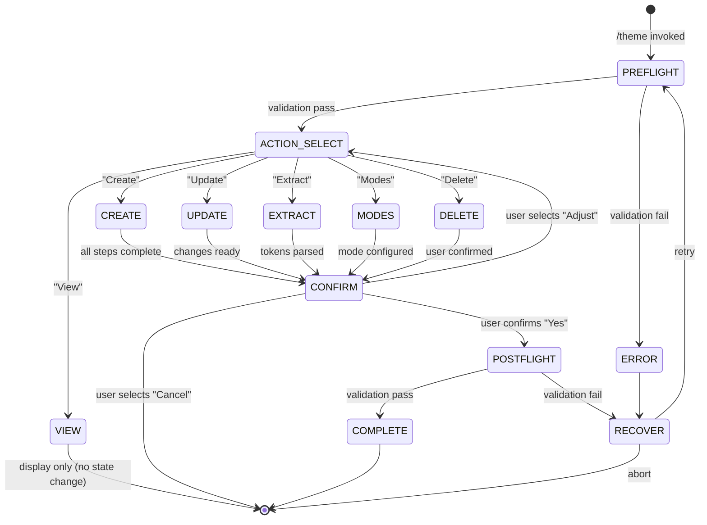

# Tokens

Manages the project design system: creating, viewing, updating design tokens, and dark/light mode configuration. Includes motion tokens (durations, easings) and interaction tokens (focus ring, hover, active states).

**Keywords**: design tokens, theme, colors, typography, spacing, breakpoints, dark mode, light mode, tailwind, css variables, design system, brand colors, font families, motion, animation, easing, transitions, interactions, focus ring, hover states

## Overview

This command manages the `theme` section in `.project/project.json` which contains design tokens (colors, typography, spacing, breakpoints, borderRadius, shadows, modes, cssVars). It can automatically extract tokens from existing Tailwind or CSS configuration.

**Output locatie:** `.project/project.json` → `theme` sectie

**References:**

- `skills/frontend-tokens/references/THEME_TEMPLATE.md` — Token categories and naming conventions
- `skills/shared/DESIGN.md` — Anti-patterns, OKLCH color advice, typography, motion, interaction states

## When to Use

- Setting up a design system for a new project
- Viewing or updating existing design tokens
- Extracting tokens from Tailwind/CSS config
- Adding or adjusting dark/light mode

---

## Theme JSON Schema

De `theme` sectie in `project.json` volgt dit schema:

```json
{
  "colors": {
    "main": [{ "token": "dark", "value": "#hex", "usage": "description" }],
    "accent": [
      { "token": "accent-primary", "value": "#hex", "usage": "description" }
    ],
    "semantic": [
      { "token": "success", "value": "#hex", "usage": "description" }
    ]
  },
  "typography": {
    "families": {
      "heading": "Font, fallback",
      "body": "Font, fallback",
      "mono": "Font, fallback"
    },
    "sizes": [
      {
        "token": "text-display",
        "size": "3rem",
        "lineHeight": "1.1",
        "usage": "Hero headings"
      },
      {
        "token": "text-title-l",
        "size": "2rem",
        "lineHeight": "1.2",
        "usage": "Page titles"
      },
      {
        "token": "text-body-m",
        "size": "1rem",
        "lineHeight": "1.5",
        "usage": "Body text"
      }
    ]
  },
  "spacing": {
    "base": "4px",
    "scale": [{ "token": "spacing-4", "value": "16px", "usage": "description" }]
  },
  "breakpoints": [
    { "token": "screen-md", "value": "768px", "target": "Tablets" }
  ],
  "borderRadius": [
    { "token": "rounded-md", "value": "0.375rem", "usage": "description" }
  ],
  "shadows": [{ "token": "shadow-md", "value": "...", "usage": "Cards" }],
  "motion": {
    "durations": [
      {
        "token": "duration-fast",
        "value": "200ms",
        "usage": "Tooltip, hover state"
      }
    ],
    "easings": [
      {
        "token": "ease-out",
        "value": "cubic-bezier(0.25, 1, 0.5, 1)",
        "usage": "Elements entering"
      }
    ]
  },
  "interactions": {
    "focusRing": {
      "width": "2px",
      "style": "solid",
      "color": "var(--color-accent-primary)",
      "offset": "2px"
    },
    "hover": {
      "transition": "var(--duration-fast) var(--ease-out)",
      "transform": "none"
    },
    "active": { "transform": "scale(0.98)" }
  },
  "modes": { "light": ":root { css }", "dark": ".dark { css }" },
  "cssVars": ":root { full css vars export }"
}
```

See `shared/DASHBOARD.md` for the complete `project.json` schema with all sections.

---

## Read/Write Protocol

### Reading

1. Read `.project/project.json`
2. Parse as JSON
3. Use `theme` section (may be empty/undefined)

### Writing

1. Read `.project/project.json` (or create new with empty schema if it doesn't exist)
2. Parse JSON
3. Mutate ONLY the `theme` section (do NOT overwrite other sections)
4. Write back as `JSON.stringify(data, null, 2)`

### Creating a new file

If `.project/project.json` does not exist, create with the empty schema from `shared/DASHBOARD.md`:

```json
{
  "concept": {
    "name": "",
    "pitch": "",
    "conceptFile": "project-concept.md",
    "content": ""
  },
  "theme": {},
  "stack": {
    "framework": "",
    "language": "",
    "styling": "",
    "db": "",
    "auth": "",
    "hosting": "",
    "packages": []
  },
  "data": { "entities": [] },
  "endpoints": [],
  "decisions": []
}
```

Then populate the `theme` section with the generated tokens.

---

## State Machine


```mermaid
stateDiagram-v2
    [*] --> PREFLIGHT: /theme invoked

    PREFLIGHT --> ACTION_SELECT: validation pass
    PREFLIGHT --> ERROR: validation fail

    ACTION_SELECT --> CREATE: "Create"
    ACTION_SELECT --> VIEW: "View"
    ACTION_SELECT --> UPDATE: "Update"
    ACTION_SELECT --> EXTRACT: "Extract"
    ACTION_SELECT --> MODES: "Modes"
    ACTION_SELECT --> DELETE: "Delete"

    CREATE --> CONFIRM: all steps complete
    VIEW --> [*]: display only (no state change)
    UPDATE --> CONFIRM: changes ready
    EXTRACT --> CONFIRM: tokens parsed
    MODES --> CONFIRM: mode configured
    DELETE --> CONFIRM: user confirmed

    CONFIRM --> POSTFLIGHT: user confirms "Yes"
    CONFIRM --> ACTION_SELECT: user selects "Adjust"
    CONFIRM --> [*]: user selects "Cancel"

    POSTFLIGHT --> COMPLETE: validation pass
    POSTFLIGHT --> RECOVER: validation fail

    COMPLETE --> [*]

    ERROR --> RECOVER
    RECOVER --> PREFLIGHT: retry
    RECOVER --> [*]: abort
```

**State Descriptions:**

- **PREFLIGHT**: Validate resources and dependencies
- **ACTION_SELECT**: User chooses CRUD operation
- **CREATE/UPDATE/EXTRACT/MODES/DELETE**: Execute selected operation
- **VIEW**: Read-only display (no state mutation)
- **CONFIRM**: User reviews and confirms changes
- **POSTFLIGHT**: Validate output
- **COMPLETE**: Success, prepare handoff
- **ERROR/RECOVER**: Handle failures

---

## Workflow

### PHASE 0: Pre-flight Validation

**Run these checks BEFORE the workflow starts.**

```
PRE-FLIGHT CHECK
════════════════════════════════════════════════
```

**1. Directory Check**

```bash
# Verify .project/ exists or can be created
```

```
Directory: [✓|✗] .project/ - [exists|created|error]
```

**2. Session Check**

```bash
# Check .project/session/devinfo.json
```

```
Session: [✓|✗] [New session | Continuing from {skill}]
Handoff: [✓|✗] [data available | not applicable]
```

**3. Conflict Check (for Create/Update)**

```bash
# Read .project/project.json → check if theme section is already populated
```

```
Conflicts: [✓|✗] project.json theme - [empty | has data (will warn) | file missing]
```

**Pre-flight Summary:**

```
════════════════════════════════════════════════
PRE-FLIGHT RESULT
════════════════════════════════════════════════
Directory:  [✓ PASS | ✗ FAIL]
Session:    [✓ PASS | ✗ FAIL]
Conflicts:  [✓ PASS | ⚠ WARNING | ✗ FAIL]

Status: [→ Ready to proceed | ⚠ Warning: {issue} | ✗ Cannot proceed]
════════════════════════════════════════════════
```

**On Failure:**

**AskUserQuestion:**

```yaml
header: "Pre-flight Failed"
question: "Pre-flight check failed: {reason}. How would you like to proceed?"
options:
  - label: "Fix and retry (Recommended)", description: "Resolve the issue and try again"
  - label: "Continue anyway", description: "Ignore warning and continue"
  - label: "Cancel", description: "Stop workflow"
multiSelect: false
```

---

### PHASE 1: Action Selection

**First check if project.json has a populated theme section:**

```bash
# Read .project/project.json → parse JSON → check theme section
```

**Design Principles Context (optional):**

Check `.project/project.json` → `design.principles`. If principles exist, show them as context before action selection:

```
DESIGN PRINCIPLES AVAILABLE
════════════════════════════════════════════════════════════════
- {principle.name}: {principle.description}
- {principle.name}: {principle.description}
════════════════════════════════════════════════════════════════

These principles are taken into account as suggestions for token choices.
```

Principles are advisory — use them to inform suggestions (e.g., if "Mobile-first" exists, suggest mobile-optimized breakpoints), but don't enforce.

**If theme section contains DATA (not empty):**

**Completeness check — run before the action menu is shown:**

Check which of the 10 expected sections are present in `theme`. A section counts as "present" if the key exists AND is not an empty object `{}`, empty array `[]`, or empty string `""`.

```
THEME STATUS
════════════════════════════════════════════════
  [✓|✗] colors
  [✓|✗] typography
  [✓|✗] spacing
  [✓|✗] breakpoints
  [✓|✗] borderRadius
  [✓|✗] shadows
  [✓|✗] motion
  [✓|✗] interactions
  [✓|✗] modes
  [✓|✗] cssVars

Complete: {N}/10 sections
════════════════════════════════════════════════
```

**If all sections present (N = 10):**

**AskUserQuestion:**

```yaml
header: "Theme"
question: "What would you like to do?"
options:
  - label: "View", description: "Show current design tokens"
  - label: "Update", description: "Modify existing tokens"
  - label: "Modes", description: "Manage dark/light mode"
  - label: "Delete", description: "Remove theme data"
multiSelect: false
```

**If sections are missing (N < 10):**

**AskUserQuestion:**

```yaml
header: "Theme"
question: "What would you like to do? (⚠ {10-N} sections missing: {missing_list})"
options:
  - label: "Fill in (Recommended)", description: "Add missing sections: {missing_list}"
  - label: "View", description: "Show current design tokens"
  - label: "Update", description: "Modify existing tokens"
  - label: "Modes", description: "Manage dark/light mode"
multiSelect: false
```

**If theme section is EMPTY or project.json does not exist:**

**AskUserQuestion:**

```yaml
header: "Theme"
question: "No theme found. What would you like to do?"
options:
  - label: "Create (Recommended)", description: "New theme with guided setup"
  - label: "Extract", description: "Retrieve tokens from existing Tailwind/CSS"
  - label: "Explain question", description: "Explain options"
multiSelect: false
```

---

### PHASE 2: Action Execution

#### Route: Fill In (Missing Sections)

Targets only the missing sections. For each missing section, run the corresponding step from the Create route:

| Missing Section | → Run Step                                                               |
| --------------- | ------------------------------------------------------------------------ |
| colors          | Step 1: Colors                                                           |
| typography      | Step 2: Typography                                                       |
| spacing         | Step 3: Spacing                                                          |
| breakpoints     | Step 4: Breakpoints                                                      |
| modes           | Step 5: Dark Mode                                                        |
| motion          | Step 6: Motion                                                           |
| interactions    | Step 7: Interactions                                                     |
| borderRadius    | Generate defaults (0.125rem, 0.25rem, 0.375rem, 0.5rem, 0.75rem, 9999px) |
| shadows         | Generate defaults (sm, md, lg, xl + glow with accent color)              |
| cssVars         | Auto-generate from all present token data                                |

Skip already-present sections. After filling in all missing sections:

1. Regenereer `cssVars` om nieuw toegevoegde tokens te bevatten
2. → Go to PHASE X: Post-flight Validation
3. → Go to X.6: Theme Infrastructure Sync
4. → Go to PHASE Y: Website Sync

---

#### Route: Create (New Theme)

**Step 1: Colors**

**AskUserQuestion:**

```yaml
header: "Colors"
question: "How would you like to define colors?"
options:
  - label: "Generate for me (Recommended)", description: "Describe what you're building, Claude picks suitable colors"
  - label: "Enter manually", description: "I'll provide hex values"
  - label: "Extract from config", description: "Pull from Tailwind/CSS"
  - label: "Explain question", description: "Explain what design tokens are"
multiSelect: false
```

**If "Generate for me":**

```
Briefly describe what you're building:

→ Example: "Healthcare dashboard for doctors"
→ Example: "E-commerce for luxury watches"
→ Example: "SaaS landing page for project management"
```

Based on the description, Claude generates a context-aware color palette:

- Main colors (dark, light, mid-gray, light-gray)
- Accent colors (primary, secondary, tertiary) suited to the industry/audience
- Semantic colors (success, warning, error, info)

```yaml
header: "Color palette"
question: "Does this color palette look right?"
options:
  - label: "Yes, continue (Recommended)", description: "Go to Step 2"
  - label: "Adjust", description: "Modify colors"
multiSelect: false
```

**Token Layer Explanation (after color confirmation)**

The generated colors follow a three-layer structure:

- **Primitives** (`main` and `accent` groups): direct hex/OKLCH values.
  CSS output: `--color-dark: #1a1a2e`, `--color-accent-primary: #3B82F6`
- **Semantics** (`semantic` group): reference a primitive via `var()`.
  CSS output: `--color-success: var(--color-accent-primary)` (not: `--color-success: #10B981`)
  Reason: if `accent-primary` changes, semantic tokens update automatically.

Follow this structure when building `cssVars` in Step 8.

**Color format**

Detect Tailwind version from `package.json` before generating colors:

- `"tailwindcss": "^4.*"` → use **OKLCH** (`oklch(L C H)`, e.g. `oklch(0.15 0.02 260)`)
- Tailwind 3 or no Tailwind → use **hex** (`#RRGGBB`)

OKLCH advantage: L-component directly adjustable for dark mode (same C/H = same hue, only lightness changes). Hex does not have this.

**If "Enter manually":**

```
Provide your primary colors (hex values):

1. Primary (main color for actions/buttons)
   → Example: #3B82F6

2. Secondary (supporting color)
   → Example: #10B981

3. Neutral (gray for text/borders)
   → Example: #6B7280
```

**If "Extract":** → Jump to Route: Extract

**Step 2: Typography**

**AskUserQuestion:**

```yaml
header: "Typography"
question: "Which fonts do you use?"
options:
  - label: "System fonts (Recommended)", description: "system-ui, sans-serif"
  - label: "Custom fonts", description: "Specify your own font families"
  - label: "Extract", description: "Pull from existing CSS"
multiSelect: false
```

**If "Custom fonts":**

```
Provide your font families:

1. Headings font
   → Example: "Inter", "Poppins"

2. Body font
   → Example: "Inter", system-ui

3. Mono font (optional, for code)
   → Example: "Fira Code", monospace

Type 's' for popular combinations
```

**Step 3: Spacing**

**AskUserQuestion:**

```yaml
header: "Spacing"
question: "Spacing scale preference?"
options:
  - label: "4px base (Recommended)", description: "4, 8, 12, 16, 20, 24, 32, 48, 64"
  - label: "8px base", description: "8, 16, 24, 32, 40, 48, 64, 80, 96"
  - label: "Custom", description: "Custom spacing scale"
  - label: "Explain question", description: "Explain what a spacing scale is"
multiSelect: false
```

**Step 4: Breakpoints**

**AskUserQuestion:**

```yaml
header: "Breakpoints"
question: "Responsive breakpoints?"
options:
  - label: "Tailwind defaults (Recommended)", description: "sm:640, md:768, lg:1024, xl:1280"
  - label: "Bootstrap style", description: "sm:576, md:768, lg:992, xl:1200"
  - label: "Custom", description: "Custom breakpoints"
  - label: "Explain question", description: "Explain how breakpoints work"
multiSelect: false
```

**Step 5: Dark Mode**

**AskUserQuestion:**

```yaml
header: "Dark Mode"
question: "Would you like to add dark mode to your theme?"
options:
  - label: "Yes, auto-generate (Recommended)", description: "Automatically generate dark colors based on your light palette"
  - label: "Manual", description: "Enter dark mode colors manually"
  - label: "No, light mode only", description: "Skip dark mode (can be added later via Modes)"
multiSelect: false
```

**If "Yes, auto-generate":**

- Invert background/foreground: `dark` <> `light`
- Adjust `mid-gray` and `light-gray` for dark context
- Retain accent colors but increase lightness (~10-15%) for readability on dark background
- **If OKLCH colors:** adjust only the L-component (e.g. `oklch(0.15 0.02 260)` → `oklch(0.90 0.02 260)` for background-inversion); C and H stay the same for color consistency
- Genereer `.dark` CSS block naast `:root`
- Toon preview (zelfde als Mode Comparison)

**If "Manual":**

```
Provide your dark mode colors (hex values):

1. Background (dark background)
   → Example: #1a1a2e

2. Foreground (light text on dark)
   → Example: #f5f5f5

3. Card background (slightly lighter than background)
   → Example: #2d2d44

4. Border color
   → Example: #3d3d5c
```

**If "No":**

- Skip dark mode
- `modes` only contains `light` key
- → Go to Step 6

**Step 6: Motion**

**AskUserQuestion:**

```yaml
header: "Motion"
question: "Motion tokens for animations and transitions?"
options:
  - label: "Defaults (Recommended)", description: "Standard durations (100/200/300/500ms) + smooth easings"
  - label: "Custom", description: "Specify custom durations and easing curves"
  - label: "No motion tokens", description: "Skip (can be added later via Update)"
  - label: "Explain question", description: "Explain what motion tokens are"
multiSelect: false
```

**If "Defaults":**

Generate standard motion tokens based on `shared/DESIGN.md`:

- Durations: `duration-instant` (100ms), `duration-fast` (200ms), `duration-normal` (300ms), `duration-slow` (500ms)
- Easings: `ease-out` (cubic-bezier(0.25, 1, 0.5, 1)), `ease-in` (cubic-bezier(0.7, 0, 0.84, 0)), `ease-in-out` (cubic-bezier(0.65, 0, 0.35, 1))

```yaml
header: "Motion Tokens"
question: "Do these motion tokens look right?"
options:
  - label: "Yes, continue (Recommended)", description: "Go to Step 7"
  - label: "Custom", description: "Specify custom durations/easings"
multiSelect: false
```

**If "Custom":**

```
Provide your motion preferences:

1. Speed preference?
   → "snappy" (shorter durations: 75/150/200/350ms)
   → "smooth" (standard: 100/200/300/500ms)
   → "relaxed" (longer durations: 150/250/400/600ms)

2. Easing style?
   → "smooth" (ease-out-quart — default)
   → "snappy" (ease-out-expo — confident, direct)
   → "custom" (custom cubic-bezier values)
```

**If "No motion tokens":**

- Skip motion, `motion` section becomes empty object
- → Go to Step 7

**Step 7: Interactions**

**AskUserQuestion:**

```yaml
header: "Interactions"
question: "Interaction tokens for hover, focus, and active states?"
options:
  - label: "Defaults (Recommended)", description: "Focus ring (2px accent), subtle hover transition, scale active"
  - label: "Custom", description: "Specify custom interaction styles"
  - label: "No interaction tokens", description: "Skip (can be added later via Update)"
  - label: "Explain question", description: "Explain what interaction tokens are"
multiSelect: false
```

**If "Defaults":**

Generate standard interaction tokens:

- Focus ring: `width: 2px`, `style: solid`, `color: var(--color-accent-primary)`, `offset: 2px`
- Hover: `transition: var(--duration-fast) var(--ease-out)`, `transform: none`
- Active: `transform: scale(0.98)`

```yaml
header: "Interaction Tokens"
question: "Do these interaction tokens look right?"
options:
  - label: "Yes, continue (Recommended)", description: "Go to Step 8"
  - label: "Custom", description: "Specify custom focus/hover/active styles"
multiSelect: false
```

**If "Custom":**

```
Provide your interaction preferences:

1. Focus ring
   → Color: accent-primary / custom
   → Width: 2px / custom
   → Offset: 2px / custom

2. Hover effect
   → Transition speed: instant / fast / normal
   → Transform: none / translateY(-1px) / scale(1.02)

3. Active/press effect
   → Transform: scale(0.98) / scale(0.95) / none
```

**If "No interaction tokens":**

- Skip interactions, `interactions` section becomes empty object
- → Go to Step 8

**CHECKPOINT: Design Tokens Summary**

Present all collected tokens as an overview before they are saved:

**Step 8: Confirmation**

```
THEME SUMMARY

| Category | Value |
|----------|-------|
| **Primary** | {color} |
| **Secondary** | {color} |
| **Neutral** | {color} |
| **Headings** | {font} |
| **Body** | {font} |
| **Spacing** | {scale} |
| **Breakpoints** | {list} |
| **Dark Mode** | {Yes (auto) / Yes (custom) / No} |
| **Motion** | {Defaults / Custom / None} |
| **Interactions** | {Defaults / Custom / None} |
```

**AskUserQuestion:**

```yaml
header: "Confirm"
question: "Create theme with these settings?"
options:
  - label: "Yes, create (Recommended)", description: "Write to .project/project.json (theme section)"
  - label: "Adjust", description: "Go back to make changes"
  - label: "Cancel", description: "Stop without creating"
multiSelect: false
```

**If "Yes":**

1. Consult `skills/frontend-tokens/references/THEME_TEMPLATE.md` for token categories and naming conventions
2. Build the theme JSON object according to the schema (see "Theme JSON Schema" above)
3. Populate `colors` (main, accent, semantic) with structured token objects
4. Populate `typography` with families and sizes. Use semantic names for `sizes`:
   `text-display` (largest heading), `text-title-l/m/s`, `text-headline-l/m/s`, `text-body-l/m/s`, `text-code`
   instead of size-based names like `text-xs/sm/base/lg`. Assign each name a concrete rem value suited to the project.
5. Populate `spacing` with base and scale
6. Populate `breakpoints`, `borderRadius`, `shadows`
7. **If dark mode chosen:** Populate `modes` with both `light` and `dark` CSS strings
8. **If no dark mode:** Populate `modes` with only the `light` key
9. **If motion chosen:** Populate `motion` with durations and easings
10. **If interactions chosen:** Populate `interactions` with focusRing, hover, active
11. Generate `cssVars` — full CSS variables string (all tokens incl. motion/interaction as `:root { ... }`)
12. Read `.project/project.json` (or create new with empty schema)
13. Set `theme` section → Write back as formatted JSON
14. → Go to PHASE X: Post-flight Validation
15. → Go to X.6: Theme Infrastructure Sync
16. → Go to PHASE Y: Website Sync

---

#### Route: View

1. Read `.project/project.json` → parse `theme` section
2. Parse and display in a clear table:

```
CURRENT THEME

## Colors
| Token | Value | Preview |
|-------|-------|---------|
| primary-500 | #3B82F6 | |
| secondary-500 | #10B981 | |
| ... | ... | ... |

## Typography
| Element | Font |
|---------|------|
| Headings | Inter |
| Body | system-ui |

## Spacing
| Token | Value |
|-------|-------|
| spacing-1 | 4px |
| spacing-2 | 8px |
| ... | ... |

## Breakpoints
| Name | Value |
|------|-------|
| sm | 640px |
| md | 768px |
| ... | ... |
```

3. **Completeness check:** check all 10 expected sections (colors, typography, spacing, breakpoints, borderRadius, shadows, motion, interactions, modes, cssVars). If sections are missing:

```
⚠ MISSING SECTIONS: {missing_list}
  Use "Fill in" to add missing sections.
```

**AskUserQuestion:**

If all sections present:

```yaml
header: "Action"
question: "What would you like to do?"
options:
  - label: "Done", description: "Return to conversation"
  - label: "Update", description: "Make changes"
  - label: "Export", description: "Show as CSS variables"
  - label: "Visual Preview", description: "Open theme preview in browser"
multiSelect: false
```

If sections are missing — add "Fill in":

```yaml
header: "Action"
question: "What would you like to do? (⚠ {N} sections missing)"
options:
  - label: "Fill in (Recommended)", description: "Add missing sections: {missing_list}"
  - label: "Done", description: "Return to conversation"
  - label: "Update", description: "Make changes"
  - label: "Export", description: "Show as CSS variables"
multiSelect: false
```

**If "Visual Preview":**

```
THEME PREVIEW
═════════════

Generating preview page...

1. Create temporary preview HTML:
   - Inject CSS variables from project.json theme.cssVars
   - Include color swatches, typography samples, spacing demo

2. Open in default browser:
   start [temp-path]/theme-preview.html

(If dark mode configured: include toggle button in preview)
```

---

#### Token Drift Check (shared helper)

Use before every Write on `theme.colors`, `theme.typography`, or `theme.spacing` where an **existing key** gets a different value (not purely additive).

**Additive = no drift-risk** (no check needed):

- Adding a new key to `colors` (e.g. `colors.brand-accent`)
- Adding a new size to `typography.sizes`

**Drift-risk = existing key changes** (run drift check):

- `colors.primary` value changes or is removed/renamed
- `typography.fontFamily` changes
- `spacing` scale changes significantly

**Drift-check steps:**

1. Read `backlog.html` → filter on `type === "PAGE" && (status === "DOING" || status === "DONE")`
2. If no affected pages → skip (no prompt)
3. With ≥1 affected page: show:

```
TOKEN DRIFT WARNING

Change:    {token-path}  {old value} → {new value}
Affected:  {N} PAGE-features (DOING/DONE)
           - {page-name}  ({status}, built {date})
           - ...

Pages using bg-{token} / text-{token} may break visually.
```

```yaml
header: "Token drift detected"
question: "How to proceed?"
options:
  - label: "Continue + log drift (Recommended)", description: "Write tokens, drift logged in devinfo.tokenDrift for later re-render"
  - label: "Update pages first", description: "Stop now — run /frontend-convert {page} patch on affected pages"
  - label: "Cancel", description: "No change written"
multiSelect: false
```

**On "Continue + log drift"**: write to `devinfo.tokenDrift`:

```json
{
  "tokenDrift": {
    "changedAt": "{ISO-timestamp}",
    "changes": [
      {
        "path": "{token-path}",
        "from": "{old value}",
        "to": "{new value}"
      }
    ],
    "affectedFeatures": ["{page-name-1}", "{page-name-2}"],
    "resolved": false
  }
}
```

Show after write:

```
Recommended follow-up per affected page:
  /frontend-convert {page} patch    (re-render with new tokens)
```

**On "Update pages first"** or **"Cancel"**: stop without Write.

---

#### Route: Update

**AskUserQuestion:**

```yaml
header: "Update"
question: "Which section would you like to update?"
options:
  - label: "Colors", description: "Adjust colors"
  - label: "Typography", description: "Adjust fonts"
  - label: "Spacing", description: "Adjust spacing scale"
  - label: "Breakpoints", description: "Adjust breakpoints"
  - label: "Motion", description: "Adjust durations and easings"
  - label: "Interactions", description: "Adjust focus ring, hover, active states"
  - label: "All", description: "Full reconfiguration"
multiSelect: true
```

**Per selected section:**

- Read current values from `project.json` → `theme` section
- Show current values
- Ask for new values (same flow as Create)
- Show diff preview
- **Drift check** (see "Token Drift Check" above) for colors/typography/spacing changes
- Confirm change
- Read project.json → update only changed theme subsections → Write back
- → Go to PHASE X: Post-flight Validation
- → Go to X.6: Theme Infrastructure Sync (update CSS variables / Tailwind config with changed tokens)
- → Go to PHASE Y: Website Sync (scan voor oude token waarden in componenten)

---

#### Route: Extract

**Step 1: Detection**

```bash
# Find configuration files
# - tailwind.config.js/ts/mjs
# - CSS files with :root variables
# - globals.css, variables.css, etc.
```

**Output:**

```
DETECTION RESULT

| Source | Status | Tokens |
|--------|--------|--------|
| tailwind.config.js | ✓ Found | ~{N} colors, spacing |
| src/styles/globals.css | ✓ Found | ~{N} CSS variables |
| src/index.css | ✗ No tokens | - |
```

**AskUserQuestion:**

```yaml
header: "Extract"
question: "Which sources to extract from?"
options:
  - label: "All sources (Recommended)", description: "Combine all found tokens"
  - label: "Tailwind only", description: "Only from tailwind config"
  - label: "CSS only", description: "Only :root variables"
multiSelect: false
```

**Step 2: Perform extraction**

1. Parse selected sources
2. Map to theme JSON structure (see schema above)
3. Show preview of extracted tokens
4. **Drift check** (see "Token Drift Check" above) — if extraction overwrites existing `colors`/`typography`/`spacing` keys
5. Ask for confirmation (same as Create Step 6)
6. Write to project.json theme section
7. → Go to PHASE X: Post-flight Validation
8. → Go to X.6: Theme Infrastructure Sync
9. → Go to PHASE Y: Website Sync

---

#### Route: Modes (Dark/Light)

**AskUserQuestion:**

```yaml
header: "Modes"
question: "Theme mode action?"
options:
  - label: "Add dark mode (Recommended)", description: "Add dark variant to current theme"
  - label: "Add light mode", description: "Add light variant"
  - label: "Remove mode", description: "Remove an existing mode"
  - label: "Switch mode", description: "Toggle default mode"
  - label: "Explain question", description: "Explain how modes work"
multiSelect: false
```

**If "Add dark mode":**

**AskUserQuestion:**

```yaml
header: "Dark Mode"
question: "How to generate dark mode colors?"
options:
  - label: "Auto-generate (Recommended)", description: "Automatically invert/adjust"
  - label: "Manual", description: "Specify dark colors yourself"
  - label: "Extract", description: "Pull from existing dark theme CSS"
  - label: "Explain question", description: "Tips for dark mode colors"
multiSelect: false
```

**If "Auto-generate":**

- Read current colors from project.json → theme.colors
- Generate dark variants of current colors
- Show preview
- Ask for confirmation
- Update project.json → theme.modes with dark key
- → Go to PHASE X: Post-flight Validation
- → Go to X.6: Theme Infrastructure Sync

#### Mode Comparison

After mode configuration, show side-by-side comparison:

```
MODE COMPARISON
═══════════════

1. Generate comparison HTML:
   - Left panel: Light mode
   - Right panel: Dark mode
   - Same content in both

2. Open in default browser:
   start [temp-path]/mode-comparison.html

Layout: [Light Mode] | [Dark Mode] side-by-side
```

**Output:**

```
MODE COMPARISON READY
─────────────────────
Colors compared:
  Background: #ffffff ↔ #1a1a2e
  Foreground: #1a1a2e ↔ #f5f5f5
  Primary:    #3B82F6 ↔ #60A5FA
  ...

Contrast check:
  Primary on background: 4.8:1 ✓ (AA pass)
  Text on background: 7.2:1 ✓ (AAA pass)

Opening comparison in browser...
```

**AskUserQuestion (after preview opens):**

```yaml
header: "Mode Preview"
question: "Review the light/dark comparison in browser. Satisfied?"
options:
  - label: "Yes, save (Recommended)", description: "Confirm mode configuration"
  - label: "Adjust", description: "Modify colors"
```

---

#### Route: Delete

**AskUserQuestion:**

```yaml
header: "Delete"
question: "Are you sure you want to delete the theme?"
options:
  - label: "Yes, remove", description: "Remove theme section from project.json"
  - label: "No, cancel (Recommended)", description: "Keep theme"
multiSelect: false
```

**If "Yes":**

1. Read `.project/project.json`
2. Set `theme` section to empty object `{}`
3. Write back
4. → Go to Output Format (show "THEME REMOVED")

---

### PHASE X: Post-flight Validation

**Run these checks AFTER every write operation (Create/Update/Extract/Modes).**

```
POST-FLIGHT CHECK
════════════════════════════════════════════════
```

**1. File Validation**

```
File: [✓|✗] .project/project.json - [exists|missing|empty]
Theme: [✓|✗] theme sectie - [populated|empty|missing]
Format: [✓|✗] JSON - [valid|corrupt]
```

**2. Content Validation**

```
Sections:
  [✓|✗] colors - [present|missing] (main, accent, semantic)
  [✓|✗] typography - [present|missing] (families, sizes)
  [✓|✗] spacing - [present|missing] (base, scale)
  [✓|✗] breakpoints - [present|missing]
  [✓|✗] borderRadius - [present|missing]
  [✓|✗] shadows - [present|missing]
  [✓|✗] motion - [present|skipped|missing] (durations, easings)
  [✓|✗] interactions - [present|skipped|missing] (focusRing, hover, active)
  [✓|✗] modes - [light only|light+dark|missing]
  [✓|✗] cssVars - [present|missing]
```

**3. Value Validation**

```
Colors:
  [✓|✗] All color values valid (#RRGGBB hex or oklch(L C H) format)
  [✓|✗] No empty values
  [✓|✗] Each color has token, value, usage
  [✓|⚠] Semantic tokens use var() refs — not raw hex (warning only: existing setups may have raw values)
  [✓|⚠] Semantic completeness — success, warning, error, info defined and mutually distinct (⚠ if one is missing or two use the same primitive ref)
Typography:
  [✓|✗] Font families have fallbacks
  [✓|✗] Sizes have token, size, lineHeight
Spacing:
  [✓|✗] All values numeric with unit
  [✓|✗] Scale entries have token, value, usage
Modes:
  [✓|✗] Light mode :root CSS present and valid
  [✓|✗] Dark mode .dark CSS present (if configured)
  [✓|✗] Dark mode contrast ratios acceptable (AA minimum)
  [✓|✗] No unfilled placeholders in mode CSS blocks
Motion (if configured):
  [✓|✗] Duration values end with 'ms' or 's'
  [✓|✗] Each duration has token, value, usage
  [✓|✗] Easing values are valid cubic-bezier or keyword
Interactions (if configured):
  [✓|✗] Focus ring has width, color, offset
  [✓|✗] Hover transition references valid motion tokens
  [✓|✗] Active transform is valid CSS transform
```

**4. Export Validation**

```
CSS Export:
  [✓|✗] cssVars field present and non-empty
  [✓|✗] :root block syntax valid
  [✓|✗] Matches structured token data
  [✓|✗] All variables populated (no {placeholders})
```

**5. JSON Integrity**

```
Integrity:
  [✓|✗] project.json is valid JSON
  [✓|✗] Other sections unchanged (concept, stack, data, endpoints, decisions)
  [✓|✗] Theme sectie matches schema
```

**Post-flight Summary:**

```
════════════════════════════════════════════════
POST-FLIGHT RESULT
════════════════════════════════════════════════
File:         [✓ PASS | ✗ FAIL]
Content:      [✓ PASS | ✗ FAIL] - {N}/{M} sections
Values:       [✓ PASS | ⚠ WARNINGS | ✗ FAIL]
Modes:        [✓ PASS | ⚠ Light only | ✗ FAIL] - {light|light+dark}
Motion:       [✓ PASS | ⚠ Skipped | ✗ FAIL]
Interactions: [✓ PASS | ⚠ Skipped | ✗ FAIL]
Export:       [✓ PASS | ✗ FAIL]
Integrity:    [✓ PASS | ✗ FAIL]

Status: [→ Complete | ⚠ Warnings: {list} | ✗ Recovery needed]
════════════════════════════════════════════════
```

**On Failure:**

**AskUserQuestion:**

```yaml
header: "Post-flight Failed"
question: "Validation found problems: {issues}. What now?"
options:
  - label: "Auto-fix (Recommended)", description: "Attempt automatic repair"
  - label: "Fix manually", description: "Review and fix problems"
  - label: "Ignore", description: "Accept output despite problems"
multiSelect: false
```

---

### X.6 Theme Infrastructure Sync (Create/Update only)

**Always runs after successful post-flight validation.** Ensures theme tokens are available in the project's styling infrastructure, not just in project.json.

**On Updates:** diff the old token values (before the update) against the new values. Use this diff to:

1. Only update changed CSS variables in the CSS/config file (not regenerate everything)
2. Show a list of changed tokens in the infrastructure sync output
3. Pass the old values to PHASE Y so it can also scan for old hex codes / rgba values in components

**Styling approach detectie:**

1. **Detect styling approach** from `package.json` + CSS files:
   - `tailwindcss` present → check for Tailwind 4 CSS-first OR classic config (see step 2)
   - Neither → CSS variables project

2. **Tailwind project:**
   - **Tailwind 4 (CSS-first):** Grep CSS files (globals.css, index.css) for `@theme inline`. If found: update the `:root` CSS variables in that file directly — this IS the Tailwind config in v4
     - Follow the same two-block order: primitives first, semantics with var() refs after
   - **Tailwind 3 (config-based):** Fall back to `tailwind.config.{js,ts,mjs}` when no `@theme inline` is present
   - Generate/update theme tokens:
     - `colors`: map color tokens to Tailwind color keys
     - `spacing`: map custom spacing tokens (skip if standard 4px scale)
     - `borderRadius`: map radius tokens
     - `boxShadow`: map shadow tokens
     - `fontFamily`: map typography families
   - Write back (preserve existing non-theme extensions)

3. **Non-Tailwind project:**
   - Generate/update CSS variables file (e.g., `src/styles/theme.css`) from `theme.cssVars`
   - CSS output must contain two consecutive blocks within `:root { ... }`:
     1. **Primitives** (main + accent colors, spacing, typography, motion): direct values
        `--color-dark: #1a1a2e;`
        `--color-accent-primary: #3B82F6;`
     2. **Semantics** (semantic colors): var() references to primitives
        `--color-success: var(--color-accent-primary);`
   - Generate semantics as `var(--color-{best-matching-primitive})` — match on color group or user intent
   - Check if it's imported in the main CSS entry point — if not, warn

4. **No project detected** (no package.json, no source files):
   - Skip with: `"No project detected — theme saved to project.json only."`

```
THEME INFRASTRUCTURE
════════════════════════════════════════════════
Approach: {Tailwind | CSS Variables | Skipped (no project)}
Config:   {tailwind.config updated | theme.css generated | —}
Tokens:   {N} color, {M} spacing, {P} typography, {Q} motion, {R} interaction tokens synced
════════════════════════════════════════════════
```

---

## PHASE Y: Website Sync (Create/Update only)

**After post-flight validation, check if existing website code uses the theme.**

Skip this phase entirely for View, Delete, or when no website code exists.

### Y.1 Scan for Website Code

```bash
# Glob for frontend source files
# src/**/*.{tsx,jsx,astro,vue}, app/**/*.{tsx,jsx}, *.html
```

- **No source files found** → skip with: `"No website code found — theme saved."` → proceed to Output Format
- **Source files found** → continue to Y.2

### Y.2 Theme Usage Analysis

Scan the codebase for theme integration:

1. **Tailwind config**: check `tailwind.config` for custom theme extensions matching project.json tokens
2. **CSS variables**: grep CSS files for `:root` blocks with CSS custom properties
3. **Component scan**: grep component files for:
   - Hardcoded color values: `#hex`, `rgb()`, `hsl()`, `bg-[#`, `text-[#`
   - Theme token usage: `bg-primary`, `text-accent`, `var(--`, theme class references
   - Hardcoded spacing: `p-[16px]`, `gap-[24px]`, arbitrary Tailwind values
   - **On Updates:** also scan for OLD token values from the X.6 diff. If a color changed from `#C89B3C` to `#0AC8B9`, scan for remaining `#C89B3C` references in component files and arbitrary Tailwind values (`bg-[#C89B3C]`, `shadow-[...rgba(200,155,60,...)]`, etc.)

**Tally results:**

```
WEBSITE SYNC CHECK
════════════════════════════════════════════════
Files scanned:         {N}
Theme integration:     {Tailwind config | CSS vars | None}
Hardcoded colors:      {N} files, {M} values
Old values found:      {N} files, {M} references (on updates)
Theme token usage:     {N} files, {M} references
════════════════════════════════════════════════
```

### Y.3 Sync Decision

**If code already uses theme correctly** (hardcoded count ≤ 3 AND theme tokens present):

```
✓ Theme in sync — website already uses design tokens.
```

→ Proceed to Output Format.

**If code has hardcoded values** (hardcoded count > 3 OR no theme token usage):

**AskUserQuestion:**

```yaml
header: "Website Sync"
question: "There are {N} files with hardcoded colors/styling that don't use the theme. Would you like to restyle?"
options:
  - label: "Yes, restyle all (Recommended)", description: "Replace hardcoded values with theme tokens in all {N} files"
  - label: "Extract as theme", description: "Formalize existing colors/values as theme tokens (reverse sync)"
  - label: "Show files", description: "View which files are affected before deciding"
  - label: "No, save theme only", description: "Skip — manual later"
multiSelect: false
```

**If "Extract as theme":** Run the Extract route (PHASE 2 → Route: Extract) to parse existing hardcoded color/spacing values from component files as theme tokens. After extraction, merge into `project.json#theme` (existing tokens take priority, extracted values fill gaps), re-run Theme Infrastructure Sync (X.6). This formalizes existing design choices rather than overwriting them.

**If "Show files":** Show file list with hardcoded value count per file, then re-ask with "Yes, restyle all" / "Select specific" / "No" options.

### Y.4 Restyle Execution (if approved)

**Step 1: Replace hardcoded values**

Per component file, replace hardcoded values with theme tokens:

| Hardcoded              | → Theme Token          |
| ---------------------- | ---------------------- |
| `bg-[#3B82F6]`         | `bg-primary`           |
| `text-[#1a1a2e]`       | `text-foreground`      |
| `p-[16px]`             | `p-4`                  |
| `gap-[32px]`           | `gap-8`                |
| `#hex` in inline style | `var(--color-primary)` |

Map each hardcoded value to the closest theme token by color distance / value match.

**Step 2: Verification**

After restyle, quick scan for remaining hardcoded values. Report count.

### Y.5 Restyle Report

```
WEBSITE SYNC
════════════════════════════════════════════════
Files scanned:    {N}
Files restyled:   {M}
Replacements:     {X} hardcoded values → theme tokens

Changed files:
  ✓ {file} — {N} colors restyled
  ✓ {file} — {N} colors + spacing
  ✓ tailwind.config.ts — theme extension added/updated

Remaining:            {R} hardcoded values (manual review recommended)
════════════════════════════════════════════════
```

---

## Output Format

**After successful action:**

```
THEME [CREATED/UPDATED/DELETED]

Location: .project/project.json (theme section)

| Category | Tokens |
|----------|--------|
| Colors | {N} (main: {n}, accent: {n}, semantic: {n}) |
| Typography | {N} (families: {n}, sizes: {n}) |
| Spacing | {N} |
| Breakpoints | {N} |
| Border Radius | {N} |
| Shadows | {N} |
| Motion | {N} (durations: {n}, easings: {n}) |
| Interactions | {N} (focusRing, hover, active) |
| Modes | {light/dark/both} |
| CSS Vars | {present/missing} |

Theme tokens ready in project.json for downstream consumption.

Next steps:
  1. /frontend-design {page} → build a page with these tokens
  2. /frontend-convert → convert a design with these tokens
  3. /frontend-tokens → view or update tokens later
  4. /frontend-check → check performance and SEO
  5. /frontend-check --scope=a11y → accessibility audit
```

---

## Error Recovery

> See also: `skills/shared/VALIDATION.md` for general recovery patterns.

### Extraction Failures

| Error                      | Recovery                                  |
| -------------------------- | ----------------------------------------- |
| Config file not found      | Offer manual path input                   |
| Parse error in config      | Show raw content, ask for format hint     |
| No tokens found            | Offer defaults + manual input             |
| Tailwind v3 vs v4 mismatch | Detect version, adjust parser accordingly |

### Write Failures

| Error                   | Recovery                           |
| ----------------------- | ---------------------------------- |
| Permission denied       | Suggest alternative path           |
| Disk full               | Warn, suggest cleanup              |
| Directory not creatable | Offer manual creation instructions |
| JSON parse error        | Backup corrupt file, create new    |

### Validation Failures

| Error            | Auto-fix              | Manual                       |
| ---------------- | --------------------- | ---------------------------- |
| Invalid hex code | Suggest closest valid | Show invalid, ask correction |
| Missing section  | Add with defaults     | Ask for values               |
| Empty value      | Use default           | Ask for value                |
| CSS syntax error | Re-generate cssVars   | Show error location          |
| Invalid JSON     | Re-generate file      | Show parse error             |

> **Note:** Rollback is handled by Claude Code's built-in "Rewind" function.

---

## DevInfo Integration

> See also: `skills/shared/DEVINFO.md` for the full specification.

### Session Initialization

At skill start:

```json
{
  "currentSkill": {
    "name": "frontend-tokens",
    "phase": "PREFLIGHT",
    "startedAt": "ISO timestamp"
  }
}
```

### Progress Updates

Update devinfo on every phase transition:

- `PREFLIGHT` → `ACTION_SELECT`
- `ACTION_SELECT` → `CREATE|UPDATE|EXTRACT|MODES|DELETE`
- `CONFIRM` → `POSTFLIGHT`
- `POSTFLIGHT` → `COMPLETE`

### Design Sync

Update `.project/project.json` → `design.principles` with concrete design system decisions:

1. Read `project.json` → `design.principles` (skip if design section doesn't exist)
2. Generate principle entries from the created/updated theme:
   - Spacing: e.g., `{ "name": "{base}px spacing scale", "description": "Base unit {base}px, scale: {scale values}" }`
   - Typography: e.g., `{ "name": "Font: {heading} + {body}", "description": "Headings: {heading family}, Body: {body family}" }`
   - Colors: e.g., `{ "name": "Color palette: {scheme}", "description": "Primary: {main color}, Accent: {accent color}" }`
3. Merge on `name` — add new principles, never overwrite existing user-defined principles
4. Write `project.json` (only mutate `design.principles`)

### Completion Handoff

On successful completion:

```json
{
  "handoff": {
    "from": "frontend-tokens",
    "to": null,
    "data": {
      "themeLocation": ".project/project.json#theme",
      "preset": "Anthropic Style | Custom",
      "tokens": {
        "colors": 12,
        "typography": 3,
        "spacing": 9
      },
      "modes": ["light", "dark"],
      "cssVarsPresent": true
    }
  }
}
```

---

## Cross-Skill Integration

### Output Contract (theme → wireframe)

This skill guarantees at completion:

- `.project/project.json` contains a populated `theme` section
- `theme` contains valid sections: colors, typography, spacing, breakpoints, borderRadius, shadows, modes, cssVars
- `theme.cssVars` contains a syntactically valid CSS variables string
- Handoff data available in devinfo

### Consumption by Other Skills

Other skills consume theme data as follows:

- **CSS variables needed:** Read `project.json` → `theme.cssVars`
- **Structured tokens needed:** Read `project.json` → `theme.colors`, `theme.typography`, etc.
- **Mode-specific CSS:** Read `project.json` → `theme.modes.light` / `theme.modes.dark`

---

## Resources

- `skills/frontend-tokens/references/THEME_TEMPLATE.md` - Reference for token categories and naming conventions
- `skills/shared/DASHBOARD.md` - project.json schema and merge strategy
- `skills/shared/VALIDATION.md` - Pre/post-flight validation templates
- `skills/shared/DEVINFO.md` - Session state tracking

---

## Restrictions

This command must **NEVER**:

- Create a theme without confirmation
- Overwrite an existing theme without a warning
- Guess tokens without a source (config or user input)
- Skip post-flight validation
- Overwrite other sections in project.json (only mutate `theme`)
- Restyle website code without explicit user confirmation
- Perform a restyle without first scanning for hardcoded values

This command must **ALWAYS**:

- Run pre-flight validation
- Use AskUserQuestion for all choices
- Show current values during updates
- Show a diff preview for changes
- Ask for confirmation before destructive actions
- Run post-flight validation
- Run the Website Sync check after Create/Update (PHASE Y)
- Update DevInfo on phase transitions
- JSON integrity check: other sections unchanged after write
