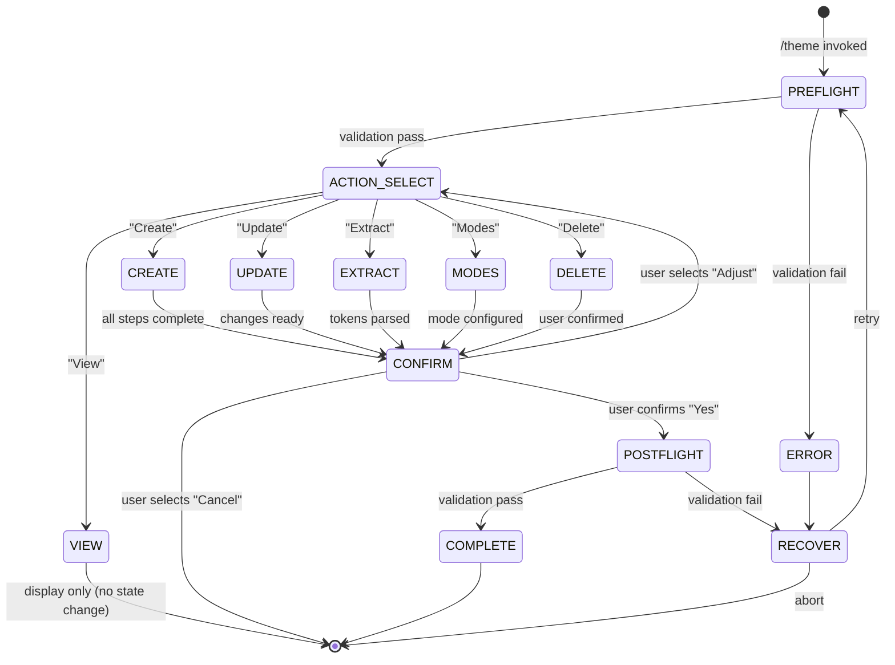

# Tokens

Manages the project design system: creating, viewing, updating design tokens, and dark/light mode configuration. Includes motion tokens (durations, easings) and interaction tokens (focus ring, hover, active states).

**Keywords**: design tokens, theme, colors, typography, spacing, breakpoints, dark mode, light mode, tailwind, css variables, design system, brand colors, font families, motion, animation, easing, transitions, interactions, focus ring, hover states

## Overview

This command manages the `theme` section in `.project/project.json` which contains design tokens (colors, typography, spacing, breakpoints, borderRadius, shadows, modes, cssVars). It can automatically extract tokens from existing Tailwind or CSS configuration.

**Output location:** `.project/project.json` → `theme` section

**References:**

- `skills/frontend-tokens/references/THEME_TEMPLATE.md` — Token categories and naming conventions
- `skills/shared/DESIGN.md` — Anti-patterns, OKLCH color advice, typography, motion, interaction states

## When to Use

- Setting up a design system for a new project
- Viewing or updating existing design tokens
- Extracting tokens from Tailwind/CSS config
- Adding or adjusting dark/light mode

---

## Theme JSON Schema

The `theme` section in `project.json` follows this schema:

```json
{
  "colors": {
    "main": [{ "token": "dark", "value": "#hex", "usage": "description" }],
    "accent": [
      { "token": "accent-primary", "value": "#hex", "usage": "description" }
    ],
    "semantic": [
      { "token": "success", "value": "#hex", "usage": "description" }
    ]
  },
  "typography": {
    "families": {
      "heading": "Font, fallback",
      "body": "Font, fallback",
      "mono": "Font, fallback"
    },
    "sizes": [
      {
        "token": "text-display",
        "size": "3rem",
        "lineHeight": "1.1",
        "usage": "Hero headings"
      },
      {
        "token": "text-title-l",
        "size": "2rem",
        "lineHeight": "1.2",
        "usage": "Page titles"
      },
      {
        "token": "text-body-m",
        "size": "1rem",
        "lineHeight": "1.5",
        "usage": "Body text"
      }
    ]
  },
  "spacing": {
    "base": "4px",
    "scale": [{ "token": "spacing-4", "value": "16px", "usage": "description" }]
  },
  "breakpoints": [
    { "token": "screen-md", "value": "768px", "target": "Tablets" }
  ],
  "borderRadius": [
    { "token": "rounded-md", "value": "0.375rem", "usage": "description" }
  ],
  "shadows": [{ "token": "shadow-md", "value": "...", "usage": "Cards" }],
  "motion": {
    "durations": [
      {
        "token": "duration-fast",
        "value": "200ms",
        "usage": "Tooltip, hover state"
      }
    ],
    "easings": [
      {
        "token": "ease-out",
        "value": "cubic-bezier(0.25, 1, 0.5, 1)",
        "usage": "Elements entering"
      }
    ]
  },
  "interactions": {
    "focusRing": {
      "width": "2px",
      "style": "solid",
      "color": "var(--color-accent-primary)",
      "offset": "2px"
    },
    "hover": {
      "transition": "var(--duration-fast) var(--ease-out)",
      "transform": "none"
    },
    "active": { "transform": "scale(0.98)" }
  },
  "modes": { "light": ":root { css }", "dark": ".dark { css }" },
  "cssVars": ":root { full css vars export }"
}
```

See `shared/DASHBOARD.md` for the complete `project.json` schema with all sections.

---

## Read/Write Protocol

### Reading

1. Read `.project/project.json`
2. Parse as JSON
3. Use `theme` section (may be empty/undefined)

### Writing

1. Read `.project/project.json` (or create new with empty schema if it doesn't exist)
2. Parse JSON
3. Mutate ONLY the `theme` section (do NOT overwrite other sections)
4. Write back as `JSON.stringify(data, null, 2)`

### Creating a new file

If `.project/project.json` does not exist, create with the empty schema from `shared/DASHBOARD.md`:

```json
{
  "concept": {
    "name": "",
    "pitch": "",
    "conceptFile": "project-seed.md",
    "content": ""
  },
  "theme": {},
  "stack": {
    "framework": "",
    "language": "",
    "styling": "",
    "db": "",
    "auth": "",
    "hosting": "",
    "packages": []
  },
  "data": { "entities": [] },
  "endpoints": [],
  "decisions": []
}
```

Then populate the `theme` section with the generated tokens.

---

## State Machine


```mermaid
stateDiagram-v2
    [*] --> PREFLIGHT: /theme invoked

    PREFLIGHT --> ACTION_SELECT: validation pass
    PREFLIGHT --> ERROR: validation fail

    ACTION_SELECT --> CREATE: "Create"
    ACTION_SELECT --> VIEW: "View"
    ACTION_SELECT --> UPDATE: "Update"
    ACTION_SELECT --> EXTRACT: "Extract"
    ACTION_SELECT --> MODES: "Modes"
    ACTION_SELECT --> DELETE: "Delete"

    CREATE --> CONFIRM: all steps complete
    VIEW --> [*]: display only (no state change)
    UPDATE --> CONFIRM: changes ready
    EXTRACT --> CONFIRM: tokens parsed
    MODES --> CONFIRM: mode configured
    DELETE --> CONFIRM: user confirmed

    CONFIRM --> POSTFLIGHT: user confirms "Yes"
    CONFIRM --> ACTION_SELECT: user selects "Adjust"
    CONFIRM --> [*]: user selects "Cancel"

    POSTFLIGHT --> COMPLETE: validation pass
    POSTFLIGHT --> RECOVER: validation fail

    COMPLETE --> [*]

    ERROR --> RECOVER
    RECOVER --> PREFLIGHT: retry
    RECOVER --> [*]: abort
```

**State Descriptions:**

- **PREFLIGHT**: Validate resources and dependencies
- **ACTION_SELECT**: User chooses CRUD operation
- **CREATE/UPDATE/EXTRACT/MODES/DELETE**: Execute selected operation
- **VIEW**: Read-only display (no state mutation)
- **CONFIRM**: User reviews and confirms changes
- **POSTFLIGHT**: Validate output
- **COMPLETE**: Success, prepare handoff
- **ERROR/RECOVER**: Handle failures

---

## Workflow

### PHASE 0: Pre-flight Validation

**Run these checks BEFORE the workflow starts.**

```
PRE-FLIGHT CHECK
════════════════════════════════════════════════
```

**1. Directory Check**

```bash
# Verify .project/ exists or can be created
```

```
Directory: [✓|✗] .project/ - [exists|created|error]
```

**2. Session Check**

```bash
# Check .project/session/devinfo.json
```

```
Session: [✓|✗] [New session | Continuing from {skill}]
Handoff: [✓|✗] [data available | not applicable]
```

**3. Conflict Check (for Create/Update)**

```bash
# Read .project/project.json → check if theme section is already populated
```

```
Conflicts: [✓|✗] project.json theme - [empty | has data (will warn) | file missing]
```

**4. Backlog Task Check**

See `shared/BACKLOG.md → Lifecycle Protocol → Read`. Filter: `type === "THEME" && transition === "defining"`.

→ Show: `Backlog: ✓ Task picked up — {taskName}` or `Backlog: ✓ No matching task in backlog (standalone run)`

**Pre-flight Summary:**

```
════════════════════════════════════════════════
PRE-FLIGHT RESULT
════════════════════════════════════════════════
Directory:  [✓ PASS | ✗ FAIL]
Session:    [✓ PASS | ✗ FAIL]
Conflicts:  [✓ PASS | ⚠ WARNING | ✗ FAIL]
Backlog:    [✓ Task picked up — {taskName} | ✓ Standalone run]

Status: [→ Ready to proceed | ⚠ Warning: {issue} | ✗ Cannot proceed]
════════════════════════════════════════════════
```

**On Failure:**

**AskUserQuestion:**

```yaml
header: "Pre-flight Failed"
question: "Pre-flight check failed: {reason}. How would you like to proceed?"
options:
  - label: "Fix and retry (Recommended)", description: "Resolve the issue and try again"
  - label: "Continue anyway", description: "Ignore warning and continue"
  - label: "Cancel", description: "Stop workflow"
multiSelect: false
```

---

### PHASE 1: Action Selection

**First check if project.json has a populated theme section:**

```bash
# Read .project/project.json → parse JSON → check theme section
```

**Design Principles Context (optional):**

Check `.project/project.json` → `design.principles`. If principles exist, show them as context before action selection:

```
DESIGN PRINCIPLES AVAILABLE
════════════════════════════════════════════════════════════════
- {principle.name}: {principle.description}
- {principle.name}: {principle.description}
════════════════════════════════════════════════════════════════

These principles are taken into account as suggestions for token choices.
```

Principles are advisory — use them to inform suggestions (e.g., if "Mobile-first" exists, suggest mobile-optimized breakpoints), but don't enforce.

**If theme section contains DATA (not empty):**

**Completeness check — run before the action menu is shown:**

Check which of the 10 expected sections are present in `theme`. A section counts as "present" if the key exists AND is not an empty object `{}`, empty array `[]`, or empty string `""`.

```
THEME STATUS
════════════════════════════════════════════════
  [✓|✗] colors
  [✓|✗] typography
  [✓|✗] spacing
  [✓|✗] breakpoints
  [✓|✗] borderRadius
  [✓|✗] shadows
  [✓|✗] motion
  [✓|✗] interactions
  [✓|✗] modes
  [✓|✗] cssVars

Complete: {N}/10 sections
════════════════════════════════════════════════
```

**If all sections present (N = 10):**

**AskUserQuestion:**

```yaml
header: "Theme"
question: "What would you like to do?"
options:
  - label: "View", description: "Show current design tokens"
  - label: "Update", description: "Modify existing tokens"
  - label: "Modes", description: "Manage dark/light mode"
  - label: "Delete", description: "Remove theme data"
multiSelect: false
```

**If sections are missing (N < 10):**

**AskUserQuestion:**

```yaml
header: "Theme"
question: "What would you like to do? (⚠ {10-N} sections missing: {missing_list})"
options:
  - label: "Fill in (Recommended)", description: "Add missing sections: {missing_list}"
  - label: "View", description: "Show current design tokens"
  - label: "Update", description: "Modify existing tokens"
  - label: "Modes", description: "Manage dark/light mode"
multiSelect: false
```

**If theme section is EMPTY or project.json does not exist:**

**AskUserQuestion:**

```yaml
header: "Theme"
question: "No theme found. What would you like to do?"
options:
  - label: "Create (Recommended)", description: "New theme with guided setup"
  - label: "Extract", description: "Retrieve tokens from existing Tailwind/CSS"
  - label: "Explain question", description: "Explain options"
multiSelect: false
```

---

### PHASE 2: Action Execution

#### Route: Fill In (Missing Sections)

Targets only the missing sections. For each missing section, run the corresponding step from the Create route:

| Missing Section | → Run Step                                                               |
| --------------- | ------------------------------------------------------------------------ |
| colors          | Step 1: Colors                                                           |
| typography      | Step 2: Typography                                                       |
| spacing         | Step 3: Spacing                                                          |
| breakpoints     | Step 4: Breakpoints                                                      |
| modes           | Step 5: Dark Mode                                                        |
| motion          | Step 6: Motion                                                           |
| interactions    | Step 7: Interactions                                                     |
| borderRadius    | Generate defaults (0.125rem, 0.25rem, 0.375rem, 0.5rem, 0.75rem, 9999px) |
| shadows         | Generate defaults (sm, md, lg, xl + glow with accent color)              |
| cssVars         | Auto-generate from all present token data                                |

Skip already-present sections. After filling in all missing sections:

1. Regenereer `cssVars` om nieuw toegevoegde tokens te bevatten
2. → Go to PHASE X: Post-flight Validation
3. → Go to X.6: Theme Infrastructure Sync
4. → Go to PHASE Y: Website Sync

---

#### Route: Create (New Theme)

> **Todo**: Read `.claude/skills/frontend-tokens/references/route-create.md`

---

#### Route: View

> **Todo**: Read `.claude/skills/frontend-tokens/references/route-view.md`

---

#### Token Drift Check (shared helper)

> **Todo**: Read `.claude/skills/frontend-tokens/references/token-drift.md`

---

#### Routes: Update, Extract, Modes, Delete

> **Todo**: Read `.claude/skills/frontend-tokens/references/route-secondary.md`

---

### PHASE X: Post-flight Validation + X.6 Theme Infrastructure Sync

> **Todo**: Read `.claude/skills/frontend-tokens/references/postflight-validation.md`

---

## PHASE Y: Website Sync (Create/Update only)

> **Todo**: Read `.claude/skills/frontend-tokens/references/website-sync.md`

---

## Output Format

**After successful Create/Update/Extract/Modes**, if PHASE 0 identified a backlog task:

See `shared/BACKLOG.md → Lifecycle Protocol → Write`. Set `status: "DONE"`, remove `transition`.

**After successful action:**

```
THEME [CREATED/UPDATED/DELETED]

Location: .project/project.json (theme section)

| Category | Tokens |
|----------|--------|
| Colors | {N} (main: {n}, accent: {n}, semantic: {n}) |
| Typography | {N} (families: {n}, sizes: {n}) |
| Spacing | {N} |
| Breakpoints | {N} |
| Border Radius | {N} |
| Shadows | {N} |
| Motion | {N} (durations: {n}, easings: {n}) |
| Interactions | {N} (focusRing, hover, active) |
| Modes | {light/dark/both} |
| CSS Vars | {present/missing} |

{If backlog task was found and marked DONE:}
Backlog: ✓ Task "{taskName}" → DONE

Theme tokens ready in project.json for downstream consumption.

Next steps:
  1. /frontend-design {page} → build a page with these tokens
  2. /frontend-convert → convert a design with these tokens
  3. /frontend-tokens → view or update tokens later
  4. /frontend-check → check performance and SEO
  5. /frontend-check --scope=a11y → accessibility audit
```

---

## Error Recovery

> See also: `skills/shared/VALIDATION.md` for general recovery patterns.

### Extraction Failures

| Error                      | Recovery                                  |
| -------------------------- | ----------------------------------------- |
| Config file not found      | Offer manual path input                   |
| Parse error in config      | Show raw content, ask for format hint     |
| No tokens found            | Offer defaults + manual input             |
| Tailwind v3 vs v4 mismatch | Detect version, adjust parser accordingly |

### Write Failures

| Error                   | Recovery                           |
| ----------------------- | ---------------------------------- |
| Permission denied       | Suggest alternative path           |
| Disk full               | Warn, suggest cleanup              |
| Directory not creatable | Offer manual creation instructions |
| JSON parse error        | Backup corrupt file, create new    |

### Validation Failures

| Error            | Auto-fix              | Manual                       |
| ---------------- | --------------------- | ---------------------------- |
| Invalid hex code | Suggest closest valid | Show invalid, ask correction |
| Missing section  | Add with defaults     | Ask for values               |
| Empty value      | Use default           | Ask for value                |
| CSS syntax error | Re-generate cssVars   | Show error location          |
| Invalid JSON     | Re-generate file      | Show parse error             |

> **Note:** Rollback is handled by Claude Code's built-in "Rewind" function.

---

## Cross-Skill Integration

### Output Contract (theme → wireframe)

This skill guarantees at completion:

- `.project/project.json` contains a populated `theme` section
- `theme` contains valid sections: colors, typography, spacing, breakpoints, borderRadius, shadows, modes, cssVars
- `theme.cssVars` contains a syntactically valid CSS variables string
- Handoff data available in devinfo

### Consumption by Other Skills

Other skills consume theme data as follows:

- **CSS variables needed:** Read `project.json` → `theme.cssVars`
- **Structured tokens needed:** Read `project.json` → `theme.colors`, `theme.typography`, etc.
- **Mode-specific CSS:** Read `project.json` → `theme.modes.light` / `theme.modes.dark`

---

## Resources

- `skills/frontend-tokens/references/THEME_TEMPLATE.md` - Reference for token categories and naming conventions
- `skills/shared/DASHBOARD.md` - project.json schema and merge strategy
- `skills/shared/VALIDATION.md` - Pre/post-flight validation templates
- `skills/shared/DEVINFO.md` - Session state tracking

---

## Restrictions

This command must **NEVER**:

- Create a theme without confirmation
- Overwrite an existing theme without a warning
- Guess tokens without a source (config or user input)
- Skip post-flight validation
- Overwrite other sections in project.json (only mutate `theme`)
- Restyle website code without explicit user confirmation
- Perform a restyle without first scanning for hardcoded values

This command must **ALWAYS**:

- Run pre-flight validation
- Use AskUserQuestion for all choices
- Show current values during updates
- Show a diff preview for changes
- Ask for confirmation before destructive actions
- Run post-flight validation
- Run the Website Sync check after Create/Update (PHASE Y)
- Update DevInfo on phase transitions
- JSON integrity check: other sections unchanged after write
- Follow `shared/BACKLOG.md → Lifecycle Protocol` for backlog tasks (read on PHASE 0, write status on success, no abort write needed)
