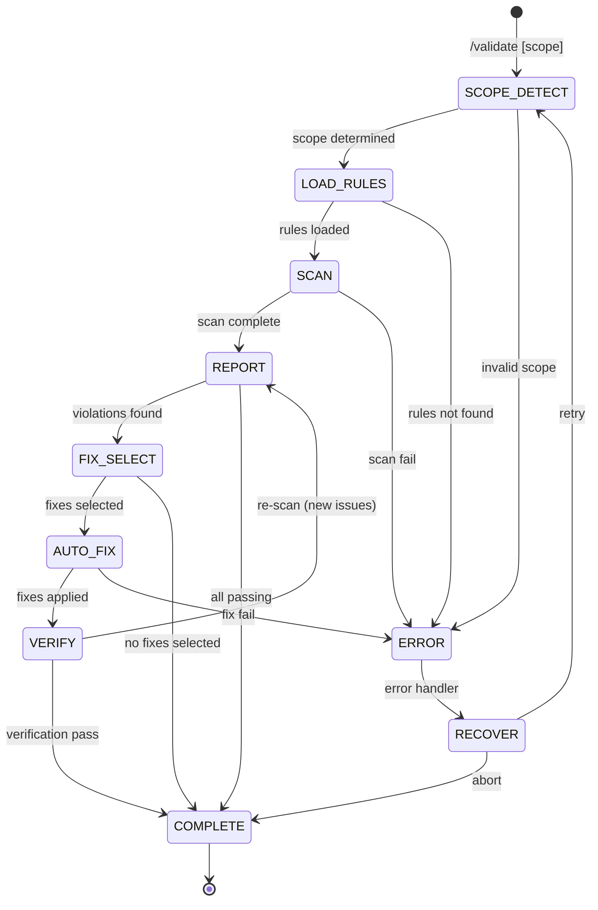

# Validate

Standalone rule checking for frontend code. Validates against `shared/RULES.md` coding standards and provides severity-scored reports with auto-fix capabilities.

---

## State Machine



---

## References

- `../shared/RULES.md` — Rule definitions (MUST source)
- `../shared/VALIDATION.md` — Validation patterns
- `../shared/PATTERNS.md` — Correct implementation patterns
- `../shared/PLAYWRIGHT.md` — Browser-based accessibility validation (H002, H004-H006)

---

## Usage

```
/validate [scope]

Scopes:
  file:[path]     Validate specific file(s)
  feature:[name]  Validate feature from dev-plan
  changed         Validate git diff files only
  all             Validate entire frontend codebase
  (no argument)   Interactive scope selection
```

---

## FASE 1: Scope Detection

### 1.1 Parse Scope Argument

| Argument | Action |
|----------|--------|
| `file:src/components/Header.tsx` | Single file |
| `file:src/components/*.tsx` | Glob pattern |
| `feature:authentication` | Look up in dev-plan, get file list |
| `changed` | Run `git diff --name-only` |
| `all` | Scan `src/` recursively |
| (none) | Ask user |

### 1.2 Interactive Scope Selection

Als geen argument:

```yaml
header: "Scope"
question: "Wat wil je valideren?"
options:
  - label: "Changed files (Recommended)"
    description: "Alleen gewijzigde bestanden (git diff)"
  - label: "Current feature"
    description: "Bestanden van actieve feature"
  - label: "All frontend"
    description: "Volledige src/ directory"
  - label: "Specific file"
    description: "Ik geef een path op"
```

### 1.3 File Discovery

```
SCOPE DETECTED
──────────────

Scope: changed
Files to validate: 5

src/components/Header.tsx
src/components/Header.module.css
src/pages/dashboard.tsx
src/hooks/useAuth.ts
src/styles/globals.css
```

**Validation:**

```
SCOPE VALIDATION
────────────────
[ ] At least 1 file found
[ ] All files exist
[ ] All files readable
[ ] File types supported (.tsx, .ts, .css, .html)
```

---

## FASE 2: Load Rules

### 2.1 Parse RULES.md

Load rules from `skills/shared/RULES.md`:

```
RULES LOADED
────────────

React/Next.js Rules:
├── MUST_DO (8 rules): R001-R008
├── SHOULD_DO (8 rules): R101-R108
└── AVOID (8 rules): R201-R208

HTML/CSS Rules:
├── MUST_DO (6 rules): H001-H006
├── SHOULD_DO (4 rules): H101-H104
└── AVOID (4 rules): H201-H204

TypeScript Rules:
├── MUST_DO (3 rules): T001-T003
├── SHOULD_DO (3 rules): T101-T103
└── AVOID (3 rules): T201-T203

Total: 47 rules (17 CRITICAL, 15 HIGH, 15 MEDIUM)
```

### 2.2 Rule Filtering

Per file type, filter relevante rules:

| File Type | Rule Categories |
|-----------|-----------------|
| `.tsx` | React, TypeScript |
| `.ts` | TypeScript |
| `.css` | HTML/CSS |
| `.html` | HTML/CSS |
| `.module.css` | HTML/CSS |

---

## FASE 3: Scan Files

### 3.1 Per-File Validation

Voor elk bestand, check alle relevante rules:

```
SCANNING
────────

[1/5] src/components/Header.tsx
      Checking 19 React/TS rules...
      ├── R001 (semantic HTML): PASS
      ├── R002 (alt text): PASS
      ├── R003 (no inline styles): FAIL (line 42)
      ├── R004 (form labels): N/A
      └── ... 15 more

[2/5] src/components/Header.module.css
      Checking 14 CSS rules...
```

### 3.2 Rule Checks

#### React Rules (R001-R208)

| Rule | Check Method |
|------|--------------|
| R001 | Parse JSX, check for `<div onClick>` without button role |
| R002 | Find `` tags, verify `alt` attribute present |
| R003 | Find `style={{}}` props with hardcoded values |
| R004 | Find `<input>`, verify paired `<label>` |
| R005 | Check interactive elements for `tabIndex`, `onKeyDown` |
| R006 | Find async components, verify ErrorBoundary wrapper |
| R007 | Find async functions, verify try/catch or .catch() |
| R008 | Search for API keys, tokens, secrets patterns |
| R101 | Measure prop count, flag >5 props |
| R102 | Check for logic in render (fetch, setState) |
| R103 | Find hardcoded px/rem values not in tokens |
| R104 | Check media queries for mobile-first pattern |
| R201 | Flag CSS-in-JS for theming variables |
| R206 | Find `.map()` with `key={index}` |
| R207 | Find `useEffect` computing derived state |

#### HTML/CSS Rules (H001-H204)

| Rule | Check Method |
|------|--------------|
| H001 | Validate HTML structure (DOCTYPE, html, head, body) |
| H002 | Count H1 elements (should be 1) |
| H003 | Check heading sequence (no H3 before H2) |
| H004 | Calculate color contrast ratios |
| H005 | Check UI element contrast (borders, icons) |
| H006 | Measure touch target sizes |
| H101 | Check for CSS custom properties usage |
| H201 | Flag `!important` usage |
| H202 | Find magic numbers (hardcoded values) |
| H203 | Find ID selectors for styling |
| H204 | Measure selector nesting depth |

#### TypeScript Rules (T001-T203)

| Rule | Check Method |
|------|--------------|
| T001 | Verify tsconfig strict mode |
| T002 | Find implicit `any` types |
| T003 | Find potential null pointer issues |
| T101 | Check for discriminated union opportunities |
| T201 | Find type assertions (`as`) |
| T202 | Find non-null assertions (`!`) |
| T203 | Find enum declarations |

### 3.3 Browser-Based Validation (Playwright)

Rules that require rendered page analysis for accurate validation:

| Rule | Why Browser Needed |
|------|-------------------|
| H002 | H1 can be dynamically rendered (React, Vue) |
| H004 | Color contrast requires computed styles |
| H005 | UI element contrast requires actual rendering |
| H006 | Touch targets require layout calculation |

**When to Use:**
- HTML files with dynamic content
- React/Vue components requiring dev server
- When static analysis is inconclusive

```
BROWSER VALIDATION (Playwright)
══════════════════════════════════════════════════════════════

Target: [file or URL]
Rules: H002, H004, H005, H006

1. browser_navigate → [target]
2. browser_snapshot → (analyze accessibility tree)
3. Parse returned accessibility tree:
   - H1 count (H002)
   - Interactive element sizes (H006)
   - Element hierarchy
4. browser_close

══════════════════════════════════════════════════════════════
```

**Accessibility Tree Analysis:**

```
H002 CHECK (One H1 per page)
────────────────────────────
Parse returned snapshot for:

H1 elements found: [N]
- "[H1 text 1]" at [location]
- "[H1 text 2]" at [location]

Result: [✓ PASS (1 H1) | ✗ FAIL (0 or >1 H1)]
```

```
H006 CHECK (Touch targets ≥44px)
────────────────────────────────
Interactive elements in snapshot:
- button: [N] found
- link: [N] found
- input: [N] found

Size verification:
[ ] All buttons minimum 44x44px
[ ] All interactive elements adequate touch area

Note: Sizes extracted from accessibility tree or
      require browser_evaluate for computed dimensions
```

**On Playwright Unavailable:**

```
⚠ Browser validation unavailable
  Using static HTML analysis only
  Rules H004, H005 require manual verification

  Suggestion: Enable Playwright for accurate validation
```

---

## FASE 4: Report

### 4.1 Summary Report

```
VALIDATION REPORT
─────────────────

Scope: changed (5 files)
Rules checked: 47
Time: 2.3s

╭────────────────────────────────────────╮
│  SCORE: 78% compliant                  │
│  Status: REVIEW (requires attention)   │
╰────────────────────────────────────────╯

By severity:
├── CRITICAL: 2 violations (must fix)
├── HIGH: 5 violations (should fix)
└── MEDIUM: 8 violations (consider)

By category:
├── React: 6 issues
├── CSS: 5 issues
└── TypeScript: 4 issues
```

### 4.2 Detailed Violations

```
CRITICAL VIOLATIONS (2)
───────────────────────

[R003] No inline styles for theming
       src/components/Header.tsx:42
       Found: style={{ color: '#fff', padding: '16px' }}
       Fix: Use CSS variables or Tailwind classes

[R008] No secrets in client code
       src/hooks/useAuth.ts:15
       Found: const API_KEY = "sk-..."
       Fix: Move to environment variable

HIGH VIOLATIONS (5)
───────────────────

[R103] Use design tokens for spacing
       src/components/Header.module.css:12
       Found: padding: 16px
       Fix: Use var(--spacing-4)

[H201] Avoid !important
       src/styles/globals.css:45
       Found: color: red !important
       Fix: Increase specificity or refactor cascade

... 3 more

MEDIUM VIOLATIONS (8)
─────────────────────

[R206] Index as key in lists
       src/pages/dashboard.tsx:78
       Found: items.map((item, i) => <Item key={i} />)
       Fix: Use stable unique ID

... 7 more
```

### 4.3 File-by-File Summary

```
PER-FILE SUMMARY
────────────────

src/components/Header.tsx
├── CRITICAL: 1 (R003)
├── HIGH: 2 (R103, R201)
└── MEDIUM: 1 (R206)

src/hooks/useAuth.ts
├── CRITICAL: 1 (R008)
├── HIGH: 0
└── MEDIUM: 2 (T201, T202)

src/styles/globals.css
├── CRITICAL: 0
├── HIGH: 3 (H201, H202, H203)
└── MEDIUM: 2 (H204)
```

---

## FASE 5: Fix Selection

### 5.1 Fix Prompt

```yaml
header: "Fixes"
question: "Welke issues wil je fixen?"
options:
  - label: "Critical only (Recommended)"
    description: "Fix 2 blocking issues"
  - label: "Critical + High"
    description: "Fix 7 important issues"
  - label: "All auto-fixable"
    description: "Fix 10 issues met auto-fix support"
  - label: "Let me pick"
    description: "Selecteer specifieke issues"
multiSelect: false
```

### 5.2 Auto-Fix Categories

| Category | Rules | Action |
|----------|-------|--------|
| Safe auto-fix | R002 (add alt=""), R105 (named export), H202 (closest token), T203 (enum to const) | Apply automatically |
| Guided fix | R001 (semantic element), R003 (extract to CSS var), R004 (generate label) | Show before/after, confirm |
| Manual only | R006 (ErrorBoundary), R008 (env vars), H004 (contrast) | Provide instructions |

---

## FASE 6: Auto-Fix

### 6.1 Safe Auto-Fixes

Apply without confirmation:

```
AUTO-FIX (Safe)
───────────────

[R002] Adding alt="" to decorative image
       src/components/Hero.tsx:23
       - 
       + 
       ✓ Applied

[H202] Replacing magic number with token
       src/components/Card.module.css:8
       - padding: 16px
       + padding: var(--spacing-4)
       ✓ Applied
```

### 6.2 Guided Fixes

Show diff, ask confirmation:

```
GUIDED FIX
──────────

[R003] Extract inline style to CSS variable

Current (Header.tsx:42):
  <div style={{ color: '#fff', padding: '16px' }}>

Proposed fix:
  1. Add to tokens.css:
     --header-text: #fff;
     --header-padding: var(--spacing-4);

  2. Update Header.tsx:
     <div className={styles.header}>

  3. Add to Header.module.css:
     .header {
       color: var(--header-text);
       padding: var(--header-padding);
     }
```

```yaml
header: "Apply fix?"
question: "Wil je deze refactor toepassen?"
options:
  - label: "Yes, apply (Recommended)"
    description: "Pas alle 3 wijzigingen toe"
  - label: "Modify first"
    description: "Ik pas de token names aan"
  - label: "Skip"
    description: "Sla deze fix over"
```

### 6.3 Manual Fix Instructions

```
MANUAL FIX REQUIRED
───────────────────

[R008] No secrets in client code
       src/hooks/useAuth.ts:15

This cannot be auto-fixed. Instructions:

1. Create/update .env.local:
   NEXT_PUBLIC_API_KEY=sk-...

2. Update useAuth.ts:
   - const API_KEY = "sk-..."
   + const API_KEY = process.env.NEXT_PUBLIC_API_KEY

3. Add to .gitignore (if not present):
   .env.local

4. Restart dev server to load env vars
```

### 6.4 Visual Fix Verification (Playwright)

For fixes affecting visual layout (H004, H005, H006):

```
VISUAL FIX VERIFICATION
══════════════════════════════════════════════════════════════

Fix applied: [Rule ID] [Description]
File: [path]

After fix:
1. browser_navigate → [updated file/URL]
2. browser_snapshot → (analyze accessibility tree)
3. browser_take_screenshot → (view visual result)
4. browser_close

Verify in returned data:
[ ] Visual layout preserved (no regression)
[ ] Fix correctly applied
[ ] Accessibility tree updated

Result: [✓ Fix verified | ✗ Issue persists | ⚠ Regression detected]
══════════════════════════════════════════════════════════════
```

**Regression Detection:**

If analysis shows unexpected changes:

```yaml
header: "Possible Regression"
question: "Fix voor [Rule] veroorzaakt mogelijk visuele veranderingen. Wat nu?"
options:
  - label: "Accepteer (Recommended)"
    description: "Veranderingen zijn verwacht"
  - label: "Rollback"
    description: "Maak fix ongedaan"
```

---

## FASE 7: Verification

### 7.1 Re-scan Fixed Files

```
VERIFICATION
────────────

Re-scanning 3 fixed files...

[R003] src/components/Header.tsx:42
       Previously: FAIL
       Now: PASS ✓

[H202] src/components/Card.module.css:8
       Previously: FAIL
       Now: PASS ✓

[R008] src/hooks/useAuth.ts:15
       Previously: FAIL
       Now: FAIL (manual fix required)
```

### 7.2 Final Report

```
VALIDATION COMPLETE
───────────────────

Before: 78% compliant (15 violations)
After: 93% compliant (2 violations)

Fixed: 13 issues
├── Auto-fixed: 8
├── Guided: 4
└── Skipped: 1

Remaining: 2 issues
├── [R008] Manual fix required (secrets)
└── [H004] Manual fix required (contrast)

Files modified: 4
├── src/components/Header.tsx
├── src/components/Header.module.css
├── src/components/Card.module.css
└── src/styles/tokens.css
```

---

## Error Recovery

### Rules Not Found

```
RECOVERY: Rules Missing
───────────────────────
1. Check skills/shared/RULES.md exists
2. Offer to use embedded fallback rules
3. Warn about incomplete validation
```

### Parse Failure

```
RECOVERY: File Parse Error
──────────────────────────
1. Log specific parse error
2. Skip unparseable file
3. Continue with remaining files
4. Report partial results
```

### Fix Failure

```
RECOVERY: Fix Application Error
───────────────────────────────
1. Rollback partial fix
2. Mark as "fix failed"
3. Continue with remaining fixes
4. Report in final summary
```

---

## DevInfo Integration

### Session Update

```json
{
  "currentSkill": {
    "name": "frontend-validate",
    "phase": "SCAN"
  },
  "progress": {
    "completedTasks": 3,
    "totalTasks": 5,
    "currentTask": "Scanning src/components/Header.tsx"
  }
}
```

### Validation Record

Store validation results for trend tracking:

```json
{
  "validation": {
    "lastCheck": {
      "timestamp": "2024-01-15T12:00:00Z",
      "scope": "changed",
      "filesChecked": 5,
      "score": 93,
      "violations": {
        "critical": 0,
        "high": 1,
        "medium": 1
      }
    }
  }
}
```

---

## CI Integration

### Pre-commit Hook

```bash
#!/bin/bash
# .husky/pre-commit

# Run validate on staged files
claude "/validate changed"

# Block commit if CRITICAL violations
if [ $? -ne 0 ]; then
  echo "Commit blocked: CRITICAL violations found"
  exit 1
fi
```

### GitHub Action

```yaml
# .github/workflows/validate.yml
name: Frontend Validation

on: [pull_request]

jobs:
  validate:
    runs-on: ubuntu-latest
    steps:
      - uses: actions/checkout@v4
      - name: Run validation
        run: claude "/validate changed"
      - name: Comment results
        if: failure()
        uses: actions/github-script@v7
        with:
          script: |
            github.rest.issues.createComment({
              issue_number: context.issue.number,
              body: 'Validation failed. Please fix CRITICAL issues.'
            })
```

---

## Notes

- Run validation early and often — catch issues before they compound
- CRITICAL rules block deployment; HIGH rules require justification
- Auto-fix is safe but always verify changes make sense in context
- Track validation scores over time to measure code health
- Use `/validate changed` as part of your commit workflow
