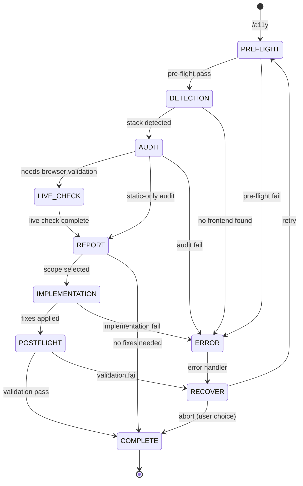

# Accessibility

Audit and fix accessibility issues in web applications. Scans source code for WCAG 2.1 AA violations, optionally validates in-browser via Playwright, and implements prioritized fixes.

**Verwante skills:** `/frontend-theme` · `/frontend-plan` · `/frontend-compose` · `/frontend-convert` · `/frontend-iterate` · `/frontend-audit`

---

## State Machine



---

## References

- `../shared/VALIDATION.md` — Pre-flight/post-flight patterns
- `../shared/RULES.md` — A-series (A001-A203), plus R001, R002, R004, R005, H004-H006
- `../shared/DEVINFO.md` — Session tracking protocol
- `../shared/PLAYWRIGHT.md` — Browser automation for live a11y checks (accessibility tree)
- `../shared/BACKLOG.md` — Backlog HTML+JSON format, read/write protocol

---

## FASE 0: Pre-flight Validation

**BEFORE any work, validate:**

### 0.1 Project Structure Check

```
PRE-FLIGHT: Project Structure
─────────────────────────────
[ ] Source directory exists (src/, app/, pages/, or HTML files)
[ ] Git repository status noted
```

**Failure action:**

```yaml
header: "Input Scope"
question: "Wat wil je scannen op accessibility issues?"
options:
  - label: "Hele project (Recommended)"
    description: "Scan alle componenten en pagina's"
  - label: "Specifiek bestand"
    description: "Geef een pad op"
  - label: "Specifieke component"
    description: "Geef een component naam op"
```

### 0.2 Scope Determination

If invoked with argument (`/a11y src/components/Dialog.tsx`), use that as scope.
Otherwise, default to project-wide scan.

**Output:**

```
PRE-FLIGHT COMPLETE
───────────────────
Scope: [Project-wide | File: path | Component: name]
Git: [Clean | Dirty - uncommitted changes]
Ready for: Stack detection
```

> **Note:** Rollback wordt afgehandeld door Claude Code's ingebouwde "Rewind" functie.

### 0.3 Backlog Stage (optional)

Read `.project/backlog.html` (if exists) → parse JSON from `<script id="backlog-data" type="application/json">...</script>`.

Match scope (file/component/project) against backlog items:

- Items with type `A11Y` and status `TODO`: set `status: "DOING"`, `stage: "testing"`, `date: today`. Write back.
- Items with type `PAGE` and `stage === "built"`: set `stage: "testing"`. Write back.

Set `data.updated` to today. Keep `<script>` tags intact.
If no match or no backlog: skip.

---

## FASE 1: Stack Detection

Scan the project to identify:

1. **Framework**: Next.js, Remix, Astro, plain React, Vue, static HTML, etc.
2. **Component library**: shadcn/ui, Radix, Headless UI, React Aria, MUI, Chakra, etc.
3. **Existing a11y setup**: eslint-plugin-jsx-a11y, axe-core, @testing-library, etc.

Detection checks:

- `package.json` dependencies for framework + component library identification
- `.eslintrc*` / `eslint.config.*` for existing a11y lint rules
- Test files for a11y test patterns (getByRole, axe, toHaveAccessibleName)

**Output:**

```
DETECTED
────────
Framework: [name] ([version])
UI Library: [name | none]
Existing a11y: [list what's present]
Lint rules: [jsx-a11y enabled | not found]
```

**Validation:**

```
DETECTION VALIDATION
────────────────────
[ ] Framework identified (not "unknown")
[ ] At least 1 source file found
[ ] Component library noted (or "none")
```

**On detection failure:**

```yaml
header: "Framework"
question: "Framework niet gedetecteerd. Wat is het framework?"
options:
  - label: "React (Next.js/Vite/CRA)"
    description: "JSX/TSX componenten"
  - label: "Vue"
    description: "Vue SFC componenten"
  - label: "Static HTML"
    description: "Gewone HTML pagina's"
  - label: "Astro/Svelte"
    description: "Island/component framework"
```

---

## FASE 2: Audit

Scan files within the determined scope for accessibility violations.

### 2.1 Static Analysis (always runs)

Scan source code organized by priority:

#### Critical (A-series MUST_DO + R-series a11y rules)

| Rule ID | What to scan                                                                                   |
| ------- | ---------------------------------------------------------------------------------------------- |
| A001    | Icon-only buttons without aria-label, images-as-buttons without alt                            |
| A002    | div/span with onClick without role + tabIndex + onKeyDown                                      |
| A003    | Dialog/modal components without focus trap (check for `<dialog>`, FocusTrap, or equivalent)    |
| A004    | Dialog onClose without focus restoration to trigger                                            |
| A005    | CSS `:focus { outline: none }` or Tailwind `outline-none` without `focus-visible:` replacement |
| A006    | aria-expanded/aria-selected/aria-pressed not synchronized with component state                 |
| R001    | Non-semantic interactive elements (div-as-button, div-as-link)                                 |
| R004    | Form inputs without associated labels (`<label>` with htmlFor or wrapping)                     |
| R005    | Interactive elements missing keyboard handlers                                                 |

#### High (A-series SHOULD_DO + existing rules)

| Rule ID | What to scan                                                     |
| ------- | ---------------------------------------------------------------- |
| A101    | Form error messages not linked via aria-describedby              |
| A102    | Required fields without aria-required                            |
| A103    | Dynamic error display without aria-live                          |
| A104    | Loading states without aria-busy                                 |
| H004    | Hardcoded color values where contrast is questionable            |
| H006    | Small click targets (check className patterns for narrow sizing) |

#### Medium (A-series AVOID)

| Rule ID | What to scan                                                                     |
| ------- | -------------------------------------------------------------------------------- |
| A201    | tabindex > 0 usage                                                               |
| A202    | aria-label on non-interactive elements (div, span, p)                            |
| A203    | `:focus { outline: none }` or `outline-none` without `focus-visible` replacement |

### 2.2 Live Check (Playwright — optional)

Triggered when dev server is available. Provides deeper validation via the accessibility tree.

```yaml
header: "Live Check"
question: "Wil je ook een browser-based check uitvoeren? (vereist draaiende dev server)"
options:
  - label: "Ja, met Playwright (Recommended)"
    description: "Check accessibility tree, focus order, ARIA in browser"
  - label: "Nee, alleen static analysis"
    description: "Sneller, maar minder compleet"
```

**If yes:**

```
LIVE CHECK (Playwright)
═══════════════════════════════════════════════════

Dev server: [http://localhost:3000]

Per route/page:
1. browser_navigate → [url]
2. browser_snapshot → (analyze accessibility tree)
3. browser_close

Parse returned snapshot for:
[ ] All interactive elements have accessible names
[ ] Heading hierarchy correct (H002/H003)
[ ] Form inputs have labels
[ ] No orphaned ARIA roles

═══════════════════════════════════════════════════
```

**On Playwright unavailable:**

Fall back to static analysis with warning:

```
Warning: Playwright unavailable - using static analysis only
  Live checks skipped: focus order, rendered ARIA tree
  Recommendation: Run with Playwright for browser-level validation
```

---

## FASE 3: Report

Present findings grouped by severity:

```
A11Y AUDIT REPORT
─────────────────

Framework: [name]
Scope: [Project-wide | File: path]
Files scanned: [count]
Score: [X/Y checks passed]

CRITICAL ([count])
──────────────────
[A001] Missing accessible name: [file:line] — <button> without label
[A002] div-as-button: [file:line] — <div onClick> without keyboard support
[R004] Missing form label: [file:line] — <input> without label

HIGH ([count])
──────────────
[A101] Error not linked: [file:line] — missing aria-describedby
[A103] No live region: [file:line] — dynamic error without aria-live

MEDIUM ([count])
────────────────
[A201] tabindex > 0: [file:line] — disrupts tab order

PASSING ([count])
─────────────────
✓ Form labels present
✓ Focus indicators visible
✓ No focus traps detected
```

Use **AskUserQuestion**:

```yaml
header: "Fix scope"
question: "Welke issues wil je fixen?"
options:
  - label: "Critical only (Recommended)"
    description: "Fix alleen blokkerende accessibility issues"
  - label: "Critical + High"
    description: "Fix alle impactvolle issues"
  - label: "Alles"
    description: "Alle a11y verbeteringen inclusief medium"
  - label: "Laat mij kiezen"
    description: "Ik selecteer specifieke issues"
multiSelect: false
```

---

## FASE 4: Implementation

For each selected issue, implement the fix. Order by impact:

### Implementation Order

1. Accessible names (aria-label, aria-labelledby)
2. Semantic element replacements (div → button)
3. Keyboard handlers (onKeyDown for Enter/Space)
4. Focus management (focus trap, focus restoration)
5. ARIA state synchronization
6. Form error linkage (aria-describedby)
7. Live regions (aria-live)

### Per Fix

1. Show what will change (file + diff preview)
2. Implement the change
3. Mark as done

### Progress Tracking

```
IMPLEMENTATION PROGRESS
───────────────────────
[✓] Accessible names (3/3 elements)
[✓] Semantic elements (2/2 replacements)
[▸] Keyboard handlers (1/4 elements)
[ ] Focus management
[ ] ARIA states
[ ] Form error linkage
```

### Constraints

- **Minimal changes only** — do not refactor unrelated code
- **No new dependencies** — do not add libraries the project doesn't already use
- **Native HTML first** — prefer `<button>`, `<dialog>`, `<label>` over ARIA workarounds
- **No component library migration** — work within the existing stack

---

## FASE 5: Post-flight Verification

**AFTER implementation, verify:**

### 5.1 File Validation

```
POST-FLIGHT: Files
──────────────────
[ ] All modified files exist
[ ] All modified files valid syntax
[ ] No accidental deletions
```

### 5.2 Fix Verification

```
POST-FLIGHT: Fixes
──────────────────
[ ] Each CRITICAL fix applied and verifiable
[ ] Each HIGH fix applied (if selected)
[ ] No new issues introduced
```

### 5.3 Live Verification (Playwright — optional)

If live check was used in FASE 2, re-verify:

```
POST-FLIGHT: Live Verification
──────────────────────────────
[ ] Dev server running
[ ] Accessibility tree shows improvements
[ ] Focus order correct after changes
```

### 5.4 Build Check (Optional)

Als TypeScript project:

```bash
npx tsc --noEmit
```

**On post-flight failure:**

```yaml
header: "Verification"
question: "[N] fixes konden niet geverifieerd worden. Hoe doorgaan?"
options:
  - label: "Review failures (Recommended)"
    description: "Bekijk welke fixes niet werkten"
  - label: "Retry failed fixes"
    description: "Probeer gefaalde fixes opnieuw"
  - label: "Keep changes"
    description: "Accepteer huidige state"
```

---

## FASE 6: Completion

After all fixes are implemented and validated:

### 6.1 Backlog Completion Sync

1. If a backlog item was tagged as "testing" in FASE 0:
   - Read `.project/backlog.html` → parse JSON
   - Find the feature → set `status: "DONE"`, remove `stage` field, `data.updated` to today
   - Write back via Edit (keep `<script>` tags intact)
   - Sync to `project.json` `features[]`: merge feature with `status: "DONE"`

2. If new accessibility issues were found that don't exist in the backlog:
   - Add each as: `{ "name": "{issue-kebab}", "type": "A11Y", "status": "TODO", "phase": "P3", "description": "{WCAG criterion}: {issue description}", "dependency": null }`
   - Report: "{N} new A11Y items added to backlog"

### 6.2 Summary

```
A11Y COMPLETE
─────────────

Implemented: [count] fixes
─────────────────────────
[A001] Added aria-label to 3 icon buttons
[A002] Replaced 2 div-as-button with <button>
[A003] Added focus trap to ConfirmDialog
[A101] Linked 5 error messages via aria-describedby

Files modified: [count]
- src/components/Button.tsx
- src/components/ConfirmDialog.tsx
- src/components/LoginForm.tsx

Remaining: [count] items not selected
- [A201] tabindex cleanup (medium)
```

---

## Error Recovery

### Stack Detection Failure

```
RECOVERY: Stack Detection
─────────────────────────
1. Check package.json manually
2. Ask user to specify framework
3. Use generic HTML a11y patterns
```

### Playwright Failure

```
RECOVERY: Playwright Unavailable
─────────────────────────────────
1. Fall back to static analysis
2. Warn user about reduced coverage
3. Continue with source-level checks
```

### Implementation Failure

```
RECOVERY: Fix Application
─────────────────────────
1. Log specific error
2. Skip failed fix
3. Continue with remaining fixes
4. Report partial success
```

> **Note:** Rollback wordt afgehandeld door Claude Code's ingebouwde "Rewind" functie.

---

## DevInfo Integration

### Session Update (bij elke phase transition)

```json
{
  "currentSkill": {
    "name": "frontend-wcag",
    "phase": "AUDIT"
  },
  "progress": {
    "completedTasks": 2,
    "totalTasks": 6,
    "currentTask": "Scanning files for a11y issues"
  }
}
```

### Completion Handoff

```json
{
  "handoff": {
    "from": "frontend-wcag",
    "to": null,
    "data": {
      "fixesApplied": 8,
      "framework": "react",
      "filesScanned": 24
    }
  }
}
```

---

## Notes

- Prefer native HTML over ARIA workarounds — `<button>` over `<div role="button">`
- Component libraries (Radix, React Aria, Headless UI) already handle many a11y patterns — check before adding manual ARIA
- Never implement a11y fixes that break existing functionality
- Always present the audit report before implementing any fixes
