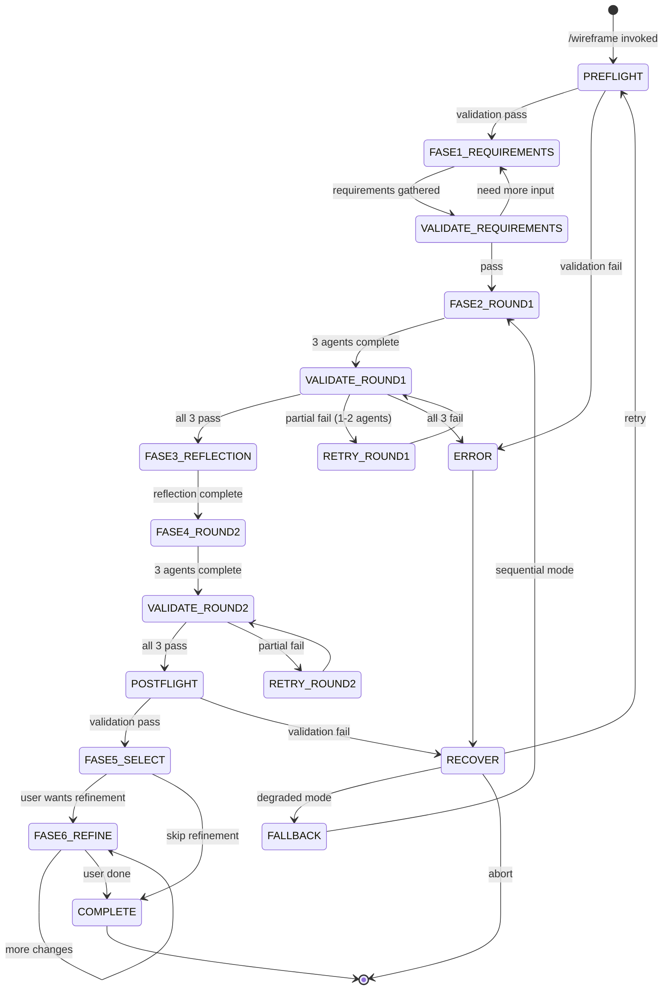
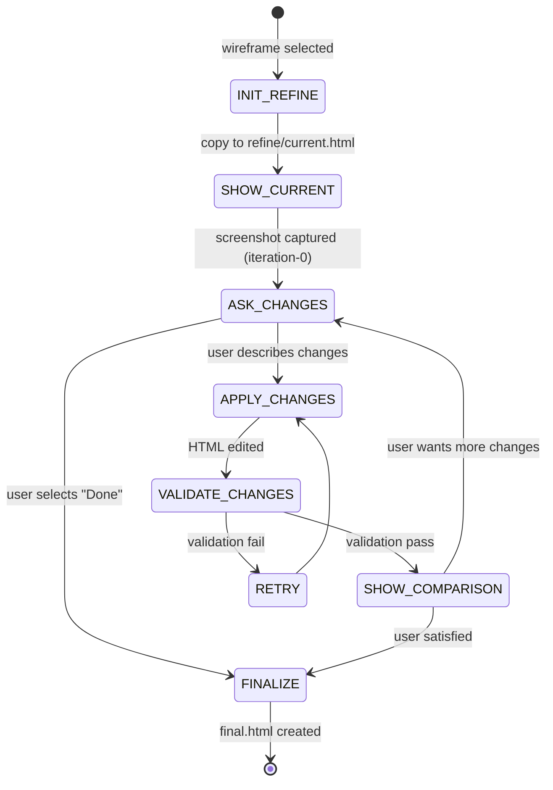

# Wireframe

Generate multiple low-fidelity wireframe sketches using 3 parallel design agents, each with a unique philosophy. Agents visually review their own work via screenshots and iterate to create improved versions.

**Keywords**: wireframe, mockup, prototype, layout, UI design, UX, mobile, desktop, atomic design, storybook, low-fidelity, parallel agents, design variants

## When to Use

- Planning page layouts before coding
- Exploring different layout options
- Before starting `/style` workflow
- Need diverse design perspectives

---

## State Machine



**State Descriptions:**
- **PREFLIGHT**: Validate theme, directories, template, agent capability
- **FASE1_REQUIREMENTS**: Gather user requirements via modals
- **VALIDATE_REQUIREMENTS**: Check requirements completeness
- **FASE2_ROUND1**: Spawn 3 parallel agents for v1 wireframes
- **VALIDATE_ROUND1**: Verify all 3 v1 files exist and valid
- **RETRY_ROUND1**: Retry failed agents only
- **FASE3_REFLECTION**: Sequential thinking analysis of v1
- **FASE4_ROUND2**: Spawn 3 parallel agents for v2 wireframes
- **VALIDATE_ROUND2**: Verify all 3 v2 files exist and valid
- **POSTFLIGHT**: Final validation of all 6 wireframes
- **FASE5_SELECT**: User selects preferred wireframe
- **FASE6_REFINE**: Iterative refinement loop (text-based tweaks)
- **COMPLETE**: Create final.html and prepare handoff to /style
- **FALLBACK**: Degraded sequential mode

---

## Process Overview

```
FASE 0.5: Pre-flight Validation
    ↓
FASE 1: Requirements & Research
    ↓
FASE 2: Round 1 - 3 agents create v1 wireframes (parallel)
    ↓
    [Validate Round 1]
    ↓
FASE 3: Visual Reflection (sequential thinking)
    ↓
FASE 4: Round 2 - 3 agents create v2 wireframes (parallel)
    ↓
    [Validate Round 2]
    ↓
FASE 5: Open first wireframe + Ask for selection
    ↓
FASE 5.5: Final Post-flight Validation
```

## Resources

This skill includes pre-researched reference files for fast execution:

| File | Description |
|------|-------------|
| `references/html-template.html` | Single-view template (phone OR desktop) |
| `references/html-template-responsive.html` | **RECOMMENDED** Dual-view template (phone + desktop side-by-side) |
| `references/mobile-patterns.md` | Touch targets, navigation, layouts, forms for mobile |
| `references/desktop-patterns.md` | Navigation, grids, interactions, data display for desktop |
| `references/page-types.md` | Structures for landing, dashboard, form, list, detail, settings |

---

## FASE 0.5: Pre-flight Validation

> **CRITICAL:** Run these checks BEFORE spawning expensive parallel agents.

```
PRE-FLIGHT CHECK
════════════════════════════════════════════════════════════════
```

### 1. Theme Dependency Check

```bash
# Check .workspace/config/THEME.md
```

```
Theme: [✓|✗] THEME.md - [exists|missing]
  → If exists: [valid|corrupt]
  → Tokens: colors={N}, typography={N}, spacing={N}
```

### 2. Output Directory Check

```bash
# Check .workspace/wireframes/[page-name]/
```

```
Directory: [✓|✗] .workspace/wireframes/ - [exists|created|error]
Page dir: [✓|✗] [page-name]/ - [available|exists (conflict)|error]
```

### 3. Agent Capability Check

```
Task tool: [✓|✗] - [available|unavailable]
Parallel mode: [✓|✗] - [supported|fallback to sequential]
```

### 4. Template Validation

```bash
# Read and validate references/html-template.html
```

```
Template: [✓|✗] html-template.html - [valid|missing|corrupt]
Placeholders: [✓|✗] All required placeholders present
  - {{PAGE_NAME}}: [✓|✗]
  - {{WIREFRAME_CONTENT}}: [✓|✗]
  - {{COMPONENT_STYLES}}: [✓|✗]
  - {{THEME_VARIABLES}}: [✓|✗]
```

### 5. Session Check

```
Session: [✓|✗] [New session | Continuing from {skill}]
Handoff: [✓|✗] [theme data available | not applicable]
```

### Pre-flight Samenvatting

```
════════════════════════════════════════════════════════════════
PRE-FLIGHT RESULT
════════════════════════════════════════════════════════════════
Theme:      [✓ PASS | ⚠ MISSING | ✗ CORRUPT]
Directory:  [✓ PASS | ⚠ CONFLICT | ✗ FAIL]
Agents:     [✓ PARALLEL | ⚠ SEQUENTIAL | ✗ UNAVAILABLE]
Template:   [✓ PASS | ✗ FAIL]

Status: [→ Ready for parallel agents | ⚠ Degraded mode | ✗ Cannot proceed]
════════════════════════════════════════════════════════════════
```

### On Theme Missing

```yaml
header: "Theme Missing"
question: "Geen THEME.md gevonden. Hoe wil je doorgaan?"
options:
  - label: "Run /theme eerst (Recommended)", description: "Maak theme tokens aan"
  - label: "Grayscale wireframes", description: "Standaard low-fidelity zonder theme"
  - label: "Brand preset kiezen", description: "Gebruik preset uit brand-presets.md"
  - label: "Annuleren", description: "Stop workflow"
multiSelect: false
```

### On Directory Conflict

```yaml
header: "Directory Conflict"
question: "Wireframes voor [page-name] bestaan al. Wat nu?"
options:
  - label: "Overschrijven (Recommended)", description: "Vervang bestaande wireframes"
  - label: "Nieuwe naam", description: "Maak [page-name]-v2 directory"
  - label: "Bekijk bestaande", description: "Open bestaande wireframes eerst"
  - label: "Annuleren", description: "Stop workflow"
multiSelect: false
```

### On Agent Unavailable

```yaml
header: "Agent Mode"
question: "Task tool beperkt beschikbaar. Hoe doorgaan?"
options:
  - label: "Sequential mode (Recommended)", description: "3 agents achter elkaar i.p.v. parallel"
  - label: "Single agent", description: "Eén agent maakt 3 stijlen"
  - label: "Annuleren", description: "Stop workflow"
multiSelect: false
```

---

## FASE 1: Requirements Gathering

> **Doel:** Inventariseer WAT er op de pagina moet voordat agents starten.
> De output is een requirements document dat agents gebruiken.

---

### Step 1.1: Open Beschrijving

Start met een open vraag om de echte intentie te vangen:

```yaml
header: "Beschrijving"
question: "Beschrijf wat deze pagina moet doen en voor wie het is:"
options: []
# Tekst input - laat gebruiker in eigen woorden beschrijven
```

**Voorbeelden van goede input:**
- "Een dashboard voor marketing managers om campagne ROI te monitoren"
- "Checkout flow voor een e-commerce site met payment options"
- "Settings pagina waar users hun profiel en notificaties kunnen aanpassen"

---

### Step 1.2: Context Scan (Automatisch)

Scan de codebase voor hints (als in een project):

```
CONTEXT SCAN
────────────
```

**Checks:**
```bash
# Check package.json voor app type
# Check src/pages of app/ voor bestaande routes
# Check API routes voor beschikbare data endpoints
# Check types/ voor data models
# Check components/ voor herbruikbare UI
```

**Output:**

```
App type: [E-commerce | SaaS | Blog | Portfolio | Admin | Unknown]
Framework: [Next.js App Router | Next.js Pages | Remix | etc.]
Existing pages: [lijst van routes]
API endpoints: [relevante endpoints]
Reusable components: [bestaande UI components]

Suggestion: Based on context, this looks like a [type] page.
```

---

### Step 1.3: Paginatype Bevestiging

Op basis van beschrijving + context scan:

```yaml
header: "Paginatype"
question: "Je beschreef [samenvatting]. Is dit een...?"
options:
  - label: "Dashboard", description: "Overzicht met metrics, grafieken, status"
  - label: "Landing", description: "Marketing pagina met hero en CTA"
  - label: "Formulier", description: "Data invoer met validatie"
  - label: "Lijst/Overzicht", description: "Items met filtering en sortering"
  - label: "Detail", description: "Detailweergave van één item"
  - label: "Instellingen", description: "Configuratie en voorkeuren"
  - label: "Checkout/Flow", description: "Multi-step process"
  - label: "Anders", description: "Ik beschrijf het zelf"
multiSelect: false
```

---

### Step 1.4: Type-Specifieke Verdieping

**Per paginatype, vraag specifieke details:**

#### Voor Dashboard:

```yaml
header: "Dashboard Details"
question: "Wat voor data toont dit dashboard?"
options:
  - label: "Analytics/Metrics", description: "KPIs, grafieken, trends"
  - label: "Admin/Beheer", description: "Users, content, permissions"
  - label: "Persoonlijk", description: "Eigen activiteit, stats, progress"
  - label: "Operationeel", description: "Live status, queues, alerts"
multiSelect: false
```

Dan:

```yaml
header: "Key Metrics"
question: "Welke belangrijkste informatie moet direct zichtbaar zijn? (max 5)"
options: []
# Tekst input - bijv: "conversions, spend, ROI, active campaigns, top performers"
```

#### Voor Formulier:

```yaml
header: "Formulier Details"
question: "Wat voor formulier is dit?"
options:
  - label: "Contact/Feedback", description: "Simpel contact formulier"
  - label: "Registratie/Signup", description: "Account aanmaken"
  - label: "Checkout/Payment", description: "Bestelling afronden"
  - label: "Settings/Profile", description: "Instellingen wijzigen"
  - label: "Data Entry", description: "Complexe data invoer"
multiSelect: false
```

Dan:

```yaml
header: "Formulier Velden"
question: "Welke velden zijn nodig? (lijst de belangrijkste)"
options: []
# Tekst input - bijv: "email, password, name, company, phone"
```

#### Voor Lijst:

```yaml
header: "Lijst Details"
question: "Wat voor items toont deze lijst?"
options:
  - label: "Producten", description: "E-commerce catalogus"
  - label: "Artikelen/Posts", description: "Blog of nieuws"
  - label: "Users/Contacts", description: "Mensen beheren"
  - label: "Orders/Transacties", description: "Bestellingen of history"
  - label: "Files/Documents", description: "Bestanden of documenten"
multiSelect: false
```

Dan:

```yaml
header: "Lijst Features"
question: "Welke features zijn nodig?"
options:
  - label: "Zoeken", description: "Tekst search"
  - label: "Filters", description: "Filter op eigenschappen"
  - label: "Sorteren", description: "Sorteer opties"
  - label: "Pagination", description: "Meerdere pagina's"
  - label: "Bulk acties", description: "Meerdere items selecteren"
multiSelect: true
```

#### Voor Landing:

```yaml
header: "Landing Details"
question: "Wat is het doel van deze pagina?"
options:
  - label: "Product launch", description: "Nieuw product presenteren"
  - label: "Lead generation", description: "Emails/signups verzamelen"
  - label: "Brand awareness", description: "Bedrijf/merk voorstellen"
  - label: "Feature showcase", description: "Features uitlichten"
multiSelect: false
```

Dan:

```yaml
header: "Landing Secties"
question: "Welke secties zijn nodig?"
options:
  - label: "Hero met CTA", description: "Hoofdboodschap + actie"
  - label: "Features", description: "Belangrijkste voordelen"
  - label: "Social proof", description: "Testimonials, logos, stats"
  - label: "Pricing", description: "Prijzen of plannen"
  - label: "FAQ", description: "Veelgestelde vragen"
  - label: "Contact/CTA", description: "Afsluitende call-to-action"
multiSelect: true
```

---

### Step 1.5: Platform Keuze

```yaml
header: "Platform"
question: "Voor welk platform ontwerp je?"
options:
  - label: "Responsive dual-view (Recommended)", description: "Phone + Desktop naast elkaar met toggle"
  - label: "Mobile first", description: "Primair mobile, desktop secondary"
  - label: "Desktop only", description: "Uitsluitend desktop (bijv. admin tools)"
  - label: "Mobile only", description: "Uitsluitend mobile (bijv. app webview)"
multiSelect: false
```

**Template Selection Based on Platform:**
- **Responsive dual-view** → Use `html-template-responsive.html`
- **Mobile first / Mobile only** → Use `html-template.html` with `phone-frame`
- **Desktop only** → Use `html-template.html` with `desktop-frame`

---

### Step 1.6: Requirements Samenvatting

Toon verzamelde requirements aan gebruiker:

```
REQUIREMENTS SAMENVATTING
═════════════════════════════════════════════════════════════════

Page: [naam]
Type: [Dashboard | Landing | Form | etc.]
Platform: [Desktop + Mobile | etc.]

MUST HAVE:
1. [Component/Feature]: [wat het moet doen]
2. [Component/Feature]: [wat het moet doen]
3. [Component/Feature]: [wat het moet doen]
...

CONTEXT (from codebase):
- Reusable: [bestaande components die relevant zijn]
- API: [beschikbare endpoints]

═════════════════════════════════════════════════════════════════
```

```yaml
header: "Requirements Check"
question: "Klopt deze samenvatting? Mis ik iets?"
options:
  - label: "Ja, dit klopt (Recommended)", description: "Ga door naar layout preferences"
  - label: "Ik wil iets toevoegen", description: "Extra requirements specificeren"
  - label: "Ik wil iets verwijderen", description: "Requirements aanpassen"
  - label: "Opnieuw beginnen", description: "Start requirements gathering opnieuw"
multiSelect: false
```

---

### Step 1.7: Layout Preferences (Optioneel)

```yaml
header: "Layout"
question: "Heb je specifieke layout wensen? (optioneel)"
options:
  - label: "Laat Claude beslissen (Recommended)", description: "Agents bepalen zelf de beste layout"
  - label: "Met sidebar", description: "Hoofd content + zijpaneel voor filters/nav"
  - label: "Zonder sidebar", description: "Full-width content"
  - label: "Split view", description: "Twee kolommen naast elkaar"
  - label: "Eigen specificatie", description: "Ik beschrijf mijn layout wensen"
multiSelect: false
```

**Als "Eigen specificatie":**

```yaml
header: "Layout Details"
question: "Beschrijf je layout wensen:"
options: []
# Tekst input
# Voorbeelden: "Filters bovenaan, niet in sidebar", "Sticky header", "Cards in 3-kolom grid"
```

---

### Step 1.8: Atomic Design Level

```yaml
header: "Design Niveau"
question: "Welk detail niveau voor de wireframes?"
options:
  - label: "Page (Recommended)", description: "Complete pagina met alle secties"
  - label: "Template", description: "Pagina layout met placeholder content"
  - label: "Organism", description: "Focus op één sectie (header, card grid, etc.)"
multiSelect: false
```

---

### Step 1.9: Theme Integration

**Als THEME.md bestaat (detected in pre-flight):**

```yaml
header: "Theme"
question: "Theme tokens gevonden. Gebruiken voor wireframes?"
options:
  - label: "Ja, gebruik theme (Recommended)", description: "Wireframes krijgen theme kleuren en fonts"
  - label: "Nee, standaard grayscale", description: "Low-fidelity grayscale wireframes"
multiSelect: false
```

---

### Step 1.10: Bevestiging & Requirements Document

**Genereer requirements document:**

```markdown
# Wireframe Requirements: [Page Name]

## Context
- **Doel:** [Samenvatting van wat gebruiker beschreef]
- **Gebruiker:** [Wie gebruikt dit]
- **Platform:** [Desktop + Mobile | etc.]
- **Type:** [Dashboard | Landing | Form | etc.]

## Must Have
1. **[Component]:** [Wat het moet tonen/doen]
2. **[Component]:** [Wat het moet tonen/doen]
3. **[Component]:** [Wat het moet tonen/doen]
...

## Layout
- **Voorkeur:** [Claude beslist | Sidebar | Full-width | Custom: ...]
- **Niveau:** [Page | Template | Organism]

## Theme
- **Styling:** [Theme tokens | Grayscale]

## Hints voor Agents
- [Pattern suggestie gebaseerd op page type]
- [Best practice hint]
- [Codebase context hint]

---
✓ Requirements complete — ready for agents
```

**Sla op naar:** `.workspace/wireframes/[page]/requirements.md`

```yaml
header: "Start Agents"
question: "Requirements document is klaar. Starten met wireframe generatie?"
options:
  - label: "Ja, start agents (Recommended)", description: "3 parallel agents maken v1 wireframes"
  - label: "Nee, requirements aanpassen", description: "Terug naar requirements"
  - label: "Annuleren", description: "Stop workflow"
multiSelect: false
```

---

### Step 1.11: Load Reference Patterns

**Na bevestiging, laad relevante reference files:**

```
Loading reference patterns...
```

**Based on platform:**
```
Read: skills/frontend-wireframe/references/mobile-patterns.md (if mobile)
Read: skills/frontend-wireframe/references/desktop-patterns.md (if desktop)
```

**Based on page type:**
```
Read: skills/frontend-wireframe/references/page-types.md
```

---

### FASE 1 Output

**Wat agents ontvangen:**

```
AGENT BRIEFING
══════════════

Page: Marketing Dashboard
Platform: Desktop + Mobile
Level: Page

REQUIREMENTS:
1. Header: Logo, main nav, user menu with notifications
2. KPI Cards (4x): Total spend, Conversions, ROI %, Avg CTR
3. Trend Chart: Conversions over time (line chart, last 30 days)
4. Campaign Table: Top campaigns with spend, clicks, conversions, sortable
5. Filters: Date range picker, channel selector, campaign status

LAYOUT:
- User preference: Sidebar for filters
- Hint: KPIs at top for quick scanning
- Hint: Table may need horizontal scroll on mobile

THEME:
- Using: THEME.md tokens (see attached)

REFERENCE PATTERNS:
- Dashboard patterns from page-types.md
- Desktop patterns (primary)
- Mobile patterns (responsive)

YOUR PHILOSOPHY: [UX | Minimal | Rich]
OUTPUT: .workspace/wireframes/dashboard/[agent]/v1.html
```

---

## FASE 2: Round 1 - First Designs

**CRITICAL:** Spawn 3 agents IN PARALLEL using the Task tool. Send a single message with 3 Task tool calls.

```
3 design agents parallel gestart...

- UX Agent: User-first design maken
- Minimal Agent: Minimalistisch design maken
- Rich Agent: Feature-rich design maken
```

### Agent Prompts

**IMPORTANT:** Each agent MUST read `references/html-template.html` and use it EXACTLY.

**Task 1 - UX Agent:**
```
Task(
  subagent_type="general-purpose",
  description="Create UX wireframe v1",
  prompt="[UX agent prompt with requirements, template instructions, output path]"
)
```

**Task 2 - Minimal Agent:**
```
Task(
  subagent_type="general-purpose",
  description="Create Minimal wireframe v1",
  prompt="[Minimal agent prompt with requirements, template instructions, output path]"
)
```

**Task 3 - Rich Agent:**
```
Task(
  subagent_type="general-purpose",
  description="Create Rich wireframe v1",
  prompt="[Rich agent prompt with requirements, template instructions, output path]"
)
```

### Post-FASE 2 Validation

**Run IMMEDIATELY after all 3 agents complete:**

```
ROUND 1 VALIDATION
════════════════════════════════════════════════════════════════
```

**1. File Existence**
```
Files:
  [✓|✗] ux/v1.html - [exists|missing] ({N} bytes)
  [✓|✗] minimal/v1.html - [exists|missing] ({N} bytes)
  [✓|✗] rich/v1.html - [exists|missing] ({N} bytes)
```

**2. HTML Validity**
```
Parse status:
  [✓|✗] ux/v1.html - [valid HTML|parse error]
  [✓|✗] minimal/v1.html - [valid HTML|parse error]
  [✓|✗] rich/v1.html - [valid HTML|parse error]
```

**3. Navigation Intact**
```
Navigation:
  [✓|✗] wireframe-nav class present
  [✓|✗] All 6 links present (ux/min/rich × v1/v2)
```

**4. Theme Applied (if selected)**
```
Theme:
  [✓|✗] CSS variables injected
  [✓|✗] No default grayscale where theme expected
```

**5. Visual Screenshot Capture (Playwright)**

Capture screenshots en accessibility snapshots voor analyse:

```
Screenshot capture:
  [✓|✗] ux/v1-screenshot.png - captured
  [✓|✗] minimal/v1-screenshot.png - captured
  [✓|✗] rich/v1-screenshot.png - captured

Accessibility snapshots:
  [✓|✗] ux/v1-snapshot.md - {N} interactive elements
  [✓|✗] minimal/v1-snapshot.md - {N} interactive elements
  [✓|✗] rich/v1-snapshot.md - {N} interactive elements
```

**Playwright sequence per wireframe:**
```
1. browser_navigate → file:///[absolute-path]/[agent]/v1.html
2. browser_snapshot → save to [agent]/v1-snapshot.md
3. browser_take_screenshot → save to [agent]/v1-screenshot.png
4. browser_close (cleanup)
```

**Round 1 Result:**
```
════════════════════════════════════════════════════════════════
ROUND 1 RESULT: [3/3 PASS | {N}/3 PASS - retry needed | 0/3 FAIL]
════════════════════════════════════════════════════════════════
```

### On Partial Failure (1-2 agents failed)

```yaml
header: "Partial Failure"
question: "{N}/3 agents gefaald. Hoe doorgaan?"
options:
  - label: "Retry gefaalde (Recommended)", description: "Alleen [agent(s)] opnieuw"
  - label: "Doorgaan met successen", description: "Ga verder met {N} wireframes"
  - label: "Alles opnieuw", description: "Start FASE 2 opnieuw"
  - label: "Sequential mode", description: "Schakel over naar sequential"
multiSelect: false
```

---

## FASE 3: Visual Reflection

### Step 3.1: Analyse Screenshots & Snapshots (Playwright)

Gebruik de screenshots en accessibility snapshots uit Post-FASE 2 validation:

```
Beschikbare assets voor analyse:
├── ux/
│   ├── v1-screenshot.png    ← Visuele layout
│   └── v1-snapshot.md       ← Accessibility tree (interactieve elementen)
├── minimal/
│   ├── v1-screenshot.png
│   └── v1-snapshot.md
└── rich/
    ├── v1-screenshot.png
    └── v1-snapshot.md
```

**Optioneel: Open in browser voor handmatige review**
```bash
start .workspace/wireframes/[page-name]/ux/v1.html
```

### Step 3.2: Sequential Thinking Analysis

Analyseer ELKE wireframe met sequential thinking, gebruik de screenshots EN snapshots:

```
Analyseren van [agent] v1 wireframe...

1. Layout structuur (uit snapshot): Welke elementen zijn aanwezig?
2. Visuele hierarchie (uit screenshot): Is de flow duidelijk?
3. Whitespace balans (uit screenshot): Voldoende ruimte?
4. Touch targets (uit snapshot): Buttons ≥44px? Check interactive elements.
5. Accessibility (uit snapshot): Zijn alle elementen bereikbaar?
6. Wat kan verbeterd worden voor v2?
7. Wat moet behouden blijven?

Conclusie: Specifieke verbeteringen voor v2...
```

---

## FASE 4: Round 2 - Improved Designs

**CRITICAL:** Spawn 3 agents IN PARALLEL opnieuw, nu met reflection inzichten.

```
Ronde 2 gestart met visuele feedback...
```

### Post-FASE 4 Validation

**Run IMMEDIATELY after all 3 v2 agents complete:**

```
ROUND 2 VALIDATION
════════════════════════════════════════════════════════════════
Files:
  [✓|✗] ux/v2.html - [exists|missing] ({N} bytes)
  [✓|✗] minimal/v2.html - [exists|missing] ({N} bytes)
  [✓|✗] rich/v2.html - [exists|missing] ({N} bytes)

Parse status: [all valid | {N} errors]
Navigation: [intact | broken]
Theme: [applied | missing]

Screenshots (Playwright):
  [✓|✗] ux/v2-screenshot.png - captured
  [✓|✗] minimal/v2-screenshot.png - captured
  [✓|✗] rich/v2-screenshot.png - captured

Accessibility snapshots:
  [✓|✗] ux/v2-snapshot.md - {N} interactive elements
  [✓|✗] minimal/v2-snapshot.md - {N} interactive elements
  [✓|✗] rich/v2-snapshot.md - {N} interactive elements

ROUND 2 RESULT: [3/3 PASS | {N}/3 PASS | FAIL]
════════════════════════════════════════════════════════════════
```

---

## FASE 5: Open & Select

### Step 5.1: Open First Wireframe

```bash
start .workspace/wireframes/[page-name]/ux/v1.html
```

### Step 5.2: Show Summary

```
6 WIREFRAME DESIGNS GEMAAKT

| Stijl | Filosofie | Versies |
|-------|-----------|---------|
| **UX Focus** | user flow, toegankelijkheid | v1, v2 |
| **Minimal** | whitespace, essentials only | v1, v2 |
| **Feature Rich** | power users, informatiedichtheid | v1, v2 |

Atomic Design Niveau: [niveau]
Component Type: Presentational
```

### Step 5.3: Ask for Selection

```yaml
header: "Richting Kiezen"
question: "Welke richting werkt het beste voor jou?"
options:
  - label: "Selecteer en verfijn (Recommended)", description: "Kies wireframe, dan iteratief tweaken tot perfect"
  - label: "Selecteer en ga naar /style", description: "Direct doorgaan zonder refinement"
  - label: "Elementen combineren", description: "Mix de beste delen van meerdere wireframes"
  - label: "Vraag uitleggen", description: "Leg opties uit"
multiSelect: false
```

### Step 5.4: Wireframe Selection (if refinement or direct)

```yaml
header: "Selecteer Wireframe"
question: "Welke wireframe wil je gebruiken als basis?"
options:
  - label: "UX v2 (Recommended)", description: "User-focused design, refined"
  - label: "UX v1", description: "User-focused design, initial"
  - label: "Minimal v2", description: "Clean minimal design, refined"
  - label: "Minimal v1", description: "Clean minimal design, initial"
  - label: "Rich v2", description: "Feature-rich design, refined"
  - label: "Rich v1", description: "Feature-rich design, initial"
multiSelect: false
```

---

## FASE 6: Refinement Loop (Optional)

> **Doel:** Iteratief de geselecteerde wireframe verfijnen tot user satisfied is.
> **Skip:** Als user "Selecteer en ga naar /style" kiest, ga direct naar FASE 7.

### Refinement State Machine



### Step 6.1: Initialize Refinement

Kopieer geselecteerde wireframe naar refinement workspace:

```bash
# Maak refine directory
mkdir -p .workspace/wireframes/[page]/refine

# Kopie maken (origineel behouden)
cp .workspace/wireframes/[page]/[agent]/v2.html .workspace/wireframes/[page]/refine/current.html
```

Screenshot huidige staat met Playwright:
```
1. browser_navigate → file:///[absolute-path]/refine/current.html
2. browser_take_screenshot → refine/iteration-0.png
```

```
REFINEMENT INITIALIZED
════════════════════════════════════════════════════════════════
Base wireframe: [agent]/v2.html
Working copy: refine/current.html
Initial screenshot: refine/iteration-0.png
════════════════════════════════════════════════════════════════
```

### Step 6.2: Verzamel Wijzigingen

```yaml
header: "Refinement"
question: "Wat wil je aanpassen aan deze wireframe?"
options:
  - label: "Done - wireframe is klaar", description: "Afronden en final.html maken"
multiSelect: false
# User kan "Other" kiezen voor tekst input met beschrijving van wijzigingen
```

**Voorbeelden van instructies (via "Other" tekst input):**
- "Maak de header kleiner, 60px hoogte"
- "Voeg een search bar toe in de header"
- "Verwijder de sidebar, maak content full-width"
- "Meer whitespace tussen de secties (32px)"
- "Verplaats de CTA button naar rechts"
- "Verander de grid van 3 naar 4 kolommen"

### Step 6.3: Pas Wijzigingen Toe

Analyseer de instructie en pas de HTML aan:

```
PROCESSING REFINEMENT
════════════════════════════════════════════════════════════════
Instructie: "[user input]"

Analyse:
• Component: [welke sectie/element wordt aangepast]
• Type: [add/remove/modify/move]
• Details: [specifieke wijzigingen]

Toepassen...
════════════════════════════════════════════════════════════════
```

**Na wijziging - Playwright validation:**
```
1. browser_navigate → file:///[path]/refine/current.html
2. browser_snapshot → check HTML structure (accessibility tree)
3. browser_take_screenshot → refine/iteration-{N}.png
```

### Step 6.4: Before/After Comparison

```
REFINEMENT ITERATION {N}
════════════════════════════════════════════════════════════════

Before: refine/iteration-{N-1}.png
After:  refine/iteration-{N}.png

Wijzigingen toegepast:
• [Beschrijving wijziging 1]
• [Beschrijving wijziging 2]

Open screenshots voor visuele vergelijking:
════════════════════════════════════════════════════════════════
```

```bash
# Open beide screenshots voor vergelijking
start .workspace/wireframes/[page]/refine/iteration-{N-1}.png
start .workspace/wireframes/[page]/refine/iteration-{N}.png
```

### Step 6.5: Continue of Finalize

Loop terug naar Step 6.2 voor volgende iteratie.

Als user "Done" kiest → ga naar Step 6.6.

### Step 6.6: Finalize Wireframe

Maak final.html van de verfijnde wireframe:

```bash
# Kopieer naar final locatie
cp .workspace/wireframes/[page]/refine/current.html .workspace/wireframes/[page]/final.html

# Final screenshot
# Playwright: browser_take_screenshot → final-screenshot.png
```

```
REFINEMENT COMPLETE
════════════════════════════════════════════════════════════════

Final wireframe: .workspace/wireframes/[page]/final.html
Final screenshot: .workspace/wireframes/[page]/final-screenshot.png

Total iterations: {N}

Iteration history:
  refine/iteration-0.png (original selection)
  refine/iteration-1.png
  refine/iteration-2.png
  ...

Base: [agent]/v2.html → final.html

════════════════════════════════════════════════════════════════
```

---

## FASE 7: Final Post-flight Validation

**Run before completion:**

```
FINAL POST-FLIGHT CHECK
════════════════════════════════════════════════════════════════
```

### 1. Completeness

```
Files: [6/6 wireframes created]
  ux/v1.html: [✓] {size} bytes
  ux/v2.html: [✓] {size} bytes
  minimal/v1.html: [✓] {size} bytes
  minimal/v2.html: [✓] {size} bytes
  rich/v1.html: [✓] {size} bytes
  rich/v2.html: [✓] {size} bytes
```

### 2. Navigation Check

```
Navigation links:
  [✓|✗] All relative paths valid
  [✓|✗] Active states correctly set per file
```

### 3. Accessibility Baseline

```
Accessibility (RULES.md H002, H006):
  [✓|✗] H1 present in each wireframe
  [✓|✗] Touch targets ≥44px (spot check)
  [⚠] Color contrast: [N/A for grayscale | verified for theme]
```

### 4. Storybook Readiness

```
data-* attributes:
  [✓|✗] data-component present: {N} components
  [✓|✗] data-variant present: {N} variants
  [✓|✗] data-atomic present: {N} marked
```

### Final Result

```
════════════════════════════════════════════════════════════════
FINAL POST-FLIGHT RESULT
════════════════════════════════════════════════════════════════
Completeness:   [✓ 6/6]
Navigation:     [✓ PASS | ✗ FAIL]
Accessibility:  [✓ PASS | ⚠ {N} warnings]
Storybook:      [✓ {N} components ready]

Status: [→ Complete | ⚠ Warnings noted]
════════════════════════════════════════════════════════════════
```

---

## Output Structure

```
.workspace/
└── wireframes/
    └── [page-name]/
        ├── requirements.md              # Verzamelde requirements
        ├── ux/
        │   ├── v1.html
        │   ├── v1-screenshot.png        # Playwright screenshot
        │   ├── v1-snapshot.md           # Accessibility tree
        │   ├── v2.html
        │   ├── v2-screenshot.png
        │   └── v2-snapshot.md
        ├── minimal/
        │   ├── v1.html
        │   ├── v1-screenshot.png
        │   ├── v1-snapshot.md
        │   ├── v2.html
        │   ├── v2-screenshot.png
        │   └── v2-snapshot.md
        ├── rich/
        │   ├── v1.html
        │   ├── v1-screenshot.png
        │   ├── v1-snapshot.md
        │   ├── v2.html
        │   ├── v2-screenshot.png
        │   └── v2-snapshot.md
        ├── refine/                      # FASE 6: Refinement workspace
        │   ├── current.html             # Working copy during refinement
        │   ├── iteration-0.png          # Original selection screenshot
        │   ├── iteration-1.png          # After first tweak
        │   ├── iteration-2.png          # After second tweak
        │   └── ...                      # Additional iterations
        ├── final.html                   # Final refined wireframe (handoff to /style)
        ├── final-screenshot.png         # Final wireframe screenshot
        └── storybook/                   # Optional
            └── components.md
```

---

## Error Recovery

> Zie ook: `skills/shared/VALIDATION.md` voor algemene patterns.

### Agent Failures

| Failure | Recovery |
|---------|----------|
| 1 agent timeout | Retry that agent only |
| 2 agents timeout | Sequential mode for remaining |
| All 3 timeout | Fall back to single sequential agent |
| Task tool unavailable | Single agent makes 3 styles |

### Output Failures

| Failure | Recovery |
|---------|----------|
| Empty file | Retry agent with verbose prompt |
| Invalid HTML | Parse error, fix common issues, retry |
| Missing navigation | Re-apply template, keep content |
| Theme not applied | Re-inject CSS variables |

### Graceful Degradation Sequence

```
Level 1: 3 parallel agents, 2 rounds → 6 wireframes (default)
Level 2: 2 parallel agents, 2 rounds → 4 wireframes
Level 3: 3 sequential agents, 1 round → 3 wireframes
Level 4: 1 agent, 3 styles sequential → 3 wireframes
Level 5: Template only, user fills in → 1 template
```

**Always preserve:** Any successfully generated wireframes.

> **Note:** Rollback wordt afgehandeld door Claude Code's ingebouwde "Rewind" functie.

---

## DevInfo Integration

> Zie ook: `skills/shared/DEVINFO.md`

### Session Updates

Update devinfo at each phase:
- `PREFLIGHT` → session started
- `FASE1` → requirements captured
- `FASE2` → files created (v1)
- `FASE3` → reflection complete
- `FASE4` → files created (v2)
- `FASE5` → user selection
- `COMPLETE` → handoff ready

### Completion Handoff

```json
{
  "handoff": {
    "from": "frontend-wireframe",
    "to": "frontend-style",
    "data": {
      "selectedWireframe": ".workspace/wireframes/[page]/final.html",
      "finalScreenshot": ".workspace/wireframes/[page]/final-screenshot.png",
      "refinement": {
        "iterations": 3,
        "originalSelection": {
          "agent": "ux | minimal | rich",
          "version": "v2",
          "path": ".workspace/wireframes/[page]/[agent]/v2.html"
        }
      },
      "atomicLevel": "organism",
      "platform": "desktop",
      "components": [
        { "name": "Header", "atomic": "organism" },
        { "name": "MetricCard", "atomic": "molecule" }
      ],
      "themeApplied": true,
      "themeFile": ".workspace/config/THEME.md"
    }
  }
}
```

---

## Cross-Skill Integration

### Input Contract (wireframe ← theme)

Expects from /theme (if theme integration selected):
- `.workspace/config/THEME.md` exists
- CSS export section valid
- Handoff data in devinfo

### Output Contract (wireframe → style)

Guarantees at completion:
- `.workspace/wireframes/[page]/final.html` exists (refined wireframe)
- `.workspace/wireframes/[page]/final-screenshot.png` exists
- All 6 wireframe variants preserved in agent folders (ux/, minimal/, rich/)
- Contains data-component, data-variant, data-atomic attributes
- Navigation links functional
- Handoff data in devinfo with refinement history

### Suggested Next

```
✅ WIREFRAMES COMPLETE

Selected: [agent] v2
Components: [N] identified
Atomic level: [level]

Next suggested: /style [page]
```

---

## Wireframe Styling Guidelines

Gebruik ALLEEN low-fidelity grayscale (of theme tokens als geselecteerd):

**Grayscale defaults:**
- Achtergronden: #f5f5f5, #fafafa, #e0e0e0
- Borders: #999, #aaa, #bbb, #ccc
- Tekst: #333, #666, #888
- Selected/Active: #888 bg, #fff text
- Placeholder images: solid #ddd

---

## Resources

- `skills/frontend-wireframe/references/html-template.html` - Single-view template
- `skills/frontend-wireframe/references/html-template-responsive.html` - **Dual-view responsive template (recommended)**
- `skills/frontend-wireframe/references/mobile-patterns.md` - Mobile patterns
- `skills/frontend-wireframe/references/desktop-patterns.md` - Desktop patterns
- `skills/frontend-wireframe/references/page-types.md` - Page type patterns
- `skills/shared/brand-presets.md` - Brand color presets
- `skills/shared/VALIDATION.md` - Validation templates
- `skills/shared/DEVINFO.md` - Session tracking
- `skills/shared/RULES.md` - Coding standards (H002, H006)

---

## Restrictions

Dit command moet **NOOIT**:
- Parallel agents spawnen zonder pre-flight validation
- Doorgaan als template corrupt is
- Post-flight validation overslaan
- Gedeeltelijke outputs als "complete" markeren

Dit command moet **ALTIJD**:
- Pre-flight validation uitvoeren VOOR agents
- Na elke agent ronde valideren
- Retry aanbieden bij partial failures
- Graceful degradation bij persistent failures
- DevInfo updaten bij elke fase transitie
- Final post-flight validation uitvoeren
