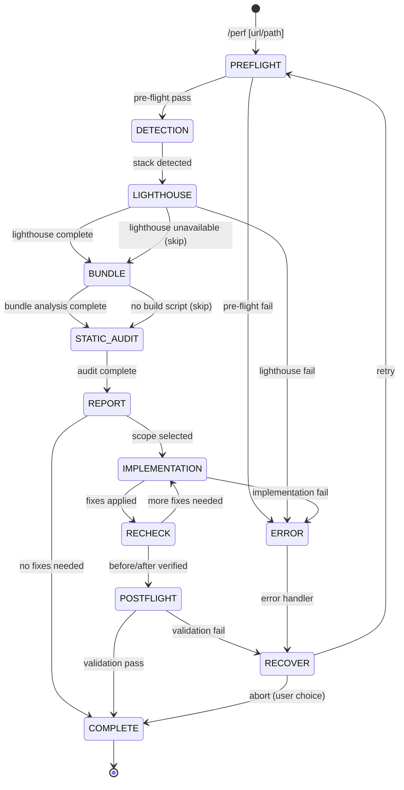

# Performance

Lighthouse + bundle analyse + statische code audit voor frontend performance. Meet Core Web Vitals, analyseer bundle sizes per route, en implementeer optimalisaties met before/after scores.

**Keywords**: performance, lighthouse, CWV, LCP, CLS, INP, bundle, code splitting, lazy loading, image optimization, font loading

## When to Use

- Na `/build` of `/convert` voor performance baseline
- Bij trage pagina's of slechte Lighthouse scores
- Voor productie deployment
- Als onderdeel van een kwaliteitsaudit

---

## State Machine



---

## References

- `../shared/RULES.md` — P-series (P001-P203)
- `../shared/PLAYWRIGHT.md` — CWV measurement via PerformanceObserver
- `../shared/PATTERNS.md` — Code splitting, memoization patterns
- `../shared/DEVINFO.md` — Session tracking protocol

---

## FASE 0: Pre-flight Validation

**BEFORE any work, validate:**

### 0.1 Project Check

```
PRE-FLIGHT: Project
───────────────────
[ ] package.json exists
[ ] Framework detected (Next.js, Vite, CRA, etc.)
[ ] Build script available (npm run build)
[ ] Dev server URL accessible
```

### 0.2 Tool Availability

```
PRE-FLIGHT: Tools
─────────────────
[ ] Lighthouse CLI: npx lighthouse --version
[ ] Playwright: browser_navigate available
[ ] Node.js: node --version
```

### 0.3 Target Selection

```yaml
header: "Target"
question: "Wat wil je analyseren op performance?"
options:
  - label: "Draaiende dev server (Recommended)"
    description: "Lighthouse + CWV meting op dev server"
  - label: "Production build"
    description: "Eerst builden, dan analyseren"
  - label: "Specifieke route"
    description: "Geef route pad op"
multiSelect: false
```

### Pre-flight Samenvatting

```
PRE-FLIGHT COMPLETE
═══════════════════════════════════════════════════════════
Target:     [URL]
Framework:  [Next.js | Vite | CRA | ...]
Bundler:    [Webpack | Vite | Turbopack]
Build:      [npm run build available: ja/nee]
Lighthouse: [available | unavailable]
Status:     Ready for detection
═══════════════════════════════════════════════════════════
```

---

## FASE 1: Detection

> **Doel:** Framework, bundler, en bestaande optimalisatie config detecteren.

### 1.1 Framework Detection

```
FRAMEWORK DETECTION
═══════════════════════════════════════════════════════════
Framework:  [Next.js 14 | Vite 5 | CRA | ...]
Bundler:    [Webpack 5 | Vite | Turbopack | esbuild]
Renderer:   [SSR | SSG | CSR | ISR | mixed]
Router:     [App Router | Pages Router | React Router | ...]
═══════════════════════════════════════════════════════════
```

### 1.2 Bestaande Optimalisatie Config

Scan voor bestaande performance configuratie:

- Image optimization (`next/image`, `vite-imagetools`)
- Code splitting config (dynamic imports, `React.lazy`)
- Caching headers / ISR config
- Bundle analyzer setup
- Font loading strategy (`next/font`, `@fontsource`)
- Compression (gzip/brotli)

---

## FASE 2: Lighthouse

> **Doel:** Core Web Vitals en Lighthouse scores meten.

### 2.1 Lighthouse CLI

Primaire methode:

```bash
npx lighthouse {url} --output json --chrome-flags="--headless --no-sandbox" --only-categories=performance,accessibility,best-practices,seo
```

Parse output voor:

- Performance score
- LCP, CLS, INP/TBT, FCP, TTFB
- Opportunities (specifieke verbeteringen)
- Diagnostics

### 2.2 Fallback: Playwright CWV

Als Lighthouse niet beschikbaar, gebruik `browser_evaluate` met PerformanceObserver (zie `PLAYWRIGHT.md`):

```
LIGHTHOUSE RESULTS
═══════════════════════════════════════════════════════════
Method: [Lighthouse CLI | Playwright CWV]

Scores:
  Performance:    [score]/100
  Accessibility:  [score]/100
  Best Practices: [score]/100
  SEO:            [score]/100

Core Web Vitals:
  LCP:  [value]s  [Good ≤2.5 | Needs Improvement ≤4.0 | Poor]
  CLS:  [value]   [Good ≤0.1 | Needs Improvement ≤0.25 | Poor]
  INP:  [value]ms [Good ≤200 | Needs Improvement ≤500 | Poor]
  FCP:  [value]s  [Good ≤1.8 | Needs Improvement ≤3.0 | Poor]
  TTFB: [value]ms [Good ≤800 | Needs Improvement ≤1800 | Poor]

Top Opportunities:
  1. [opportunity] — [estimated savings]
  2. [opportunity] — [estimated savings]
  3. [opportunity] — [estimated savings]

═══════════════════════════════════════════════════════════
```

---

## FASE 3: Bundle Analysis

> **Doel:** Production build analyseren op bundle sizes per route.

### 3.1 Production Build

```bash
npm run build
```

### 3.2 Framework-Specifieke Analyse

**Next.js:**

```bash
ANALYZE=true npm run build
# Of: npx @next/bundle-analyzer
```

**Vite:**

```bash
npx vite-bundle-visualizer
```

**Generiek:**

```bash
# Parse build output voor chunk sizes
# Zoek naar .next/static of dist/ output
```

### 3.3 Route-Level Sizes

```
BUNDLE ANALYSIS
═══════════════════════════════════════════════════════════

Total bundle: [size] (gzipped)

Per Route:
  /             [size] gzipped  [OK ≤200KB | WARN | OVER]
  /dashboard    [size] gzipped  [OK | WARN | OVER]
  /settings     [size] gzipped  [OK | WARN | OVER]

Largest chunks:
  1. [chunk name] — [size]
  2. [chunk name] — [size]
  3. [chunk name] — [size]

Shared chunks: [size] total

═══════════════════════════════════════════════════════════
```

---

## FASE 4: Static Audit

> **Doel:** Source code scannen op performance anti-patterns.

### 4.1 Images

- Lazy loading (`loading="lazy"` of Next.js Image)
- Width/height attributen (CLS preventie)
- Modern formats (WebP/AVIF)
- Responsive sizes (`sizes` attribuut)
- Oversized images (source groter dan weergave)

### 4.2 JavaScript

- Re-render hotspots (missing memo, useCallback)
- Synchrone data loading in render path
- Full library imports (`import _ from 'lodash'`)
- Unused imports / dead code
- Heavy computations zonder Web Worker

### 4.3 CSS

- Unused CSS (grote ongebruikte stylesheets)
- Render-blocking stylesheets
- Excessive CSS-in-JS runtime overhead
- Missing `content-visibility: auto` voor lange pagina's

### 4.4 Fonts

- FOIT (Flash of Invisible Text) risico
- Font preloading (`<link rel="preload" as="font">`)
- Font strategy (`font-display: swap/optional`)
- Subset loading (alleen benodigde characters)

### 4.5 Third-Party Scripts

- Sync loaded scripts
- Impact op main thread
- Scripts zonder async/defer

### Finding Format

```
FINDING: [ID]
─────────────
Category: [images | js | css | fonts | third-party]
Severity: [CRITICAL | HIGH | MEDIUM]
Rule:     [P001-P203]
CWV Impact: [LCP | CLS | INP | FCP | none]
File:     [pad]
Issue:    [beschrijving]
Fix:      [suggestie]
```

---

## FASE 5: Report

> **Doel:** Gecombineerd rapport van alle drie audit methoden.

```
PERFORMANCE AUDIT REPORT
═══════════════════════════════════════════════════════════

1. LIGHTHOUSE
   Score: [N]/100
   CWV: LCP [value] | CLS [value] | INP [value]

2. BUNDLE
   Total: [size] gzipped
   Over budget: [N] routes

3. STATIC AUDIT
   Findings: [N] total
   CRITICAL: [N]
   HIGH: [N]
   MEDIUM: [N]

Combined Priorities:
  1. [finding] — CWV impact: [metric]
  2. [finding] — CWV impact: [metric]
  3. [finding] — CWV impact: [metric]

═══════════════════════════════════════════════════════════
```

### Scope Selection

```yaml
header: "Fix Scope"
question: "Welke issues wil je fixen?"
options:
  - label: "CWV-impacterende fixes (Recommended)"
    description: "Focus op LCP, CLS, INP verbeteringen"
  - label: "Alleen CRITICAL"
    description: "[N] fixes, snelle wins"
  - label: "Alles"
    description: "Inclusief bundle optimalisaties, [N] fixes totaal"
  - label: "Ik kies zelf"
    description: "Selecteer specifieke findings"
multiSelect: false
```

---

## FASE 6: Implementation

> **Doel:** Performance fixes implementeren in prioriteitsvolgorde.

### Fix Volgorde

1. **CLS fixes** — layout shifts elimineren (width/height, font loading)
2. **LCP fixes** — largest contentful paint versnellen (image opt, preload)
3. **INP fixes** — input delay reduceren (code splitting, defer)
4. **Bundle fixes** — chunk sizes verkleinen (tree-shaking, dynamic import)
5. **Polish** — minor optimalisaties

### Context7 Research

Voordat framework-specifieke fixes worden toegepast, gebruik Context7 om de juiste API/pattern te vinden:

```
RESEARCH: [framework] [optimalisatie]
Voorbeeld: "Next.js image optimization", "Vite code splitting"
```

### Per Fix

```
FIX: [Finding ID]
═══════════════════════════════════════════════════════════
Issue:      [beschrijving]
CWV Impact: [metric]
File:       [pad]

Before:
  [code snippet]

After:
  [code snippet]

Expected improvement: [metric change]
═══════════════════════════════════════════════════════════
```

---

## FASE 7: Re-audit

> **Doel:** Lighthouse opnieuw draaien + build sizes vergelijken.

### 7.1 Lighthouse Re-run

Herhaal FASE 2 voor dezelfde URL.

### 7.2 Bundle Re-analyse

```bash
npm run build
```

### 7.3 Before/After Vergelijking

```
BEFORE/AFTER VERGELIJKING
═══════════════════════════════════════════════════════════

Lighthouse:
  Performance: [before] → [after] ([+/-]%)

Core Web Vitals:
  LCP:  [before] → [after]
  CLS:  [before] → [after]
  INP:  [before] → [after]

Bundle:
  Total: [before] → [after]
  Largest route: [before] → [after]

Resolved: [N]/[total] findings

═══════════════════════════════════════════════════════════
```

---

## FASE 8: Post-flight + Completion

### Performance Validation

Voer de Performance Check uit RULES.md uit:

```
PERFORMANCE CHECK
─────────────────
[ ] P001 - Lighthouse >= 90 per categorie
[ ] P002 - Geen render-blocking resources
[ ] P003 - Images geoptimaliseerd
[ ] P101 - CLS < 0.1
[ ] P102 - LCP < 2.5s
[ ] P103 - INP < 200ms
[ ] P104 - Bundle < 200KB/route
```

### Completion Report

```
PERFORMANCE AUDIT COMPLETE
═══════════════════════════════════════════════════════════

Lighthouse: [before] → [after] ([+/-] points)

Core Web Vitals:
  LCP:  [before] → [after]  [status]
  CLS:  [before] → [after]  [status]
  INP:  [before] → [after]  [status]

Bundle:
  Total: [before] → [after] ([+/-]%)
  Routes over budget: [before] → [after]

Fixes applied: [N]
Findings remaining: [N]

Validation: [PASS | REVIEW | FAIL]

Next steps:
1. Test met echte netwerk throttling (Chrome DevTools)
2. Monitor CWV in productie (web-vitals library)
3. Overweeg /responsive als layout shifts gevonden

═══════════════════════════════════════════════════════════
```

---

## Restrictions

Dit command moet **NOOIT**:

- Performance fixes toepassen zonder eerst te meten
- Lighthouse draaien op development mode als productie scores nodig zijn
- Code splitting toepassen zonder impact verificatie
- Memoization overal toepassen (alleen bij gemeten re-render issues)
- Post-flight validation overslaan

Dit command moet **ALTIJD**:

- Before/after scores vergelijken
- CWV impact taggen per finding
- Context7 raadplegen voor framework-specifieke optimalisatie
- Production build gebruiken voor bundle analyse
- Rules uit RULES.md volgen (P-series)
- DevInfo updaten bij elke fase transitie
- Alle prompts in het Nederlands
