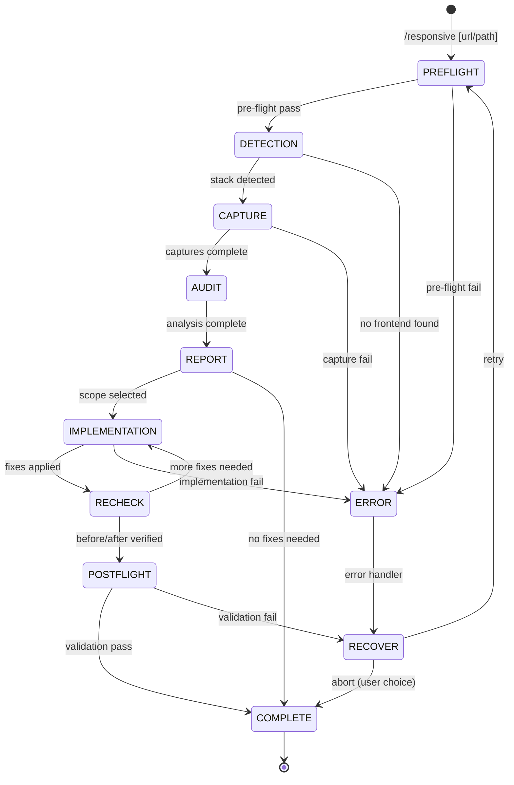

# Responsive

Multi-viewport audit en fix voor responsive design issues. Capture screenshots op 6 viewports, detecteer overflow/layout problemen, en implementeer fixes met before/after vergelijking.

**Keywords**: responsive, viewport, mobile, tablet, desktop, overflow, breakpoint, media query, touch target, fluid layout

## When to Use

- Na `/build` of `/convert` om responsive gedrag te valideren
- Bij klachten over mobile/tablet layout
- Als onderdeel van een kwaliteitsaudit
- Voor je naar productie gaat

---

## State Machine



---

## References

- `../shared/RULES.md` — H-series (H104, H117-H121), H006 (touch targets)
- `../shared/PLAYWRIGHT.md` — Multi-viewport capture sequence, overflow detection
- `../shared/DEVINFO.md` — Session tracking protocol

---

## FASE 0: Pre-flight Validation

**BEFORE any work, validate:**

### 0.1 Project Check

```
PRE-FLIGHT: Project
───────────────────
[ ] Source directory exists (src/, app/, pages/)
[ ] CSS approach detected (Tailwind, CSS Modules, styled-components)
[ ] Target URL or file path accessible
```

### 0.2 Dev Server Check

```yaml
header: "Target"
question: "Wat wil je controleren op responsive issues?"
options:
  - label: "Draaiende dev server (Recommended)"
    description: "http://localhost:3000 of andere URL"
  - label: "Statisch HTML bestand"
    description: "Geef pad naar HTML bestand"
  - label: "Specifieke route"
    description: "Geef route pad op (bijv. /dashboard)"
multiSelect: false
```

### 0.3 Scope Bepaling

```yaml
header: "Scope"
question: "Wat wil je scannen?"
options:
  - label: "Alle routes (Recommended)"
    description: "Detecteer routes en scan allemaal"
  - label: "Huidige pagina"
    description: "Alleen de opgegeven URL/route"
  - label: "Specifieke routes"
    description: "Ik kies welke routes"
multiSelect: false
```

### 0.4 Breakpoint Config Detectie

Detecteer bestaande breakpoint configuratie:

```
BREAKPOINT CONFIG
─────────────────
Source: [tailwind.config.js | CSS custom | framework default]
Breakpoints:
  sm: 640px
  md: 768px
  lg: 1024px
  xl: 1280px
  2xl: 1536px
Custom: [ja/nee]
```

---

## FASE 1: Detection

> **Doel:** Framework + CSS aanpak detecteren, bestaande responsive patronen inventariseren.

### 1.1 Bestaande Responsive Patronen

Scan source code voor responsive patterns:

- Media queries (`@media`, `min-width`, `max-width`)
- Tailwind responsive prefixes (`sm:`, `md:`, `lg:`, `xl:`)
- Container queries (`@container`)
- CSS Grid/Flexbox responsiveness (`auto-fit`, `auto-fill`, `flex-wrap`)

### 1.2 Breakpoint Inventaris

Count usages per breakpoint (sm/md/lg/xl/2xl + custom). Note any gaps in coverage.

---

## FASE 2: Capture

> **Doel:** Multi-viewport screenshots en accessibility snapshots op alle viewports.

Per route, capture op 6 viewports (XS:320, SM:375, MD:768, LG:1024, XL:1440, 2XL:1920). Volg het patroon uit `PLAYWRIGHT.md`:

### 2.1 Capture Sequence (per viewport)

Zie `PLAYWRIGHT.md` → Multi-Viewport Capture Sequence:

1. `browser_resize` → `{ width: [vp], height: 900 }`
2. `browser_wait_for` → `{ time: 1 }` (settle animations)
3. `browser_take_screenshot` → visuele staat opslaan
4. `browser_snapshot` → accessibility tree analyseren
5. `browser_evaluate` → overflow detectie (zie PLAYWRIGHT.md)

### 2.3 Capture Samenvatting

```
CAPTURE COMPLETE
═══════════════════════════════════════════════════════════
Route: /[route]
Screenshots: 6/6 captured
Overflow detected: [viewports with overflow]
═══════════════════════════════════════════════════════════
```

---

## FASE 3: Audit

> **Doel:** Analyseer captures voor responsive problemen.

### 3.1 Statische CSS Analyse

Scan source code voor potentiële responsive issues:

- **Overflow risico**: Fixed widths (`width: 600px`), absolute positioning buiten viewport
- **Missing responsive**: Components zonder responsive prefixes
- **Breakpoint gaps**: Ranges zonder media query coverage
- **Font scaling**: Font sizes die niet schalen op klein viewport

### 3.2 Snapshot Analyse

Vergelijk accessibility tree snapshots tussen viewports:

- **Verdwijnende elementen**: Content dat op bepaalde viewports verdwijnt zonder `display:none` intent
- **Overlap**: Elementen die over andere heen vallen
- **Onbereikbare interactie**: Buttons/links die buiten viewport vallen

### 3.3 Screenshot Analyse

Visuele inspectie van screenshots:

- **Truncatie**: Tekst die wordt afgesneden
- **Horizontale scrollbar**: Ongewenste overflow
- **Layout breuk**: Content dat niet meer past
- **Touch targets**: Te kleine knoppen op mobiel

### 3.4 Finding Format

Per finding:

```
FINDING: [ID]
─────────────
Viewport:  [XS/SM/MD/LG/XL/2XL]
Severity:  [CRITICAL | HIGH | MEDIUM]
Type:      [overflow | layout | touch | typography | visibility]
Element:   [CSS selector of component naam]
Rule:      [H117 | H118 | H119 | H120 | H121 | H006 | H104]
Issue:     [beschrijving]
Evidence:  [screenshot viewport + CSS snippet]
Fix hint:  [suggestie]
```

---

## FASE 4: Report

> **Doel:** Gestructureerd rapport met bevindingen per viewport.

```
RESPONSIVE AUDIT REPORT
═══════════════════════════════════════════════════════════

Route: /[route]

CRITICAL ([N]):
  [finding summaries]

HIGH ([N]):
  [finding summaries]

MEDIUM ([N]):
  [finding summaries]

Per Viewport:
  XS (320px): [N] issues
  SM (375px): [N] issues
  MD (768px): [N] issues
  LG (1024px): [N] issues
  XL (1440px): [N] issues
  2XL (1920px): [N] issues

═══════════════════════════════════════════════════════════
```

### Scope Selection

```yaml
header: "Fix Scope"
question: "Welke issues wil je fixen?"
options:
  - label: "Alle CRITICAL + HIGH (Recommended)"
    description: "[N] fixes"
  - label: "Alleen CRITICAL"
    description: "[N] fixes, minimale impact"
  - label: "Alles"
    description: "Inclusief MEDIUM, [N] fixes totaal"
  - label: "Ik kies zelf"
    description: "Selecteer specifieke findings"
multiSelect: false
```

---

## FASE 5: Implementation

> **Doel:** Fix responsive issues in prioriteitsvolgorde.

### Fix Volgorde

1. **Overflow fixes** — horizontale scroll elimineren
2. **Touch target fixes** — knoppen/links vergroten op mobiel
3. **Readability fixes** — font sizes, contrast op klein viewport
4. **Layout fixes** — breakpoints toevoegen/aanpassen
5. **Polish** — fijne spacing, alignment tweaks

Per fix: show finding ID, issue, file, and before/after code diff.

---

## FASE 6: Re-check

> **Doel:** Opnieuw capturen en before/after vergelijken.

### 6.1 Re-capture

Herhaal FASE 2 capture sequence voor gefixte routes.

### 6.2 Before/After Vergelijking

Compare overflow count, touch target violations, and scroll status per viewport. Report resolved vs remaining findings.

---

## FASE 7: Post-flight + Completion

### Responsive Validation

Voer de Responsive Check uit RULES.md uit:

```
RESPONSIVE CHECK
────────────────
[ ] H117 - Geen horizontaal scroll bij 320px
[ ] H118 - Touch targets in thumb-zone
[ ] H119 - Viewport meta tag aanwezig
[ ] H120 - Geen fixed-width die breekt
[ ] H121 - Body font >= 16px mobiel
[ ] H104 - Mobile-first breakpoints
[ ] H006 - Touch targets ≥ 44x44px
```

### Completion Report

```
RESPONSIVE AUDIT COMPLETE
═══════════════════════════════════════════════════════════

Routes checked:  [N]
Viewports:       6 (320, 375, 768, 1024, 1440, 1920)
Findings:        [N] total
Fixed:           [N]
Remaining:       [N]

By severity:
  CRITICAL: [before] → [after]
  HIGH:     [before] → [after]
  MEDIUM:   [before] → [after]

Validation: [PASS | REVIEW | FAIL]

Next steps:
1. Verify fixes visueel in browser
2. Test op echte devices indien mogelijk
3. Overweeg /perf voor performance impact van responsive changes

═══════════════════════════════════════════════════════════
```

---

## Restrictions

Dit command moet **NOOIT**:

- Responsive fixes toepassen zonder eerst te capturen
- Layout wijzigen op desktop om mobiel te fixen (mobile-first aanpak)
- Elementen verbergen als responsive fix (tenzij bewust design keuze)
- Touch targets verkleinen
- Post-flight validation overslaan

Dit command moet **ALTIJD**:

- Alle 6 viewports capturen voor audit
- Mobile-first aanpak volgen (fixes van klein → groot)
- Rules uit RULES.md volgen (H-series)
