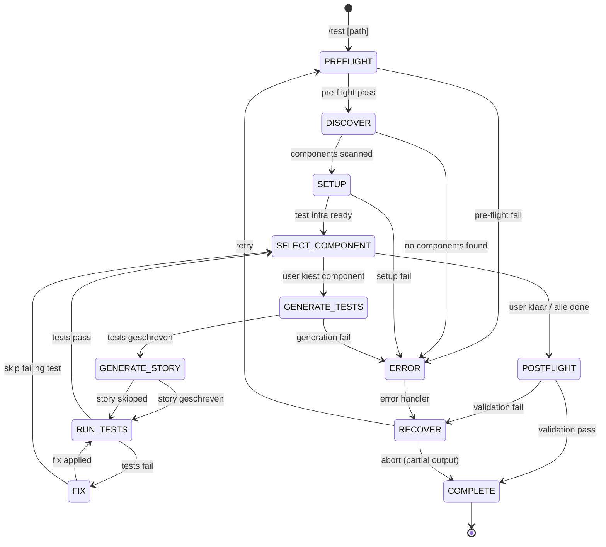

# Test

Genereer component unit tests (Vitest + React Testing Library) en Storybook stories voor React components. Per component: tests genereren, story genereren, tests draaien, en fixen als nodig.

**Keywords**: test, unit test, Vitest, Jest, RTL, React Testing Library, Storybook, CSF3, coverage, component test, story

## When to Use

- Na `/build`, `/convert`, of `/data` om components te testen
- Wanneer je test coverage wilt opbouwen
- Wanneer je Storybook stories wilt genereren
- Als onderdeel van een kwaliteitsworkflow

---

## State Machine



---

## References

- `../shared/RULES.md` — R-series (component rules), A-series (a11y assertions)
- `../shared/PATTERNS.md` — Component patterns, Storybook organization
- `../shared/DEVINFO.md` — Session tracking protocol

---

## FASE 0: Pre-flight Validation

**BEFORE any work, validate:**

### 0.1 Component Directory Check

```
PRE-FLIGHT: Components
──────────────────────
[ ] Component directory exists
[ ] .tsx component files found
[ ] .types.ts files found
```

### 0.2 Test Framework Check

```
PRE-FLIGHT: Test Framework
──────────────────────────
[ ] Vitest: [installed | not found]
[ ] Jest: [installed | not found]
[ ] React Testing Library: [installed | not found]
[ ] @testing-library/jest-dom: [installed | not found]
[ ] Storybook: [installed | not found]
```

### 0.3 Scope Bepaling

```yaml
header: "Test Scope"
question: "Wat wil je testen?"
options:
  - label: "Tests + Stories (Recommended)"
    description: "Unit tests en Storybook stories voor alle components"
  - label: "Alleen tests"
    description: "Unit tests zonder Storybook"
  - label: "Alleen stories"
    description: "Storybook stories zonder unit tests"
  - label: "Specifieke components"
    description: "Ik kies welke components"
multiSelect: false
```

### Pre-flight Samenvatting

```
PRE-FLIGHT COMPLETE
═══════════════════════════════════════════════════════════
Components:  [N] in [directory]
Test runner: [Vitest | Jest | not installed]
RTL:         [installed | not installed]
Storybook:   [installed | not installed]
Scope:       [tests + stories | tests only | stories only]
Status:      Ready for discovery
═══════════════════════════════════════════════════════════
```

---

## FASE 1: Discovery

> **Doel:** Scan components, extract props/variants/states, bouw test plan.

### 1.1 Component Scan

Per `.tsx` component:

- Parse props interface van `.types.ts`
- Identificeer variants (via union types, variant prop)
- Identificeer states (loading, error, disabled, active)
- Classificeer: **presentational** (pure render) vs **interactive** (event handlers, state)
- Detecteer accessibility patterns (aria-\*, role, keyboard handlers)

### 1.2 Test Plan

```
TEST PLAN
═══════════════════════════════════════════════════════════

 #  Component       Type           Tests  Story
─── ─────────────── ────────────── ────── ──────
 1  Button          interactive    6      yes
 2  Badge           presentational 3      yes
 3  Avatar          presentational 3      yes
 4  MetricCard      presentational 4      yes
 5  Navigation      interactive    5      yes
 6  Header          interactive    4      yes
 7  Sidebar         interactive    6      yes

Total: 7 components, ~31 tests, 7 stories

═══════════════════════════════════════════════════════════
```

### 1.3 Bevestiging

```yaml
header: "Test Plan"
question: "[N] components gevonden, ~[N] tests. Doorgaan?"
options:
  - label: "Start (Recommended)"
    description: "Genereer tests in atomic volgorde"
  - label: "Ik kies zelf"
    description: "Selecteer specifieke components"
  - label: "Aanpassen"
    description: "Wijzig test scope per component"
multiSelect: false
```

---

## FASE 2: Setup

> **Doel:** Test infrastructure installeren en configureren.

### 2.1 Installatie Check

Als test dependencies ontbreken:

```yaml
header: "Test Dependencies"
question: "De volgende packages ontbreken. Installeren?"
options:
  - label: "Installeer alles (Recommended)"
    description: "vitest, @testing-library/react, @testing-library/jest-dom, @testing-library/user-event"
  - label: "Alleen test runner"
    description: "vitest (of jest)"
  - label: "Ik installeer zelf"
    description: "Skip installatie"
multiSelect: false
```

Storybook installatie (apart):

```yaml
header: "Storybook"
question: "Storybook niet gevonden. Installeren?"
options:
  - label: "Installeren (Recommended)"
    description: "npx storybook@latest init"
  - label: "Skip stories"
    description: "Genereer alleen unit tests"
multiSelect: false
```

### 2.2 Setup Files

Maak test setup bestanden als ze niet bestaan:

**Vitest config:**

```typescript
// vitest.config.ts (of uitbreiding in vite.config.ts)
// Voeg jsdom environment toe, setup files
```

**Test setup:**

```typescript
// src/test/setup.ts
import "@testing-library/jest-dom";
```

**Shared test utilities:**

```typescript
// src/test/utils.tsx
import { render, RenderOptions } from '@testing-library/react'
import { ReactElement } from 'react'

// Wrap met providers die het project gebruikt
function AllProviders({ children }: { children: React.ReactNode }) {
  return <>{children}</>
}

export function renderWithProviders(
  ui: ReactElement,
  options?: Omit<RenderOptions, 'wrapper'>
) {
  return render(ui, { wrapper: AllProviders, ...options })
}

export * from '@testing-library/react'
export { renderWithProviders as render }
```

### 2.3 Setup Samenvatting

```
SETUP COMPLETE
═══════════════════════════════════════════════════════════
Test runner:  Vitest [version]
RTL:          @testing-library/react [version]
Storybook:    [version | skipped]
Setup file:   src/test/setup.ts
Utils:        src/test/utils.tsx
Config:       vitest.config.ts
═══════════════════════════════════════════════════════════
```

---

## FASE 3: Component Loop

> **Kern van de skill.** Per component:
> Select → Generate Tests → Generate Story → Run → Fix

### 3a. Select Component

```
COMPONENT STATUS
═══════════════════════════════════════════════════════════

 #  Component       Tests    Story    Status
─── ─────────────── ──────── ──────── ──────────────
 1  Button          6/6 ✓    ✓        Complete
 2  Badge           3/3 ✓    ✓        Complete
 3  Avatar          ·        ·        → Next
 4  MetricCard      ·        ·        Pending
 5  Navigation      ·        ·        Pending

Progress: 2/5 complete

═══════════════════════════════════════════════════════════
```

```yaml
header: "Volgende Component"
question: "Welke component wil je nu testen?"
options:
  - label: "Avatar (Recommended)"
    description: "Presentational, 3 tests, 1 story"
  - label: "Ik kies zelf"
    description: "Selecteer een specifieke component"
  - label: "Klaar — afronden"
    description: "Stop, ga naar post-flight"
multiSelect: false
```

### 3b. Generate Tests

Per component, genereer test file met:

#### Test Categorieën

1. **Render test** — component rendert zonder errors
2. **Variant tests** — elke variant rendert correct
3. **Props test** — props worden correct doorgegeven
4. **Interaction tests** — click, hover, keyboard (voor interactive components)
5. **A11y assertions** — accessible name, role, aria-states
6. **Edge cases** — lege data, lange tekst, ontbrekende optionele props

#### Test Conventies

- Gebruik `screen.getByRole()` (NIET `getByTestId()`)
- Geen snapshot tests (fragiel)
- Descriptive test names in het Nederlands of Engels (consistent met project)
- `describe` per component, geneste `describe` per variant/feature

#### Voorbeeld Test

```typescript
// Button.test.tsx
import { render, screen } from '@/test/utils'
import userEvent from '@testing-library/user-event'
import { Button } from './Button'

describe('Button', () => {
  it('renders with text content', () => {
    render(<Button>Click me</Button>)
    expect(screen.getByRole('button', { name: 'Click me' })).toBeInTheDocument()
  })

  describe('variants', () => {
    it('renders primary variant', () => {
      render(<Button variant="primary">Primary</Button>)
      const button = screen.getByRole('button')
      expect(button).toHaveClass('bg-primary')
    })

    it('renders secondary variant', () => {
      render(<Button variant="secondary">Secondary</Button>)
      const button = screen.getByRole('button')
      expect(button).toHaveClass('border-primary')
    })

    it('renders ghost variant', () => {
      render(<Button variant="ghost">Ghost</Button>)
      const button = screen.getByRole('button')
      expect(button).toHaveClass('bg-transparent')
    })
  })

  describe('interaction', () => {
    it('calls onClick when clicked', async () => {
      const user = userEvent.setup()
      const onClick = vi.fn()
      render(<Button onClick={onClick}>Click</Button>)
      await user.click(screen.getByRole('button'))
      expect(onClick).toHaveBeenCalledOnce()
    })

    it('does not call onClick when disabled', async () => {
      const user = userEvent.setup()
      const onClick = vi.fn()
      render(<Button onClick={onClick} disabled>Click</Button>)
      await user.click(screen.getByRole('button'))
      expect(onClick).not.toHaveBeenCalled()
    })
  })

  describe('accessibility', () => {
    it('has correct role', () => {
      render(<Button>Accessible</Button>)
      expect(screen.getByRole('button')).toBeInTheDocument()
    })
  })
})
```

### 3c. Generate Story

CSF3 format (Component Story Format 3):

```typescript
// Button.stories.tsx
import type { Meta, StoryObj } from "@storybook/react";
import { Button } from "./Button";

const meta = {
  title: "Atoms/Button",
  component: Button,
  parameters: { layout: "centered" },
  tags: ["autodocs"],
  argTypes: {
    variant: {
      control: "select",
      options: ["primary", "secondary", "ghost"],
    },
    size: {
      control: "select",
      options: ["sm", "md", "lg"],
    },
  },
} satisfies Meta<typeof Button>;

export default meta;
type Story = StoryObj<typeof meta>;

export const Primary: Story = {
  args: { children: "Primary Button", variant: "primary" },
};

export const Secondary: Story = {
  args: { children: "Secondary Button", variant: "secondary" },
};

export const Ghost: Story = {
  args: { children: "Ghost Button", variant: "ghost" },
};

export const Small: Story = {
  args: { children: "Small", size: "sm" },
};

export const Large: Story = {
  args: { children: "Large", size: "lg" },
};

export const Disabled: Story = {
  args: { children: "Disabled", disabled: true },
};
```

#### Story Conventies

- CSF3 format (met `satisfies Meta`)
- `tags: ['autodocs']` voor auto-generated docs
- Default story + per variant + per size
- Controls voor alle props
- Atomic level in title pad (`Atoms/`, `Molecules/`, `Organisms/`)

### 3d. Run Tests

```bash
npx vitest run [component-test-file]
```

Parse output:

```
TEST RUN: Button
═══════════════════════════════════════════════════════════

 ✓ renders with text content (3ms)
 ✓ renders primary variant (2ms)
 ✓ renders secondary variant (1ms)
 ✓ renders ghost variant (1ms)
 ✓ calls onClick when clicked (8ms)
 ✓ does not call onClick when disabled (2ms)

Tests: 6 passed, 0 failed
Time:  0.234s

═══════════════════════════════════════════════════════════
```

### 3e. Fix (bij test failures)

Analyseer of de failure een test-issue of component-bug is:

```yaml
header: "Test Failure"
question: "[N] test(s) gefaald. Wat is de oorzaak?"
options:
  - label: "Test aanpassen (Recommended)"
    description: "De test verwacht iets dat niet klopt"
  - label: "Component fixen"
    description: "Er is een bug in de component"
  - label: "Test overslaan"
    description: "Skip deze test, ga door"
multiSelect: false
```

**Test-issue:** Pas de test aan (verkeerde selector, verkeerde verwachting).
**Component-bug:** Fix de component en run opnieuw.

### Component Output

```
COMPONENT COMPLETE: Button
═══════════════════════════════════════════════════════════

Tests:  6/6 passed ✓
Story:  Button.stories.tsx ✓

Files created:
  + src/components/[page]/atoms/Button/Button.test.tsx
  + src/components/[page]/atoms/Button/Button.stories.tsx

Progress: 3/7 complete

═══════════════════════════════════════════════════════════
```

---

## FASE 4: Post-flight

### Full Suite Run

```bash
npx vitest run
```

```
FULL SUITE
═══════════════════════════════════════════════════════════

Test Files:  [N] passed, [N] failed
Tests:       [N] passed, [N] failed
Duration:    [time]

═══════════════════════════════════════════════════════════
```

### Storybook Smoke Test

```bash
npx storybook build --test
```

Of manuele instructie:

```
STORYBOOK CHECK
═══════════════════════════════════════════════════════════
Run: npx storybook dev -p 6006
Verify: alle stories laden zonder errors
═══════════════════════════════════════════════════════════
```

### Coverage Report

```bash
npx vitest run --coverage
```

```
COVERAGE
═══════════════════════════════════════════════════════════

Component              Stmts   Branch  Funcs   Lines
─────────────────────  ──────  ──────  ──────  ──────
Button                 100%    85%     100%    100%
Badge                  100%    100%    100%    100%
Avatar                 95%     80%     100%    95%
MetricCard             100%    90%     100%    100%
Navigation             88%     75%     85%     88%

Overall:               96%     86%     97%     96%

═══════════════════════════════════════════════════════════
```

### Completion Report

```
TEST GENERATION COMPLETE
═══════════════════════════════════════════════════════════

Components tested: [N]/[total]
Components skipped: [N]

Tests:
├── Total: [N] tests
├── Passed: [N]
├── Failed: [N]
└── Coverage: [N]%

Stories:
├── Total: [N] stories
├── Components: [N]
└── Variants covered: [N]

Files created:
├── .test.tsx: [N]
├── .stories.tsx: [N]
├── test/setup.ts: [1 if new]
└── test/utils.tsx: [1 if new]

Next steps:
1. Run: npx vitest --watch (continuous testing)
2. Run: npx storybook dev (browse stories)
3. Overweeg /perf als coverage hoog genoeg
4. CI integratie: voeg test script toe aan CI pipeline

═══════════════════════════════════════════════════════════
```

---

## Restrictions

Dit command moet **NOOIT**:

- Snapshot tests genereren (fragiel, moeilijk te onderhouden)
- `getByTestId()` gebruiken als `getByRole()` mogelijk is
- Tests schrijven die implementatie-details testen (interne state, private methods)
- Component code wijzigen om tests te laten slagen (tenzij echte bug)
- Storybook stories genereren zonder de component te begrijpen
- Post-flight validation overslaan

Dit command moet **ALTIJD**:

- `screen.getByRole()` als primaire query gebruiken
- CSF3 format voor Storybook stories
- Tests per component draaien voor feedback loop
- Accessibility assertions toevoegen
- `userEvent` gebruiken voor interacties (niet `fireEvent`)
- Atomic volgorde aanhouden (atoms → molecules → organisms)
- Rules uit RULES.md volgen
- DevInfo updaten bij elke fase transitie
- Alle prompts in het Nederlands
